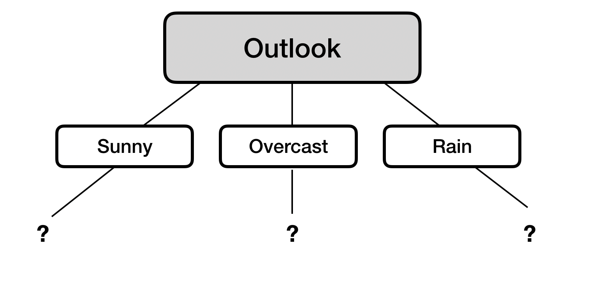
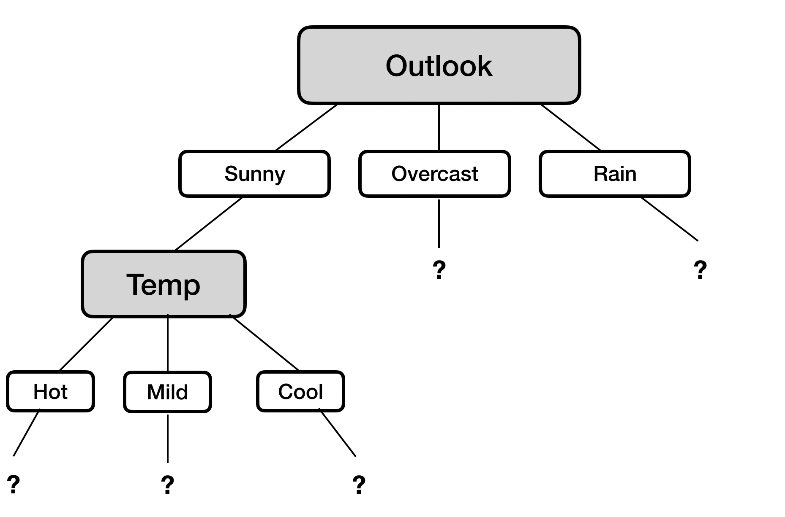

# ID3 Classification Trees: Perfect Split with Information Gain - Lab

## Introduction

In this lab, we will simulate the example from the previous lesson in Python. You will write functions to calculate entropy and IG which will be used for calculating these uncertainty measures and deciding upon creating a split using information gain while growing an ID3 classification tree. You will also write a general function that can be used for other (larger) problems as well. So let's get on with it.

## Objectives

In this lab you will:

- Write functions for calculating entropy and information gain measures
- Use entropy and information gain to identify the attribute that results in the best split at each node


## Problem

You will use the same problem about deciding whether to go and play tennis on a given day, given the weather conditions. Here is the data from the previous lesson:

|  outlook | temp | humidity | windy | play |
|:--------:|:----:|:--------:|:-----:|:----:|
| overcast | cool |   high   |   Y   |  yes |
| overcast | mild |  normal  |   N   |  yes |
|   sunny  | cool |  normal  |   N   |  yes |
| overcast |  hot |   high   |   Y   |  no  |
|   sunny  |  hot |  normal  |   Y   |  yes |
|   rain   | mild |   high   |   N   |  no  |
|   rain   | cool |  normal  |   N   |  no  |
|   sunny  | mild |   high   |   N   |  yes |
|   sunny  | cool |  normal  |   Y   |  yes |
|   sunny  | mild |  normal  |   Y   |  yes |
| overcast | cool |   high   |   N   |  yes |
|   rain   | cool |   high   |   Y   |  no  |
|   sunny  |  hot |  normal  |   Y   |  no  |
|   sunny  | mild |   high   |   N   |  yes |


## Write a function `entropy(pi)` to calculate total entropy in a given discrete probability distribution `pi`

- The function should take in a probability distribution `pi` as a list of class distributions. This should be a list of two integers, representing how many items are in each class. For example: `[4, 4]` indicates that there are four items in each class, `[10, 0]` indicates that there are 10 items in one class and 0 in the other.
- Calculate and return entropy according to the formula: $$Entropy(p) = -\sum (P_i . log_2(P_i))$$

```python
from math import log
def entropy(pi):
    """
    return the Entropy of a probability distribution:
    entropy(p) = - SUM (Pi * log(Pi) )
    """

    total = 0
    for p in pi:
        p = p / sum(pi)
        if p != 0:
            total +=  p * log(p, 2)
        else:
            total += 0
    total *= -1
    return total

# Test the function

print(entropy([1, 1])) # Maximum Entropy e.g. a coin toss
print(entropy([0, 6])) # No entropy, ignore the -ve with zero , its there due to log function
print(entropy([2, 10])) # A random mix of classes
```
## Write a function `IG(D,a)` to calculate the information gain

- As input, the function should take in `D` as a class distribution array for target class, and `a` the class distribution of the attribute to be tested
- Using the `entropy()` function from above, calculate the information gain as:

$$gain(D,A) = Entropy(D) - \sum(\frac{|D_i|}{|D|}.Entropy(D_i))$$

where $D_{i}$ represents distribution of each class in `a`.

```python
def IG(D, a):
    """
    return the information gain:
    gain(D, A) = entropy(D)\N{MINUS SIGN} SUM( |Di| / |D| * entropy(Di) )
    """

    total = 0
    for Di in a:
        total += abs(sum(Di) / sum(D)) * entropy(Di)

    gain = entropy(D) - total
    return gain


# Test the function
# set of example of the dataset - distribution of classes
test_dist = [6, 6] # Yes, No
# attribute, number of members (feature)
test_attr = [ [4, 0], [2, 4], [0, 2] ] # class1, class2, class3 of attr1 according to YES/NO classes in test_dist

print(IG(test_dist, test_attr))
```
## First iteration - Decide the best split for the root node

- Create the class distribution `play` as a list showing frequencies of both classes from the dataset
- Similarly, create variables for four categorical feature attributes showing the class distribution for each class with respect to the target classes (yes and no)
- Pass the play distribution with each attribute to calculate the information gain

```python
# Set of example of the dataset
play = [9, 5] # Yes, No

# attribute, number of members (feature)
outlook = [
    [3, 1],  # overcast   [yes, no]
    [6, 1],  # sunny
    [0, 3]   # rain
]
temperature = [
    [1, 2],  # hot
    [4, 2],  # cool
    [4, 1]   # mild
]
humidity = [
    [4, 3],  # high
    [5, 2]   # normal
]
wind = [
    [5, 2],  # no
    [4, 3]   # yes
]


# Information Gain:
print ('Information Gain:\n' )
print('Outlook:', IG(play, outlook))
print('Temperature:', IG(play, temperature))
print('Humidity:', IG(play, humidity))
print('Wind:', IG(play, wind))
```
We see here that the outlook attribute gives us the highest value for information gain, hence we choose this for creating a split at the root node. So far, we've built the following decision tree:



## Second iteration

Since the first iteration determines what split we should make for the root node of our tree, it's pretty simple. Now, we move down to the second level and start finding the optimal split for each of the nodes on this level. The first branch (edge) of three above that leads to the "Sunny" outcome. Of the temperature, humidity and wind attributes, find which one provides the highest information gain.

Follow the same steps as above. Remember, we have 6 positive examples and 1 negative example in the "sunny" branch.

```python
# Set of example of the dataset
play = [6, 1]

temperature = [[1, 1],[3, 0], [2, 0]]  # hot, mild, cool [yes, no]
humidity = [[2, 0],[4, 1]]   # high, normal [yes, no]
wind = [[3, 1],[3, 0]]      # Y, N [yes, no]


print ('Information Gain:\n' )

print('Temperature:', IG(play, temperature))
print('Humidity:', IG(play, humidity))
print('Wind:', IG(play, wind))
```
We see that temperature gives us the highest information gain, so we'll use it to split our tree as shown below:




Let's continue.

## Third iteration

We'll now calculate splits for the 'temperature' node we just created for days where the weather is sunny. Temperature has three possible values: [Hot, Mild, Cool]. This means that for each of the possible temperatures, we'll need to calculate if splitting on windy or humidity gives us the greatest possible information gain.

Why are we doing this next instead of the rest of the splits on level 2? Because a decision tree is a greedy algorithm, meaning that the next choice is always the one that will give it the greatest information gain. In this case, evaluating the temperature on sunny days gives us the most information gain, so that's where we'll go next.

## All other iterations

What happens once we get down to a 'pure' split? Obviously, we stop splitting. Once that happens, we go back to the highest remaining uncalculated node and calculate the best possible split for that one. We then continue on with that branch, until we have exhausted all possible splits or we run into a split that gives us 'pure' leaves where all 'play=Yes' is on one side of the split, and all 'play=No' is on the other.

## Summary

This lab should have helped you familiarize yourself with how decision trees work 'under the hood', and demystified how the algorithm actually 'learns' from data by:

- Calculating entropy and information gain
- Figuring out the next split you should calculate ('greedy' approach)


-----File-Boundary-----
# Building Trees using scikit-learn - Lab

## Introduction

Following the simple example you saw in the previous lesson, you'll now build a decision tree for a more complex dataset. This lab covers all major areas of standard machine learning practice, from data acquisition to evaluation of results. We'll continue to use the Scikit-learn and Pandas libraries to conduct this analysis, following the same structure we saw in the previous lesson.

## Objectives

In this lab you will:

- Use scikit-learn to fit a decision tree classification model
- Use entropy and information gain to identify the best attribute to split on at each node
- Plot a decision tree using Python

## UCI Banknote authentication dataset

In this lab, you'll work with a popular dataset for classification called the "UCI Bank note authentication dataset". This data was extracted from images that were taken from genuine and forged banknotes! The notes were first digitized, followed by a numerical transformation using DSP techniques. The final set of engineered features are all continuous in nature, meaning that our dataset consists entirely of floats, with no strings to worry about. If you're curious about how the dataset was created, you can visit the UCI link [here](https://archive.ics.uci.edu/ml/datasets/banknote+authentication)!

We have the following attributes in the dataset:

1. __Variance__ of wavelet transformed image (continuous)
2. __Skewness__ of wavelet transformed image (continuous)
3. __Curtosis__ of wavelet transformed image (continuous)
4. __Entropy__ of image (continuous)
5. __Class__ (integer) - Target/Label

## Step 1: Import the necessary libraries

We've imported all the necessary modules you will require for this lab, go ahead and run the following cell:

```python
#\N{NO-BREAK SPACE}Import necessary libraries
import numpy as np
import pandas as pd
import matplotlib.pyplot as plt
from sklearn.model_selection import train_test_split
from sklearn.tree import DecisionTreeClassifier
from sklearn.metrics import accuracy_score, roc_curve, auc
from sklearn.preprocessing import OneHotEncoder
from sklearn import tree
```
## Step 2: Import data

Now, you'll load our dataset in a DataFrame, perform some basic EDA, and get a general feel for the data you'll be working with.

- Import the file `'data_banknote_authentication.csv'` as a pandas DataFrame. Note that there is no header information in this dataset
- Assign column names `'Variance'`, `'Skewness'`, `'Kurtosis'`, `'Entropy'`, and `'Class'` to the dataset in the given order
- View the basic statistics and shape of the dataset
- Check for the frequency of positive and negative examples in the target variable

```python
#\N{NO-BREAK SPACE}Create DataFrame
dataset = pd.read_csv('data_banknote_authentication.csv', header=None)
dataset.columns = ['Variance', 'Skewness', 'Curtosis', 'Entropy', 'Class']
```
```python
# Describe the dataset
dataset.describe()
```
```python
# Shape of dataset
dataset.shape
```
```python
# Class frequency of target variable
dataset['Class'].value_counts()
```
## Step 3: Create features, labels, training, and test data

Now we need to create our feature set `X` and labels `y`:
- Create `X` and `y` by selecting the appropriate columns from the dataset
- Create a 80/20 split on the dataset for training/test. Use `random_state=10` for reproducibility

```python
# Create features and labels
X = dataset.drop('Class', axis=1)
y = dataset['Class']
```
```python
# Perform an 80/20 split
X_train, X_test, y_train, y_test = train_test_split(
    X, y, test_size=0.20, random_state=10)
```
## Step 4: Train the classifier and make predictions
- Create an instance of a decision tree classifier with `random_state=10` for reproducibility
- Fit the training data to the model
- Use the trained model to make predictions with test data

```python
# Train a DT classifier
classifier = DecisionTreeClassifier(random_state=10)
classifier.fit(X_train, y_train)
```
```python
# Make predictions for test data
y_pred = classifier.predict(X_test)
```
## Step 5: Check predictive performance

Use different evaluation measures to check the predictive performance of the classifier:
- Check the accuracy, AUC, and create a confusion matrix
- Interpret the results

```python
# Calculate accuracy
acc = accuracy_score(y_test,y_pred) * 100
print('Accuracy is :{0}'.format(acc))

# Check the AUC for predictions
false_positive_rate, true_positive_rate, thresholds = roc_curve(y_test, y_pred)
roc_auc = auc(false_positive_rate, true_positive_rate)
print('\nAUC is :{0}'.format(round(roc_auc, 2)))

# Create and print a confusion matrix
print('\nConfusion Matrix')
print('----------------')
pd.crosstab(y_test, y_pred, rownames=['True'], colnames=['Predicted'], margins=True)
```
```python
# Alternative confusion matrix
from sklearn.metrics import plot_confusion_matrix

plot_confusion_matrix(classifier, X, y, values_format='.3g')
plt.show()
```
## Level up (Optional)


### Re-grow the tree using entropy

The default impurity criterion in scikit-learn is the Gini impurity. We can change it to entropy by passing in the argument `criterion='entropy'` to the classifier in the training phase.

- Create an instance of a decision tree classifier with `random_state=10` for reproducibility. Make sure you use entropy to calculate impurity
- Fit this classifier to the training data
- Run the given code to plot the decision tree

```python
# Instantiate and fit a DecisionTreeClassifier
classifier_2 = DecisionTreeClassifier(random_state=10, criterion='entropy')
classifier_2.fit(X_train, y_train)
```
```python
# Plot and show decision tree
plt.figure(figsize=(12,12), dpi=500)
tree.plot_tree(classifier_2,
               feature_names=X.columns,
               class_names=np.unique(y).astype('str'),
               filled=True, rounded=True)
plt.show()
```
- We discussed earlier that decision trees are very sensitive to outliers. Try to identify and remove/fix any possible outliers in the dataset.

- Check the distributions of the data. Is there any room for normalization/scaling of the data? Apply these techniques and see if it improves the accuracy score.

## Summary

In this lesson, we looked at growing a decision tree for the banknote authentication dataset, which is composed of extracted continuous features from photographic data. We looked at data acquisition, training, prediction, and evaluation. We also looked at growing trees using entropy vs. gini impurity criteria. In following lessons, we shall look at more pre-training tuning techniques for ensuring an optimal classifier for learning and prediction.


-----File-Boundary-----
# Hyperparameter Tuning and Pruning in Decision Trees - Lab

## Introduction

In this lab, you will use the titanic dataset to see the impact of tree pruning and hyperparameter tuning on the predictive performance of a decision tree classifier. Pruning reduces the size of decision trees by removing nodes of the tree that do not provide much predictive power to classify instances. Decision trees are the most susceptible out of all the machine learning algorithms to overfitting and effective pruning can reduce this likelihood.

## Objectives

In this lab you will:

- Determine the optimal hyperparameters for a decision tree model and evaluate the model performance

## Import necessary libraries

Let's first import the libraries you'll need for this lab.

```python
import numpy as np
import pandas as pd
import matplotlib as mpl
import matplotlib.pyplot as plt
from sklearn.model_selection import train_test_split
from sklearn.tree import DecisionTreeClassifier
from sklearn.metrics import roc_curve, auc
plt.style.use('seaborn')
```
## Import the data

The titanic dataset, available in `'titanic.csv'`, is all cleaned up and preprocessed for you so that you can focus on pruning and optimization. Import the dataset and print the first five rows of the data:

```python
# Import the data
df = pd.read_csv('titanic.csv')
df.head()
```
## Create training and test sets

- Assign the `'Survived'` column to `y`
- Drop the `'Survived'` and `'PassengerId'` columns from `df`, and assign the resulting DataFrame to `X`
- Split `X` and `y` into training and test sets. Assign 30% to the test set and set the `random_state` to `SEED`

```python
# Create X and y
y = df['Survived']
X = df.drop(columns=['Survived', 'PassengerId'], axis=1)

# Split into training and test sets
SEED = 1
X_train, X_test, y_train, y_test = train_test_split(X, y, test_size=0.3, random_state=SEED)
```
## Train a vanilla classifier

__Note:__ The term "vanilla" is used for a machine learning algorithm with its default settings (no tweaking/tuning).

- Instantiate a decision tree
  - Use the `'entropy'` criterion and set the `random_state` to `SEED`
- Fit this classifier to the training data

```python
#\N{NO-BREAK SPACE}Train the classifier using training data
dt = DecisionTreeClassifier(criterion='entropy', random_state=SEED)
dt.fit(X_train, y_train)
```
## Make predictions
- Create a set of predictions using the test set
- Using `y_test` and `y_pred`, calculate the AUC (Area under the curve) to check the predictive performance

```python
# Make predictions using test set
y_pred = dt.predict(X_test)

# Check the AUC of predictions
false_positive_rate, true_positive_rate, thresholds = roc_curve(y_test, y_pred)
roc_auc = auc(false_positive_rate, true_positive_rate)
roc_auc
```
## Maximum Tree Depth

Let's first check for the best depth parameter for our decision tree:

- Create an array for `max_depth` values ranging from 1 - 32
- In a loop, train the classifier for each depth value (32 runs)
- Calculate the training and test AUC for each run
- Plot a graph to show under/overfitting and the optimal value
- Interpret the results

```python
# Identify the optimal tree depth for given data
max_depths = list(range(1, 33))
train_results = []
test_results = []
for max_depth in max_depths:
    dt = DecisionTreeClassifier(criterion='entropy', max_depth=max_depth, random_state=SEED)
    dt.fit(X_train, y_train)
    train_pred = dt.predict(X_train)
    false_positive_rate, true_positive_rate, thresholds = roc_curve(y_train, train_pred)
    roc_auc = auc(false_positive_rate, true_positive_rate)
    # Add auc score to previous train results
    train_results.append(roc_auc)
    y_pred = dt.predict(X_test)
    false_positive_rate, true_positive_rate, thresholds = roc_curve(y_test, y_pred)
    roc_auc = auc(false_positive_rate, true_positive_rate)
    # Add auc score to previous test results
    test_results.append(roc_auc)

plt.figure(figsize=(12,6))
plt.plot(max_depths, train_results, 'b', label='Train AUC')
plt.plot(max_depths, test_results, 'r', label='Test AUC')
plt.ylabel('AUC score')
plt.xlabel('Tree depth')
plt.legend()
plt.show()
```
```python
#\N{NO-BREAK SPACE}Training error decreases with increasing tree depth - clear sign of overfitting
# Test error increases after depth=3 - nothing more to learn from deeper trees (some fluctuations, but not stable)
# Training and test errors rise rapidly between the depths of 2 and 3
#\N{NO-BREAK SPACE}Optimal value seen here is 3
```
## Minimum Sample Split

Now check for the best `min_samples_splits` parameter for our decision tree

- Create an array for `min_sample_splits` values ranging from 0.1 - 1 with an increment of 0.1
- In a loop, train the classifier for each `min_samples_splits` value (10 runs)
- Calculate the training and test AUC for each run
- Plot a graph to show under/overfitting and the optimal value
- Interpret the results

```python
# Identify the optimal min-samples-split for given data
min_samples_splits = np.linspace(0.1, 1.0, 10, endpoint=True)
train_results = []
test_results = []
for min_samples_split in min_samples_splits:
    dt = DecisionTreeClassifier(criterion='entropy', min_samples_split=min_samples_split, random_state=SEED)
    dt.fit(X_train, y_train)
    train_pred = dt.predict(X_train)
    false_positive_rate, true_positive_rate, thresholds =    roc_curve(y_train, train_pred)
    roc_auc = auc(false_positive_rate, true_positive_rate)
    train_results.append(roc_auc)
    y_pred = dt.predict(X_test)
    false_positive_rate, true_positive_rate, thresholds = roc_curve(y_test, y_pred)
    roc_auc = auc(false_positive_rate, true_positive_rate)
    test_results.append(roc_auc)

plt.figure(figsize=(12,6))
plt.plot(min_samples_splits, train_results, 'b', label='Train AUC')
plt.plot(min_samples_splits, test_results, 'r', label='Test AUC')
plt.xlabel('Min. Sample splits')
plt.legend()
plt.show()
```
```python
#\N{NO-BREAK SPACE}AUC for both test and train data stabilizes at 0.7
#\N{NO-BREAK SPACE}Further increase in minimum sample split does not improve learning
```
## Minimum Sample Leafs

Now check for the best `min_samples_leafs` parameter value for our decision tree

- Create an array for `min_samples_leafs` values ranging from 0.1 - 0.5 with an increment of 0.1
- In a loop, train the classifier for each `min_samples_leafs` value (5 runs)
- Calculate the training and test AUC for each run
- Plot a graph to show under/overfitting and the optimal value
- Interpret the results

```python
# Calculate the optimal value for minimum sample leafs
min_samples_leafs = np.linspace(0.1, 0.5, 5, endpoint=True)
train_results = []
test_results = []
for min_samples_leaf in min_samples_leafs:
    dt = DecisionTreeClassifier(criterion='entropy', min_samples_leaf=min_samples_leaf, random_state=SEED)
    dt.fit(X_train, y_train)
    train_pred = dt.predict(X_train)
    false_positive_rate, true_positive_rate, thresholds = roc_curve(y_train, train_pred)
    roc_auc = auc(false_positive_rate, true_positive_rate)
    train_results.append(roc_auc)
    y_pred = dt.predict(X_test)
    false_positive_rate, true_positive_rate, thresholds = roc_curve(y_test, y_pred)
    roc_auc = auc(false_positive_rate, true_positive_rate)
    test_results.append(roc_auc)

plt.figure(figsize=(12,6))
plt.plot(min_samples_leafs, train_results, 'b', label='Train AUC')
plt.plot(min_samples_leafs, test_results, 'r', label='Test AUC')
plt.ylabel('AUC score')
plt.xlabel('Min. Sample Leafs')
plt.legend()
plt.show()
```
```python
# AUC gives best value between 0.2 and 0.3 for both test and training sets
#\N{NO-BREAK SPACE}The accuracy drops down if we continue to increase the parameter value
```
## Maximum Features

Now check for the best `max_features` parameter value for our decision tree

- Create an array for `max_features` values ranging from 1 - 12 (1 feature vs all)
- In a loop, train the classifier for each `max_features` value (12 runs)
- Calculate the training and test AUC for each run
- Plot a graph to show under/overfitting and the optimal value
- Interpret the results

```python
# Find the best value for optimal maximum feature size
max_features = list(range(1, X_train.shape[1]))
train_results = []
test_results = []
for max_feature in max_features:
    dt = DecisionTreeClassifier(criterion='entropy', max_features=max_feature, random_state=SEED)
    dt.fit(X_train, y_train)
    train_pred = dt.predict(X_train)
    false_positive_rate, true_positive_rate, thresholds = roc_curve(y_train, train_pred)
    roc_auc = auc(false_positive_rate, true_positive_rate)
    train_results.append(roc_auc)
    y_pred = dt.predict(X_test)
    false_positive_rate, true_positive_rate, thresholds = roc_curve(y_test, y_pred)
    roc_auc = auc(false_positive_rate, true_positive_rate)
    test_results.append(roc_auc)

plt.figure(figsize=(12,6))
plt.plot(max_features, train_results, 'b', label='Train AUC')
plt.plot(max_features, test_results, 'r', label='Test AUC')
plt.ylabel('AUC score')
plt.xlabel('max features')
plt.legend()
plt.show()
```
```python
#\N{NO-BREAK SPACE}No clear effect on the training dataset - flat AUC
#\N{NO-BREAK SPACE}Some fluctuations in test AUC but not definitive enough to make a judgement
#\N{NO-BREAK SPACE}Highest AUC value seen at 6
```
## Re-train the classifier with chosen values

Now we will use the best values from each training phase above and feed it back to our classifier. Then we can see if there is any improvement in predictive performance.

- Train the classifier with the optimal values identified
- Compare the AUC of the new model with the earlier vanilla decision tree AUC
- Interpret the results of the comparison

```python
# Train a classifier with optimal values identified above
dt = DecisionTreeClassifier(criterion='entropy',
                           max_features=6,
                           max_depth=3,
                           min_samples_split=0.7,
                           min_samples_leaf=0.25,
                           random_state=SEED)
dt.fit(X_train, y_train)
y_pred = dt.predict(X_test)
false_positive_rate, true_positive_rate, thresholds = roc_curve(y_test, y_pred)
roc_auc = auc(false_positive_rate, true_positive_rate)
roc_auc
```
```python
#\N{NO-BREAK SPACE}We actually have a worse AUC than the vanilla classifier, because we tuned the
# hyper parameters one at a time. With more complicated (and bigger) datasets,
# we might see an improvement in AUC/accuracy of the classifier.
```
In order to address the issue of a baseline classifier performing better than a tuned one like this, a more-sophisticated technique is called a "grid search" and this will be introduced in a future lesson.

## Summary

In this lesson, we looked at tuning a decision tree classifier in order to avoid overfitting and increasing the generalization capabilities of the classifier. For the titanic dataset, we see that identifying optimal parameter values can result in some improvements towards predictions. This idea will be exploited further in upcoming lessons and labs.


-----File-Boundary-----
# Regression with CART Trees - Lab

## Introduction

In this lab, we'll make use of what we learned in the previous lesson to build a model for the [Petrol Consumption Dataset](https://www.kaggle.com/harinir/petrol-consumption) from Kaggle. This model will be used to predict gasoline consumption for a bunch of examples, based on features about the drivers.

## Objectives

In this lab you will:

- Fit a decision tree regression model with scikit-learn

## Import necessary libraries

```python
#\N{NO-BREAK SPACE}Import libraries
import pandas as pd
import numpy as np
from sklearn.model_selection import train_test_split
```
## The dataset

- Import the `'petrol_consumption.csv'` dataset
- Print the first five rows of the data
- Print the dimensions of the data

```python
# Import the dataset
dataset = pd.read_csv('petrol_consumption.csv')
```
```python
# Print the first five rows
dataset.head()
```
```python
# Print the dimensions of the data
dataset.shape
```
- Print the summary statistics of all columns in the data:

```python
#\N{NO-BREAK SPACE}Describe the dataset
dataset.describe()
```
## Create training and test sets

- Assign the target column `'Petrol_Consumption'` to `y`
- Assign the remaining independent variables to `X`
- Split the data into training and test sets using a 80/20 split
- Set the random state to 42

```python
# Split the data into training and test sets
X = dataset.drop('Petrol_Consumption', axis=1)
y = dataset['Petrol_Consumption']
X_train, X_test, y_train, y_test = train_test_split(X, y, test_size=0.2, random_state=42)
```
## Create an instance of CART regressor and fit the data to the model

As mentioned earlier, for a regression task we'll use a different `sklearn` class than we did for the classification task. The class we'll be using here is the `DecisionTreeRegressor` class, as opposed to the `DecisionTreeClassifier` from before.

```python
# Import the DecisionTreeRegressor class
from sklearn.tree import DecisionTreeRegressor

# Instantiate and fit a regression tree model to training data
regressor = DecisionTreeRegressor(random_state=42)
regressor.fit(X_train, y_train)
```
## Make predictions and calculate the MAE, MSE, and RMSE

Use the above model to generate predictions on the test set.

Just as with decision trees for classification, there are several commonly used metrics for evaluating the performance of our model. The most common metrics are:

* Mean Absolute Error (MAE)
* Mean Squared Error (MSE)
* Root Mean Squared Error (RMSE)

If these look familiar, it's likely because you have already seen them before -- they are common evaluation metrics for any sort of regression model, and as we can see, regressions performed with decision tree models are no exception!

Since these are common evaluation metrics, `sklearn` has functions for each of them that we can use to make our job easier. You'll find these functions inside the `metrics` module. In the cell below, calculate each of the three evaluation metrics.

```python
from sklearn.metrics import mean_absolute_error, mean_squared_error

# Make predictions on the test set
y_pred = regressor.predict(X_test)

# Evaluate these predictions
print('Mean Absolute Error:', mean_absolute_error(y_test, y_pred))
print('Mean Squared Error:', mean_squared_error(y_test, y_pred))
print('Root Mean Squared Error:', np.sqrt(mean_squared_error(y_test, y_pred)))
```
## Level Up (Optional)

- Look at the hyperparameters used in the regression tree, check their value ranges in official doc and try running some optimization by growing a number of trees in a loop

- Use a dataset that you are familiar with and run tree regression to see if you can interpret the results

- Check for outliers, try normalization and see the impact on the output

## Summary

In this lesson, you implemented the architecture to train a tree regressor and predict values for unseen data. You saw that with a vanilla approach, the results were not so great, and thus we must further tune the model (what we described as hyperparameter optimization and pruning, in the case of trees).


-----File-Boundary-----
# Regression Trees and Model Optimization - Lab

## Introduction

In this lab, we'll see how to apply regression analysis using CART trees while making use of some hyperparameter tuning to improve our model.

## Objectives

In this lab you will:

- Perform the full process of cleaning data, tuning hyperparameters, creating visualizations, and evaluating decision tree models
- Determine the optimal hyperparameters for a decision tree model and evaluate the performance of decision tree models

## Ames Housing dataset

The dataset is available in the file `'ames.csv'`.

- Import the dataset and examine its dimensions:

```python
# Import necessary libraries
import numpy as np
import pandas as pd
import matplotlib.pyplot as plt
plt.style.use('ggplot')
%matplotlib inline

# Load the Ames housing dataset
data = pd.read_csv('ames.csv')

# Print the dimensions of data
print(data.shape)

# Check out the info for the dataframe
print(data.info())

# Show the first 5 rows
data.head()
```
## Identify features and target data

In this lab, we will use using 3 predictive continuous features:

#### Features

- `LotArea`: Lot size in square feet
- `1stFlrSF`: Size of first floor in square feet
- `GrLivArea`: Above grade (ground) living area square feet

#### Target

- `SalePrice`', the sale price of the home, in dollars

- Create DataFrames for the features and the target variable as shown above
- Inspect the contents of both the features and the target variable

```python
# Features and target data
target = data['SalePrice']
features = data[['LotArea', '1stFlrSF', 'GrLivArea']]
print(target.describe())
print("")
features.describe()
```
## Inspect correlations

- Use scatter plots to show the correlation between the chosen features and the target variable
- Comment on each scatter plot

```python
# Create scatter plots for each feature vs. target
import matplotlib.pyplot as plt
plt.figure(figsize=(20, 5))
for i, col in enumerate(features.columns):
    plt.subplot(1, 3, i+1)
    plt.plot(data[col], target, 'o')
    plt.title(col)
    plt.xlabel(col)
    plt.ylabel('Prices')
    plt.tight_layout()
```
## Create evaluation metrics

- Import `r2_score` and `mean_squared_error` from `sklearn.metrics`
- Create a function `performance(true, predicted)` to calculate and return both the R-squared score and Root Mean Squared Error (RMSE) for two equal-sized arrays for the given true and predicted values
    - Depending on your version of sklearn, in order to get the RMSE score you will need to either set `squared=False` or you will need to take the square root of the output of the `mean_squared_error` function - check out [the documentation](https://scikit-learn.org/stable/modules/generated/sklearn.metrics.mean_squared_error.html) or this helpful and related [StackOverflow post](https://stackoverflow.com/questions/17197492/is-there-a-library-function-for-root-mean-square-error-rmse-in-python)
    - The benefit of calculating RMSE instead of the Mean Squared Error (MSE) is that RMSE is in the same units at the target - here, this means that RMSE will be in dollars, calculating how far off in dollars our predictions are away from the actual prices for homes, on average

```python
#\N{NO-BREAK SPACE}Import metrics
from sklearn.metrics import r2_score, mean_squared_error

# Define the function
def performance(y_true, y_predict):
    """
    Calculates and returns the two performance scores between
    true and predicted values - first R-Squared, then RMSE
    """

    # Calculate the r2 score between 'y_true' and 'y_predict'
    r2 = r2_score(y_true, y_predict)

    # Calculate the root mean squared error between 'y_true' and 'y_predict'
    rmse = mean_squared_error(y_true, y_predict, squared=False)

    # If using an older version of sklearn:
    # rmse = np.sqrt(mean_squared_error(y_true, y_predict))

    # Return the score
    return [r2, rmse]

# Test the function
score = performance([3, -0.5, 2, 7, 4.2], [2.5, 0.0, 2.1, 7.8, 5.3])
score
# [0.9228556485355649, 0.6870225614927066]
```
## Split the data into training and test sets

- Split `features` and `target` datasets into training/test data (80/20)
- For reproducibility, use `random_state=42`

```python
from sklearn.model_selection import train_test_split

# Split the data into training and test subsets
x_train, x_test, y_train, y_test = train_test_split(
    features, target, test_size=0.2, random_state=42)
```
## Grow a vanilla regression tree

- Import the `DecisionTreeRegressor` class
- Run a baseline model for later comparison using the datasets created above
- Generate predictions for test dataset and calculate the performance measures using the function created above
- Use `random_state=45` for tree instance
- Record your observations

```python
#\N{NO-BREAK SPACE}Import DecisionTreeRegressor
from sklearn.tree import DecisionTreeRegressor

# Instantiate DecisionTreeRegressor
# Set random_state=45
regressor = DecisionTreeRegressor(random_state=45)

# Fit the model to training data
regressor.fit(x_train, y_train)

# Make predictions on the test data
y_pred = regressor.predict(x_test)

# Calculate performance using the performance() function
score = performance(y_test, y_pred)
score

# [0.5961521990414137, 55656.48543887347] - R2, RMSE
```
## Hyperparameter tuning (I)

- Find the best tree depth using depth range: 1-30
- Run the regressor repeatedly in a `for` loop for each depth value
- Use `random_state=45` for reproducibility
- Calculate RMSE and r-squared for each run
- Plot both performance measures for all runs
- Comment on the output

```python
# Identify the optimal tree depth for given data
max_depths = list(range(1, 31))
mse_results = []
r2_results = []

for max_depth in max_depths:
    regressor = DecisionTreeRegressor(max_depth=max_depth,
                                      random_state=45)
    regressor.fit(x_train, y_train)
    y_pred = regressor.predict(x_test)
    score = performance(y_test, y_pred)
    r2_results.append(score[0])
    mse_results.append(score[1])

plt.figure(figsize=(12, 6))
plt.plot(max_depths, r2_results, 'b', label='R2')
plt.xlabel('Tree Depth')
plt.ylabel('R-squared')
plt.legend()
plt.show()
plt.figure(figsize=(12, 6))
plt.plot(max_depths, mse_results, 'r', label='RMSE')
plt.xlabel('Tree Depth')
plt.ylabel('RMSE')
plt.legend()
plt.show()
```
## Hyperparameter tuning (II)

- Repeat the above process for `min_samples_split`
- Use a range of values from 2-10 for this hyperparameter
- Use `random_state=45` for reproducibility
- Visualize the output and comment on results as above

```python
# Identify the optimal minimum split size for given data
min_samples_splits = np.arange(2, 11)
mse_results = []
r2_results = []

for min_samples_split in min_samples_splits:
    regressor = DecisionTreeRegressor(min_samples_split=int(min_samples_split),
                                      random_state=45)
    regressor.fit(x_train, y_train)
    y_pred = regressor.predict(x_test)
    score = performance(y_test, y_pred)
    r2_results.append(score[0])
    mse_results.append(score[1])

plt.figure(figsize=(12, 6))
plt.plot(min_samples_splits, r2_results, 'b', label='R2')
plt.show()
plt.figure(figsize=(12, 6))
plt.plot(min_samples_splits, mse_results, 'r', label='RMSE')
plt.show()
```
# Run the *optimized* model

- Use the best values for `max_depth` and `min_samples_split` found in previous runs and run an optimized model with these values
- Calculate the performance and comment on the output

```python
regressor = DecisionTreeRegressor(min_samples_split=5, max_depth=7, random_state=45)
regressor.fit(x_train, y_train)
y_pred = regressor.predict(x_test)
score = performance(y_test, y_pred)
score[0], score[1], regressor
```
## Level up (Optional)

- How about bringing in some more features from the original dataset which may be good predictors?
- Also, try tuning more hyperparameters like `max_features` to find a more optimal version of the model

## Summary

In this lab, we looked at applying a decision-tree-based regression analysis on the Ames Housing dataset. We saw how to train various models to find the optimal values for hyperparameters.


-----File-Boundary-----
