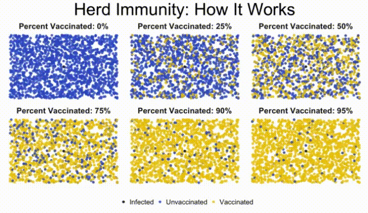

# Tree Ensembles and Random Forests - Lab

## Introduction

In this lab, we'll create some popular tree ensemble models such as a bag of trees and random forest to predict a person's salary based on information about them.

## Objectives

In this lab you will:

- Train a random forest model using `scikit-learn`
- Access, visualize, and interpret feature importances from an ensemble model

## Import data

In this lab, you'll use personal attributes to predict whether people make more than 50k/year.  The dataset was extracted from the census bureau database. The goal is to use this dataset to try and draw conclusions regarding what drives salaries. More specifically, the target variable is categorical (> 50k and <= 50 k). Let's create a classification tree!

To get started, run the cell below to import everything we'll need for this lab.

```python
import pandas as pd
import numpy as np
np.random.seed(0)
import matplotlib.pyplot as plt
from sklearn.model_selection import train_test_split
from sklearn.metrics import accuracy_score, confusion_matrix, classification_report
from sklearn.tree import DecisionTreeClassifier
from sklearn.ensemble import BaggingClassifier, RandomForestClassifier
```
Our dataset is stored in the file `'salaries_final.csv'`.

In the cell below, import the dataset from this file and store it in a DataFrame. Be sure to set the `index_col` parameter to `0`.  Then, display the `.head()` of the DataFrame to ensure that everything loaded correctly.

```python
# Import the data
salaries = pd.read_csv('salaries_final.csv', index_col=0)
salaries.head()
```
In total, there are 6 predictors, and one outcome variable, the salary, `Target` - `<= 50k` and `>50k`.

The 6 predictors are:

- `Age`: continuous

- `Education`: Categorical. Bachelors, Some-college, 11th, HS-grad, Prof-school, Assoc-acdm, Assoc-voc, 9th, 7th-8th, 12th, Masters, 1st-4th, 10th, Doctorate, 5th-6th, Preschool

- `Occupation`: Tech-support, Craft-repair, Other-service, Sales, Exec-managerial, Prof-specialty, Handlers-cleaners, Machine-op-inspct, Adm-clerical, Farming-fishing, Transport-moving, Priv-house-serv, Protective-serv, Armed-Forces

- `Relationship`: Wife, Own-child, Husband, Not-in-family, Other-relative, Unmarried

- `Race`: White, Asian-Pac-Islander, Amer-Indian-Eskimo, Other, Black

- `Sex`: Female, Male

First, we'll need to store our `'Target'` column in a separate variable and drop it from the dataset.

Do this in the cell below.

```python
# Split the outcome and predictor variables
target = salaries['Target']
salaries = salaries.drop("Target", axis=1)
```
In the cell below, examine the data type of each column:

```python
salaries.dtypes
```
Great. `'Age'` is numeric, as it should be. Now we're ready to create some dummy columns and deal with our categorical variables.

In the cell below, use Pandas to create dummy columns for each of categorical variables. If you're unsure of how to do this, check out the [documentation](https://pandas.pydata.org/pandas-docs/stable/generated/pandas.get_dummies.html).

```python
# Create dummy variables
data = pd.get_dummies(salaries)
data.head()
```
Now, split `data` and `target` into 75/25 training and test sets. Set the `random_state` to 123.

```python
data_train, data_test, target_train, target_test = train_test_split(data, target,
                                                                    test_size = 0.25, random_state=123)
```
## Build a "regular" tree as a baseline

We'll begin by fitting a regular decision tree classifier, so that we have something to compare our ensemble methods to.

### Build the tree

In the cell below, instantiate and fit a decision tree classifier. Set the `criterion` to `'gini'`, and a `max_depth` of `5`.  Then, fit the tree to the training data and labels.

```python
# Instantiate and fit a DecisionTreeClassifier
tree_clf = DecisionTreeClassifier(criterion='gini', max_depth=5)
tree_clf.fit(data_train, target_train)
```
### Feature importance

Let's quickly examine how important each feature ended up being in our decision tree model. Check the `feature_importances_` attribute of the trained model to see what it displays.

```python
# Feature importance
tree_clf.feature_importances_
```
That matrix isn't very helpful, but a visualization of the data it contains could be.  Run the cell below to plot a visualization of the feature importances for this model.

```python
def plot_feature_importances(model):
    n_features = data_train.shape[1]
    plt.figure(figsize=(8,8))
    plt.barh(range(n_features), model.feature_importances_, align='center')
    plt.yticks(np.arange(n_features), data_train.columns.values)
    plt.xlabel('Feature importance')
    plt.ylabel('Feature')

plot_feature_importances(tree_clf)
```
### Model performance

Next, let's see how well our model performed on the test data.

In the cell below:

* Use the model to generate predictions on the test set
* Print out a `confusion_matrix` of the test set predictions
* Print out a `classification_report` of the test set predictions

```python
# Test set predictions
pred = tree_clf.predict(data_test)

# Confusion matrix and classification report
print(confusion_matrix(target_test, pred))
print(classification_report(target_test, pred))
```
Now, let's check the model's accuracy. Run the cell below to display the test set accuracy of the model.

```python
print("Testing Accuracy for Decision Tree Classifier: {:.4}%".format(accuracy_score(target_test, pred) * 100))
```
## Bagged trees

The first ensemble approach we'll try is a bag of trees. This will make use of **_Bagging_**, along with a number of decision tree classifier models.

Now, let's instantiate a [`BaggingClassifier`](http://scikit-learn.org/stable/modules/generated/sklearn.ensemble.BaggingClassifier.html).  First, initialize a `DecisionTreeClassifier` and set the same parameters that we did above for `criterion` and `max_depth`.  Also set the `n_estimators` parameter for our `BaggingClassifier` to `20`.

```python
# Instantiate a BaggingClassifier
bagged_tree =  BaggingClassifier(DecisionTreeClassifier(criterion='gini', max_depth=5),
                                 n_estimators=20)
```
Great! Now, fit it to our training data.

```python
# Fit to the training data
bagged_tree.fit(data_train, target_train)
```
Checking the accuracy of a model is such a common task that all (supervised learning) models have a `.score()` method that wraps the `accuracy_score()` helper function we've been using. All we have to do is pass it a dataset and the corresponding labels and it will return the accuracy score for those data/labels.

Let's use it to get the training accuracy of our model. In the cell below, call the `.score()` method on our bagging model and pass in our training data and training labels as parameters.

```python
# Training accuracy score
bagged_tree.score(data_train, target_train)
```
Now, let's check the accuracy score that really matters -- our testing accuracy.  This time, pass in our testing data and labels to see how the model did.

```python
# Test accuracy score
bagged_tree.score(data_test, target_test)
```
## Random forests

Another popular ensemble method is the **_Random Forest_**. Let's fit a random forest classifier next and see how it measures up compared to all the others.

### Fit a random forests model

In the cell below, instantiate and fit a `RandomForestClassifier`, and set the number estimators to `100` and the max depth to `5`. Then, fit the model to our training data.

```python
# Instantiate and fit a RandomForestClassifier
forest = RandomForestClassifier(n_estimators=100, max_depth= 5)
forest.fit(data_train, target_train)
```
Now, let's check the training and testing accuracy of the model using its `.score()` method:

```python
# Training accuracy score
forest.score(data_train, target_train)
```
```python
# Test accuracy score
forest.score(data_test, target_test)
```
### Feature importance

```python
plot_feature_importances(forest)
```
Note: "relationship" represents what this individual is relative to others. For example an
individual could be a Husband. Each entry only has one relationship, so it is a bit of a weird attribute.

Also note that more features show up. This is a pretty typical result.

### Look at the trees in your forest

Let's create a forest with some small trees. You'll learn how to access trees in your forest!

In the cell below, create another `RandomForestClassifier`.  Set the number of estimators to 5, the `max_features` to 10, and the `max_depth` to 2.

```python
# Instantiate and fit a RandomForestClassifier
forest_2 = RandomForestClassifier(n_estimators = 5, max_features= 10, max_depth= 2)
forest_2.fit(data_train, target_train)
```
Making `max_features` smaller will lead to very different trees in your forest! The trees in your forest are stored in the `.estimators_` attribute.

In the cell below, get the first tree from `forest_2.estimators_` and store it in `rf_tree_1`

```python
# First tree from forest_2
rf_tree_1 = forest_2.estimators_[0]
```
Now, we can reuse our `plot_feature_importances()` function to visualize which features this tree was given to use duing subspace sampling.

In the cell below, call `plot_feature_importances()` on `rf_tree_1`.

```python
# Feature importance
plot_feature_importances(rf_tree_1)
```
Now, grab the second tree and store it in `rf_tree_2`, and then pass it to `plot_feature_importances()` in the following cell so we can compare which features were most useful to each.

```python
# Second tree from forest_2
rf_tree_2 = forest_2.estimators_[1]
```
```python
# Feature importance
plot_feature_importances(rf_tree_2)
```
We can see by comparing the two plots that the two trees we examined from our random forest look at different attributes, and have wildly different feature importances!

## Summary

In this lab, we got some practice creating a few different tree ensemble methods. We also learned how to visualize feature importances, and compared individual trees from a random forest to see if we could notice the differences in the features they were trained on.


-----File-Boundary-----
# GridSearchCV - Lab

## Introduction

In this lab, we'll explore how to use scikit-learn's `GridSearchCV` class to exhaustively search through every combination of hyperparameters until we find optimal values for a given model.

## Objectives

In this lab you will:

- Design a parameter grid for use with scikit-learn's GridSearchCV
- Use GridSearchCV to increase model performance through parameter tuning


## The dataset

For this lab, we'll be working with the [Wine Quality Dataset](https://archive.ics.uci.edu/ml/datasets/wine+quality) from the UCI Machine Learning dataset repository. We'll be using data about the various features of wine to predict the quality of the wine on a scale from 1-10 stars, making this a multiclass classification problem.

### Getting started

Before we can begin grid searching our way to optimal hyperparameters, we'll need to go through the basic steps of modeling. This means that we'll need to:

* Import and inspect the dataset (and clean, if necessary)
* Split the data into training and test sets
* Build and fit a baseline model that we can compare against our grid search results

Run the cell below to import everything we'll need for this lab:

```python
import pandas as pd
import numpy as np
import matplotlib.pyplot as plt
%matplotlib inline
import seaborn as sns
from sklearn.model_selection import train_test_split, GridSearchCV, cross_val_score
from sklearn.tree import DecisionTreeClassifier
from sklearn.ensemble import RandomForestClassifier, AdaBoostClassifier
from sklearn.metrics import accuracy_score
```
Now that we've imported all the necessary libraries and functions for this lab, we'll need to get the dataset.

Our data is stored in the file `'winequality-red.csv'`. Use Pandas to import the data from this file and store it in a DataFrame.  Print the head to ensure that everything loaded correctly.

```python
# Import the data
df = pd.read_csv('winequality-red.csv')
df.head()
```
Great! Let's inspect our data. In the cell below, perform some basic exploratory data analysis on our dataset. Get a feel for your data by exploring the descriptive statistics and creating at least one visualization to help you better understand this dataset.

```python
# Explore the dataset
display(df.describe())

# Create a box plot of each column
plt.figure(figsize=(20, 10))
plt.boxplot([df[col] for col in df.columns])
plt.title("Box plot of all columns in dataset")
plt.xticks(range(len(df.columns.values)), df.columns.values)
plt.show()
```
**_Question:_** Based on your findings during your exploratory data analysis, do you think that we need to do any sort of preprocessing on this dataset? Why or why not?

Write your answer below this line:
________________________________________________________________________________________________________________________________


### Preprocessing our data

Now, we'll perform any necessary preprocessing on our dataset before training our model. We'll start by isolating the target variable that we are trying to predict.

In the cell below:
* Assign the data in the `quality` column to the `y` variable
* Drop the `quality` column from the dataset and assign it to `X`

```python
y = df['quality']
X = df.drop('quality', axis=1)
X.head()
```
### Training, testing, and cross-validation

First we want to do a train-test split to create a holdout set to evaluate how good our final model is. Remember that any time we make modeling decisions based on a section of our data, we risk overfitting to that data. We can make use of **_Cross Validation_** when using `GridSearchCV` to do model selection and hyperparameter tuning, then test our final model choice on the test set.

In the cell below:

* Create a training and test set using `train_test_split()` (set `random_state=42` for reproducability)

```python
# Split the data into training and test sets
X_train, X_test, y_train, y_test = train_test_split(X, y, random_state=42)
```
### Create a baseline model: Decision Trees

In the cell below:

* Instantiate a `DecisionTreeClassifier`
* Perform a 3-fold cross-validation on the training data using this classifier
* Calculate and print the mean cross-validation score from the model

**_Note:_** If you need a refresher on how to use `cross_val_score()`, check out the [documentation](http://scikit-learn.org/stable/modules/generated/sklearn.model_selection.cross_val_score.html).

```python
dt_clf = DecisionTreeClassifier()

dt_cv_score = cross_val_score(dt_clf, X_train, y_train, cv=3)
mean_dt_cv_score = np.mean(dt_cv_score)

print(f"Mean Cross Validation Score: {mean_dt_cv_score :.2%}")
```
Take a second to interpret the results of the cross-validation score.  How well did the model do? How does this compare to a naive baseline level of accuracy (random guessing)?

Write your answer below:

```python
print("""
Our model did poorly overall, but still significantly better than we
would expect from random guessing, which would have ~10% accuracy.
""")
```
## Grid search: Decision trees

Our model does not have stellar performance. However, we've yet to modify the hyperparameters of the model. Each dataset is different, and the chances that the best possible parameters for a given dataset also happen to be the default parameters set by `scikit-learn` at instantiation is very low.

This means that we need to try **_Hyperparameter Tuning_**.  There are several strategies for searching for optimal hyperparameters. The one we'll be using, **_Combinatoric Grid Searching_**, is probably the most popular because it performs an exhaustive search of all possible combinations.

The sklearn module we'll be using to accomplish this is `GridSearchCV`, which can be found inside of `sklearn.model_selection`.

Take a minute to look at sklearn's user guide for [GridSearchCV](http://scikit-learn.org/stable/modules/grid_search.html#grid-search) and then complete the following task.

In the cell below:

* Complete the `param_grid` dictionary. In this dictionary, each key represents a parameter we want to tune and each corresponding value is a list of every parameter value we'd like to check for that parameter
* Normally, you would have to just try different values to search through for each parameter.  However, in order to limit the complexity of this lab, the parameters and values to search through have been provided for you.  You just need to turn them into key-value pairs inside the `param_grid` dictionary. Complete `param_grid` so that it tests the following values for each corresponding parameter:
    * For `"criterion"`, try values of `"gini"` and `"entropy"`
    * For `"max_depth"`, try `None`, as well as 2, 3, 4, 5, and 6
    * For `min_samples_split`, try 2, 5, and 10
    * For `"min_samples_leaf"`, try 1, 2, 3, 4, 5, and 6

* Before you run the grid search take some time to understand what each of the specific hyperparameters mean. How does varying the values of each hyperparameter effect the overfitting or underfitting of a decision tree model?

```python
dt_param_grid = {
    'criterion': ['gini', 'entropy'],
    'max_depth': [None, 2, 3, 4, 5, 6],
    'min_samples_split': [2, 5, 10],
    'min_samples_leaf': [1, 2, 3, 4, 5, 6]
}
```
Now that we have our parameter grid set up, we can use `GridSearchCV`.  Before we do, let's briefly think about the particulars of this model.

Grid Search works by training a model on the data for each unique combination of parameters and then returning the parameters of the model that performed best. In order to protect us from randomness, it is common to implement K-Fold cross-validation during this step.  For this lab, we'll set K = 3, meaning that we'll actually train 3 different models for each unique combination of parameters.

Given our `param_grid` and the knowledge that we're going to use 3-fold cross-validation, how many different decision trees will `GridSearchCV` have to train in order to try every possible combination and find the best parameter choices?

Calculate and print your answer in the cell below.

```python
num_decision_trees = 3 * 2 * 6 * 3 * 6
print(f"Grid Search will have to search through {num_decision_trees} different permutations.")
```
That's a lot of decision trees! Decision trees are generally pretty quick to train, but that isn't the case with every type of model we want to tune. Be aware that if you set a particularly large search space of parameters inside your parameter grid, then grid search could potentially take a very long time.

Let's create our `GridSearchCV` object and fit it. In the cell below:

* Instantiate `GridSearchCV`.  Pass in our model, the parameter grid, and `cv=3` to use 3-fold cross-validation. Also set `return_train_score` to `True`
* Call our grid search object's `fit()` method and pass in our data and labels, just as if you were using regular cross validation

```python
# Instantiate GridSearchCV
dt_grid_search = GridSearchCV(dt_clf, dt_param_grid, cv=3, return_train_score=True)

# Fit to the data
dt_grid_search.fit(X_train, y_train)
```
### Examine the best parameters

Now that we have fit our model using grid search, we need to inspect it to discover the optimal combination of parameters.

In the cell below:

* Calculate the the mean training score.  An array of training score results can be found inside the `.cv_results_` dictionary, with the key `mean_train_score`
* Calculate the testing score using the our grid search model's `.score()` method by passing in our data and labels
* Examine the appropriate attribute to discover the best estimator parameters found during the grid search

**_HINT:_** If you're unsure what attribute this is stored in, take a look at sklearn's [GridSearchCV documentation](http://scikit-learn.org/stable/modules/generated/sklearn.model_selection.GridSearchCV.html).

```python
# Mean training score
dt_gs_training_score = np.mean(dt_grid_search.cv_results_['mean_train_score'])

# Mean test score
dt_gs_testing_score = dt_grid_search.score(X_test, y_test)

print(f"Mean Training Score: {dt_gs_training_score :.2%}")
print(f"Mean Test Score: {dt_gs_testing_score :.2%}")
print("Best Parameter Combination Found During Grid Search:")
dt_grid_search.best_params_
```
**_Question:_** What effect, if any, did our parameter tuning have on model performance? Will `GridSearchCV` always discover a perfectly (global) optimal set of parameters? Why or why not?

```python
print("""
The parameter tuning using GridSearchCV improved our model's performance
by over 20%, from ~44% to ~66%. The model also shows no signs of
overfitting, as evidenced by the close training and testing scores.
Grid Search does not gaurantee that we will always find the globally
optimal combination of parameter values. Since it only exhaustively
searches through the parameter values we provide,
not every possible combination of every possible value for each parameter
is tested. This means that the model is only as good as the possible
combinations of the parameters we include in our parameter grid.
""")
```
### Tuning more advanced models: Random forests

Now that we have some experience with grid searching through parameter values for a decision tree classifier, let's try our luck with a more advanced model and tune a _random forest classifier_.

In the cell below:
* Instantiate a `RandomForestClassifier`
* Use 3-fold cross-validation to generate a baseline score for this model type, so that we have something to compare our tuned model performance to

```python
rf_clf = RandomForestClassifier()
mean_rf_cv_score = np.mean(cross_val_score(rf_clf, X_train, y_train, cv=3))

print(f"Mean Cross Validation Score for Random Forest Classifier: {mean_rf_cv_score :.2%}")
```
Now that we have our baseline score, we'll create a parameter grid specific to our random forest classifier.

Again -- in a real world situation, you will need to decide what parameters to tune, and be very thoughtful about what values to test for each parameter.  However, since this is a lab, we have provided the following table in the interest of simplicity.  Complete the `rf_param_grid` dictionary with the following key-value pairs:


 |     Parameter     |         Values         |
|:-----------------:|:----------------------:|
|    n_estimators   |      [10, 30, 100]     |
|     criterion     |   ['gini', 'entropy']  |
|     max_depth     | [None, 2, 6, 10] |
| min_samples_split |       [5, 10]       |
|  min_samples_leaf |   [3, 6]   |

```python
rf_param_grid = {
    'n_estimators': [10, 30, 100],
    'criterion': ['gini', 'entropy'],
    'max_depth': [None, 2, 6, 10],
    'min_samples_split': [5, 10],
    'min_samples_leaf': [3, 6]
}
```
Great! Now that we have our parameter grid, we can grid search through it with our random forest.

In the cell below, follow the process we used with decision trees above to grid search for the best parameters for our random forest classifier.

Instantiate `GridSearchCV` and pass in:
* our random forest classifier
* the parameter grid
* `cv=3`
* **_do not_** specify `return_train_score` as we did with our decision trees example above.  In the interest of runtime, we'll only worry about testing accuracy this time


**_NOTE:_** The runtime for the following cell can be over a minute on most computers.

```python
rf_grid_search = GridSearchCV(rf_clf, rf_param_grid, cv=3)
rf_grid_search.fit(X_train, y_train)

print(f"Training Accuracy: {rf_grid_search.best_score_ :.2%}")
print("")
print(f"Optimal Parameters: {rf_grid_search.best_params_}")
```
### Interpret results

Did tuning the hyperparameters of our random forest classifier improve model performance? Is this performance increase significant? Which model did better? If you had to choose, which model would you put into production? Explain your answer.

```python
print("""
Parameter tuning improved performance marginally, by about 6%.
This is good, but still falls short of the top testing score of the
Decision Tree Classifier by about 7%. Which model to ship to production
would depend on several factors, such as the overall goal, and how
noisy the dataset is. If the dataset is particularly noisy,
the Random Forest model would likely be preferable,
since the ensemble approach makes it more resistant to variance in the data.
If the data is fairly stable from batch to batch and not too noisy,
or if higher accuracy had a disproportionate effect on our business goals,
then I would go with the Decision Tree Classifier because it scored higher.
""")
```
## Which model performed the best on the holdout set?

Run the following cell to see the accuracy of the various grid search models on the test set:

```python
dt_score = dt_grid_search.score(X_test, y_test)
rf_score = rf_grid_search.score(X_test, y_test)

print('Decision tree grid search: ', dt_score)
print('Random forest grid search: ', rf_score)
```
So our random forest model performed the best!

## Summary

In this lab, you learned to:

* iteratively search for optimal model parameters using `GridSearhCV`
* tune model parameters for decision trees and random forests models


-----File-Boundary-----
# Gradient Boosting - Lab

## Introduction

In this lab, we'll learn how to use both Adaboost and Gradient Boosting classifiers from scikit-learn!

## Objectives

You will be able to:

- Use AdaBoost to make predictions on a dataset
- Use Gradient Boosting to make predictions on a dataset

## Getting Started

In this lab, we'll learn how to use boosting algorithms to make classifications on the [Pima Indians Dataset](http://ftp.ics.uci.edu/pub/machine-learning-databases/pima-indians-diabetes/pima-indians-diabetes.names). You will find the data stored in the file `'pima-indians-diabetes.csv'`. Our goal is to use boosting algorithms to determine whether a person has diabetes. Let's get started!

We'll begin by importing everything we need for this lab. Run cell below:

```python
import numpy as np
import pandas as pd
import matplotlib.pyplot as plt
%matplotlib inline
from sklearn.model_selection import train_test_split, cross_val_score
from sklearn.ensemble import AdaBoostClassifier, GradientBoostingClassifier
from sklearn.metrics import accuracy_score, f1_score, confusion_matrix, classification_report
```
Now, use Pandas to import the data stored in `'pima-indians-diabetes.csv'` and store it in a DataFrame. Print the first five rows to inspect the data we've imported and ensure everything loaded correctly.

```python
# Import the data
df = pd.read_csv('pima-indians-diabetes.csv')

# Print the first five rows
df.head()
```
## Cleaning, exploration, and preprocessing

The target we're trying to predict is the `'Outcome'` column. A `1` denotes a patient with diabetes.

By now, you're quite familiar with exploring and preprocessing a dataset.

In the following cells:

* Check for missing values and deal with them as you see fit (if any exist)
* Count the number of patients with and without diabetes in this dataset
* Store the target column in a separate variable and remove it from the dataset
* Split the dataset into training and test sets, with a `test_size` of 0.25 and a `random_state` of 42

```python
# Check for missing values
df.isna().sum()
```
```python
# Number of patients with and without diabetes
df['Outcome'].value_counts()
```
```python
target = df['Outcome']
df = df.drop('Outcome', axis=1)
```
```python
# Split the data into training and test sets
X_train, X_test, y_train, y_test = train_test_split(df, target, test_size=0.25, random_state=42)
```
## Train the models

Now that we've explored the dataset, we're ready to fit some models!

In the cell below:

* Instantiate an `AdaBoostClassifier` (set the `random_state` for 42)
* Instantiate a `GradientBoostingClassifer` (set the `random_state` for 42)

```python
# Instantiate an AdaBoostClassifier
adaboost_clf = AdaBoostClassifier(random_state=42)

# Instantiate an GradientBoostingClassifier
gbt_clf = GradientBoostingClassifier(random_state=42)
```
Now, fit the training data to both the classifiers:

```python
adaboost_clf.fit(X_train, y_train)
```
```python
gbt_clf.fit(X_train, y_train)
```
Now, let's use these models to predict labels on both the training and test sets:

```python
# AdaBoost model predictions
adaboost_train_preds = adaboost_clf.predict(X_train)
adaboost_test_preds = adaboost_clf.predict(X_test)

# GradientBoosting model predictions
gbt_clf_train_preds = gbt_clf.predict(X_train)
gbt_clf_test_preds = gbt_clf.predict(X_test)
```
Now, complete the following function and use it to calculate the accuracy and f1-score for each model:

```python
def display_acc_and_f1_score(true, preds, model_name):
    acc = accuracy_score(true, preds)
    f1 = f1_score(true, preds)
    print("Model: {}".format(model_name))
    print("Accuracy: {}".format(acc))
    print("F1-Score: {}".format(f1))

print("Training Metrics")
display_acc_and_f1_score(y_train, adaboost_train_preds, model_name='AdaBoost')
print("")
display_acc_and_f1_score(y_train, gbt_clf_train_preds, model_name='Gradient Boosted Trees')
print("")
print("Testing Metrics")
display_acc_and_f1_score(y_test, adaboost_test_preds, model_name='AdaBoost')
print("")
display_acc_and_f1_score(y_test, gbt_clf_test_preds, model_name='Gradient Boosted Trees')
```
Let's go one step further and create a confusion matrix and classification report for each. Do so in the cell below:

```python
adaboost_confusion_matrix = confusion_matrix(y_test, adaboost_test_preds)
adaboost_confusion_matrix
```
```python
gbt_confusion_matrix = confusion_matrix(y_test, gbt_clf_test_preds)
gbt_confusion_matrix
```
```python
adaboost_classification_report = classification_report(y_test, adaboost_test_preds)
print(adaboost_classification_report)
```
```python
gbt_classification_report = classification_report(y_test, gbt_clf_test_preds)
print(gbt_classification_report)
```
**_Question:_** How did the models perform? Interpret the evaluation metrics above to answer this question.

Write your answer below this line:
_______________________________________________________________________________________________________________________________


As a final performance check, let's calculate the 5-fold cross-validated score for each model!

Recall that to compute the cross-validation score, we need to pass in:

* A classifier
* All training data
* All labels
* The number of folds we want in our cross-validation score

Since we're computing cross-validation score, we'll want to pass in the entire dataset, as well as all of the labels.

In the cells below, compute the mean cross validation score for each model.

```python
print('Mean Adaboost Cross-Val Score (k=5):')
print(cross_val_score(adaboost_clf, df, target, cv=5).mean())
# Expected Output: 0.7631270690094218
```
```python
print('Mean GBT Cross-Val Score (k=5):')
print(cross_val_score(gbt_clf, df, target, cv=5).mean())
# Expected Output: 0.7591715474068416
```
These models didn't do poorly, but we could probably do a bit better by tuning some of the important parameters such as the **_Learning Rate_**.

## Summary

In this lab, we learned how to use scikit-learn's implementations of popular boosting algorithms such as AdaBoost and Gradient Boosted Trees to make classification predictions on a real-world dataset!


-----File-Boundary-----
# XGBoost - Lab

## Introduction

In this lab, we'll install the popular [XGBoost](http://xgboost.readthedocs.io/en/latest/index.html) library and explore how to use this popular boosting model to classify different types of wine using the [Wine Quality Dataset](https://archive.ics.uci.edu/ml/datasets/wine+quality) from the UCI Machine Learning Dataset Repository.

## Objectives

You will be able to:

- Fit, tune, and evaluate an XGBoost algorithm

## Installing XGBoost

Run this lab on your local computer.

The XGBoost model is not currently included in scikit-learn, so we'll have to install it on our own.  To install XGBoost, you'll need to use `conda`.

To install XGBoost, follow these steps:

1. Open up a new terminal window
2. Activate your conda environment
3. Run `conda install xgboost`. You must use `conda` to install this package -- currently, it cannot be installed using `pip`
4. Once the installation has completed, run the cell below to verify that everything worked

```python
from xgboost import XGBClassifier
```
Run the cell below to import everything we'll need for this lab.

```python
import pandas as pd
import numpy as np
np.random.seed(0)
import matplotlib.pyplot as plt
from sklearn.model_selection import train_test_split
from sklearn.metrics import accuracy_score
from sklearn.model_selection import GridSearchCV
from sklearn.preprocessing import LabelEncoder
import warnings
warnings.filterwarnings('ignore')
%matplotlib inline
```
### Loading the Data

The dataset we'll be using for this lab is currently stored in the file `'winequality-red.csv'`.

In the cell below, use pandas to import the dataset into a dataframe, and inspect the `.head()` of the dataframe to ensure everything loaded correctly.

```python
df = pd.read_csv('winequality-red.csv')
df.head()
```
For this lab, our target column will be `'quality'`.  That makes this a multiclass classification problem. Given the data in the columns from `'fixed_acidity'` through `'alcohol'`, we'll predict the quality of the wine.

This means that we need to store our target variable separately from the dataset, and then split the data and labels into training and test sets that we can use for cross-validation.

### Splitting the Data

In the cell below:

- Assign the `'quality'` column to `y`
- Drop this column (`'quality'`) and assign the resulting DataFrame to `X`
- Split the data into training and test sets. Set the `random_state` to 42

```python
y = df['quality']
X = df.drop(columns=['quality'], axis=1)

X_train, X_test, y_train, y_test = train_test_split(X, y, random_state=42)
```
### Preprocessing the Data

These are the current target values:

```python
y_train.value_counts().sort_index()
```
XGBoost requires that classification categories be integers that count up from 0, not starting at 3. Therefore you should instantiate a `LabelEncoder` ([documentation here](https://scikit-learn.org/stable/modules/generated/sklearn.preprocessing.LabelEncoder.html)) and convert both `y_train` and `y_test` into arrays containing label encoded values (i.e. integers that count up from 0).

```python
# Instantiate the encoder
encoder = LabelEncoder()

# Fit and transform the training data
y_train = pd.Series(encoder.fit_transform(y_train))

# Transform the test data
y_test = pd.Series(encoder.transform(y_test))
```
Confirm that the new values start at 0 instead of 3:

```python
y_train.value_counts().sort_index()
```
```python
y_test.value_counts().sort_index()
```
### Building an XGBoost Model

Now that you have prepared the data for modeling, you can use XGBoost to build a model that can accurately classify wine quality based on the features of the wine!

The API for `xgboost` is purposefully written to mirror the same structure as other models in scikit-learn.

```python
# Instantiate XGBClassifier
clf = XGBClassifier()

# Fit XGBClassifier
clf.fit(X_train, y_train)

# Predict on training and test sets
training_preds = clf.predict(X_train)
test_preds = clf.predict(X_test)

# Accuracy of training and test sets
training_accuracy = accuracy_score(y_train, training_preds)
test_accuracy = accuracy_score(y_test, test_preds)

print('Training Accuracy: {:.4}%'.format(training_accuracy * 100))
print('Validation accuracy: {:.4}%'.format(test_accuracy * 100))
```
## Tuning XGBoost

The model had a somewhat lackluster performance on the test set compared to the training set, suggesting the model is beginning to overfit to the training data. Let's tune the model to increase the model performance and prevent overfitting.

You've already encountered a lot of parameters when working with Decision Trees, Random Forests, and Gradient Boosted Trees.

For a full list of model parameters, see the [XGBoost Documentation](http://xgboost.readthedocs.io/en/latest/parameter.html).

Examine the tunable parameters for XGboost, and then fill in appropriate values for the `param_grid` dictionary in the cell below.

**_NOTE:_** Remember, `GridSearchCV` finds the optimal combination of parameters through an exhaustive combinatoric search.  If you search through too many parameters, the model will take forever to run! To ensure your code runs in sufficient time, we restricted the number of values the parameters can take.

```python
param_grid = {
    'learning_rate': [0.1, 0.2],
    'max_depth': [6],
    'min_child_weight': [1, 2],
    'subsample': [0.5, 0.7],
    'n_estimators': [100],
}
```
Now that we have constructed our `params` dictionary, create a `GridSearchCV` object in the cell below and use it to iteratively tune our XGBoost model.

Now, in the cell below:

* Create a `GridSearchCV` object. Pass in the following parameters:
    * `clf`, the classifier
    * `param_grid`, the dictionary of parameters we're going to grid search through
    * `scoring='accuracy'`
    * `cv=None`
    * `n_jobs=1`
* Fit our `grid_clf` object and pass in `X_train` and `y_train`
* Store the best parameter combination found by the grid search in `best_parameters`. You can find these inside the grid search object's `.best_params_` attribute
* Use `grid_clf` to create predictions for the training and test sets, and store them in separate variables
* Compute the accuracy score for the training and test predictions

```python
grid_clf = GridSearchCV(clf, param_grid, scoring='accuracy', cv=None, n_jobs=1)
grid_clf.fit(X_train, y_train)

best_parameters = grid_clf.best_params_

print('Grid Search found the following optimal parameters: ')
for param_name in sorted(best_parameters.keys()):
    print('%s: %r' % (param_name, best_parameters[param_name]))

training_preds = grid_clf.predict(X_train)
test_preds = grid_clf.predict(X_test)
training_accuracy = accuracy_score(y_train, training_preds)
test_accuracy = accuracy_score(y_test, test_preds)

print('')
print('Training Accuracy: {:.4}%'.format(training_accuracy * 100))
print('Validation accuracy: {:.4}%'.format(test_accuracy * 100))
```
## Summary

Great! You've now successfully made use of one of the most powerful boosting models in data science for modeling.  We've also learned how to tune the model for better performance using the grid search methodology we learned previously. XGBoost is a powerful modeling tool to have in your arsenal. Don't be afraid to experiment with it!


-----File-Boundary-----
# Object Oriented Attributes With Functions - Lab

## Introduction

In the last lesson, you saw what a **domain model** is and how it ties into object-oriented programming. In this lab, you'll be using a school as a domain model.

## Objectives

You will be able to:

* Create a domain model using OOP
* Create instance methods that operate on instance attributes


## Creating a Simple School Class

To start, open up the **school.py** file in your text editor of choice such as Atom, Sublime, or a simple notepad program. Within this file, create a `School()` class definition that will be initialized with the name of the school.

> **Note:** the next cell imports an extension, `autoreload`, from IPython. The autoreload extension reloads any imported packages when methods from that package are called. While this is inefficient for stable packages such as NumPy which will be static while working in a notebook, the `autoreload` extension is quite useful when developing a package yourself. That is, you can update a package such as **school.py** and then test the effects in a notebook; with the `autoreload` extension, you'll see the effects of your changes to the package reflected.

>> If you still have trouble with cells reflecting updates to the **school.py** file as you go along, go to the *Kernel* tab at the top of the Jupyter notebook and click *Restart & Run All*. This should smoothly run everything up to where you're working.

```python
%load_ext autoreload
%autoreload 2
```
```python
from school import School
```
```python
school = School("Middletown High School")
```
## Updating the __init__ method

Great! Now, update your `School()` definition in **school.py** to also include a `roster` attribute upon initialization. Initialize the `roster` attribute as an empty dictionary. Later, you'll use this empty roster dictionary to list students of each grade. For example, a future entry in the roster dictionary could be `{"9": ["John Smith", "Jane Donahue"]}`).

```python
# You must reinstantiate the object since you've modified the class definition!
school = School("Middletown High School")
school.roster # {}
```
## Adding Methods

### Method 1: `add_student()`

Now add a method `.add_student()` which takes two arguments: a student's full name and their grade level, and updates the roster dictionary accordingly.

```python
# Again, you must reinstantiate since you've modified the class!
school = School("Middletown High School")
school.add_student("Peter Piper", 12)
school.roster #{"12": ["Peter Piper"]}
```
> **Hint:** If you're stuck, don't fret; this one's a little tricky. You need to consider two scenarios.
    1. There is no entry for this grade yet in the roster dictionary:
        - Add an entry to roster dictionary with the grade key and a single item list using the name
    2. There is an entry for this grade in the roster dictionary:
        - Append the current name to the list associated with that grade

>> Going further: if you're really ambitious, you can actually combine both of these conditions into a single line using the `.get()` method with dictionaries. Here's the docstring for the `.get()` method:
get(key[, default])
    Return the value for key if key is in the dictionary, else default. If default is not given, it defaults to None, so that this method never raises a KeyError.

To make sure your method works for both scenarios, run the cell below:

```python
school.add_student("Kelly Slater", 9)
school.add_student("Tony Hawk", 10)
school.add_student("Ryan Sheckler", 10)
school.add_student("Bethany Hamilton", 11)
school.roster # {9: ["Kelly Slater"], 10: ["Tony Hawk", "Ryan Sheckler"], 11: ["Bethany Hamilton"], 12: ["Peter Piper"]}
```
### Method 2: `grade()`
Next, define a method called `.grade()`, which should take in an argument of a grade and return a list of all the students in that grade.

```python
# While annoying, you do need to reinstantiate the updated class and reform the previous methods
school = School("Middletown High School")
school.add_student("Peter Piper", 12)
school.add_student("Kelly Slater", 9)
school.add_student("Tony Hawk", 10)
school.add_student("Ryan Sheckler", 10)
school.add_student("Bethany Hamilton", 11)
# Testing out your new method:
print(school.grade(10)) # ["Tony Hawk", "Ryan Sheckler"]
print(school.grade(12)) # ["Peter Piper"]
```
### Method 3: `sort_roster()`

Define a method called `.sort_roster()` that returns the school's roster where the strings in the student arrays are sorted alphabetically. For instance:
`{9: ["Kelly Slater"], 10: ["Ryan Sheckler", "Tony Hawk"], 11: ["Bethany Hamilton"], 12: ["Peter Piper"]}}`

>**Note:** since dictionaries are unordered, the order of the keys does not matter here, just the order of the student's names within each list.

```python
school.sort_roster()
```
## Summary
In this lab, you continued to pracitce OOP, designing a more complex domain model using a `School()` class with a few instance methods and variables. Soon you'll see that domain models can use other classes, instance methods, and instance variables to create more functionality in your programs.


-----File-Boundary-----
# Object Oriented Shopping Cart - Lab

## Introduction
In this lab, you'll be mimicking the functionality of a shopping cart with your knowledge of object-oriented programming in Python. Your shopping cart will be able to add items of different quantities and prices to the cart, calculate discounts, keep track of what items have been added, and void transactions.

## Objectives

You will be able to:

* Define and call an instance method
* Define and access instance attributes
* Call instance methods inside of other instance methods
* Create methods that calculate statistics of the attributes of an object
* Create a domain model using OOP

## Instructions

In this lab, you'll practice your object orientated programming skills by modifying the **shopping_cart.py** file.

To start, you'll once again set this notebook to `autoreload` packages so that when you update **shopping_cart.py**, you can experiment with the effects here. Remember that while the package will be reloaded, you will need to reinitialize your class instance. Here's an example to get you started:

```python
%load_ext autoreload
%autoreload 2
```
```python
# Import our custom package
from shopping_cart import ShoppingCart
```
```python
# Initialize an instance of our shopping cart class
shopping_cart = ShoppingCart()
```
## Add an Initialization Behavior to the `ShoppingCart()` class

Update your **shopping_cart.py** file to include an `__init__` method. This should define three default attributes: `total`, which should be set to 0; `employee_discount`, set to `None`; and `items`, set to a blank list. The line of code below should work and produce the previewed output once you do this.

```python
# Add a line to reinitialize an instance of the class
shopping_cart = ShoppingCart()
print(shopping_cart.total)
print(shopping_cart.employee_discount)
print(shopping_cart.items)
```
## Add an `add_item()` method

Define an instance method called `.add_item()` that will add an item to our cart. It should take in the name of an item, its price, and an optional quantity. The method should increase the shopping cart's total by the appropriate amount and return the new total for the shopping cart.

> **Hint:** think about how you would like to keep this information in your list of items. Can we imagine wanting to ever check the price of an individual item after we've added it to our cart? What data type do we know of that can associate the item name with its price?

```python
shopping_cart.add_item("rainbow sandals", 45.99) # 45.99
```
```python
shopping_cart.add_item("agyle socks", 10.50) # 56.49
```
```python
shopping_cart.add_item("jeans", 50.00, 3) # 206.49
```
## Add Summary Methods `mean_item_price()` and `median_item_price()`

Define two more instance methods: `.mean_item_price()` and `.median_item_price()`, which should return the average price per item and the median price of the items in your cart, respectively.

> **Remember:** the mean is the average price per item and to find the median we must do three things:

* First, put all numbers in our list in ascending order (smallest to greatest)
* Then check to see if there is an odd number of elements in our list. If so, the middle number is the median
* Finally, if there is an even number of elements in the list, the median will be the average or mean of the two center elements (e.g. given the list `[1, 2, 3, 4]` the elements 2 and 3 are the two center elements and the median would be (2 + 3)/2 or 2.5)

```python
shopping_cart.mean_item_price() # 41.29
```
```python
shopping_cart.median_item_price() # 50.00
```
## Add an `apply_discount()` method

Now, define an instance method called `.apply_discount()` that applies a discount if one is provided and returns the discounted total. For example, if you initialize a new shopping cart with a discount of 20% then our total should be discounted in the amount of 20%. So, if our total were $ \$100 $, after the discount you only would owe $ \$80 $.

If our shopping cart does not have an employee discount, then it should return a string saying: `"Sorry, there is no discount to apply to your cart :("`

```python
discount_shopping_cart = ShoppingCart(20)
print(discount_shopping_cart.add_item("rainbow sandals", 45.00)) # 45.00
print(discount_shopping_cart.add_item("agyle socks", 15.00)) # 60.00
print(discount_shopping_cart.apply_discount()) # 48.00
print(discount_shopping_cart.add_item("macbook air", 1000.00)) # 1060.00
print(discount_shopping_cart.apply_discount()) # 848.00
print(shopping_cart.apply_discount()) # Sorry, there is no discount to apply to your cart :(
```
## Add a `void_last_item()` method

Finally, you are missing one piece of functionality. What if someone just accidentally added something to their cart or decided that this item is too expensive for their budget? Define a method called `void_last_item()` that removes the last item from the shopping cart and updates its total.  If there are no items in the shopping cart, `void_last_item()` should return `"There are no items in your cart!"`.

```python
shopping_cart.void_last_item()
shopping_cart.total # 156.49
```
## Summary
In this lab, you practiced using instance methods to mimic the functionality of a shopping cart as well as defined methods that give you the mean and median prices of all the items in the cart.


-----File-Boundary-----
# Building An Object-Oriented Simulation - Lab

## Introduction

In this lab, you'll build a stochastic simulation to model herd immunity in a population and examine how a virus moves through a population, depending on what percentage of the population is vaccinated against the disease.

## Objectives

You will be able to:

* Use inheritance to write nonredundant code
* Create methods that calculate statistics of the attributes of an object
* Create object-oriented data models that describe the real world with multiple classes and subclasses and interaction between classes



In the previous lesson, you saw some of the various steps you'll now take to create this simulation.

Since you'll be building a stochastic simulation that makes use of randomness, start by importing `numpy` and setting a random seed for reproducibility.

Run the cell below to do this now.

```python
import numpy as np
import pandas as pd
from tqdm.autonotebook import tqdm
np.random.seed(0)
```
## The Assumptions of Our Model

In order to build this stochastic simulation, you'll have to make some assumptions. In order to simplify the complexity of the model, assume:

* Vaccines are 100% effective
* Infected individuals that recover from the disease are now immune to catching the disease a second time (think chickenpox)
* Dead individuals are not contagious
* All infections happen from person-to-person interaction
* All individuals interact with the same amount of people each day
* The `r0` value (pronounced _"R-nought"_) is a statistic from the Centers for Disease Control that estimates the average number of people an infected person will infect before they are no longer contagious.  For this value, we assume:
    * that this number is out of 100 people
    * that this statistic is accurate

Building simulations is always a trade-off since the real world is very, very complex.  As you build the simulation, try to think about ways in which you could make our model more realistic by writing it in such a way that it eliminates one of the assumptions above (e.g. generating a float value for vaccine efficacy on a person-by-person level to eliminate our first assumption).


## Building our `Person()` class

Start by building out our `Person()` class, which will represent the individuals in the population.

The `Person()` class should have the following attributes:

* `is_alive = True`
* `is_vaccinated`, a boolean value which will be determined by generating a random value between 0 and 1.  Then compare this to `(1 - pct_vaccinated)`, a variable that should be passed in at instantiation time.  If the random number is greater, then this attribute should be `True` -- otherwise, `False`
* `is_infected = False`
* `has_been_infected = False`
* `newly_infected = False`

In the cell below, complete the `Person()` class.

**_NOTE:_** To generate a random number between 0 and 1, use `np.random.random()`.

```python
class Person(object):

    def __init__(self):
        self.is_alive = True
        self.is_infected = False
        self.has_been_infected = False
        self.newly_infected = False
        self.is_vaccinated = False

    def get_vaccinated(self, pct_vaccinated):
        if (1 - pct_vaccinated) < np.random.random():
            self.is_vaccinated = True
```
Great! Since you're using OOP to build this simulation, it makes sense to have each individual `Person` instance take care of certain details, such as determining if they are vaccinated or not.  The `pct_vaccinated` argument is a value you'll pass into the `Simulation()` class, which you can then pass along to each `Person()` once our population is created to vaccinate the right amount of people.

## Creating our `Simulation()` class

Creating our `Simulation()` class will be a bit more involved because this class does all the heavy lifting.  You'll handle this piece by piece, and test that everything is working along the way.

### Writing our `__init__` method

The init method should take in the following arguments at instantiation time:

* `self`
* `population_size`
* `disease_name`
* `r0`
* `mortality_rate`
* `total_time_steps`
* `pct_vaccinated`
* `num_initial_infected`

**_Attributes_**

The attributes `self.disease_name`, `self.mortality_rate`, and `self.total_time_steps` should be set to the corresponding arguments passed in at instantiation time.

The attribute `self.r0` should be set to set to `r0 / 100` to convert the number to a decimal between 0 and 1.

Also create attributes for keeping track of what time step the simulation is on, as well as both the current number of infected during this time step and the total number of people that have been infected at any time during the simulation.  For these, set `self.current_time_step`, `self._total_infected_counter`, and `self.current_infected_counter` to  0.

You'll also need to create an array to hold all of the `Person` objects in our simulation.  Set `self.population` equal to an empty list.

Now comes the fun part -- creating the population, and determining if they are healthy, vaccinated, or infected.

Follow the instructions inside the `__init__` method to write the logic that will set up our `Simulation` correctly.

```python
class Simulation(object):

    def __init__(self, population_size, disease_name, r0, mortality_rate,  total_time_steps, pct_vaccinated, num_initial_infected):
        self.r0 = r0 / 100.
        self.disease_name = disease_name
        self.mortality_rate = mortality_rate
        self.total_time_steps = total_time_steps
        self.current_time_step = 0
        self.total_infected_counter = 0
        self.current_infected_counter = 0
        self.dead_counter = 0
        self.population = []
        # This attribute is used in a function that is provided for you in order to log statistics from each time_step.
        # Don't touch it!
        self.time_step_statistics_df = pd.DataFrame()

        # Create a for loop the size of the population we want in this simulation
        for i in range(population_size):
            # Create new person
            new_person = Person()
            # We'll add infected persons to our simulation first.  Check if the current number of infected are equal to the
            # num_initial_infected parameter.  If not, set new_person to be infected
            if self.current_infected_counter != num_initial_infected:
                new_person.is_infected = True
                # don't forget to increment both infected counters!
                self.total_infected_counter += 1
                self.current_infected_counter += 1
            # if new_person is not infected, determine if they are vaccinated or not by using their `get_vaccinated` method
            # Then, append new_person to self.population
            else:
                new_person.get_vaccinated(pct_vaccinated)
            self.population.append(new_person)

        print("-" * 50)
        print("Simulation Initiated!")
        print("-" * 50)
        self._get_sim_statistics()


    def _get_sim_statistics(self):
    # In the interest of time, this method has been provided for you.  No extra code needed.
        num_infected = 0
        num_dead = 0
        num_vaccinated = 0
        num_immune = 0
        for i in self.population:
            if i.is_infected:
                num_infected += 1
            if not i.is_alive:
                num_dead += 1
            if i.is_vaccinated:
                num_vaccinated += 1
                num_immune += 1
            if i.has_been_infected:
                num_immune += 1
        assert num_infected == self.current_infected_counter
        assert num_dead == self.dead_counter


        print("")
        print("Summary Statistics for Time Step {}".format(self.current_time_step))
        print("")
        print("-" * 50)
        print("Disease Name: {}".format(self.disease_name))
        print("R0: {}".format(self.r0 * 100))
        print("Mortality Rate: {}%".format(self.mortality_rate * 100))
        print("Total Population Size: {}".format(len(self.population)))
        print("Total Number of Vaccinated People: {}".format(num_vaccinated))
        print("Total Number of Immune: {}".format(num_immune))
        print("Current Infected: {}".format(num_infected))
        print("Deaths So Far: {}".format(num_dead))
```
Great! You've now created a basic `Simulation()` class that is capable of instantiating itself according to your specifications. However, your simulation doesn't currently do anything.  Now, add the appropriate behaviors to the simulation.

### Building Our Simulation's Behavior

For any given time step, your simulation should complete the following steps in order:

* Loop through each living person in the population

    * If the person is currently infected:

        * Select another random person from the population

        * If this person is alive, not infected, unvaccinated, and hasn't been infected before:

            * Generate a random number between 0 and 1.  If this random number is greater than `(1 - self.r0)`, then mark this new person as newly infected

        * If the person is vaccinated, currently infected, or has been infected in a previous round of the simulation, do nothing

    * Repeat the step above until the infected person has interacted with 100 random living people from the population

* Once every infected person has interacted with 100 random living people, resolve all current illnesses and new infections

    * For each person that started this round as infected, generate a random number between 0 and 1.  If that number is greater than `(1 - mortality rate)`, then that person has been killed by the disease. They should be marked as dead. Otherwise, they stay alive, and can longer catch the disease

    * All people that were infected in this round move from `newly_infected` to `is_infected`

Begin by breaking up most of this logic into helper functions, so that your main functions will be simple.

#### `infected_interaction()` function

Write a function called `infected_interaction()` that will be called for every infected person in the population in a given time step. This function handles all the possible cases that can happen with the following logic:

* Initialize a counter called `num_interactions` to 0
* Select a random person from `self.population`
* Check if the person is alive. If the person is dead, we will not count this as an interaction
* If the random person is alive and not vaccinated, generate a random number between 0 and 1.  If the random number is greater than `(1 - self.r0)`, change the random person's `newly_infected` attribute to `True`
* Increment `num_interactions` by 1. Do not increment any of the infected counters in the simulation class -- you'll have another method deal with those

Complete the `infected_interaction()` method in the cell below.  Comments have been provided to help you write it.

**_HINT_**: To randomly select an item from a list, use `np.random.choice()`.

```python
def infected_interaction(self, infected_person):
    num_interactions = 0
    while num_interactions < 100:
        # Randomly select a person from self.population
        random_person = np.random.choice(self.population)
        # This only counts as an interaction if the random person selected is alive.  If the person is dead, we do nothing,
        # and the counter doesn't increment, repeating the loop and selecting a new person at random.
        # check if the person is alive.
        if random_person.is_alive:
            # CASE: Random person is not vaccinated, and has not been infected before, making them vulnerable to infection
            if random_person.is_vaccinated == False and random_person.has_been_infected == False:
                # Generate a random number between 0 and 1
                random_number = np.random.random()
                # If random_number is greater than or equal to (1 - self.r0), set random person as newly_infected
                if random_number >= (1 - self.r0):
                    random_person.newly_infected = True
            # Don't forget to increment num_interactions, and make sure it's at this level of indentation
            num_interactions += 1

# Adds this function to our Simulation class
Simulation.infected_interaction = infected_interaction
```
#### `_resolve_states()` function

The second helper function you'll use during each time step is one that resolves any temporary states. Recall that people do not stay newly infected or infected for more than a turn. That means you need a function to figure out what happens to these people at the end of each turn, so that everything is ready to go for the next time step.

This function will:

* Iterate through every person in the population
* Check if the person is alive (since we don't need to bother checking anything for the dead ones)
* If the person is infected, we need to resolve whether they survive the infection or die from it:
    * Generate a random number between 0 and 1
    * If this number is greater than `(1 - self.mortality_rate)`, the person has died
        * Set the person's `.is_alive` and `.is_infected` attributes both to `False`
        * Increment the simulation's `self.dead_counter` attribute by 1
        * Decrement the simulation's `self.current_infected_counter` attribute by 1
    * Else, the person has survived the infection and is now immune to future infections
        * Set the person's `is_infected` attribute to `False`
        * Set the person's `has_been_infected` attribute to `True`
        * Decrement the simulation's `self.current_infected_counter` by 1
* If the person is newly infected:
    * Set the person's `newly_infected` attribute to `False`
    * Set the person's `is_infected` attribute to `True`
    * Increment `total_infected_counter` and `current_infected_counter` by 1


Complete the function `_resolve_states()` in the cell below.  Comments have been provided to help you write it.

```python
def _resolve_states(self):
    """
    Every person in the simulation falls into 1 of 4 states at any given time:
    1. Dead
    2. Alive and not infected
    3. Currently infected
    4. Newly Infected

    States 1 and 2 need no resolving, but State 3 will resolve by either dying or surviving the disease, and State 4 will resolve
    by turning from newly infected to currently infected.

    This method will be called at the end of each time step.  All states must be resolved before the next time step can begin.
    """
    # Iterate through each person in the population
    for person in self.population:
        # We only need to worry about the people that are still alive
        if person.is_alive:
            # CASE: Person was infected this round.  We need to stochastically determine if they die or recover from the disease
            # Check if person is_infected
            if person.is_infected:
                # Generate a random number
                random_number = np.random.random()
                # If random_number is >= (1 - self.mortality_rate), set the person to dead and increment the simulation's death
                # counter
                if random_number >= (1 - self.mortality_rate):
                    # Set is_alive and in_infected both to False
                    person.is_alive = False
                    person.is_infected = False
                    # Don't forget to increment self.dead_counter, and decrement self.current_infected_counter
                    self.dead_counter += 1
                    self.current_infected_counter -= 1
                else:
                    # CASE: They survive the disease and recover.  Set is_infected to False and has_been_infected to True
                    person.is_infected = False
                    person.has_been_infected = True
                    # Don't forget to decrement self.current_infected_counter!
                    self.current_infected_counter -= 1
            # CASE: Person was newly infected during this round, and needs to be set to infected before the start of next round
            elif person.newly_infected:
                # Set is_infected to True, newly_infected to False, and increment both self.current_infected_counter and
                # self.total_infected_counter
                person.is_infected = True
                person.newly_infected = False
                self.current_infected_counter += 1
                self.total_infected_counter += 1

Simulation._resolve_states = _resolve_states
```
#### `_time_step()` function

Now that you have two helper functions to do most of the heavy lifting, the `_time_step()` function will be pretty simple.

This function should:

* Iterate through each person in the population
* If the person is alive and infected, call `self.infected_interaction()` and pass in this infected person
* Once we have looped through every person, call `self._resolve_states()` to resolve all outstanding states and prepare for the next round
* Log the statistics from this round by calling `self._log_time_step_statistics()`.  This function has been provided for you further down the notebook
* Increment `self.current_time_step`

```python
def _time_step(self):
    """
    Compute 1 time step of the simulation. This function will make use of the helper methods we've created above.

    The steps for a given time step are:
    1.  Iterate through each person in self.population.
        - For each infected person, call infected_interaction() and pass in that person.
    2.  Use _resolve_states() to resolve all states for the newly infected and the currently infected.
    3. Increment self.current_time_step by 1.
    """
    # Iterate through each person in the population
    for person in self.population:
        # Check only for people that are alive and infected
        if person.is_alive and person.is_infected:
            # Call self.infecteed_interaction() and pass in this infected person
            self.infected_interaction(person)

    # Once we've made it through the entire population, call self._resolve_states()
    self._resolve_states()

    # Now, we're almost done with this time step.  Log summary statistics, and then increment self.current_time_step by 1.
    self._log_time_step_statistics()
    self.current_time_step += 1

# Adds this function to our Simulation class
Simulation._time_step = _time_step
```
Finally, you just need to write a function that logs the results of each time step by storing it in a DataFrame, and then writes the end result of the simulation to a csv file.

In the interest of time, this function has been provided for you.  You do not need to write any code in the cell below -- just run the cell.

```python
def _log_time_step_statistics(self, write_to_file=False):
    # This function has been provided for you, you do not need to write any code for it.
    # Gets the current number of dead,
    # CASE: Round 0 of simulation, need to create and Structure DataFrame
#     if self.time_step_statistics_df == None:
#         import pandas as pd
#         self.time_step_statistics_df = pd.DataFrame()
# #         col_names = ['Time Step', 'Currently Infected', "Total Infected So Far" "Alive", "Dead"]
# #         self.time_step_statistics_df.columns = col_names
#     # CASE: Any other round
#     else:
        # Compute summary statistics for currently infected, alive, and dead, and append them to time_step_snapshots_df
    row = {
        "Time Step": self.current_time_step,
        "Currently Infected": self.current_infected_counter,
        "Total Infected So Far": self.total_infected_counter,
        "Alive": len(self.population) - self.dead_counter,
        "Dead": self.dead_counter
    }
    self.time_step_statistics_df = self.time_step_statistics_df.append(row, ignore_index=True)

    if write_to_file:
        self.time_step_statistics_df.to_csv("simulation.csv", mode='w+')

Simulation._log_time_step_statistics = _log_time_step_statistics
```
#### Wrapping It All Up With `run()`

This is the function that you (or your hypothetical user) will actually interact with. It will act as the "main" function. Since you've done a great job of writing very clean, modular helper functions, you should find that this function is the simplest one in the entire program.

This function should:

* Start a for loop that runs `self.total_time_steps` number of times.  In order to demonstrate how to easily add a progress bar to iterables with the `tqdm` library, this line has been added for you
* Display a message telling the user the time step that it is currently working on
* Call `self._time_step()`
* Once the simulation has finished, write the DataFrame containing the summary statistics from each step to a csv file. This line of code has also been provided for you

In the cell below, complete the `run()` function.  Comments have been added to help you write it.

```python
def run(self):
    """
    The main function of the simulation.  This will run the simulation starting at time step 0, calculating
    and logging the results of each time step until the final time_step is reached.
    """

    for _ in tqdm(range(self.total_time_steps)):
        # Print out the current time step
        print("Beginning Time Step {}".format(self.current_time_step))
        # Call our `_time_step()` function
        self._time_step()

    # Simulation is over--log results to a file by calling _log_time_step_statistics(write_to_file=True)
    self._log_time_step_statistics(write_to_file=True)

# Adds the run() function to our Simulation class.
Simulation.run = run
```
### Running Our Simulation

Now comes the fun part -- actually running your simulation!

In the cell below, create a simulation with the following parameters:

* Population size of 2000
* Disease name is `'Ebola'`
* `r0` value of 2
* Mortality rate of 0.5
* 20 time steps
* Vaccination rate of 0.85
* 50 initial infected

```python
sim = Simulation(2000, "Ebola", 2, 0.5, 20, .85, 50)
```
```python
sim.run()
```
```python
results = pd.read_csv('simulation.csv')
results
```
If you didn't change the random seed, your results should look like this:


As you can see from the table above, even though the average person with Ebola will infect two other people, herd immunity protects the majority of the unvaccinated people in the population.  Although there were approximately 400 people in the population that were susceptible to Ebola, only 67 were actually infected before the virus burned itself out!

## Extra Practice

Try different values for the `pct_vaccinated()` argument, and see how it changes the results of the model. These would look great as a visualization -- consider comparing them all on the same line graph!

## Summary

Great job! You've just written a simulation to demonstrate the effects of herd immunity in action. Specifically, in this lab, you demonstrated mastery of using inheritance to write nonredundant code, creating methods that calculate statistics of the attributes of an object, and creating object-oriented data models that describe the real world with multiple classes and subclasses and interaction between classes!


-----File-Boundary-----
# Vectors and Matrices in Numpy - Lab

## Introduction

In this lab, you'll solve some simple matrix creation and manipulation exercises based on what you've learned so far in this section. The key takeaway here is to be able to understand how to use indexing with matrices and vectors while applying some basic operations.

## Objectives

In this lab you will:

- Find the shape of vectors and matrices
- Access and manipulate individual scalar components of a matrix
- Create vectors and matrices using Numpy and Python

## 1. Define two arrays $A$  with shape $ (4 \times 2)$ and $B$ with shape $(2 \times 3)$
So    $A =
  \left[ {\begin{array}{cc}
   1402 & 191 \\
   1371 &  821\\
   949 &  1437 \\
   147 & 1448 \\
  \end{array} }\right]
$
and
$
B =
  \left[ {\begin{array}{ccc}
   1 & 2 & 3 \\
   4 & 5 & 6\\
  \end{array} }\right]
$

```python
import numpy as np
A = np.array([[1402, 191], [1371, 821], [949, 1437], [147, 1448]])
B = np.array([[1, 2, 3], [4, 5, 6]])
print ('A = \n', A)
print ('B = \n', B)
```
## 2. Print the dimensions of $A$ and $B$

```python
print('Shape of A:', A.shape)
print('Shape of B:', B.shape)
```
## 3. Print elements from $A$

Print the following elements from $A$:

* First row and first column
* First row and second column
* Third row and second column
* Fourth row and first column

```python
print(A[0, 0])
print(A[0, 1])
print(A[2, 1])
print(A[3, 0])
```
## 4. Write a routine to populate a matrix with random data
* Create an $(3 \times 3)$ Numpy array with all zeros (use `np.zeros()`)
* Access each location $(i,j)$ of this matrix and fill in random values between the range 1 and 10

```python
import random
M = np.zeros((3, 3))
print ('before random data:\n',M)

for x in range(0, M.shape[0]):
    for y in range(0, M.shape[1]):
        M[x][y] = random.randrange(1, 10)
print ('\nafter random data:\n',M)
```
## 5. Turn the above routine into a function
* Create two $(4 \times 4)$ zero-valued matrices and fill with random data using the function
* Add the matrices together in Numpy
* Print the results

```python
def fill(matrix):

    for x in range(0, matrix.shape[0]):
        for y in range(0, matrix.shape[1]):
            matrix[x][y] = random.randrange(1, 10)

    return matrix

M1 = np.zeros((4, 4))
M2 = np.zeros((4, 4))

M1_filled = fill(M1)
M2_filled = fill(M2)
out = M1_filled + M2_filled

print ('Final output\n\n', out)
```
## Summary

In this lab, we saw how to create and manipulate vectors and matrices in Numpy. We shall now move forward to learning more complex operations including dot products and matrix inversions.


-----File-Boundary-----
# Properties of Dot Product - Lab

## Introduction

In this lab, you'll be practicing some interesting properties of a dot product-type matrix multiplication. Understanding these properties will become useful as you study machine learning. The lab will require you to calculate results to provide a proof for these properties.

## Objectives

In this lab you will:

- Demonstrate the distributive, commutative, and associative property of dot products
- Use the transpose method to transpose Numpy matrices
- Compute the dot product for matrices and vectors


## Instructions

* For each property, create suitably sized matrices with random data to prove the equations
* Ensure that size/dimension assumptions are met while performing calculations (you'll see errors otherwise)
* Calculate the LHS and RHS for all equations and show if they are equal or not

## Distributive Property - matrix multiplication IS distributive

### Prove that $A \cdot (B+C) = (A \cdot B + A \cdot C) $

```python
import numpy as np
A = np.array([[2, 3], [1, 4], [7, 6]])
B = np.array([[5], [2]])
C = np.array([[4], [3]])

left = A.dot(B + C)
right = A.dot(B) + A.dot(C)

print (left == right)
```
## Associative Property - matrix multiplication IS associative
### Prove that $A \cdot (B \cdot C) = (A \cdot B) \cdot C $

```python
A = np.array([[2, 3], [1, 4], [7, 6]])
B = B = np.array([[5, 3], [2, 2]])
C = np.array([[4], [3]])

left = A.dot(B.dot(C))
right = (A.dot(B)).dot(C)

left == right
```
## Commutative Property - matrix multiplication is NOT commutative
### Prove that for matrices, $A \cdot B \neq B \cdot A $

```python
A = np.array([[2, 3], [6, 5]])
B = np.array([[5, 3], [2, 2]])

left = A.dot(B)
right = B.dot(A)

print(left)
print(right)

left == right
```
## Commutative Property -  vector multiplication IS commutative
### Prove that for vectors,  $x^T \cdot y = y^T \cdot x$
Note: superscipt<sup>T</sup> denotes the transpose we saw earlier

```python
x = np.array([[2], [6], [7]])
y = np.array([[3], [5], [9]])

left = np.transpose(x).dot(y)
right = np.transpose(y).dot(x)
left == right
```
## Simplification of the matrix product
### Prove that $ (A \cdot B)^T = B^T \cdot A^T $

```python
A = np.array([[2, 13], [1, 4], [72, 6], [18, 12], [27,5]])
B = np.array([[5, 30], [22, 2]])

left = np.transpose(A.dot(B))
right = np.transpose(B).dot(np.transpose(A))
left == right
```
## Summary

You've seen enough matrix algebra by now to solve a problem of linear equations as you saw earlier. You'll now see how to do this next.


-----File-Boundary-----
# Pure Python vs. Numpy - Lab

## Introduction

Numpy, Scipy, and Pandas provide a significant increase in computational efficiency with complex mathematical operations as compared to Python's built-in arithmetic functions. In this lab, you will calculate and compare the processing speed required for calculating a dot product using both basic arithmetic operations in Python and Numpy's `.dot()` method.

## Objectives
You will be able to:

- Compare the performance of high-dimensional matrix operations in Numpy vs. pure Python

## Problem

Write a routine to calculate the dot product between two $200 \times 200$ dimensional matrices using:

a) Pure Python (no libraries)

b) Numpy's `.dot()` method


### Create two $200 \times 200$ matrices in Python and fill them with random values using `np.random.rand()`

```python
# Compare 200x200 matrix-matrix multiplication speed
import numpy as np
# Set up the variables

SIZE = 200
A = np.random.rand(SIZE, SIZE)
B = np.random.rand(SIZE, SIZE)
```
## Pure Python

* Initialize a zeros-filled `numpy` matrix
* In Python, calculate the dot product using the formula


$$ \large C_{i,j}= \sum_k A_{i,k}B_{k,j}$$


* Use Python's `timeit` library to calculate the processing time
* [Visit this link](https://www.pythoncentral.io/time-a-python-function/) for an in-depth explanation on how to time a function or routine in Python

**Hint**: Use a nested `for` loop for accessing, calculating, and storing each scalar value in the resulting matrix.

```python
import timeit

# Start the timer
start = timeit.default_timer()

# Matrix multiplication in pure Python

out2 = np.zeros((SIZE, SIZE))

for i in range(SIZE):
  for j in range(SIZE):
    for k in range(SIZE):

        out2[i, k] += A[i, j]*B[j, k]

time_spent = timeit.default_timer() - start

print('Pure Python time:', time_spent, 'sec.')
```
## Numpy
Set the timer and calculate the time taken by the `.dot()` method for multiplying $A$ and $B$

```python
# Start the timer
start = timeit.default_timer()

# Matrix multiplication in numpy
out1 = A.dot(B)

time_spent = timeit.default_timer() - start
print('Numpy time:', time_spent, 'sec.')
```
### Your comments

```python
# Your comments:

# Numpy is much faster than pure Python

# Numpy provides support for large multidimensional arrays and matrices
# along with a collection of mathematical functions to operate on these elements.

# Numpy relies on well-known packages implemented in other languages (like Fortran) to perform efficient computations,
# bringing the user both the expressiveness of Python and a performance similar to MATLAB or Fortran.
```
## Summary

In this lab, you performed a quick comparison between calculating a dot product in Numpy vs pure Python. You saw that Numpy is computationally much more efficient than pure Python code because of the sophisticated implementation of Numpy source code. You're encouraged to always perform time tests to fully appreciate the use of an additional library in Python.


-----File-Boundary-----
# Rules for Derivatives - Lab

## Introduction

In this lab, we will practice implementing the rules for derivatives with code.  This lab will review your understanding of the following rules:

1. The power rule
2. The constant factor rule
3. The addition rule

## Objectives

You will be able to:

- Calculate derivatives of more complex functions by using power rules, constant factor and the addition rule
- Use python functions to demonstrate derivatives of functions

## Let's get started!

As you know we can represent polynomial functions as a numpy array in Python:

* Each term is represented as a row, for example, $2x^3$ is expressed as `(2, 3)`.
* And an entire function is expressed as 2D numpy array, like $f(x)=2x^3+7x$ is expressed as `np.array([[2, 3], [7, 1]])`.
* Between columns in our array, we imagine there is a plus sign. To subtract elements we simply place a negative sign before the first element in the row. For example, $f(x)= x^2 - 4x$ is represented as `np.array([[1, 2], [-4, 1]])`.

### Writing our derivative functions

Let's start by writing a function called `find_term_derivative` that returns the derivative of a single term.  The function takes the derivative of one term represented as an array, say $(1, 3)$, and returns its derivative, also represented as an array.  For example, if the function is $f(x) = 2x^4$ so its derivative is $f'(x) = 8x^3$, then our function `find_term_derivative` should take an input of `(2, 4)` and return `(8, 3)`.

In writing `find_term_derivative`, let's first consider the function $f(x) = x^3$, and write the function so that it takes the derivative of the term.

```python
import numpy as np
array_cubed_1 = np.array([1, 3])
array_cubed_1
```
```python
def find_term_derivative(term):
    constant = term[0]*term[1]
    exponent = term[1] - 1
    return np.array([constant, exponent])
```
```python
# use find_term_derivative on array_cubed_1
find_term_derivative(array_cubed_1)
# array([3, 2])
```
Let's try the function with $f(x) = 2x^2$.

```python
array_squared = np.array([2, 2])
# use find_term_derivative on array_squared
find_term_derivative(array_squared)
# array([4, 1])
```
Ok, now that we have a Python function called `find_derivative` that can take a derivative of a term, write a function that takes our multi-termed function as an argument, and returns the derivative of the multi-term function represented as a 2D array.

For example, if the derivative of a function $f(x)$ is $f'(x) = 2x^3 + 4x^2$, then the function `find_derivative` should return `[(2, 3), (4, 2)]`.

> Imagine that a plus sign separates each of our terms.  Again, if we need a negative term, then we add a minus sign to the first element of the row.

```python
def find_derivative(function_terms):
    der_array = np.zeros(np.shape(function_terms))
    for i in range(int(np.shape(function_terms)[0])):
        der_array[i] = find_term_derivative(function_terms[i])
    return der_array
```
Let's apply this function to $f(x) = 4x^3 - 3x$.

```python
array_cubed_2 = np.array([[4,3],[-3,1]])
find_derivative(array_cubed_2)
# [(12, 2), (-3, 0)]
```
One gotcha to note is when one of our terms is a constant, when taking the derivative, the constant will be equal to 0, while the exponent technically becomes negative (-1).  For example, when $f(x) = 3x^2 - 11$, the derivative $f'(x) = 6x$.  The reason why is because 11 is the same as $11*x^0$ which is also $11*1$, as anything raised to the zero power equals 1. And so the derivative of the term $11x^0$ equals $0*11*x^{-1} = 0$.  Our `find_derivative` function should return a zero for the constant and -1 for the exponent.  Let's store $f(x) = 3x^2 - 11$ in `array_squared_1` and apply `find_derivative` to it.

```python
array_squared_1 = [(3, 2), (-11, 0)]
# use find_derivative on array_squared_1
find_derivative(array_squared_1)
# array([[6., 1.],
#       [0., 0.]])
```
Our next function is called, `derivative_at` which, when provided a list of terms and a value $x$ at which to evaluate the derivative, returns the value of the derivative at that point.

```python
def derivative_at(terms, x):
    derivative_fn = find_derivative(terms)
    total = 0
    for term in derivative_fn:
        total += term[0]*x**term[1]
    return total
```
```python
# apply find_derivative to array_squared_1
find_derivative(array_squared_1)
# array([[6., 1.],
#       [0., 0.]])
```
```python
# apply derivative_at to array_squared_1, looking to get the derivative at x=2
derivative_at(array_squared_1, 2)
# 12
```
### Creating visualizations with our functions

Now that we have done the work of calculating the derivatives, we can begin to show the derivatives of functions with matplotlib. We have plotted derivatives previously, but we had to consider $\Delta x$ to do so.  Notice that with our rules, we no longer need to include $\Delta x$ as a parameter for our derivative calculating functions.  Similarly, we will not need to include $\Delta x$ as a parameter for our line tracing functions below.

#### Plotting the tangent line

First, let's take our `derivative_at` function, and use that in the `tangent_line` function below to display this calculation. The `derivative_at` a point on our function equals the slope of the tangent line, so we use the function to generate a `tangent_line` trace with the function below. You can use the `output_at` which we created in a previous lab in your `tangent_line` function.

```python
def term_output(term, input_value):
    return term[0]*input_value**term[1]

def output_at(array_of_terms, x_value):
    outputs = []
    for i in range(int(np.shape(array_of_terms)[0])):
        outputs.append(array_of_terms[i][0]*x_value**array_of_terms[i][1])
    return sum(outputs)
```
```python
import numpy as np

def tangent_line(list_of_terms, x_value, line_length = 4):
    y = output_at(list_of_terms, x_value)
    deriv = derivative_at(list_of_terms, x_value)

    x_dev = np.linspace(x_value - line_length/2, x_value + line_length/2, 50)
    tan = y + deriv *(x_dev - x_value)
    return {'x_dev':x_dev, 'tan':tan, 'lab': " f' (x) = " + str(deriv)}
```
Now, let's apply our function `tangent_line` to `array_squared_1`. Let's assume we want a tangent line for $x=5$ and a line length of 6.

```python
tan_line = tangent_line(array_squared_1, 5, 6)
tan_line
```
Now, let's plot our function $f(x) = 3x^2 + 11$ along with the tangent line for $x=5$

```python
import matplotlib.pyplot as plt
%matplotlib inline
import numpy as np

fig, ax = plt.subplots(figsize=(10,6))

x_values = np.linspace(-10, 10, 100)
y_values = list(map(lambda x: output_at(array_squared_1, x), x_values))

plt.plot(x_values, y_values, label = "3x^2 + 11")
plt.plot(tan_line['x_dev'], tan_line['tan'], color = "yellow", label = tan_line['lab'])

ax.legend(loc='upper center', fontsize='large');
```
#### Graphing the derivative across a range of values

We can also write a function that given a list of terms can plot the derivative across multiple values. After all, the derivative is just a function. For example, when $f(x) = 3x^2 - 11$, the derivative is $f'(x) = 6x$. Recall that we have our function $f(x) = 3x^2 - 11$ saved in `array_squared_1`.

```python
array_squared_1 = np.array([[3, 2], [-11, 0]])
```
Now, you can use `np.linspace` to generate $x$-values between -10 and 10. Next you can use the `output_at` function and the `derivative_at` function along with lambda functions to generate $f(x)$ and $f'(x)$ respectively.

```python
x_values = np.linspace(-10, 10, 100)
function_values = list(map(lambda x: output_at(array_squared_1, x), x_values))
derivative_values = list(map(lambda x: derivative_at(array_squared_1, x),x_values))
```
Now, let's plot $f(x)$ and $f'(x)$ side by side.

```python
fig, ax = plt.subplots(figsize=(12,5))

# plot 1
plt.subplot(121)
plt.axhline(y=0, color='lightgrey', )
plt.axvline(x=0, color='lightgrey')
plt.plot(x_values, function_values, label = "f (x) = 3x^2\N{MINUS SIGN}11 ")

plt.legend(loc="upper left", bbox_to_anchor=[0, 1], ncol=2, fancybox=True)

# plot 2
plt.subplot(122)
plt.axhline(y=0, color='lightgrey')
plt.axvline(x=0, color='lightgrey')
plt.plot(x_values, derivative_values,color="darkorange", label = "f '(x) = 6x")

ax.grid(True, which='both')

plt.legend(loc="upper left");
```
Note that when the $x$ values of $f(x)$ are positive, the $f(x)$ begins increasing, therefore $f'(x)$ is greater than zero, which the graph on the right displays.  And the more positive the values $x$ for $f(x)$, the faster the rate of increase.  When our function $f(x)$ is negative, the function is decreasing, that is for every change in $x$, the change in $f(x)$ is negative, and therefore $f'(x)$ is negative.

## Summary

In this lab, you practiced implementing the rules for derivatives with Python code using NumPy. This lab will review your understanding of the following rules:

1. The power rule
2. The constant factor rule
3. The addition rule


-----File-Boundary-----
# Building an SVM from Scratch - Lab

## Introduction

In this lab, you'll program a simple Support Vector Machine from scratch!

## Objectives

In this lab you will:

- Build a simple linear max margin classifier from scratch
- Build a simple soft margin classifier from scratch

## The data

Support Vector Machines can be used for any $n$-dimensional feature space. However, for this lab, you'll focus on a more limited 2-dimensional feature space so that you can easily visualize the results.

Scikit-learn has an excellent set of dataset generator functions. One of them is `make_blobs()`. Below, you can find the code to create two blobs using the `make_blobs()` function. Afterward, you'll use this data to build your own SVM from scratch!

```python
from sklearn.datasets import make_blobs
import matplotlib.pyplot as plt
%matplotlib inline
import numpy as np

plt.figure(figsize=(5, 5))

plt.title('Two blobs')
X, labels = make_blobs(n_features=2, centers=2, cluster_std=1.25,  random_state=123)
plt.scatter(X[:, 0], X[:, 1], c=labels, s=25);
```
## Build a Max Margin classifier

Since you are aiming to maximize the margin between the decision boundary and the support vectors, creating a support vector machine boils down to solving a convex optimization problem. As such, you can use the Python library `cvxpy` to do so. More information can be found [here](http://www.cvxpy.org/).

You may have not used `cvxpy` before, so make sure it is installed on your local computer using `pip install cvxpy`.

The four important commands to be used here are:

- `cp.Variable()` where you either don't include anything between `()` or, if the variable is an array with multiple elements, the number of elements.
- `cp.Minimize()` or `cp.Maximize()`, with the element to be maximized passed in as a paramater.
- `cp.Problem(objective, constraints)`, the objective is generally a stored minimization or maximization objective, and the constraints are listed constraints. Constraints can be added by a "+" sign.
- Next, you should store your `cp.Problem` in an object and use `object.solve()` to solve the optimization problem.

Recall that we're trying to solve this problem:

$ w x^{(i)} + b \geq 1$  if $y ^{(i)} = 1$

$ w x^{(i)} + b \leq -1$  if $y ^{(i)} = -1$

And, the objective function you're maximizing is $\dfrac{2}{\lVert w \rVert}$. To make things easier, you can instead minimize $\lVert w \rVert$

Note that $y^{(i)}$ is the class label. Take a look at the labels by printing them below.

```python
labels
```
Before you start to write down the optimization problem, split the data in the two classes. Name them `class_1` and `class_2`.

```python
class_1 = X[labels == 0]
class_2 = X[labels == 1]
```
Next, you need to find a way to create a hyperplane (in this case, a line) that can maximize the difference between the two classes.
Here's a pseudocode outline:
- First, `import cvxpy as cp`
- Next, define the variables. note that `b` and `w` are variables (What are the dimensions?)
- Then, build the constraints (You have two constraints here)
- After that, use "+" to group the constraints together
- The next step is to define the objective function
- After that, define the problem using `cp.Problem()`
- Solve the problem using `.solve()`
- Finally, print the problem status (however you defined the problem, and attach `.status`)

```python
import cvxpy as cp

d = 2
m = 50
n = 50

# Define the variables
w = cp.Variable(d)
b = cp.Variable()

# Define the constraints
x_constraints = [w.T * class_1[i] + b >= 1  for i in range(m)]
y_constraints = [w.T * class_2[i] + b <= -1 for i in range(n)]

# Sum the constraints
constraints = x_constraints +  y_constraints

# Define the objective. Hint: use cp.norm
obj = cp.Minimize(cp.norm(w, 2))

# Add objective and constraint in the problem
prob = cp.Problem(obj, constraints)

# Solve the problem
prob.solve()
print('Problem Status: %s'%prob.status)
```
Great! Below is a helper function to assist you in plotting the result of your SVM classifier.

```python
## A helper function for plotting the results, the decision plane, and the supporting planes

def plotBoundaries(x, y, w, b):
    # Takes in a set of datapoints x and y for two clusters,
    d1_min = np.min([x[:,0], y[:,0]])
    d1_max = np.max([x[:,0], y[:,0]])
    # Line form: (-a[0] * x - b ) / a[1]
    d2_at_mind1 = (-w[0]*d1_min - b ) / w[1]
    d2_at_maxd1 = (-w[0]*d1_max - b ) / w[1]
    sup_up_at_mind1 = (-w[0]*d1_min - b + 1 ) / w[1]
    sup_up_at_maxd1 = (-w[0]*d1_max - b + 1 ) / w[1]
    sup_dn_at_mind1 = (-w[0]*d1_min - b - 1 ) / w[1]
    sup_dn_at_maxd1 = (-w[0]*d1_max - b - 1 ) / w[1]

    # Plot the clusters!
    plt.scatter(x[:,0], x[:,1], color='purple')
    plt.scatter(y[:,0], y[:,1], color='yellow')
    plt.plot([d1_min,d1_max], [d2_at_mind1, d2_at_maxd1], color='black')
    plt.plot([d1_min,d1_max], [sup_up_at_mind1, sup_up_at_maxd1],'-.', color='blue')
    plt.plot([d1_min,d1_max], [sup_dn_at_mind1, sup_dn_at_maxd1],'-.', color='blue')
    plt.ylim([np.floor(np.min([x[:,1],y[:,1]])), np.ceil(np.max([x[:,1], y[:,1]]))])
```
Use the helper function to plot your result. To get the values of `w` and `b`, use the `.value` attribute.

```python
w = w.value
b = b.value
```
```python
plotBoundaries(class_1, class_2, w, b)
```
## A more complex problem

Now, take a look at another problem by running the code below. This example will be a little trickier as the two classes are not perfectly linearly separable.

```python
plt.figure(figsize=(5, 5))

plt.title('Two blobs')
X, labels = make_blobs(n_features=2, centers=2, cluster_std=3,  random_state=123)
plt.scatter(X[:, 0], X[:, 1], c=labels, s=25);
```
Copy your optimization code from the Max Margin Classifier and look at the problem status. What do you see?

```python

class_1 = X[labels == 0]
class_2 = X[labels == 1]

d = 2
m = 50
n = 50

# Define the variables
w = cp.Variable(d)
b = cp.Variable()

# Define the constraints
x_constraints = [w.T * class_1[i] + b >= 1  for i in range(m)]
y_constraints = [w.T * class_2[i] + b <= -1 for i in range(n)]

# Sum the constraints
constraints = x_constraints +  y_constraints

# Define the objective. Hint: use cp.norm
obj = cp.Minimize(cp.norm(w,2))

# Add objective and constraint in the problem
prob = cp.Problem(obj, constraints)

# Solve the problem
prob.solve()
print('Problem Status: %s'%prob.status)
```
### What's happening?

The problem status is "infeasible". In other words, the problem is not linearly separable, and it is impossible to draw one straight line that separates the two classes.

## Build a Soft Margin classifier

To solve this problem, you'll need to "relax" your constraints and allow for items that are not correctly classified. This is where the Soft Margin classifier comes in! As a refresher, this is the formulation for the Soft Margin classifier:

$$ b + w_Tx^{(i)} \geq 1-\xi^{(i)}  \text{     if     } y ^{(i)} = 1$$

$$ b + w_Tx^{(i)} \leq -1+\xi^{(i)}  \text{     if     } y ^{(i)} = -1$$


The objective function is

 $$\dfrac{1}{2}\lVert w \rVert^2+ C(\sum_i \xi^{(i)})$$

Use the code for the SVM optimization again, but adjust for the slack parameters $\xi$ (ksi or xi).

Some important things to note:
- Every $\xi$ needs to be positive, that should be added as constraints
- Your objective needs to be changed as well
- Allow for a "hyperparameter" $C$ which you set to 1 at first and you can change accordingly. Describe how your result changes

```python
plt.figure(figsize=(5, 5))

plt.title('Two blobs')
X, labels = make_blobs(n_features=2, centers=2, cluster_std=3, random_state=123)
plt.scatter(X[:, 0], X[:, 1], c=labels, s=25);
```
```python
# Reassign the class labels
class_1 = X[labels == 0]
class_2 = X[labels == 1]
```
```python

d = 2
m = 50
n = 50

# Define the variables
w = cp.Variable(d)
b = cp.Variable()
ksi_1 = cp.Variable(m)
ksi_2 = cp.Variable(n)

C=0.01

# Define the constraints
x_constraints = [w.T * class_1[i] + b >= 1 - ksi_1[i]  for i in range(m)]
y_constraints = [w.T * class_2[i] + b <= -1 + ksi_2[i] for i in range(n)]
ksi_1_constraints = [ksi_1 >= 0  for i in range(m)]
ksi_2_constraints = [ksi_2 >= 0  for i in range(n)]

# Sum the constraints
constraints = x_constraints +  y_constraints + ksi_1_constraints + ksi_2_constraints

# Define the objective. Hint: use cp.norm. Add in a C hyperparameter and assume 1 at first
obj = cp.Minimize(cp.norm(w,2) + C * (sum(ksi_1) + sum(ksi_2)))

# Add objective and constraint in the problem
prob = cp.Problem(obj, constraints)

# Solve the problem
prob.solve()
print('Problem Status: %s'%prob.status)
```
Plot your result again.

```python
w = w.value
b = b.value
plotBoundaries(class_1, class_2, w, b)
```
Now go ahead and experiment with the hyperparameter $C$ (making it both larger and smaller than 1). What do you see?

## Summary

Great! You now understand the rationale behind support vector machines. Wouldn't it be great to have a library that did this for you? Well, you're lucky: scikit-learn has an SVM module that automates all of this. In the next lab, you'll take a look at using this pre-built SVM tool!


-----File-Boundary-----
# Building an SVM using scikit-learn - Lab

## Introduction

In the previous lab, you learned how to build an SVM from scratch. Here, you'll learn how to use scikit-learn to create SVMs!

## Objectives

In this lab you will:

- Use scikit-learn to build an SVM when there are two groups
- Use scikit-learn to build an SVM when there are more than two groups

## Generate four datasets in scikit-learn

To start, here's some code using the scikit-learn dataset generator again:

- The first dataset contains the same blobs as the first SVM in the last lab
- The second dataset contains the same blobs as the second SVM (Soft Margin classifier) in the last lab
- The third dataset contains four separate blobs
- The fourth dataset contains slightly different data with two classes, but using the `make_moons()` generator instead of blobs

```python
from sklearn.datasets import make_blobs
from sklearn.datasets import make_moons
import matplotlib.pyplot as plt
%matplotlib inline
import numpy as np

plt.figure(figsize=(10, 10))

plt.subplot(221)
plt.title('Two Seperable Blobs')
X_1, y_1 = make_blobs(n_features=2, centers=2, cluster_std=1.25, random_state=123)
plt.scatter(X_1[:, 0], X_1[:, 1], c = y_1, s=25)

plt.subplot(222)
plt.title('Two Blobs with Mild Overlap')
X_2, y_2 = make_blobs(n_samples=100, n_features=2, centers=2, cluster_std=3,  random_state=123)
plt.scatter(X_2[:, 0], X_2[:, 1], c = y_2, s=25)

plt.subplot(223)
plt.title('Four Blobs with Varying Separability')
X_3, y_3 = make_blobs(n_samples=100, n_features=2, centers=4, cluster_std=1.6,  random_state=123)
plt.scatter(X_3[:, 0], X_3[:, 1], c=y_3, s=25)

plt.subplot(224)
plt.title('Two Moons with Substantial Overlap')
X_4, y_4 = make_moons(n_samples=100, shuffle=False , noise=0.3, random_state=123)
plt.scatter(X_4[:, 0], X_4[:, 1], c=y_4, s=25)

plt.show()
```
## A model for a perfectly linearly separable dataset

Let's have a look at our first plot again:

```python
X_1, y_1 = make_blobs(n_features=2, centers=2, cluster_std=1.25, random_state=123)
plt.scatter(X_1[:, 0], X_1[:, 1], c=y_1, s=25);
```
Now it's time to fit a simple linear support vector machine model on this data. The process is very similar to other scikit-learn models you have built so far: import the class, instantiate, fit, and predict.

- Import `SVC` from scikit-learn's `svm` module
- Instantiate `SVC` (which stands for Support Vector Classification) with `kernel='linear'` as the only argument
- Call the `.fit()` method with the data as the first argument and the labels as the second.

> Note: Typically you should scale data when fitting an SVM model. This is because if some variables have a larger scale than others, they will dominate variables that are on a smaller scale. To read more about this, check out page 3 of [this paper](https://www.csie.ntu.edu.tw/~cjlin/papers/guide/guide.pdf). Because these variables are all on a similar scale, we will not apply standardization. However, when performing SVM on a real-world dataset, you should ALWAYS scale the data before fitting a model.

```python
from sklearn.svm import SVC

clf = SVC(kernel='linear')
clf.fit(X_1, y_1)
```
Print the coefficients of the model:

```python
# Print the coefficients
clf.coef_
```
Save the first feature (on the horizontal axis) as `X_11` and the second feature (on the vertical axis) as `X_12`.

```python
X_11= X_1[:, 0]
X_12= X_1[:, 1]
```
When we create plots for the classifier later, we're going to want appropriate scales for the axes. In order to do this, we should see what the minimum and maximum values are for the horizontal and vertical axes. To make the plots not feel cramped, we will subtract the minimum by 1 and add 1 to the maximum. Save these values as `X11_min`, `X11_max`, `X12_min`, and `X12_max`.

```python
# Limits for the axes
X11_min, X11_max = X_11.min() - 1, X_11.max() + 1
X12_min, X12_max = X_12.min() - 1, X_12.max() + 1
```
Next, use NumPy's `linspace()` function to generate evenly spaced points between these adjusted min and max values for both `X_11` and `X_12`. Generating 10 points along each is sufficient.

```python
x11_coord = np.linspace(X11_min, X11_max, 10)
x12_coord = np.linspace(X12_min, X12_max, 10)
```
Now you'll create an entire grid of points by combining these two arrays using NumPy's `meshgrid()` function. It's a straightforward function, but feel free to pull up the documentation if you haven't worked with it before.

```python
X12_C, X11_C = np.meshgrid(x12_coord, x11_coord)
```
Finally, you need to reshape the outputs from `meshgrid()` to create a numpy array of the shape (100, 2) that concatenates the coordinates for `X11` and `X12` together in one numpy object. Use `np.c_` and make sure to use `.ravel()` first. Use `np.shape()` on your resulting object first to verify the resulting shape.

```python
x11x12 = np.c_[X11_C.ravel(), X12_C.ravel()]

np.shape(x11x12)
```
Great! Now we want to get a decision boundary for this particular dataset. Call `clf.decision_function()` on `x11x12`. It will return the distance to the samples that you generated using `np.meshgrid()`. You need to then change the result's shape in a way that you get a (10,10) numpy array. *We need to reshape this numpy array because it must be a 2-dimensional shape to function with the `contour()` method you will use in the next plot.*

```python
df1 = clf.decision_function(x11x12)
df1 = df1.reshape(X12_C.shape)
```
Now, let's plot our data again with the result of SVM in it. This is what the following code does, all you need to do is run it.

- The first line is simply creating the scatter plot like before
- Next, we specify that what we'll do next uses the same axes as the scatter plot. We can do this using `plt.gca()`. Store it in an object and we'll use this object to create the lines in the plot
- Then we use `.countour()`. The first two arguments are the coordinates created using the meshgrid, the third argument is the result of your decision function call
- We'll want three lines: one decision boundary line and the two lines going through the support vectors. We include `levels = [-1,0,1]` to get all three

```python
plt.scatter(X_11, X_12, c=y_1)
axes = plt.gca()
axes.contour(X11_C, X12_C, df1, colors=['blue', 'black', 'blue'],
             levels=[-1, 0, 1], linestyles=[':', '-', ':'])
plt.show()
```
The coordinates of the support vectors can be found in the `.support_vectors_` attribute. Have a look:

```python
clf.support_vectors_
```
Now we can recreate your plot and highlight the support vectors:

```python
plt.scatter(X_11, X_12, c=y_1)
axes = plt.gca()
axes.contour(X11_C, X12_C, df1, colors='black', levels=[-1, 0, 1], linestyles=[':', '-', ':'])
axes.scatter(clf.support_vectors_[:, 0], clf.support_vectors_[:, 1], facecolors='blue')
plt.show()
```
## When the data is not linearly separable

The previous example was pretty easy. The two "clusters" were easily separable by one straight line classifying every single instance correctly. But what if this isn't the case? Let's look at the second dataset again:

```python
X_2, y_2 = make_blobs(n_samples=100, n_features=2, centers=2, cluster_std=3,  random_state=123)
plt.scatter(X_2[:, 0], X_2[:, 1], c=y_2, s=25);
```
Scikit-learn's `SVC` class you used above automatically allows for slack variables. As such, simply repeat the code to fit the SVM model and plot the decision boundary.

```python
plt.scatter(X_2[:, 0], X_2[:, 1], c=y_2, s=25)

clf = SVC(kernel='linear')
clf.fit(X_2, y_2)

X_21= X_2[:,0]
X_22= X_2[:,1]
X21_min, X21_max = X_21.min() - 1, X_21.max() + 1
X22_min, X22_max = X_22.min() - 1, X_22.max() + 1

x21_coord = np.linspace(X21_min, X21_max, 10)
x22_coord = np.linspace(X22_min, X22_max, 10)

X22_C, X21_C = np.meshgrid(x22_coord, x21_coord)

x21x22 = np.c_[X21_C.ravel(), X22_C.ravel()]

df2 = clf.decision_function(x21x22)
df2= df2.reshape(X21_C.shape)

plt.scatter(X_21, X_22, c=y_2)
axes = plt.gca()
axes.contour(X21_C, X22_C, df2, colors=['blue', 'black', 'blue'],
             levels= [-1, 0, 1], linestyles=[':', '-', ':'])
plt.show()
```
As you can see, three instances are misclassified (1 yellow, 2 purple). It may not be possible to improve this, but it's worth experimenting with by changing your hyperparameter `C`, which can be done when initializing the classifier. Try it out now; re-instantiate a model object, adding a high value for the argument `C`. Specifically, set C = 5,000,000. Then refit the classifier and draw the updated decision boundary.

```python
plt.scatter(X_2[:, 0], X_2[:, 1], c=y_2, s=25)

clf = SVC(kernel='linear', C = 5000000)
clf.fit(X_2, y_2)

X_21= X_2[:,0]
X_22= X_2[:,1]
X21_min, X21_max = X_21.min() - 1, X_21.max() + 1
X22_min, X22_max = X_22.min() - 1, X_22.max() + 1

x21_coord = np.linspace(X21_min, X21_max, 10)
x22_coord = np.linspace(X22_min, X22_max, 10)

X22_C, X21_C = np.meshgrid(x22_coord, x21_coord)

x21x22 = np.c_[X21_C.ravel(), X22_C.ravel()]

df2 = clf.decision_function(x21x22)
df2= df2.reshape(X21_C.shape)

plt.scatter(X_21, X_22, c = y_2)
axes = plt.gca()
axes.contour(X21_C, X22_C, df2, colors=['blue', 'black', 'blue'],
             levels= [-1, 0, 1], linestyles=[':', '-', ':'])
plt.show()
```
## Other options in scikit-learn

If you dig deeper into scikit-learn, you'll notice that there are several ways to create linear SVMs for classification:

- `SVC(kernel = "linear")` , what you've used above. Documentation can be found [here](https://scikit-learn.org/stable/modules/generated/sklearn.svm.SVC.html#sklearn.svm.SVC)
- `svm.LinearSVC()`, which is very similar to the simple SVC method, but:
    - Does not allow for the keyword "kernel", as it is assumed to be linear (more on non-linear kernels later)
    - In the objective function, `LinearSVC` minimizes the squared hinge loss while `SVC` minimizes the regular hinge loss
    - `LinearSVC` uses the one-vs-all (also known as one-vs-rest) multiclass reduction while `SVC` uses the one-vs-one multiclass reduction (this is important only when having > 2 classes!)
- `svm.NuSVC()`, which is again very similar,
    - Does have a "kernel" argument
    - `SVC` and `NuSVC` are essentially the same thing, except that for `NuSVC`, `C` is reparametrized into `nu`. The advantage of this is that where `C` has no bounds and can be any positive number, `nu` always lies between 0 and 1
    - One-vs-one multiclass approach


So what does one-vs-one mean? What does one-vs-all mean?

- One-vs-one means that with $n$ classes, $\dfrac{(n)*(n-1)}{2}$ boundaries are constructed!
- One-vs-all means that when there are $n$ classes, $n$ boundaries are created.

The difference between these three types of classifiers is mostly small but generally visible for datasets with 3+ classes. Have a look at our third example and see how the results differ!

## Classifying four classes

```python
plt.figure(figsize=(7, 6))

plt.title('Four blobs')
X, y = make_blobs(n_samples=100, n_features=2, centers=4, cluster_std=1.6,  random_state = 123)
plt.scatter(X[:, 0], X[:, 1], c = y, s=25);
```
Try four different models and plot the results using subplots where:
    - The first one is a regular SVC (C=1)
    - The second one is a regular SVC with C=0.1
    - The third one is a NuSVC with nu= 0.7
    - The fourth one is a LinearSVC (no arguments)

Make sure all these plots have highlighted support vectors, except for LinearSVC (this algorithm doesn't have the attribute `.support_vectors_`).
Additionally, be sure to use `contourf()`, instead of `contour()` to get filled contour plots.

```python
from sklearn import svm
X1= X[:,0]
X2= X[:,1]
X1_min, X1_max = X1.min() - 1, X1.max() + 1
X2_min, X2_max = X2.min() - 1, X2.max() + 1

x1_coord = np.linspace(X1_min, X1_max, 200)
x2_coord = np.linspace(X2_min, X2_max, 200)

X2_C, X1_C = np.meshgrid(x2_coord, x1_coord)

x1x2 = np.c_[X1_C.ravel(), X2_C.ravel()]

clf1 = svm.SVC(kernel='linear', C=1)
clf1.fit(X, y)
Z1 = clf1.predict(x1x2).reshape(X1_C.shape)

clf2 = svm.SVC(kernel='linear', C=0.1)
clf2.fit(X, y)
Z2 = clf2.predict(x1x2).reshape(X1_C.shape)

clf3 = svm.NuSVC(kernel='linear', nu=0.7)
clf3.fit(X, y)
Z3 = clf3.predict(x1x2).reshape(X1_C.shape)

clf4 = svm.LinearSVC()
clf4.fit(X, y)
Z4 = clf4.predict(x1x2).reshape(X1_C.shape)

###
plt.figure(figsize=(12, 12))

plt.subplot(221)
plt.title('SVC, C=1')
axes = plt.gca()
axes.contourf(X1_C, X2_C, Z1, alpha=1)
plt.scatter(X1, X2, c=y, edgecolors='k')
axes.scatter(clf1.support_vectors_[:, 0], clf1.support_vectors_[:, 1], facecolors='blue', edgecolors='k')

plt.subplot(222)
plt.title('SVC, C=0.1')
axes = plt.gca()
axes.contourf(X1_C, X2_C, Z2, alpha=1)
plt.scatter(X1, X2, c=y, edgecolors='k')
axes.scatter(clf2.support_vectors_[:, 0], clf2.support_vectors_[:, 1], facecolors='blue', edgecolors='k')

plt.subplot(223)
plt.title('NuSVC, nu=0.5')
axes = plt.gca()
axes.contourf(X1_C, X2_C, Z3, alpha=1)
plt.scatter(X1, X2, c=y, edgecolors='k')
axes.scatter(clf3.support_vectors_[:, 0], clf3.support_vectors_[:, 1], facecolors='blue', edgecolors='k')

plt.subplot(224)
plt.title('LinearSVC')
axes = plt.gca()
axes.contourf(X1_C, X2_C, Z4, alpha=1)
plt.scatter(X1, X2, c=y, edgecolors='k')
plt.show()
```
Now, look at the coefficients of the decision boundaries. Remember that a simple `SVC` uses a one-vs-one method, this means that for four classes, $\dfrac{(4 * 3)}{2}= 6$ decision boundaries are created. The coefficients can be accessed in the attribute `.coef_`. Compare these with the coefficients for the LinearSVC. What do you notice?

```python
print(clf2.coef_)

print(clf4.coef_)
```
## Non-linear boundaries

```python
plt.title('Two interleaving half circles')
X_4, y_4 = make_moons(n_samples=100, shuffle = False , noise = 0.3, random_state=123)
plt.scatter(X_4[:, 0], X_4[:, 1], c = y_4, s=25)

plt.show()
```
Finally, look at the fourth plot. While you can try and draw a line to separate the classes, it's fairly apparent that a linear boundary is not appropriate. In the next section, you'll learn about SVMs with non-linear boundaries!

## Additional reading

It is highly recommended to read up on SVMs in the scikit-learn documentation!
- https://scikit-learn.org/stable/modules/svm.html
- https://scikit-learn.org/stable/modules/generated/sklearn.svm.SVC.html
- https://scikit-learn.org/stable/modules/generated/sklearn.svm.LinearSVC.html
- https://scikit-learn.org/stable/modules/generated/sklearn.svm.NuSVC.html

## Summary

In this lesson, you explored and practiced how to use scikit-learn to build linear support vector machines. In the next lesson, you'll learn how SVMs can be extended to have non-linear boundaries.


-----File-Boundary-----
# Kernels in scikit-learn - Lab

## Introduction

In this lab, you'll explore applying several types of kernels on some more visual data. At the end of the lab, you'll then apply your knowledge of SVMs to a real-world dataset!

## Objectives

In this lab you will:

- Create and evaluate a non-linear SVM model in scikit-learn using real-world data
- Interpret the prediction results of an SVM model by creating visualizations

## The data

To start, reexamine the final datasets from the previous lab:

```python
from sklearn.datasets import make_blobs
from sklearn.datasets import make_moons
import matplotlib.pyplot as plt
%matplotlib inline
from sklearn import svm
from sklearn.model_selection import train_test_split

import numpy as np

plt.figure(figsize=(10, 4))
plt.subplot(121)
plt.title('Four Blobs')
X_3, y_3 = make_blobs(n_samples=100, n_features=2, centers=4, cluster_std=1.6, random_state=123)
plt.scatter(X_3[:, 0], X_3[:, 1], c=y_3, s=25)

plt.subplot(122)
plt.title('Two Moons with Substantial Overlap')
X_4, y_4 = make_moons(n_samples=100, shuffle=False , noise=0.3, random_state=123)
plt.scatter(X_4[:, 0], X_4[:, 1], c=y_4, s=25)

plt.show()
```
## Explore the RBF kernel

Recall how a radial basis function kernel has 2 hyperparameters: `C` and `gamma`. To further investigate tuning, you'll generate 9 subplots with varying parameter values and plot the resulting decision boundaries. Take a look at this [example from scikit-learn](https://scikit-learn.org/stable/auto_examples/svm/plot_rbf_parameters.html) for inspiration. Each of the 9 plots should look like this:


Note that the score represents the percentage of correctly classified instances according to the model.

```python
C_range = np.array([0.1, 1, 10])
gamma_range = np.array([0.1, 1, 100])
param_grid = dict(gamma=gamma_range, C=C_range)
details = []
for C in C_range:
    for gamma in gamma_range:
        clf = svm.SVC(C=C, gamma=gamma)
        clf.fit(X_4, y_4)
        details.append((C, gamma, clf))
```
```python
X1= X_4[:, 0]
X2= X_4[:, 1]
X1_min, X1_max = X1.min() - 1, X1.max() + 1
X2_min, X2_max = X2.min() - 1, X2.max() + 1

x1_coord = np.linspace(X1_min, X1_max, 500)
x2_coord = np.linspace(X2_min, X2_max, 500)

X2_C, X1_C = np.meshgrid(x2_coord, x1_coord)
x1x2 = np.c_[X1_C.ravel(), X2_C.ravel()]
```
```python
# Plot the prediction results in 9 subplots
plt.figure(figsize=(11, 11))

for (k, (C, gamma, clf)) in enumerate(details):
    # evaluate the predictions in a grid
    Z = clf.predict(x1x2)
    Z = Z.reshape(X1_C.shape)

    # visualize decision function for these parameters
    plt.subplot(3, 3, k + 1)
    plt.title("gam= %r, C= %r, score = %r"  % (gamma, C, round(clf.score(X_4, y_4), 2)))

    # visualize parameter's effect on decision function
    plt.contourf(X1_C, X2_C, Z, alpha=1)
    plt.scatter(X_4[:, 0], X_4[:, 1], c=y_4,  edgecolors='gray')
    plt.axis('tight')
```
Repeat what you did before but now, use `decision_function()` instead of `predict()`. What do you see?

```python
plt.figure(figsize=(12, 12))

for (k, (C, gamma, clf)) in enumerate(details):
    # evaluate the decision functions in a grid
    Z = clf.decision_function(x1x2)
    Z = Z.reshape(X1_C.shape)

    # visualize decision function for these parameters
    plt.subplot(3, 3, k + 1)
    plt.title("gam= %r, C= %r, score = %r"  % (gamma, C, round(clf.score(X_4, y_4), 2)))

    # visualize parameter's effect on decision function
    plt.contourf(X1_C, X2_C, Z, alpha=1)
    plt.scatter(X_4[:, 0], X_4[:, 1], c=y_4,  edgecolors='gray')
    plt.axis('tight')
```
## Explore the Polynomial kernel

Recall that the polynomial kernel has 3 hyperparameters:
- $\gamma$, which can be specified using parameter `gamma`
- $r$, which can be specified using parameter `coef0`
- $d$, which can be specified using parameter `degree`

Build 8 different plots using all the possible combinations:
- $r= 0.1$ and $2$
- $\gamma= 0.1$ and $1$
- $d= 3$ and $4$

Note that `decision_function()` cannot be used on a classifier with more than two classes, so simply use `predict()` again.

```python
r_range =  np.array([0.1, 2])
gamma_range =  np.array([0.1, 1])
d_range = np.array([3, 4])
param_grid = dict(gamma=gamma_range, degree=d_range, coef0=r_range)
details = []
for d in d_range:
    for gamma in gamma_range:
         for r in r_range:
            clf = svm.SVC(kernel='poly', coef0=r , gamma=gamma, degree=d)
            clf.fit(X_3, y_3)
            details.append((r, d, gamma, clf))
```
```python
X1= X_3[:,0]
X2= X_3[:,1]
X1_min, X1_max = X1.min() - 1, X1.max() + 1
X2_min, X2_max = X2.min() - 1, X2.max() + 1

x1_coord = np.linspace(X1_min, X1_max, 500)
x2_coord = np.linspace(X2_min, X2_max, 500)

X2_C, X1_C = np.meshgrid(x2_coord, x1_coord)
x1x2 = np.c_[X1_C.ravel(), X2_C.ravel()]
```
```python
plt.figure(figsize=(12, 14))

for (k, (r, d,gamma, clf)) in enumerate(details):
    # evaluate the predictions in a grid
    Z = clf.predict(x1x2)
    Z = Z.reshape(X1_C.shape)

    # visualize decision function for these parameters
    plt.subplot(4, 2, k + 1)
    plt.title("d= %r, gam= %r, r = %r , score = %r"  % (d, gamma,r, round(clf.score(X_3, y_3), 2)))

    # visualize parameter's effect on decision function
    plt.contourf(X1_C, X2_C, Z, alpha=1)
    plt.scatter(X_3[:, 0], X_3[:, 1], c=y_3,  edgecolors='gray')
    plt.axis('tight')
```
## The Sigmoid kernel

Build a support vector machine using the Sigmoid kernel.

Recall that the sigmoid kernel has 2 hyperparameters:
- $\gamma$, which can be specified using parameter `gamma`
- $r$, which can be specified using parameter `coef0`


Look at 9 solutions using the following values for $\gamma$ and $r$.

- $\gamma$= 0.001, 0.01, and 0.1
- $r$ = 0.01, 1, and 10

```python
# Create a loop that builds a model for each of the 9 combinations
r_range = np.array([0.01, 1, 10])
gamma_range = np.array([0.001, 0.01, 0.1])
param_grid = dict(gamma=gamma_range, coef0=r_range)
details = []
for gamma in gamma_range:
     for r in r_range:
        clf = svm.SVC(kernel='sigmoid', coef0=r , gamma=gamma)
        clf.fit(X_3, y_3)
        details.append((r, gamma, clf))
```
```python
X1= X_3[:,0]
X2= X_3[:,1]
X1_min, X1_max = X1.min() - 1, X1.max() + 1
X2_min, X2_max = X2.min() - 1, X2.max() + 1

x1_coord = np.linspace(X1_min, X1_max, 500)
x2_coord = np.linspace(X2_min, X2_max, 500)

X2_C, X1_C = np.meshgrid(x2_coord, x1_coord)
x1x2 = np.c_[X1_C.ravel(), X2_C.ravel()]
```
```python
plt.figure(figsize=(12, 14))

for (k, (r, gamma, clf)) in enumerate(details):
    # evaluate the predictions in a grid
    Z = clf.predict(x1x2)
    Z = Z.reshape(X1_C.shape)

    # visualize decision function for these parameters
    plt.subplot(3, 3, k + 1)
    plt.title(" gam= %r, r = %r , score = %r"  % (gamma,r, round(clf.score(X_3, y_3), 2)))

    # visualize parameter's effect on decision function
    plt.contourf(X1_C, X2_C, Z, alpha=1)
    plt.scatter(X_3[:, 0], X_3[:, 1], c=y_3,  edgecolors='gray')
    plt.axis('tight')
```
## What is your conclusion here?

- The polynomial kernel is very sensitive to the hyperparameter settings. Especially when setting a "wrong" gamma - this can have a dramatic effect on the model performance
- Our experiments with the Polynomial kernel were more successful

## Explore the Polynomial kernel again, with a train-test split

Explore the same parameters you did before when exploring polynomial kernel

- Perform a train-test split. Assign 33% of the data to the test set and set the `random_state` to 123
- Train 8 models using the training set for each combination of different parameters
- Plot the results as above, both for the training and test sets
- Make some notes for yourself on training vs test performance and select an appropriate model based on these results

```python
X_train, X_test, y_train, y_test = train_test_split(X_3, y_3, test_size=0.33, random_state=123)

# Create a loop that builds a model for each of the 8 combinations
r_range =  np.array([0.1, 2])
gamma_range =  np.array([0.1, 1])
d_range = np.array([3, 4])
param_grid = dict(gamma=gamma_range, degree=d_range, coef0=r_range)
details = []
for d in d_range:
    for gamma in gamma_range:
         for r in r_range:
            clf = svm.SVC(kernel='poly', coef0=r , gamma=gamma, degree=d)
            clf.fit(X_train, y_train)
            details.append((r, d, gamma, clf))
```
```python
# Prepare your data for plotting
X1 = X_train[:, 0]
X2 = X_train[:, 1]
X1_min, X1_max = X1.min() - 1, X1.max() + 1
X2_min, X2_max = X2.min() - 1, X2.max() + 1

x1_coord = np.linspace(X1_min, X1_max, 500)
x2_coord = np.linspace(X2_min, X2_max, 500)

X2_C, X1_C = np.meshgrid(x2_coord, x1_coord)
x1x2 = np.c_[X1_C.ravel(), X2_C.ravel()]
```
```python
# Plot the prediction results in 8 subplots
plt.figure(figsize=(12, 14))

for (k, (r, d,gamma, clf)) in enumerate(details):
    # evaluate the predictions in a grid
    Z = clf.predict(x1x2)
    Z = Z.reshape(X1_C.shape)

    # visualize decision function for these parameters
    plt.subplot(4, 2, k + 1)
    plt.title("d= %r, gam= %r, r = %r , score = %r"  % (d, gamma, r, round(clf.score(X_train, y_train), 2)))

    # visualize parameter's effect on decision function
    plt.contourf(X1_C, X2_C, Z, alpha = 1)
    plt.scatter(X1, X2, c=y_train,  edgecolors='gray')
    plt.axis('tight')
```
```python
# Prepare your data for plotting
X1= X_test[:,0]
X2= X_test[:,1]
X1_min, X1_max = X1.min() - 1, X1.max() + 1
X2_min, X2_max = X2.min() - 1, X2.max() + 1

x1_coord = np.linspace(X1_min, X1_max, 500)
x2_coord = np.linspace(X2_min, X2_max, 500)

X2_C, X1_C = np.meshgrid(x2_coord, x1_coord)
x1x2 = np.c_[X1_C.ravel(), X2_C.ravel()]

# Plot the prediction results in 8 subplots
plt.figure(figsize=(12, 14))

for (k, (r, d,gamma, clf)) in enumerate(details):
    # evaluate the predictions in a grid
    Z = clf.predict(x1x2)
    Z = Z.reshape(X1_C.shape)

    # visualize decision function for these parameters
    plt.subplot(4, 2, k + 1)
    plt.title("d= %r, gam= %r, r = %r , score = %r"  % (d, gamma, r, round(clf.score(X_test, y_test), 2)))

    # visualize parameter's effect on decision function
    plt.contourf(X1_C, X2_C, Z, alpha=1)
    plt.scatter(X1, X2, c=y_test,  edgecolors='gray')
    plt.axis('tight')
```
## A higher-dimensional, real-world dataset

Until now, you've only explored datasets with two features to make it easy to visualize the decision boundary. Remember that you can use Support Vector Machines on a wide range of classification datasets, with more than two features. While you will no longer be able to visually represent decision boundaries (at least not if you have more than three feature spaces), you'll still be able to make predictions.

To do this, you'll use the salaries dataset again (in `'salaries_final.csv'`).

This dataset has six predictors:

- `Age`: continuous

- `Education`: Categorical - Bachelors, Some-college, 11th, HS-grad, Prof-school, Assoc-acdm, Assoc-voc, 9th, 7th-8th, 12th, Masters, 1st-4th, 10th, Doctorate, 5th-6th, Preschool

- `Occupation`: Categorical - Tech-support, Craft-repair, Other-service, Sales, Exec-managerial, Prof-specialty, Handlers-cleaners, Machine-op-inspct, Adm-clerical, Farming-fishing, Transport-moving, Priv-house-serv, Protective-serv, Armed-Forces

- `Relationship`: Categorical - Wife, Own-child, Husband, Not-in-family, Other-relative, Unmarried

- `Race`: Categorical - White, Asian-Pac-Islander, Amer-Indian-Eskimo, Other, Black

- `Sex`: Categorical - Female, Male

Simply run the code below to import and preview the dataset.

```python
import statsmodels as sm
from sklearn.preprocessing import StandardScaler
from sklearn.linear_model import LogisticRegression
import pandas as pd
salaries = pd.read_csv('salaries_final.csv', index_col=0)
salaries.head()
```
The following cell creates dummy variables for all categorical columns and splits the data into target and predictor variables.

```python
# Create dummy variables and
# Split data into target and predictor variables
target = pd.get_dummies(salaries['Target'], drop_first=True)
xcols = salaries.columns[:-1]
data = pd.get_dummies(salaries[xcols], drop_first=True)
```
Now build a simple linear SVM using this data. Note that using SVC, some slack is automatically allowed, so the data doesn't have to perfectly linearly separable.

- Create a train-test split of 75-25. Set the `random_state` to 123
- Standardize the data
- Fit an SVM model, making sure that you set "probability = True"
- After you run the model, calculate the classification accuracy score on both the test set

```python
X_train, X_test, y_train, y_test = train_test_split(data, target,
                                                    test_size=0.25, random_state=123)
```
```python
# Standardize the data
std = StandardScaler()
X_train_transformed = std.fit_transform(X_train)
X_test_transformed = std.transform(X_test)
```
> Warning: It takes quite a while to build the model! The score is slightly better than the best result obtained using decision trees, but at the cost of computational resources. Changing kernels can make computation times even longer.

```python
# Fit SVM model
# \N{ALARM CLOCK} This cell may take several minutes to run
clf = svm.SVC(probability=True)
clf.fit(X_train_transformed, y_train['>50K'])
```
```python
clf.score(X_test_transformed, y_test)
```
## Summary

Great, you've got plenty of practice with Support Vector Machines! In this lab, you explored kernels and applying SVMs to real-life data!


-----File-Boundary-----
