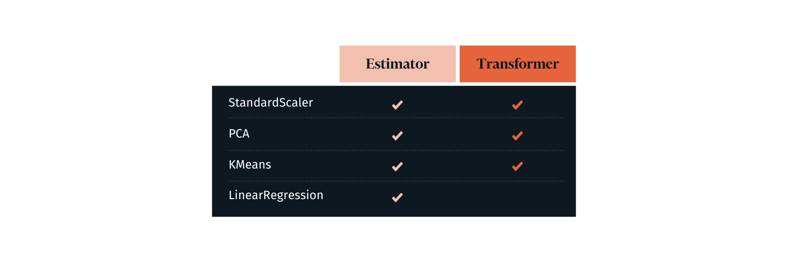
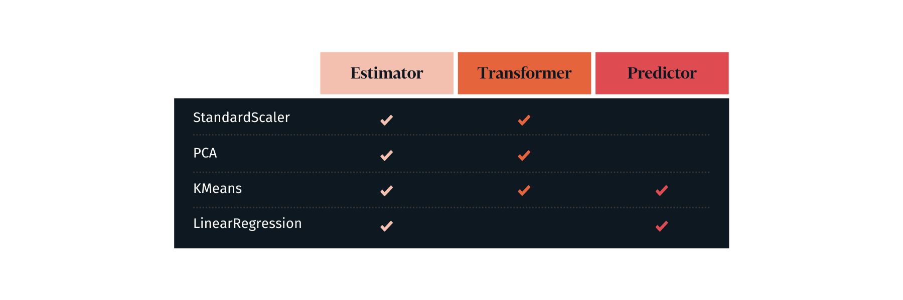
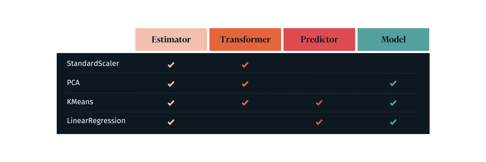

# Object-Oriented Programming - Introduction

## Introduction

In this section, you'll be introduced to the concept of object-oriented programming (OOP) in Python. OOP has become a foundational practice in much of software development and programming, allowing developers to build upon each other's code in a fluent manner.

## Programming Paradigms

***Programming paradigms*** are formal approaches for structuring code to achieve the desired results.

### Why Do We Need Them?

For very simple programming tasks, there is essentially only one "correct" way to structure the code. For example, if you needed to print the string "Hello, world!", this is how you would do it:

```python
print("Hello, world!")
```
But once your code starts to get more complex, the structure gets less intuitive and obvious. For example, if you needed to reshape some data then display a bar graph, or fit a model then use it to make predictions, how would you design that?

Deciding on a paradigm and sticking to it helps to guide your code design choices, and helps others to understand what your code is doing.

### Procedural Programming

The oldest (and probably most intuitive) modern programming paradigm is procedural programming. This involves writing a series of sequential steps to be executed, possibly with the use of techniques for ***control flow*** (e.g. `if` statements) and ***modular procedures*** (e.g. functions).

Data science code written in a **notebook** is almost always following a procedural programming paradigm. It is useful for telling a story with a single thread, but less useful for building libraries or software that runs without human intervention. Once code starts to get more complicated, we start incorporating more-complex paradigms such as functional programming or OOP.

### Functional Programming

"Purely functional" programming, using a language like Haskell or Clojure, means that procedural programming is abandoned entirely -- rather than a series of steps, the program consists only of functions, which in turn can be composed of functions or apply functions.

In the development of data science libraries, they tended not to use purely functional programming, but nevertheless incorporated some functional principles.

For example, here is the functional interface to Matplotlib:

```python
import matplotlib.pyplot as plt

plt.figure()
plt.bar(range(5), [3, 4, 4, 7, 8])
plt.title("My Graph")
plt.xlabel("x Label")
plt.ylabel("y Label");
```
Note that we created this graph without instantiating any variables. We just imported the library, then called a series of functions to create the desired graph. We could rewrite that code snippet like this, to make that aspect even clearer:

```python
from matplotlib.pyplot import figure, bar, title, xlabel, ylabel

figure()
bar(range(5), [3, 4, 4, 7, 8])
title("My Graph")
xlabel("x Label")
ylabel("y Label");
```
This approach is still preferred by some "old school" data science practitioners, but it has some issues.

It uses ***global variables***, which can get messy as code gets more complex. When the `title()` function is called in the above snippet, for example, the internal logic first has to find the current global axes object, then apply the label to that object. For a programmer to understand what axes object that is, they would need to closely follow the steps of the code, since there is no unique variable assigned to it. With no variable assigned, that also means that the code is less flexible and steps must be performed ***one at a time***.

### Object-Oriented Programming (OOP)

Object-oriented programming takes these global variables and functions and makes them into "member variables" (AKA ***attributes***) and "member functions" (AKA ***methods***). This allows code to be more organized and clear.

For example, in the previous functional Matplotlib example, you might ask *What is `title()` being called on? Is it the figure or the axes?*

To answer this, we could look at the [Matplotlib source code](https://github.com/matplotlib/matplotlib/blob/v3.5.1/lib/matplotlib/pyplot.py#L3024-L3027), which shows this:

```python
def title(label, fontdict=None, loc=None, pad=None, *, y=None, **kwargs):
    return gca().set_title(
        label, fontdict=fontdict, loc=loc, pad=pad, y=y, **kwargs)
```

`gca()` means "get current axes", so we can tell that this is being applied to the axes.

Or if we use the object-oriented Matplotlib interface instead, the answer becomes much clearer, just by looking at our code:

```python
import matplotlib.pyplot as plt

fig, ax = plt.subplots()
ax.bar(range(5), [3, 4, 4, 7, 8])
ax.set_title("My Graph")
ax.set_xlabel("x Label")
ax.set_ylabel("y Label");
```
As you can see, the title is being applied to the axes, not the figure. We can tell because the method call is structured like `ax.<method name>()` and `ax` is our axes variable.

A key takeaway here is that ***you can often do the exact same thing using different paradigms***. They are just different approaches to structuring code, and different people might prefer different approaches.

## OOP Topics

In this section, we will cover:

### Classes and Instances

A Python class can be thought of as the blueprint for creating a code object. These objects are known as an instance objects or instances. We'll go over how to create classes as well as instances.

### Methods and Attributes

Next, we'll dive deeper into how to specify and invoke the functions and variables that are "bound" to instance objects. This includes the ***encapsulation*** and ***abstraction*** principles of OOP.

### Inheritance

Inheritance means that classes can be defined that take on the traits of other classes. This is especially useful when interacting with complex code libraries.

### OOP and Scikit-Learn


Scikit-learn is the most popular machine learning library in use today, and its organization relies heavily on object-oriented programming. We'll go over the types of classes used and some of the most common methods and attributes you should know about.

## Summary

Object-oriented programming (OOP) is a way of organizing your code that can make many types of applications easier to write by combining related variables/properties and functions/methods into objects containing both behavior and state.


-----File-Boundary-----
# Classes and Instances

## Introduction
In this lesson, you'll take a look at class and instance objects in Python and how to create them. A Python class can be thought of as the blueprint for creating a code object (or **instance object**). It has both the layout for new objects as well as the ability to create those objects. When you **initialize** or make a new instance object from a class, you are essentially pressing a button on an assembly line that instantly rolls out a new instance object. For example, if you were dealing with a `Car` class, you would get a brand new car from the assembly line. In cases where you want to create multiple objects, you can see how this functionality would be extremely useful.

## Objectives

You will be able to:

- Describe a class and how it can be used to create objects
- Describe an instance object
- Create an instance of a class

## Defining a class

Imagine you are starting a ride share business. Let's call it *fuber*. All rides generally have the same basic information. They have a driver, passenger(s), origin, destination, car information, and price. You plan on having a pretty large client base, so, you could imagine having many rides being taken every day.

So, you will need to have a way to bundle up and operate on all the above information about a particular ride. And as the business would take off, you are going to need to create rides over and over.

How can you use Python to help make this process easier? Using Python classes. You can create a `Ride` class that can produce ride instance objects, which would bundle all the information and common operations for a particular ride.

As mentioned earlier, a class can be thought of as the blueprint that defines how to build an instance object. The `Ride` class is different from an actual ride instance object just as the blueprint for a house is different from the actual house.

Here is what our `Ride` class would look like in Python:

 ```python
 class Ride:
    # code for distance attribute
    # code for time attribute
    # code for price attribute
    # code to start a ride
    # code to end a ride
```

You can see that you use the keyword `class` to define a Python class. Similar to functions, all the code in a class should be indented. To end the class, you simply stop indenting.

 > **Note:** Python's convention is that all classes should follow the UpperCaseCamelCase convention. That is the class should begin with a capital letter and all other words in the name should also be capitalized. This is otherwise referred to as CamelCase.

It's not enough to simply declare a class in Python. All classes need to have a block of code inside them or else you will get an error. Let's see this below:

```python
class Ride:

```
So, let's add a block of code to our `Ride` class and see what happens. Python has a keyword `pass` which you can use in this instance to tell our code to do nothing and continue executing. `pass` can be used for times where a block of code is syntactically necessary, like defining a class or function. Feel free to read more about `pass` [here](https://docs.python.org/2/tutorial/controlflow.html#pass-statements).

```python
class Ride_test:
    pass
```
Woo! No error. So, you have now successfully defined our `Ride` class. Let's try to create an `instance` of this class. Again, you can think of these instances as objects of the `Ride` class that contain information about a single ride.

```python
first_ride = Ride_test()
print(first_ride)
```
Okay, you ***instantiated*** our first ride! You did this by invoking, or calling the `Ride()` class. You invoke a class the same way you do with functions, by adding parentheses `()` to the end of the class name, (i.e. `Ride()`).

**Instantiate** means to bring a new object to life (off the assembly line). You instantiated a new ride when you invoked the class, `Ride()`, which made a new ride in our rideshare program.

Each individual object produced from a class is known as an **instance** or **instance object**. Our variable, `first_ride`, points to an `instance` of the ride class. You can be sure it is an instance of the `Ride` class by looking at the object you created.

When you printed `first_ride` above, you saw that it says it is a `Ride object`. This tells us not only which class it comes from, the `Ride` class, but also that it is an instance since it says `object`.

You can see this distinction more clearly by printing both the class and an instance of that class:

```python
print(Ride_test)
print(first_ride)
```
Great, now let's dive a little deeper into instances. You made one already, let's make a couple more and compare them:

```python
second_ride = Ride_test()
third_ride = Ride_test()
print(first_ride)
print(second_ride)
print(third_ride)
```
Three rides! Alright, let's look at these. They seem pretty much the same, except the funny numbers at the end. Those are the IDs that represent a place in memory where the computer stores these objects. Additionally, since the IDs are unique, this means that each instance object is a **completely unique object** although they are all created from the same `Ride` class. You can prove this by comparing the objects below:

```python
print(first_ride is second_ride)
print(first_ride == second_ride)
print(first_ride is first_ride)
```
As you can see, `first_ride` is only equal to itself even though at this point these objects all have identical attributes and methods (or lack thereof) with the exception of their IDs in our computer's memory.

## Summary

In this lesson, you learned about what you use classes for and how to define them. They are the blueprints for creating instance objects and they allow us to create instance objects with the same or similar attributes and methods. However, all instance objects are produced with unique IDs, making them unique objects.


-----File-Boundary-----
# Instance Methods

## Introduction

Now that you know what classes and instances are, we can talk about instance methods. Instance methods are almost the same as regular functions in Python. The key difference is that an instance method is defined inside of a class and bound to instance objects of that class. Instance methods can be thought of as an attribute of an instance object. The difference between an instance method and another attribute of an instance is that instance methods are *callable*, meaning they execute a block of code. This may seem a bit confusing, but try to think about instance methods as functions defined in a class that are really just attributes of an instance object from that class.

## Objectives

You will be able to:

* Compare instance methods and attributes
* Define and call an instance method
* Define instance attributes
* Explain the `self` variable and its relation to instance objects
* Create an instance of a class

## Instance methods as attributes

When you think of methods and functions, you think about what kind of actions they perform. The same goes for instance methods, however, the action being performed is scoped directly to that instance object. Remember, classes are kind of like the blueprints for their instance objects. So, let's take the example of a **Dog** class. What are the things that all dogs do? They can bark, beg to go for a walk, chase squirrels, etc. When you create a new dog instance object, the dog should be able to automatically bark, beg, and chase squirrels.

Let's see how you would create a single dog, `rex`, and get him to bark. First define a `Dog` class:

```python
class Dog:
    pass
```
Now we create instantiate this class to create `rex`:

```python
rex = Dog()
rex
```
Can `rex` bark?

```python
rex.bark()
```
Okay, here you have an instance of the `Dog` class, but as you can see `rex` cannot bark yet. Let's see if we can fix that. We said that instance methods are basically functions that are ***callable*** attributes, like functions, of an instance object. So, let's write a function that returns the string `"bark!"`, and assign it as an attribute of `rex`.

> **Note:** Dictionary object attributes are accessed using the bracket (`[]`) notation. However, instance object attributes are accessed using the dot (`.`) notation.

```python
def make_a_bark():
    return 'ruff ruff!'

rex.bark = make_a_bark
rex.bark
```
Here you can see that we successfully added the `bark` attribute to `rex` and assigned the function `make_a_bark` to it. Note that the return value of `rex.bark` is simply a function signature since you have not yet executed the function, and although this looks like an instance method it is not quite.

> **Note:** Although you may hear and see the terms method and function used interchangeably, there are slight differences. You know that a function essentially contains a block of code and it can optionally take in data or objects as explicit parameters, operate on them, and optionally return a value. On the other hand, a method is, simply put, a function that is bound to a class or instances of that class. Instance methods, thus, are functions that are available/bound to instance objects of the class in which they are defined. However, a key difference between the two is that the object is *implicitly* passed to the method on which it is called, meaning the first parameter of the method is the object. Don't worry if this is confusing as you will dive more into this later.


Now you can make `rex` bark by calling the `.bark()` method:

```python
rex.bark()
```
This is a great first step. However, since `make_a_bark()` is not actually defined inside our class, you are able to call it without our dog instance object, `rex`, and we mentioned above, that's not really how instance methods work.

```python
make_a_bark()
```
Alright, so, how do you turn this into a real instance method? Well, the first thing you need to do is define it inside of our class. So, let's take a look at how you can do that.

## Define an instance method

```python
class Dog:

    def bark():
        return "I'm an instance method! Oh and... ruff ruff!"
```
```python
new_rex = Dog()

new_rex.bark
```
Here, we have re-defined our `Dog` class, but this time we actually defined an *instance method* `bark()`. Now, whenever you create a new instance of this new `Dog` class, that instance will have the `bark()` instance method as an attribute.

Notice that the signature that is returned by the unexecuted method says **bound `method`** instead of function, as was the case with our first `rex`'s bark.

However, there is still **one** issue with our instance method. Let's try calling it and see what happens:

```python
new_rex = Dog()
new_rex.bark()
```
Uh oh! `TypeError: bark() takes 0 positional arguments but 1 was given`. This error is telling you that the method, `bark()` was defined to take 0 arguments, but when you executed it, you gave it an argument.

Remember that one of the key differences between functions and methods is that a method is bound to an object and **implicitly** passes the object as an argument. That is what is causing this error. Effectively, what is happening when you try to call the instance method is this:

```python
# the instance object, new_rex, is implicitly passed in as the first argument upon execution
new_rex.bark(new_rex)
```

So, how do you fix this error? Well, if instance methods will always require a default argument of the instance object, you will need to define the instance methods with an *explicit* first parameter.

>**Note:** Parameters are the variable names you give to the method or function's future data. They are called parameters when you talk about the definition of a method or function, but when you pass the data, they are referred as arguments.

```python
# Since you are defining the function, the variables, parameter1 and parameter2, are called parameters
def function_example(parameter1, parameter2):
    return parameter1 + parameter2

# Here the strings passed in, 'Argument1' and 'Argument2', are arguments since you are passing them
# as data to the function
function_example('Argument1', 'Argument2')
```

Okay, so let's see if you define the method with a parameter, you can get rid of the error. You'll also define another method `who_am_i()` to help further understand what's happening here.

## `self` to the rescue!

As with any function or method, you can name the parameters however you want, but the convention in Python is to name this first parameter of all method classes as `self`, which makes sense since it is the object it*self* on which you are calling the method.

```python
class Dog:

    def bark(self):
        return 'I am actually going to bark this time. bark!'

newest_rex = Dog()
newest_rex.bark()
```
Awesome! It works. Again, since instance methods implicitly pass in the object itself as an argument during execution, you need to define each method with at least one parameter, `self`. The concept of `self` is a little confusing. Let's play around with it and see if you can get a better idea. In the following cell we added one more instance method, `who_am_i()` to learn more about `self`:

```python
class Dog:

    def bark(self):
        return 'I am actually going to bark this time. bark!'

    def who_am_i(self):
        return self
```
Let's create a new dog (instance), `fido`:

```python
fido = Dog()
print("1.", fido.who_am_i()) # Check return value of method
print("2.", fido) # Comparing return of the fido instance object
```
As you can see our `who_am_i()` method is returning the same instance object as `fido`, which makes sense because we called this method **on** fido, and if you look at the method all it does is return the first argument (`self`), which is the instance object on which the method was called.

```python
# Let's create another rex
another_rex = Dog()

print("3.", fido == fido.who_am_i())
print("4.", another_rex == another_rex.who_am_i())
# again asserting that `self` is equal to the instance object on which who_am_i was called
```
Again, don't worry if `self` still seems a bit confusing. It will become clearer through practice. For now, you can just go forward with the knowledge that **to define an instance method and later call it on an instance object, you will need to include at least one parameter in the method definition, `self`**.

## Summary

In this lab, you were introduced to a lot of important concepts in Object-oriented programming. You looked at instance methods and added functions as attributes of objects. Then you looked at the differences between functions and instance methods. You learned that instance methods are bound to objects and they always use the object on which they are called as their first argument. Since instance methods use their object as an argument you looked at how to properly define an instance method by using `self`.


-----File-Boundary-----
# A Deeper Dive into `self`

## Introduction
In this lesson, you'll learn a little more about `self` in object-oriented programming (OOP) in Python. You've seen a little bit about `self` when you learned about defining and calling instance methods. So far you've seen that `self` is always explicitly defined as the instance method's **first parameter**. You've also seen that instance methods implicitly use the instance object as the **first argument** when you call the method. By convention, you name this first parameter `self` since it is a reference to the object on which you are operating. Let's take a look at some code that uses `self`.

## Objectives
You will be able to:

- Explain the `self` variable and its relation to instance objects

## Using `self`

In order to really understand `self` and how it's used, it is best to use an example. Let's use the example of a **Person** class. A class produces instance objects, which in turn are just pieces of code that bundle together attributes like descriptors and behaviors. For example, an instance object of a `Person` class can have descriptors like `height`, `weight`, `age`, etc. and also have behaviors such as `saying_hello`, `eat_breakfast`, `talk_about_weather`, etc.

```python
class Person():

    def say_hello(self):
        return 'Hi, how are you?'

    def eat_breakfast(self):
        self.hungry = False
        return 'Yum that was delish!'

gail = Person()
print('1.', vars(gail))
gail.name = 'Gail'
gail.age = 29
gail.weight = 'None of your business!'
print('2.', gail.say_hello())
print('3.', gail.eat_breakfast())
print('4.', vars(gail))
```
Here you can see that the person instance objects have two behaviors (`say_hello()` and `eat_breakfast`) and you can also add instance variables and assign values to them pretty easily. Additionally, note that you also can add instance variables to `gail` by using `self` inside our instance methods (as in the `eat_breakfast()` method).

## Operating on `self`

If you wanted a method that introduces oneself, it would be apt to be similar to the `.say_hello()` method. However, it would also need to include the person's name. To do this, referencing a call to self to retrieve an object attribute is essential.

```python
class Person():

    def introduce(self):
        return f'Hi, my name is {self.name}. It is a pleasure to meet you!'

    def say_hello(self):
        return 'Hi, how are you?'

    def eat_breakfast(self):
        self.hungry = False
        return 'Yum that was delish!'

gail = Person()
gail.name = 'Gail'
the_snail = Person()
the_snail.name = 'the Snail'
print('1. ', gail.introduce())
print('2. ', the_snail.introduce())
```
Great! See how the method is the same for both instance objects, but `self` is not the same. `self` always refers to the object which is being operated on. So, in the case of `gail`, the method returns the string with the `name` attribute of the instance object `gail`.

Now let's think about some of our other behaviors that might be a bit more involved in order to make them dynamic. For example, everyone's favorite default conversation, the weather. It changes rapidly and seems to always be a choice topic for small talk. How would we create a method to introduce ourselves and make a comment about the weather? Talk about a great way to start a friendship!

Let's see how we would do this with just a regular function:

```python
def say_hello_and_weather(instance_obj, weather_pattern):
    return f"Hi, my name is {instance_obj.name}! What wildly {weather_pattern} weather we're having, right?!"

say_hello_and_weather(the_snail, 'overcast')
```
Alright, all is well and good, but let's take a look at how to incorporate this into our class object. Here's an updated version as a class method:

```python
class Person():

    def say_hello_and_weather(self, weather_pattern):
        # we are using self instead of instance_obj because we know self represents the instance object
        return f"Hi, my name is {self.name}! What wildly {weather_pattern} weather we're having, right?!"

the_snail = Person()
the_snail.name = 'the Snail'
print('1. ', the_snail.say_hello_and_weather('humid'))
# notice that we are ONLY passing in the weather pattern argument
# instance methods **implicitly** pass in the instance object as the **first** argument
```
Again, note that the only arguments you pass in are those that come after `self` when you define an instance method's parameters.

Now that you've seen how to leverage `self` and even use instance methods with more than just `self` as an argument, let's look at how you can use `self` to operate on and modify an instance object.

Let's say it is `gail`'s birthday. Gail is 29 and she is turning 30. To ensure the instance object reflects that you can define an instance method that updates `gail`'s age:

```python
class Person():

    def happy_birthday(self):
        self.age += 1
        return f"Happy Birthday to {self.name} (aka ME)! Can't believe I'm {self.age}?!"

the_snail = Person()
the_snail.name = 'the Snail'
the_snail.age = 29
print('1. ', the_snail.age)
print('2. ', the_snail.happy_birthday())
print('3. ', the_snail.age)
```
While this method could be improved, the important note is `self` can be used to not only *read* attributes from the instance object, but can also change the attributes of the instance object. `self` is simply the means by which to access underlying attributes stored within the object whether you want to retrieve said information or update it.

Let's take this a step further and look at how you can call other methods using `self`.

## Calling Instance Methods on `self`

Another very important behavior people have is eating. It is something that we all do and it helps prevent us from getting **hangry**, or angry because we're hungry.

```python
class Person():

    def eat_sandwhich(self):
        if (self.hungry):
            self.relieve_hunger()
            return "Wow, that really hit the spot! I am so full, but more importantly, I'm not hangry anymore!"
        else:
            return "Oh, I don't think I can eat another bite. Thank you, though!"

    def relieve_hunger(self):
        print("Hunger is being relieved")
        self.hungry = False

the_snail = Person()
the_snail.name = 'the Snail'
the_snail.hungry = True
print('1. ', the_snail.hungry)
print('2. ', the_snail.eat_sandwhich())
print('3. ', the_snail.hungry)
print('4. ', the_snail.eat_sandwhich())
```
Awesome! Be sure to observe that you can also use `self` to call other instance methods (as with the `self.relieve_hunger()` call above).

## Summary

In this lesson, you examined how to use `self` in OOP. You first reviewed using `self` to define instance methods appropriately. Next, you saw how to leverage `self` in order to make instance methods a bit more re-usable and dynamic. That is, you saw how you can retrieve object attributes using `self`. You also looked at using multiple arguments in a method call and using `self` to change the attributes on an instance object. Finally, you saw how to use `self` to call other instance methods.


-----File-Boundary-----
# Object Initialization

## Introduction
Now that you've begun to see OOP and class structures, it's time to investigate the `__init__` method more. The `__init__` method allows classes to have default behaviors and attributes.

## Objectives

You will be able to:

* Create instance variables in the `__init__` method
* Use default arguments in the `__init__` method

## Introducing `__init__`

By using the `__init__` method, you can initialize instances of objects with defined attributes. Without this, attributes are not defined until other methods are called to populate these fields, or you set attributes manually. This can be problematic. For example, if you had tried to call the `greet_passeneger()` method from the previous lab without first setting the driver's first and last attributes, you would have encountered an error. Here's another example to demonstrate:

```python
class Person:
    def set_name(self, name):
        self.name = name
    def set_job(self, job):
        self.job = job
```
```python
bob = Person()
```
If we try to access an attribute before setting it we'll get an error.

```python
bob.name
```
```python
bob.set_name('Bob')
```
```python
bob.name
```
To avoid errors such as this, you can use the `__init__` method to set attributes on instantiation.

```python
class Person:
    def __init__(self, name, job):
        self.name = name
        self.job = job
```
```python
bob = Person('Bob', 'Carpenter')
print(bob.name)
print(bob.job)
```
Written like this, these arguments then become required:

```python
someone = Person()
```
## Setting default arguments in the `__init__` method
To circumvent this, we can also define `__init__` to have default arguments. This allows parameters to be specified if desired but are not required.

```python
class Person:
    def __init__(self, name=None, job=None):
        self.name = name
        self.job = job
```
```python
someone = Person()
print(someone.name)
print(someone.job)

print('\n')
governer = Person(job = 'Carpenter')
print(governer.name)
print(governer.job)

print('\n')
bob = Person('Bob', 'Carpenter')
print(bob.name)
print(bob.job)
```
## Summary
In this lesson, you got a brief introduction to the `__init__` method and how you can use it to set attributes when objects are initialized, including default parameters.


-----File-Boundary-----
# Inheritance


## Introduction

In this lesson, you'll learn about how you can use inheritance to create relationships between **_Superclasses_** and **_Subclasses_** to further save you from writing redundant code!

## Objectives

You will be able to:

- Create a domain model using OOP
- Use inheritance to write nonredundant code
- Describe the relationship between subclasses and superclasses

## Writing D.R.Y. code

Assume for a second that you are going to build a data model around the most popular band of the last century, the Beatles!


<center>John, Paul, George, and Ringo, shortly before recording their
    breakout hit, "Hey Hey We're the Monkees"</center>


Using the skills you've learned so far, you could absolutely create classes for each of the different roles in the band. If you created a class for each different musician, it would probably look something like this:

```python
class Drummer(object):

    def __init__(self):
        self.name = "Ringo"
        self.role = "Drummer"

    def tune_instrument(self):
        #some code
        pass

    def practice(self):
        # some code
        pass

    def perform(self):
        #some code
        pass

class Singer(object):

    def __init__(self):
        self.name = "John"
        self.role = "Singer"

    def tune_instrument(self):
        # some code
        pass

    def practice(self):
        # some code
        pass

    def perform(self):
        # some code
        pass

# Class Guitarist code...

# Class Bass_Guitarist code...
```

If you're thinking about what it would be like to write this code, the first thing you'll notice is probably that there's a lot of redundant code that you can fill in using copy and paste. If this makes you nervous, it should -- copying and pasting is usually a sign that your program can be improved. After all, good programmers are lazy!

> "I will always choose a lazy person to do a hard job. Because a lazy person will find an easy way to do it." - Bill Gates

Good programmers try to follow the D.R.Y. rule, which stands for **_Don't Repeat Yourself!_** In the example above, you have to type the same lines of code over and over again -- the attributes in each class, the same method names (even though the bodies of the functions will likely be different), again and again. This violates the D.R.Y. rule! Luckily, we can restructure our code in an intelligent way that will allow us to accomplish the same thing without repeating everything by using **_Inheritance_**!


## Our First Subclass

The `Guitarist` class and the `Bass_Guitarist` class are extremely similar. In fact, we could say that bass guitarists are a special case of guitarists. With a few notable exceptions, the `Bass_Guitarist` class is generally going to be more similar than different to the `Guitarist` class.

In Python, we can make `Bass_Guitarist` a **_subclass_** of `Guitarist`.  This will mean that the `Bass_Guitarist` class will **_inherit_** the attributes and methods of its superclass, `Guitarist`.  This will save us a lot of redundant code!

See the example in the cell below.

```python
class Guitarist(object):

    def __init__(self):
        self.name = 'George'
        self.role = 'Guitarist'
        self.instrument_type = 'Stringed Instrument'

    def tune_instrument(self):
        print('Tune the strings!')

    def practice(self):
        print('Strumming the old 6 string!')

    def perform(self):
        print('Hello, New  York!')

class Bass_Guitarist(Guitarist):

    def __init__(self):
        super().__init__()
        self.name = 'Paul'
        self.role = 'Guitarist'

    def practice(self):
        print('I play the Seinfeld Theme Song when I get bored')

    def perform(self):
        super().perform()
        print('Thanks for coming out!')
```
```python
george = Guitarist()
paul = Bass_Guitarist()
```
```python
print(george.instrument_type)
print(paul.instrument_type)
```
```python
george.tune_instrument()
paul.tune_instrument()
```
```python
george.practice()
paul.practice()
```
```python
george.perform()
paul.perform()
```

Take a look at the way the classes were created and the corresponding outputs in the cells above.  A couple of things stand out:

1.  The `.tune_instrument()` method was never declared for class `Bass_Guitarist()`, but the `paul` instance still has access to this method.

2. The `.instrument_type` attribute was never set for the `Bass_Guitarist()` class, but the `paul` instance nonetheless has that attribute, and the attribute has the same value as it had in the `Guitarist` class. This is because it inherited it from the `Guitarist()` calls through the `super().__init__()` method first.

3. With inheritance, you can still change or overwrite specific attributes or methods. For example, in the `Bass_Guitarist()` class, the `.practice()` and `.perform()` methods, as well as the values for the `.name` and `.role` attributes all differ from the inherited `Guitarist()` class.

### Using `.super()`

The `super()` method gives you access to the superclass of the object that calls `super()`.  In this case, you saw how `super()` was used in the  `__init__()` method to initialize the object just as if we were creating a new `guitar` object. Afterward, you can modify attributes as needed.  Although not shown in this example, it is worth noting that you can also add attributes and methods to a subclass that a superclass does not have. For instance, if you added the attribute `self.string_type = 'bass'` inside the `Bass_Guitarist.__init__()` method, all bass guitarist objects would have that attribute, but guitarist objects would not.  Conversely, any changes that you make to the superclass `Guitarist()` will always be reflected in the subclass `Bass_Guitarist()`.


### Changing Values and Methods

Note that in both of these classes, you have methods named `.practice()` that have the same name, but different behaviors. This is an example of **_Polymorphism_**, meaning that you can have methods that have the same name, but contain different code inside their bodies.  This is not a naming collision because these methods exist attached to different classes.

Also, take note of the way the `.perform()` method is written inside of `Bass_Guitarist()`. If you want a method in a subclass to do everything that method does in a superclass and *then* do something else, you can accomplish this by simply calling the superclass's version of the method by accessing it with `super()` and then adding any remaining behavior afterward in the body of the function.

### Accessing Methods

By default, subclasses have access to all methods contained in a superclass. Because they are a subclass, they can automatically do the same things as the corresponding superclass. You do not need to declare the functions in the body of the subclass to have access to them. For example, while there was no mention of the method `.tune_instrument()`, `paul` still has access to the exact same `.tune_instrument()` method as `george`.  You only declare methods that are mentioned in the superclass if you want to override their behavior in the subclass.

## Abstract Superclasses

When you make use of a subclass and a superclass, you are defining levels of **_Abstraction_**. In this case, the superclass `Guitarist()` is one level of abstraction higher than the subclass `Bass_Guitarist()`. Intuitively, this makes sense -- bass guitarists are a kind of guitarist, but not all guitarists are bass guitarists.

It's also worth noting that you can always go a level of abstraction higher by defining a class that is more vague but still captures the common thread amongst the subclasses. Here's an example to demonstrate.

At first glance, it may seem that guitarists, singers, and drummers don't have enough in common with each other to make use of inheritance -- a drummer is not a type of singer, etc. However, one thing they all have in common is they are all a type of `Musician()`. No matter what sort of musician you are, you:

* have a `name`
* have an `instrument`
* know how to `tune_instrument`
* can `practice` and `perform`

In this way, you can write a single superclass that will be useful for all of the subclasses in our band: `Drummer()`, `Guitarist()`, `Bass_Guitarist()`, and `Singer()` are all types of musicians!

This is called an **_Abstract Superclass_**. The superclass being used is at a level of abstraction where it does not make sense for it to exist on its own.  For example, it makes sense to instantiate drummers, singers, and guitarists -- they are members of a band, and by playing these instruments, they are musicians.  However, you cannot be a `musician` without belonging to one of these subclasses -- there is no such thing as a musician that doesn\N{RIGHT SINGLE QUOTATION MARK}t play any instruments or sing! It makes no sense to instantiate a `Musician()`, because they don't really exist in the real world -- you only create this **_Abstract Superclass_** to define the commonalities between our subclasses and save ourselves some redundant code!

### Creating The Beatles Using an Abstract Superclass

The cell below models the Beatles by making use of the abstract superclass `Musician()`, and then subclassing it when creating `Drummer()`, `Singer()`, and `Guitarist()`.  Note that since you can have multiple layers of abstraction, it makes sense to keep `Bass_Guitarist()` as a subclass of `Guitarist()`.

```python
class Musician(object):

    def __init__(self, name): # We'll set name at instantiation time to demonstrate passing in arguments to super().__init__()
        self.name = name
        self.band = "The Beatles"

    def tune_instrument(self):
        print("Tuning Instrument!")

    def practice(self):
        print("Practicing!")

    def perform(self):
        print("Hello New York!")

class Singer(Musician):

    def __init__(self, name):
        super().__init__(name)  # Notice how we pass in name argument from init to the super().__init() method, because it expects it
        self.role = "Singer"

    def tune_instrument(self):
        print("No tuning needed -- I'm a singer!")

class Guitarist(Musician):

    def __init__(self, name):
        super().__init__(name)
        self.role = "Guitarist"

    def practice(self):
        print("Strumming the old 6 string!")

class Bass_Guitarist(Guitarist):

    def __init__(self, name):
        super().__init__(name)
        self.role = "Bass Guitarist"

    def practice(self):
        print("I play the Seinfeld Theme Song when I get bored")

    def perform(self):
        super().perform()
        print("Thanks for coming out!")

class Drummer(Musician):

    def __init__(self, name):
        super().__init__(name)
        self.role = "Drummer"

    def tune_instrument(self):
        print('Where did I put those drum sticks?')

    def practice(self):
        print('Why does my chair still say "Pete Best"?')
```
```python
john = Singer('John Lennon')
paul = Bass_Guitarist('Paul McCartney')
ringo = Drummer('Ringo Starr')
george = Guitarist('George Harrison')

the_beatles = [john, ringo, george, paul]
```
```python
for musician in the_beatles:
    print('{} is the {}!'.format(musician.name, musician.role))
```
```python
for musician in the_beatles:
    musician.tune_instrument()
```
```python
for musician in the_beatles:
    musician.practice()
```
```python
for musician in the_beatles:
    musician.perform()
```
## Summary

In this lab, you learned how to use inheritance to write nonredundant code, describe the relationship between subclasses and superclasses, and create a domain model using OOP.


-----File-Boundary-----
# OOP with Scikit-Learn

## Introduction

As you learn more about machine learning algorithms, there are typically two components. First, the conceptual underlying logic of the algorithm -- how it works to process inputs and generate outputs. Second, the scikit-learn implementation of the algorithm -- how to use it in practice.

Before diving into specific examples of various scikit-learn models, it is helpful to understand the general structure they follow. Specifically, we'll go over some key classes, methods, and attributes common to scikit-learn.

## Objectives

In this lesson you will:

* Recall the distinction between mutable and immutable types
* Define the four main inherited object types in scikit-learn
* Instantiate scikit-learn transformers and models
* Invoke scikit-learn methods
* Access scikit-learn attributes

## Mutable and Immutable Data Types

In base Python, the built-in types are either mutable or immutable.

***Mutable*** data types are data types that can be modified after they are initialized. For example, a list is a mutable data type in Python.

```python
my_list = [1, 2, 3]
my_list
```
One way you can mutate a Python `list` is using the `append` method:

```python
my_list.append(4)
my_list
```
This is in contrast to ***immutable*** data types, which can't be modified after they are initialized. For example, a string is an immutable data type in Python.

```python
my_str = "Hello!"
my_str
```
We can call methods on strings, but it doesn't modify their value:

```python
my_str.upper()
my_str
```
This same principle applies to custom classes beyond base Python, including the classes used by scikit-learn.

**Most scikit-learn classes are** ***mutable***, which means that calling methods on them changes their internal data.

## Scikit-Learn Classes

Scikit-learn has four main classes to be aware of:

* Estimator
* Transformer
* Predictor
* Model

They are defined based on which methods they possess. The classes are **not mutually exclusive**.

### Estimator


Almost all scikit-learn classes you will use will be some kind of estimator. It is the "base object" in scikit-learn.

An estimator is defined by having a `fit` method. There are two typical forms for this method:

```python
estimator.fit(data)
```

and

```python
estimator.fit(X, y)
```

The first one is typically used in the context of a transformer or unsupervised learning predictor, while the second is used in the context of a supervised learning predictor.

### Transformer



A transformer is an estimator that has a `transform` method:

```python
transformer.transform(data)
```

The `transform` method is called after the `fit` method and returns a modified form of the input data.

An example of a transformer (that is not also a predictor or model) is:

#### `StandardScaler`

`StandardScaler` is used to standardize features by removing the mean and scaling to unit variance ([documentation here](https://scikit-learn.org/stable/modules/generated/sklearn.preprocessing.StandardScaler.html))

```python
# Import class from scikit-learn
from sklearn.preprocessing import StandardScaler

# Instantiate the scaler (same step for all estimators, though specific args differ)
scaler = StandardScaler()
```
When the estimator is first instantiated, these are all of its attributes:

```python
scaler.__dict__
```
(Note: the `__dict__` attribute starts with an underscore so it is not intended for "public" use and may not work consistently in the future. Look at the documentation page to see the list of public attributes.)

The next step, like with any scikit-learn estimator, is to fit the scaler on the data:

```python
# Data representing a single feature
data = [[10], [20], [30], [40], [50]]

# Fit the scaler (same step for all estimators, though specific args differ)
scaler.fit(data)
```
Now that `fit` has been called, because transformers are *mutable*, there are additional attributes:

```python
scaler.__dict__
```
The underscore (`_`) at the end of these new variables (e.g. `mean_`) is a scikit-learn convention, which means that these attributes are not available until the estimator has been fit.

We can access these fitted attributes using the standard dot notation:

```python
scaler.mean_
```
Now that the scaler is fit, we can use it to transform the data:

```python
scaler.transform(data)
```
Note that even though we passed in a base Python list, the scaler returned a NumPy `ndarray`. Transformers always return this type of array regardless of whether you pass in a base Python data structure, a NumPy data structure, or a pandas data structure.

Some additional examples of transformers (that aren't also predictors) are:

* [`OneHotEncoder`](https://scikit-learn.org/stable/modules/generated/sklearn.preprocessing.OneHotEncoder.html): used to convert categorical features into one-hot encoded features
* [`CountVectorizer`](https://scikit-learn.org/stable/modules/generated/sklearn.feature_extraction.text.CountVectorizer.html): used to convert text data into a matrix of token counts

### Predictor



As you might have...*predicted*...a predictor is an estimator that has a `predict` method:

```python
predictor.predict(X)
```

The `predict` method is called after the `fit` method and can be part of a supervised or unsupervised learning model. It returns a list of predictions `y` associated with the input data `X`.

An example of a predictor is:

#### `LinearRegression`

`LinearRegression` is a class that represents an ordinary least squares linear regression model ([documentation here](https://scikit-learn.org/stable/modules/generated/sklearn.linear_model.LinearRegression.html))

```python
# Import class from scikit-learn
from sklearn.linear_model import LinearRegression

# Instantiate the model (same step for all estimators, though specific args differ)
lr = LinearRegression()
```
When the estimator is first instantiated, these are all of its attributes:

```python
lr.__dict__
```
The next step, like with any scikit-learn estimator, is to fit the linear regression on the data:

```python
# Data representing X (features) and y (target), where y = 10x + 5
X = [[1], [2], [3], [4], [5]]
y = [15, 25, 35, 45, 55]

# Fit the linear regression (same step for all estimators, though specific args differ)
lr.fit(X, y)
```
Note that this differs from the `fit` method in the `StandardScaler` (and most transformers) because it requires both `X` and `y`.

Once again, there are additional attributes now that `fit` has been called, since `LinearRegression` is mutable:

```python
lr.__dict__
```
We can access the fitted attributes using dot notation. For example, below we access the intercept and coefficient of the regression:

```python
print(lr.intercept_)
print(lr.coef_[0])
```
Because this is a predictor and not a transformer, the next step is to use the `predict` method rather than the `transform` method:

```python
lr.predict(X)
```
Some additional examples of predictors (that aren't also transformers) are:

* [`LogisticRegression`](https://scikit-learn.org/stable/modules/generated/sklearn.linear_model.LogisticRegression.html): a classifier that uses the logistic regression algorithm
* [`KNeighborsRegressor`](https://scikit-learn.org/stable/modules/generated/sklearn.neighbors.KNeighborsRegressor.html): a regressor that uses the k-nearest neighbors algorithm
* [`DecisionTreeClassifier`](https://scikit-learn.org/stable/modules/generated/sklearn.tree.DecisionTreeClassifier.html): a classifier that uses the decision tree algorithm

### Model



A model is an estimator that has a `score` method. There are two typical forms for this method:

```python
model.score(X, y)
```

and

```python
model.score(X)
```

For example, using the linear regression model from above, we can score the model using r-squared:

```python
lr.score(X, y)
```
An example of a model that produces a score with just `X` would be `PCA` ([documentation here](https://scikit-learn.org/stable/modules/generated/sklearn.decomposition.PCA.html)):

```python
# Import class from scikit-learn
from sklearn.decomposition import PCA

# Instantiate the model (same step for all estimators, though specific args differ)
pca = PCA(n_components=1)
```
```python
pca.__dict__
```
```python
# Data representing two features
X = [[1, 11], [2, 12], [3, 14], [4, 16], [5, 18]]

# Fit the PCA (same step for all estimators, though specific args differ)
pca.fit(X)
```
```python
pca.__dict__
```
```python
pca.score(X)
```
To understand what a given score means, look at the documentation for the model (e.g. [here](https://scikit-learn.org/stable/modules/generated/sklearn.linear_model.LinearRegression.html?highlight=score#sklearn.linear_model.LinearRegression.score) for `LinearRegression` or [here](https://scikit-learn.org/stable/modules/generated/sklearn.decomposition.PCA.html?highlight=score#sklearn.decomposition.PCA.score) for `PCA`).


### Overlapping Classes

As stated previously, these scikit-learn classes are not mutually exclusive.

`StandardScaler` is an **estimator** and a **transformer** but not a predictor or a model.

`LinearRegression` is an **estimator**, a **predictor**, and a **model** but not a transformer.

`KMeans` is an **estimator**, a **transformer**, a **predictor**, and a **model**.

`PCA` is an **estimator**, a **transformer**, and a **model** but not a predictor.

(Don't worry if you're not sure what all of these classes are used for. We'll get there eventually!)

## Takeaways

**You do not need to memorize** these labels for every scikit-learn class you encounter. You can always figure out what a class can do by looking at its documentation:

* If it has a `fit` method, it's an estimator
* If it has a `transform` method, it's a transformer
* If it has a `predict` method, it's a predictor
* If it has a `score` method, it's a model

Recognizing these terms can help you navigate the official documentation as well as third-party resources, which might refer to these classes and their instances with various labels interchangeably, since multiple labels often apply.

Also, keep in mind that estimators are mutable and store important information during the `fit` step, which means that you always need to call the `fit` method before you can call the `transform`, `predict`, or `score` methods.

## Summary

In this lesson, you learned about the four main classes in scikit-learn: estimators, transformers, predictors, and models. You saw how the attributes of the estimators changed when the `fit` method was called, as well as how to use other methods such as `transform`, `predict`, and `score`.


-----File-Boundary-----
# Object-Oriented Programming - Recap

## Introduction

In this section, you learned about Object-oriented programming (OOP) as a foundational practice for software development and programming.


## OOP overview

You now know all about OOP and how to define classes. Like functions, using classes in your programming can save you a lot of time by eliminating repetitive tasks. Classes go further than functions by allowing you to persist data. After all, class methods are fairly analogous to functions, while attributes add functionality by acting as data storage containers.

## Class structure

As you saw, the most basic class definition starts off with:

```python
class ClassName:
```

From there, you then saw how you can further define class methods:

```python
class ClassName:
    def method_1(self):
        pass # Ideally a method does something, but you get the point
    def method_2(self):
        print('This is a pretty useless second method.')
```

You also learned about `self`. Specifically, that `self` is the default parameter used to define methods. This is necessary since instance methods implicitly pass in the object itself as an argument during execution.

## Creating instances

Recall that after you define a class, you can then create instances of that class to bring it to life and use it! You're probably wondering what all of this has to do with data science. In turns out you'll use OOP principles when you start working with common data science libraries. For example, you might import the `LinearRegression` class from the scikit-learn library in order to create a regression model!

Remember, creating an instance of a class would look like this:

```python
# Import class definition
from sklearn.linear_model import LinearRegression()

# Create an instance of the class
reg = LinearRegression()
```

Once you create an instance object of the class, you can then use all the methods associated with that class!

## Level up

If you would like to dive deeper into OOP and learn some advanced topics, you can check out the additional OOP lessons and labs in the Appendix.

## Summary

Congrats, you now have a solid foundation in OOP! You first learned how to define a class and methods. Then you learned how to create an instance of a class and define instance attributes. These skills will be useful for collaboration and writing concise, modular code!


-----File-Boundary-----
