# Linear Algebra and Calculus - Introduction

## Introduction

In this section, we're going to take a step back to learn some of the basics of the math that powers the most popular machine learning models. You may not need deep knowledge of linear algebra and calculus just to build a scikit-learn model, but this introduction should give you a better understanding of how your models are working "under the hood".

## Linear Algebra

Linear Algebra is so foundational to machine learning that you're going to see it referenced many times as the course progresses. In this section, the goal is to give you both a theoretical introduction and some computational practice, solving a real-life problem by writing the code required to solve a linear regression using OLS.

We're going to kick this section off by looking at some of the many places that linear algebra is used in machine learning - from deep learning to natural language processing (NLP) to dimensionality reduction techniques such as principal component analysis (PCA).

### Systems of Linear Equations

We then start to dig into the math! We look at the idea of linear simultaneous equations - a set of two or more equations each of which is linear (can be plotted on a graph as a straight line). We then see how such equations can be represented as vectors or matrices to represent such systems efficiently.

### Scalars, Vectors, Matrices, and Tensors

In a code along, we'll introduce the concepts and concrete representations (in NumPy) of scalars, vectors, matrices, and tensors - why they are important and how to create them.

### Vector/Matrix Operations

We then start to build up the basic skills required to perform matrix operations such as addition and multiplication.  You will also cover key techniques used by many machine learning models to perform their calculations covering both the Hadamard product and the (more common) dot product.

### Solving Systems of Linear Equations Using NumPy

We then bring the previous work together to look at how to use NumPy to solve systems of linear equations, introducing the identity and inverse matrices along the way.

### Regression Analysis Using Linear Algebra and NumPy

Having built up a basic mathematical and computational foundation for linear algebra, you will solve a real data problem - looking at how to use NumPy to solve a linear regression using the ordinary least squares (OLS) method.

### Computational Complexity

In the last linear algebra lesson, we look at the idea of computational complexity and Big O notation, showing why OLS is computationally inefficient, and that a gradient descent algorithm can instead be used to solve a linear regression much more efficiently.

## Calculus and Gradient Descent

Next, you'll learn about the mechanism behind many machine learning optimization algorithms: gradient descent! Along the way, we'll also look at cost functions and will provide a foundation in calculus that will be valuable to you throughout your career as a data scientist.

Just as we used solving a linear regression using OLS as an excuse to introduce you to linear algebra, we're now using the idea of gradient descent to introduce enough calculus to both understand and have good intuitions about many of the machine learning models that you're going to learn throughout the rest of the course.

### An Introduction to Calculus and Derivatives

We're going to start off by introducing derivatives - the "instantaneous rate of change of a function" or (more graphically) the "slope of a curve". We'll start off by looking at how to calculate the slope of a curve for a straight line, and then we'll explore how to calculate the rate of change for more complex (non-linear) functions.

### Gradient Descent

Now that we know how to calculate the slope of a curve - and, by extension, to find a local minimum (low point) or maximum (high point) where the curve is flat (the slope of the curve is zero), we'll look at the idea of a gradient descent to step from some random point on a cost curve to find the local optima to solve for a given linear equation. We'll also look at how best to select the step sizes for descending the cost function, and how to use partial derivatives to optimize both slope and offset to more effectively solve a linear regression using gradient descent.

## Summary

It is possible to use machine learning models such as scikit-learn without understanding the underlying math, but a basic understanding of this math will help you to make the most informed choices about which models to use based on your particular project context.


-----File-Boundary-----
# Motivation for Linear Algebra in Data Science

## Introduction

In this section, you'll learn about algebra as a foundational step for data science, and later on statistics. Linear algebra is also very important when moving on to machine learning models, where a solid understanding of linear equations plays a major role. This lesson will attempt to present some motivational examples of how and why a solid foundation of linear algebra is valuable for data scientists.

## Objectives

You will be able to:

- State the importance of linear algebra in the fields of data science and machine learning
- Describe the areas in AI and machine learning where linear algebra might be used for advanced analytics

## Background


While having a deep understanding of linear algebra may not be mandatory, some basic knowledge is undoubtedly extremely helpful in your journey towards becoming a data scientist.

You may already know a number of linear algebraic concepts without even knowing it. Examples are: matrix multiplication and dot-products. Later on, you'll learn more complex algebraic concepts like the calculation of matrix determinants, cross-products, and eigenvalues/eigenvectors. As a data scientist, it is important to know some of the theories as well as having a practical understanding of these concepts in a real-world setting.

## An analogy

Think of a simple example where you first learn about a sine function as an infinite polynomial while learning trigonometry. Students usually practice this function by passing different values to this function and getting the expected results and then manage to relate this to triangles and vertices. When learning advanced physics, students get to learn more applications of sine and other similar functions in the area of sound and light. In the domain of Signal Processing for unidimensional data, these functions pop up again to help you solve filtering, time-series related problems. An introduction to numeric computation around sine functions can not alone help you understand its wider application areas. In fact, sine functions are everywhere in the universe from music to light/sound/radio waves, from pendulum oscillations to alternating current.

##\N{NO-BREAK SPACE}Why Linear Algebra?

> Linear algebra is the branch of mathematics concerning vector spaces and linear relationships between such spaces. It includes the study of lines, planes, and subspaces, but is also concerned with properties common to all vector spaces.

Analogous to the example we saw above, it's important that a data scientist understands how data structures are built with vectors and matrices following the geometric intuitions from linear algebra, in addition to the numeric calculations. A data-focused understanding of linear algebra can help machine learning practitioners decide what tools can be applied to a given problem and how to interpret the results of experiments. You'll see that a good understanding of linear algebra is particularly useful in many ML/AI algorithms, especially in deep learning, where a lot of the operations happen under the hood.

Following are some of the areas where linear algebra is commonly practiced in the domain of data science and machine learning:

### Computer Vision / Image Processing


Computers are designed to process binary information only (only 0s and 1s). How can an image such as the dog shown here, with multiple attributes like color, be stored in a computer? This is achieved by storing the pixel intensities for red, blue and green colors in a matrix format. Color intensities can be coded into this matrix and can be processed further for analysis and other tasks. Any operation performed on this image would likely use some form of linear algebra with matrices as the back end.

### Deep Learning - Tensors

Deep Learning is a sub-domain of machine learning, concerned with algorithms that can imitate the functions and structure of a biological brain as a computational algorithm. These are called artificial neural networks (ANNs).

The algorithms usually store and process data in the form of mathematical entities called tensors. A tensor is often thought of as a generalized matrix. That is, it could be a 1-D matrix (a vector is actually such a tensor), a 2-D matrix (like a data frame), a 3-D matrix (something like a cube of numbers), even a 0-D matrix (a single number), or a higher dimensional structure that is harder to visualize.


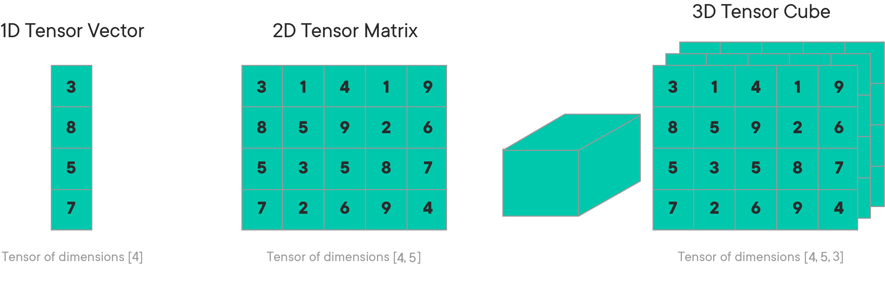


As shown in the image above where different input features are being extracted and stored as spatial locations inside a tensor which appears as a cube. A tensor encapsulates the scalar, vector, and the matrix characteristics. For deep learning, creating and processing tensors and operations that are performed on these also require knowledge of linear algebra. Don't worry if you don't fully understand this right now, you'll learn more about tensors later!

### Natural Language Processing

Natural Language Processing (NLP) is another (very popular) area in Machine Learning dealing with text data. The most common techniques employed in NLP include BoW (Bag of Words) representation, Term Document Matrix etc. As shown in the image below, the idea is that words are being encoded as numbers and stored in a matrix format. Here, we just use 3 sentences to illustrate this:

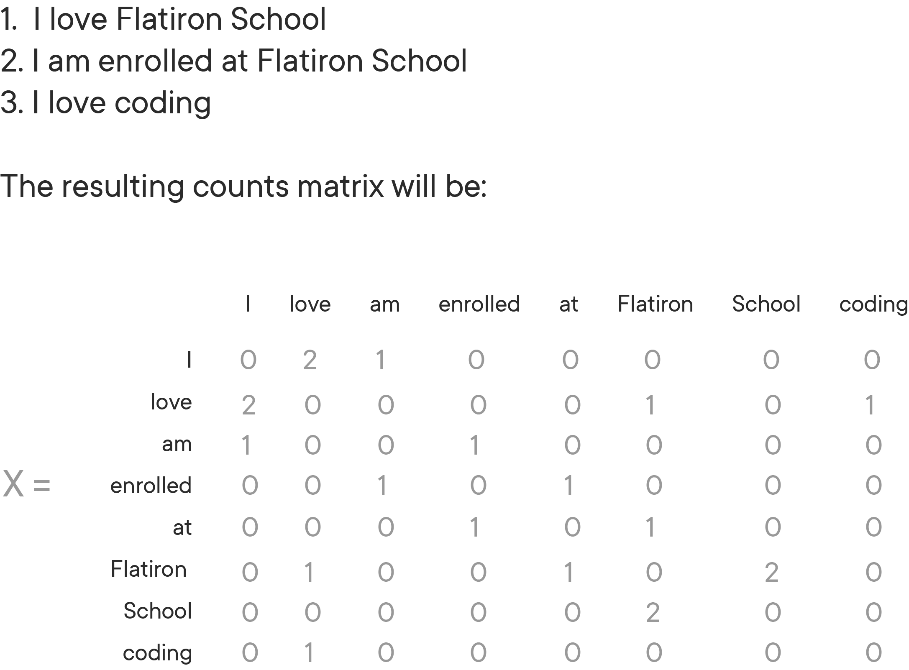


This is just a short example, but you can store long documents in (giant) matrices like this. Using these counts in a matrix form can help perform tasks like semantic analysis, language translation, language generation etc.

### Dimensionality Reduction

Dimensionality reduction techniques, which are heavily used when dealing with big datasets, use matrices to process data in order to reduce its dimensions. Principle Component Analysis (PCA) is a widely used dimensionality reduction technique that relies solely on calculating eigenvectors and eigenvalues to identify principal components as a set of highly reduced dimensions. The picture below is an example of a three-dimensional data being mapped into two dimensions using matrix manipulations.

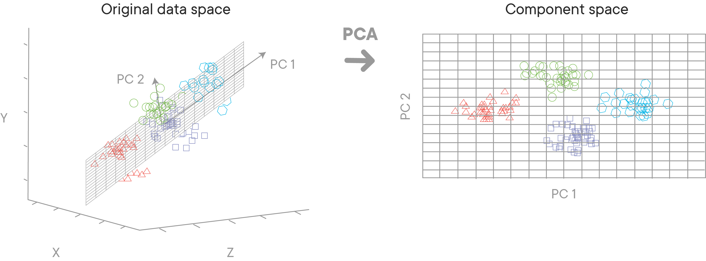

Great, you now know about some key areas where linear algebra is used! In the following lessons, you'll go through an introductory series of lessons and labs that will cover basic ideas of linear algebra: an understanding of vectors and matrices with some basic operations that can be performed on these mathematical entities. We will implement these ideas in Python, in an attempt to give you the foundational knowledge to deal with these algebraic entities and their properties. These skills will be applied in advanced machine learning sections later in the course.

## Further Reading

[Youtube: Why Linear Algebra](https://www.youtube.com/watch?v=_MxCXGF9N-8)

[Boost your data science skills. Learn linear algebra.](https://towardsdatascience.com/boost-your-data-sciences-skills-learn-linear-algebra-2c30fdd008cf)

[Quora: Applications of Linear Algebra in Deep Learning](https://www.quora.com/What-are-the-applications-of-linear-algebra-in-machine-learning)

## Summary

In this lesson, you learned about some Data Science examples that heavily rely on linear algebra principles. You looked at some use cases in practical machine learning problems where linear algebra and matrix manipulation might come in handy. In the following lessons, you'll take a deeper dive into specific concepts in linear algebra, working your way towards solving a regression problem using linear algebraic operations only.


-----File-Boundary-----
# Systems of Linear Equations

## Introduction

Linear algebra is a sub-field of mathematics concerned with vectors, matrices, and linear transforms between them.
The first step towards developing a good understanding of linear algebra is to get a good sense of *what linear mappings and linear equations* are, *how these relate to vectors and matrices* and *what this has to do with data analysis*. Let's try to develop a basic intuition around these ideas by first understanding what linear equations are.

## Objectives

You will be able to:

- Describe a system of linear equations for solving analytical problems
- Describe how matrices and vectors can be used to solve linear equations
- Solve a system of equations using elimination and substitution


## What are linear equations?

In mathematics, a system of linear equations (or linear system) is a collection of two or more linear equations involving the same set of variables. For example, look at the following equations:

$$ 3x + 2y - z = 0 $$
$$ 2x- 2y + 4z = -2 $$
$$ -x + 0.5y - z = 0 $$

This is a system of three equations in the three variables $x$, $y$, and $z$. A solution to a linear system is an assignment of values to the variables in a way that *all the equations are simultaneously satisfied*. A solution to the system above is given by:

$$ x = 1 $$
$$ y = -8/3 $$
$$ z = -7/3 $$

These values make all three equations valid. The word "system" indicates that the equations are to be considered collectively, rather than individually.

## Solving linear equations

A system of linear equations can always be expressed in a matrix form. Algebraically, both of these express the same thing. Let's work with an example to see how this works:

### Example

Let's say you go to a market and buy 2 apples and 1 banana. For this, you end up paying 35 pence. If you denote apples by $a$ and bananas by $b$, the relationship between items bought and the price paid can be written down as an equation - let's call it Eq. A:

$2a + b = 35$  - (Eq. A)

On your next trip to the market, you buy 3 apples and 4 bananas, and the cost is 65 pence. Just like above, this can be written as Eq. B:

$3a + 4b = 65$ - (Eq. B)

These two equations (known as a simultaneous equations) form a system that can be solved by hand for values of $a$ and $b$ i.e., price of a single apple and banana.


Let's solve this system for individual prices using a series of eliminations and substitutions:

**Step 1:** Multiply Eq. A by 4

$8a + 4b = 140$ - (Eq. C)

**Step 2 :** Subtract Eq. B from Eq. C

$5a = 75$ which leads to $a = 15$

**Step 3:** Substitute the value of $a$ in Eq. A

$30 + b = 35$ which leads to $b = 5$

So the price of an apple is 15 pence and the price of the banana is 5 pence.

## From equations to vectors and matrices

Now, as your number of shopping trips increase along with the number of items you buy at each trip, the system of equations will become more complex and solving a system for individual price may become very expensive in terms of time and effort. In these cases, you can use a computer to find the solution.

The above example is a classic linear algebra problem. The numbers 2 and 1 from Eq. A and 3 and 4 from Eq. B are linear coefficients that relate input variables a and b to the known output 15 and 5.

Using linear algebra, we can write this system of equations as shown below:


You see that in order for a computational algorithm to solve this (and other similar) problems, we need to first convert the data we have into a set of matrix and vector objects. Machine learning involves building up these objects from the given data, understanding their relationships and how to process them for a particular problem.

Solving these equations requires knowledge of defining these vectors and matrices in a computational environment and of operations that can be performed on these entities to solve for unknown variables as we saw above. We'll look into how to do this in upcoming lessons.

## Summary

In this lesson, you learned how a system of linear (simultaneous) equations can be solved using elimination and substitution, and also, how to covert these problems into matrices and vectors to be processed by computational algorithms. In the next couple of lessons, we'll look at how to describe these entities in Python and NumPy and also how to perform arithmetic operations to solve these types of equations.


-----File-Boundary-----
# Systems of Linear Equations - Lab

## Introduction
The following scenarios present problems that can be solved as a system of equations while performing substitutions and eliminations as you saw in the previous lesson.

* Solve these problems by hand, showing all the steps to work out the unknown variable values
* Verify your answers by showing the calculated values satisfy all equations

## Objectives

In this lab you will:

- Solve a system of equations using elimination and substitution

## Exercise 1
Jane paid 12 dollars for 4 cups of coffee and 4 cups of tea. 3 cups of coffee cost as much as 2 cups of tea. What would be the total cost of 5 cups of coffee and 5 cups of tea?

### Solution

> Let $x$ be the unit price of coffee and $y$ be the unit price of tea

```python
# Your solution here
# Answer: 5 cups of tea and 5 cups of coffee = 15 dollars
```
## Exercise 2

Jim has more money than Bob. If Jim gave Bob 20 dollars, they would have the same amount. If Bob gave Jim 22 dollars, however, Jim would then have twice as much as Bob.

How much does each one actually have?

### Solution
> Let x be the amount of money that Jim has and y be the amount that Bob has

```python
# Your solution here
# Answer:
# y = 106 (Bob's amount)
# x = 146 (Jim's amount)
```
## Exercise 3

Mia has 30 coins, consisting of quarters (25 cents) and dimes (10 cents), which totals to the amount 5.70 dollars.
How many of each does she have?

### Solution

> Let x be the number of quarters and y be the number of dimes

```python
# Your solution here
# Answer:
# x = 18 quarters
# y = 12 dimes
```
## Level up (Optional)
For more practice with linear equations, visit the following links for more complex equations:

* https://www.transum.org/software/SW/Starter_of_the_day/Students/Simultaneous_Equations.asp?Level=6
* https://www.transum.org/software/SW/Starter_of_the_day/Students/Simultaneous_Equations.asp?Level=7

## Summary

In this lesson, you learned how to solve linear equations by hand to find the coefficient values. You'll now move forward to have a deeper look into vectors and matrices and how Python and NumPy can help us solve more complex equations in an analytical context.


-----File-Boundary-----
# Scalars, Vectors, Matrices, and Tensors - Code Along


## Introduction
In this lesson, you'll be introduced to the basic mathematical entities used in linear algebra. We'll also look at how these entities are created (and later manipulated) in Python using NumPy.

## Objectives
You will be able to:

- Compare scalars, vectors, matrices, and tensors
- Create vectors and matrices using Numpy and Python
- Use the transpose method to transpose Numpy matrices


## Background

Let's start by defining some mathematical entities that data scientists routinely come across while dealing with machine learning and deep learning algorithms. These entities are used to store, process and represent our data and analytical activities are mainly focused on manipulating these algebraic entities to provide solutions to unknown data entities.

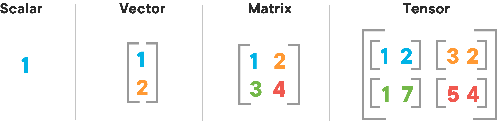

## Scalars
> A scalar is a **single number**

A scalar is the simplest entity in linear algebra compared to other objects, which are usually arrays of multiple numbers. In literature, you'll find scalars represented as lower case italics characters. Scalars need to be defined in terms of the type of number they carry. For example:

* **Real valued scalars**: Let $S \in  \mathbb{R} $  be the salary of an individual
* **Natural number scalars**: Let $n \in \mathbb{N}$ be the number of floors in a building


## Vectors

> A vector is an **array** of numbers arranged in some order, as opposed to the single numbered scalar.

The numbers contained within a vector are known as scalar components of the vector. Vectors are built from individual components, which are numerical in nature. We can think of a vector as a list of numbers, and vector algebra as operations performed on the numbers in the list.

\begin{equation}
x =
\begin{bmatrix}
  x_{1} \\
  x_{2} \\
  \vdots \\
  x_{n-1} \\
  x_{n} \\
\end{bmatrix}
\end{equation}

Where $x$ is the name of the vector and $(x_1,x_2, \ldots, x_{n-1}, x_n)$ are the scalar components of the vector.

In machine learning systems like regression you saw earlier, the output variable is known as a **target vector** with the lowercase $y$ when describing the training of a machine learning algorithm.

We can set index values to elements of a vector by defining a set containing the indices and write the set as a subscript. For example, to access $x_1, x_3$ and $x_6$, we define the set $S=\{1,3,6\}$, and call it $x_S$.


### A geometric intuition

A vector can be thought of as an entity that represents spatial coordinates in an n-dimensional space, where n is the number of dimensions. A vector can also represent a line from the origin of the vector space with a direction and a magnitude, based on scalar components. Below is an example of a vector in 3D vector space:


Let\N{RIGHT SINGLE QUOTATION MARK}s look at how to define a vector in Python.

### Defining a vector in Python

In Python, one of the easiest ways to represent a vector is by using Numpy arrays. The list scalar values can be used to create a vector in Python as shown below:

```python
# create a vector from list [2,4,6]
import numpy as np
v = np.array([2, 4, 6])
print(v)
```

```python
# Code here
```
### Indexing a vector

There will be times when you have a lot of data in a vector (or array as we now know it) and you want to extract a portion of the data for some analysis. For example, maybe you want to know the first few values of a long array, or you want the integral of data between $x = 4$ and $x = 6$, but your vector covers $0 < x < 10$. Indexing is the way to do these things. Let's generate a long vector to see this action using 10 values between -pi and pi (i.e. -3.14 to 3.14):

```python
x = np.linspace(-np.pi, np.pi, 10)
print(x)
```

```python
# Code here
```
You can use the index values to address individual scalar values within this vector, similar to Python list indexing as shown below:
```python
print (x[0])  # first element
print (x[2])  # third element
print (x[-1]) # last element
print (x[-2]) # second to last element
```

```python
# Code here
```
You can select a range of elements too. The syntax a:b extracts the a-th to (b-1)-th elements. The syntax a:b:n starts at a, skips n elements up to the index b.
```python
print (x[1:4])     # second to fourth element. Element 5 is not included
print (x[0:-1:2])  # every other element
print (x[:])       # print the whole vector
print (x[::-1]) # reverse the vector!
```

```python
# Code here
```
## Matrices
> A matrix is a 2-dimensional array of numbers written between square brackets.

As compared to vectors, a matrix is a multi-dimensional array of scalars that can possibly have multiple rows as well as columns. It is often denoted by an $m \times n$ notation where $m$ is the number of rows and $n$ is number of columns, as shown below. Every scalar component of a matrix can be addressed by specifying (row, column) values as tuples $(m, n)$. A matrix is usually written down as:


$$
   A=
  \left[ {\begin{array}{cccc}
   A_{1,1} & A_{1,2} & \ldots &A_{1,n} \\
   A_{2,1} & A_{2,2} & \ldots &A_{2,n} \\
   \vdots& \vdots & \ddots & \vdots \\
   A_{m,1} & A_{m,2} & \ldots &A_{m,n} \\
  \end{array} } \right]
$$

We usually give matrices uppercase variable names with bold typeface, such as $A$. If a real-valued matrix $A$ has a height of $m$ and a width of $n$ as above, we state this as $A \in \mathbb{R}^{m \times n}$. In machine learning, a vector can be seen as a special case of a matrix.

> A vector is a matrix that has only 1 column, so you have an $(m \times 1)$-matrix. $m$ is the number of rows, and 1 here is the number of columns, so a matrix with just one column is a vector.

### Defining a matrix in Python

As opposed to one-dimensional arrays used by vectors, we can represent a matrix in Python using a multi-dimensional NumPy array. A NumPy array can be constructed given a list of lists. For example, below is a 3 row, 3 column matrix created from a list of three lists.
```python
X = np.array([[1, 2, 3], [4, 5, 6], [7, 8, 9]])
print(X)
```

```python
# Code here
```
* Note: Take special care with brackets during definition as opening and closing of the square brackets signifies a new row.


We can also define matlab styles matrices (for those used to matlab definitions) in the following way:
```python
Y = np.mat([[1, 2, 3], [4, 5, 6], [7, 8, 9]])
print(Y)
```

```python
# Code here
```
Numpy **matrices** are always 2-dimensional, while numpy **arrays** (also referred to as ndarrays) are N-dimensional. Matrix objects are a subclass of ndarray, so they inherit all the attributes and methods of ndarrays. For multidimensional arrays/matrices with more than 2 dimensions, it is always best to use arrays. Arrays are the standard vector/matrix/tensor type of NumPy, and most NumPy functions return arrays and not matrices.

Arrays also offer a clear distinction between element-wise operations and linear algebra operations as you'll see later.

### Matrix indexing

In 2D-arrays like the one we created above you can use a (row, column) notation. Use a `:` to indicate all rows or all columns. Remember that the indexing for both vectors and matrices start with 0 and ends at (m-1) and (n-1).

```python
print (X[0, 0]) # element at first row and first column
print (X[-1, -1]) # element from the last row and last column
print (X[0, :]) # first row and all columns
print (X[:, 0]) # all rows and first column
print (X[:]) # all rows and all columns
```

```python
# Code here
```
You can also use indexing to address and assign new values to elements of a matrix:
```python
X[:, 0] = [11, 12, 13]  # set the values in first column to this sequence
X[2, 2] = 15  # set a single element in third row and third column
print (X)

X[2] = 16  # sets everything in the third row to 16!
print (X)

X[:,2] = 17  # sets everything in the third column to 17!
print (X)
```

```python
#\N{NO-BREAK SPACE}Code here
```
## Shape of an array

The shape (or "dimensions") of a vector/matrix array tells us the number of values for each dimension. For a 2-dimensional array it gives you the number of rows and the number of columns. Let\N{RIGHT SINGLE QUOTATION MARK}s find the shape of our preceding 2-D and 3-D arrays created above. For a NumPy object, you can access its shape as shown below:
```python
print(x.shape) #\N{NO-BREAK SPACE}the vector with 10 scalars
print (X.shape) # the 2-D Matrix with 3X3 scalar components
```

```python
# Code here
```
The vector has only one dimension as shown by the shape parameter whereas the 2D-matrix has 3 rows and 3 columns

## Transposition

Using transposition, you can convert a row vector to a column vector and vice versa. Let's see how its done in vectors and matrices.

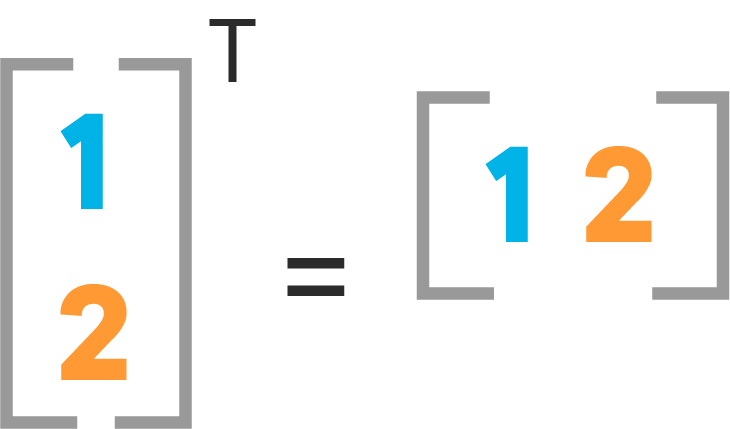

Neural networks frequently process weights and inputs of different sizes where the dimensions do not meet the requirements of matrix multiplication. Matrix transpose provides a way to "rotate" one of the matrices so that the operation complies with multiplication requirements and can continue. There are two steps to transpose a matrix:

* Rotate the matrix right 90\N{DEGREE SIGN} clockwise.
* Reverse the order of elements in each row (e.g. [a b c] becomes [c b a]).
This can be better understood looking at this image :

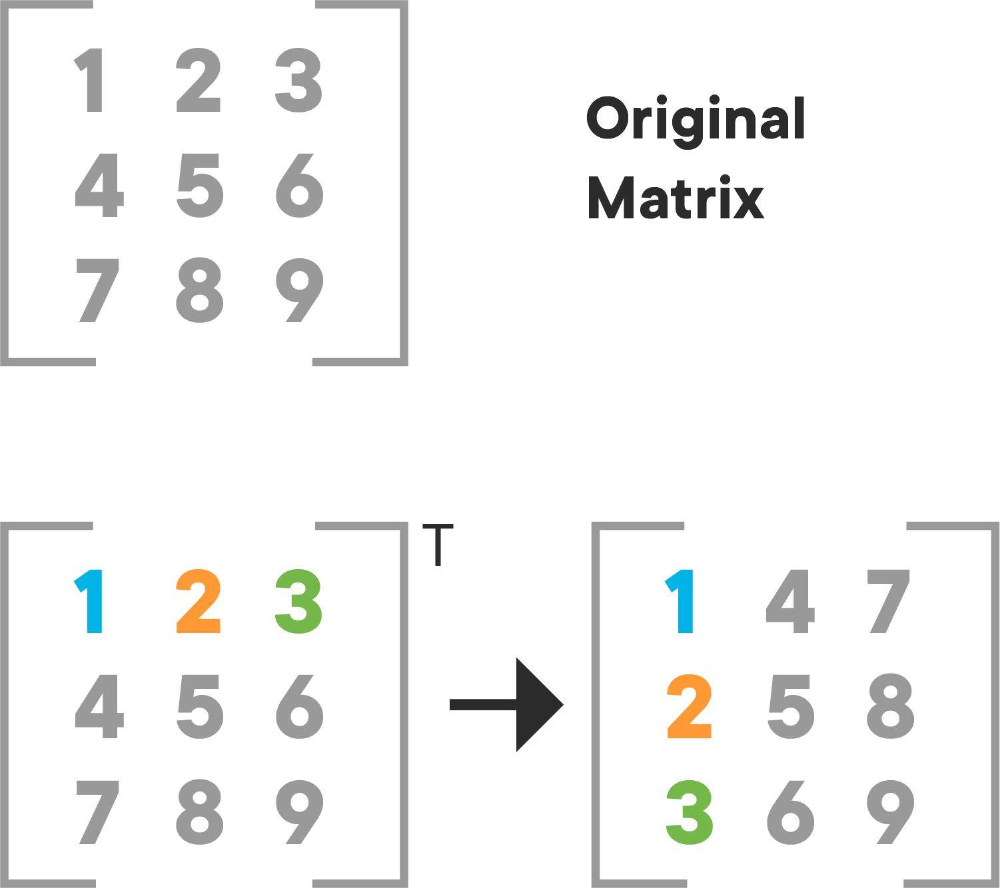

Numpy provides the transpose operation by using the `.T` attribute or the `np.transpose()` function with the array that needs to be transposed as shown below:

```python
# create a transpose of a matrix

A = np.array([
   [1, 2, 3],
   [4, 5, 6],
   [7, 8, 9]])

A_transposed = A.T
A_transposed_2 = np.transpose(A)

print(A,'\n\n', A_transposed, '\n\n', A_transposed_2)
```

```python
#\N{NO-BREAK SPACE}Code here
```
## Tensors
In some cases, you'll need an array with more than two axes. In the general case:
>An array of numbers arranged on a regular grid with a variable number of axes is known as a tensor.

A vector is a one-dimensional or "first order tensor" and a matrix is a two-dimensional or "second order tensor".
Tensor notation is just like matrix notation, with a capital letter that represents a tensor, and lowercase letters with a subscript representing scalar values within the tensor. Many operations that can be performed with scalars, vectors, and matrices can be reformulated to be performed with tensors as well. The image below shows some of these operations for a  3D tensor.

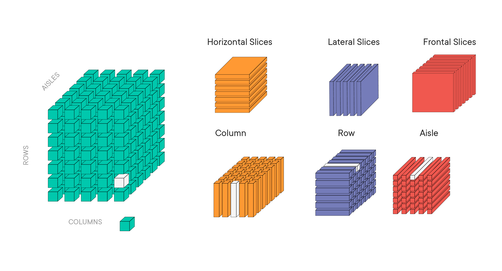

As a tool, tensors and tensor algebra are widely used in the fields of physics and engineering, and in data science it is particularly useful when you'll learn about deep learning models.
We'll revisit tensors and relevant operations in the deep learning sections and explain how tensors are created, manipulated, and saved using more advanced analytical tools like Keras.

## Summary

In this lesson, you learned about basic mathematical entities including scalars, vectors, matrices, and tensors to solve linear algebraic problems. You focused on creating vectors and matrices in Python and Numpy. You also saw how to index and slice these entities and check for the shape of underlying data elements. Next, you'll look at some of the key operations with matrices and vectors.


-----File-Boundary-----
# Matrix Multiplication - Code Along

## Introduction
Understanding matrix operations is very important for a deeper understanding of linear algebra. We know matrices are used throughout the field of machine learning in the description of algorithms and representation of data. In this lesson, we shall discover how to manipulate matrices in Python and Numpy.

## Objectives

You will be able to:

- Compute the dot product for matrices and vectors
- Calculate a cross product using Numpy
- Define a cross product

## Definition

Multiplication of two matrices is one of the most crucial operations involving matrices. You can write the matrix product just by placing two or more matrices together, for example,

> $C = AB$

The standard product of two matrices is not just a matrix containing the element-wise product of the individual elements. This type of operation is a _special case_ and is called the element-wise product, or the **Hadamard product**.

## Hadamard product

Two matrices with the same dimensions can be multiplied together. Such element-wise matrix multiplication is called the Hadamard product. It's not the typical operation meant when referring to matrix multiplication, therefore a different operator is often used, such as a circle $\circ$.
> $C = A \circ B$

As with element-wise addition and subtraction, element-wise multiplication involves the multiplication of elements from each parent matrix to calculate the values in the new matrix as shown below.

$$ A \circ B =
   \left[ {\begin{array}{cc}
   A_{1,1} * B_{1,1} & A_{1,2} * B_{1,2}\\
   A_{2,1} * B_{2,1}& A_{2,2} * B_{2,2} \\
   A_{3,1} * B_{3,1} & A_{3,2} * B_{3,2} \\
  \end{array} } \right]
$$

The Hadamard product can be calculated in Python using the $*$ operator between two NumPy arrays:

```python
# Element-wise Hadamard product
import numpy as np
A = np.array([[1, 2, 3], [4, 5, 6]])
print(A)
B = np.array([[1, 2, 3], [4, 5, 6]])
print(B)
print ('\nHadamard product\n\n', A * B)
```

```python
#\N{NO-BREAK SPACE}Code here
```
## Dot product

The matrix dot product is more complicated than the previous operations and involves a rule as **not all matrices can be dot multiplied together**. The rule is as follows:

The matrix product of matrices $A$ and $B$ is a another matrix $C$. For defining this product, $A$ must have the same number of dimensions as $B$ has rows.

> When using the dot product, the number of columns in the first matrix must be equal the number of rows in the second matrix

For example, think of a matrix $A$ having $m$ rows and $n$ columns and matrix $B$ having $n$ rows and $k$ columns. Provided the $n$ columns in $A$ and $n$ rows $b$ are equal, the result is a new matrix with $m$ rows and $k$ columns. The dot product can be shown using (.) or (dot).

> $ C_{(m, k)} = A_{(m, n)} \cdot B_{(n, k)}$ OR $ C_{(m, k)} = A_{(m, n)} \text{  dot  } B_{(n, k)}$

The product operation is de\N{LATIN SMALL LIGATURE FI}ned by

$$ \large C_{i, j}= \sum_k A_{i, k}B_{k, j}$$


The calculations are performed as follows:


$$ A =
   \left[ {\begin{array}{cc}
   A_{1,1}& A_{1,2} \\
   A_{2,1}& A_{2,2}  \\
   A_{3,1} & A_{3,2} \\
  \end{array} } \right]
$$

$$ B =
   \left[ {\begin{array}{cc}
   B_{1,1}&  B_{1,2} \\
   B_{2,1} & B_{2,2} \\
  \end{array} } \right]
$$

$$ C =
  \left[ {\begin{array}{cc}
   A_{1,1}* B_{1,1}+ A_{1,2}*B_{2,1} & A_{1,1}* B_{1,2}+ A_{1,2}*B_{2,2} \\
   A_{2,1}* B_{1,1}+ A_{2,2}*B_{2,1} & A_{2,1}* B_{1,2}+ A_{2,2}*B_{2,2} \\
   A_{3,1}* B_{1,1}+ A_{3,2}*B_{2,1} & A_{3,1}* B_{1,2}+ A_{3,2}*B_{2,2} \\
  \end{array} } \right]
$$


This rule applies for a chain of matrix multiplications.  The number of columns in one matrix in the chain must match the number of rows in the following matrix in the chain. The intuition for the matrix multiplication is that you calculate the dot product between each row in matrix $A$ with each column in matrix $B$. For example, you can step down rows of column $A$ and multiply each with column 1 in $B$ to give the scalar values in column 1 of $C$.

This is made clear with the following worked example between two matrices.


$$
  \left[ {\begin{array}{ccc}
   1 & 2 & 3 \\
   4 & 5 & 6  \\
   7 & 8 & 9 \\
   10 & 11 & 12 \\
  \end{array} } \right] \times
    \left[ {\begin{array}{cc}
   2 & 7 \\
   1 & 2 \\
   3 & 6 \\
  \end{array} } \right] =
   \left[ {\begin{array}{cc}
   2*1 + 1*2 + 3*3  & 7*1+2*2+6*3\\
   2*4+1*5+3*6 & 7*4+2*5+6*6 \\
   2*7+1*8+3*9 & 7*7+2*8+6*9 \\
   2*10+1*11+3*12 & 7*10+2*11+6*12 \\
  \end{array} } \right] =
    \left[ {\begin{array}{cc}
   13 & 29 \\
   31 & 74  \\
   49 & 119 \\
   67 & 164 \\
  \end{array} } \right]
$$


Let's define above matrices and see how to achieve this in Python and Numpy using the `.dot()` method :

```python
# matrix dot product
A = np.array([[1, 2, 3], [4, 5, 6], [7, 8, 9], [10, 11, 12]])
B = np.array([[2, 7], [1, 2], [3, 6]])

C = A.dot(B)

print(A, '\ndot', '\n', B, '\n = \n', C)
```

```python
# Code here
```
## Matrix-vector dot product

A matrix and a vector can be multiplied together as long as the rule of matrix multiplication (stated above) is observed. The number of columns in the matrix must equal the number of rows in the vector. As with matrix multiplication, the operation can be written using the dot notation. Because the vector only has one column, the result is always a vector. See the general approach below where A is the matrix being multiplied to v, a vector:


$$ A =
   \left[ {\begin{array}{cc}
   A_{1,1}& A_{1,2} \\
   A_{2,1}& A_{2,2}  \\
   A_{3,1} & A_{3,2} \\
  \end{array} } \right]
$$

$$ v =
   \left[ {\begin{array}{c}
   v_{1}\\
   v_{2}\\
  \end{array} } \right]
$$

$$
C =
  \left[ {\begin{array}{cc}
   A_{1,1} * v_1 + A_{1,2} * v_2 \\
   A_{2,1} * v_1 + A_{2,2} * v_2 \\
   A_{3,1} * v_1 + A_{3,2} * v_2 \\
  \end{array} } \right]
  $$

The matrix-vector multiplication can be implemented in NumPy using the `.dot()` method as seen before:

```python
# matrix-vector multiplication

A = np.array([[1, 2], [3, 4], [5, 6]])
v = np.array([0.5, 0.5])

C = A.dot(v)

print(A, 'dot', v, f'= {C}', sep='\n')
```

```python
# Code here

```
## Cross product

From basic geometry, you know that a vector has magnitude (how long it is) and direction. Two vectors can be multiplied using the "cross product". The cross product or vector product is a binary operation on two vectors in three-dimensional space. The result is a vector which is perpendicular to the vectors being multiplied and normal to the plane containing them.

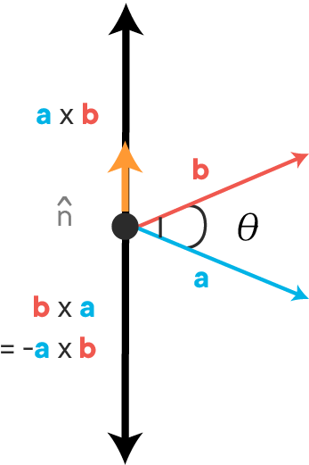

The cross product of two vectors a and b is denoted by $(a \times b)$.

It's defined as:

> $a \times b = \mid a \mid  \mid b \mid \sin(\theta) n $

* $\mid a \mid$  is the magnitude (length) of vector $a$
* $\mid b \mid$  is the magnitude (length) of vector $b$
* $\theta$ is the angle between $a$ and $b$
* $n$ is the unit vector at right angles to both $a$ and $b$

If either of the vectors being multiplied is zero or the vectors are parallel then their cross product is zero. More generally, the magnitude of the product equals the area of a parallelogram with the vectors as sides. If the vectors are perpendicular the parallelogram is a rectangle and the magnitude of the product is the product of their lengths.

In Numpy, you can take a cross product with `np.cross()` function:
```python
# Cross product between two vectors
x = np.array([0, 0, 1])
y = np.array([0, 1, 0])

print(np.cross(x, y))
print(np.cross(y, x))
```

```python
#\N{NO-BREAK SPACE}Code here
```
You'll look at the applications of the cross product later, when studying machine learning algorithms and developing geometric intuitions. In Natural Language Processing, cross products are also important to bring text into vector space, and check for document similarity. For now we'll look a bit more into the dot product.

## Summary

In this lesson, you learned about matrix multiplication using the Hadamard product and the dot product. You also looked at how to take the dot product between vectors and matrices while observing the size assumptions. You also saw how cross products work between two vectors. Next, you'll learn about some properties of dot products and what makes them so special.


-----File-Boundary-----
# Solving Systems of Linear Equations with NumPy - Code Along

## Introduction

In this lesson, you'll learn how to solve a system of linear equations using matrix algebra and Numpy.  You'll also learn about the identity matrix and inverse matrices, which have some unique properties that can be used to solve for unknown values in systems of linear equations. You'll also learn how to create these using Numpy.

## Objectives

You will be able to:

- Define the identity matrix and its dot product
- Define the inverse of a matrix
- Calculate the inverse of a matrix in order to solve linear problems
- Use matrix algebra and Numpy to solve a system of linear equations given a real-life example


## Identity matrix

An identity matrix is a matrix whose dot product with another matrix $M$ equals the same matrix $M$.

The identity matrix is a square matrix which contains **1**s along the major diagonal (from the top left to the bottom right), while all its other entries are **0**s. The main diagonal is highlighted in the image below:

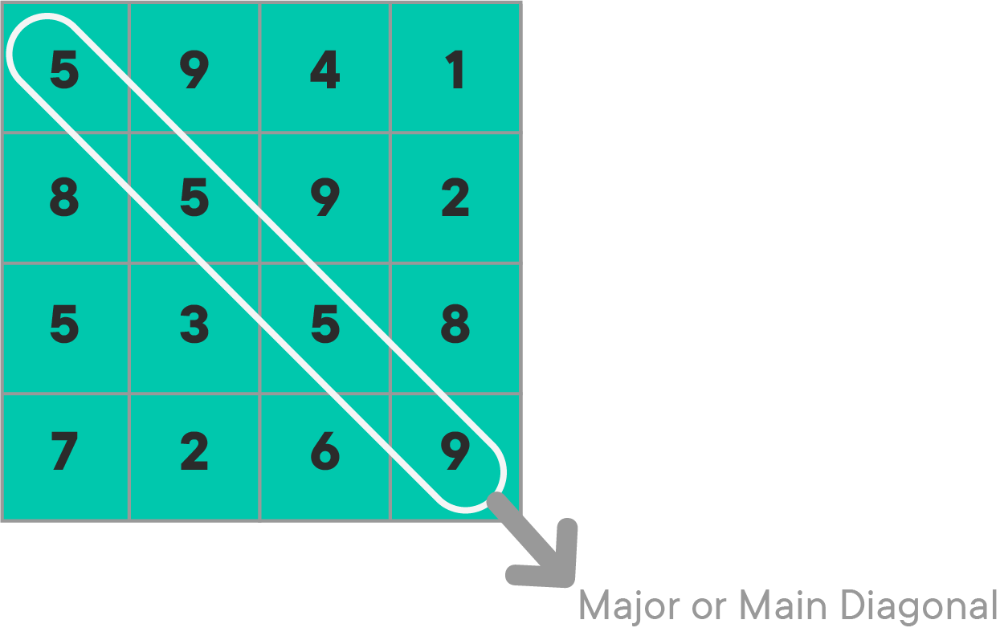

An identity matrix with the same $(3 \times 3)$-shape contains all **1**s along this diagonal and **0**s everywhere else as shown below:

$$
  \left[ {\begin{array}{ccc}
   1 & 0 & 0 \\
   0 & 1 & 0 \\
   0 & 0 & 1 \\
  \end{array} } \right]
$$


This would be called a $(3 \times 3)$ identity matrix. The $(n \times n)$ identity matrix is usually denoted by $I_n$ which is a matrix with $n$ rows and $n$ columns.

The identity matrix is also called the *unit matrix* or *elementary matrix*.


### Dot product of a matrix and its identity matrix

Let's try to multiply a matrix with its identity matrix and check the output. Let's start with the coefficient matrix from the previous problem:

$$
  \left[ {\begin{array}{cc}
   1 & 2  \\
   3 & 4  \\
  \end{array} } \right]
$$

The identity matrix for this matrix would look like:

$$
  \left[ {\begin{array}{cc}
   1 & 0  \\
   0 & 1  \\
  \end{array} } \right]
$$

The dot product for these two matrices can be calculated as:
```python
import numpy as np
A = np.array([[2,1],[3,4]])
I = np.array([[1,0],[0,1]])
print(I.dot(A))
print('\n', A.dot(I))
```

```python
# Code here
```
You see that the dot product of any matrix and the appropriate identity matrix is always the original matrix, regardless of the order in which the multiplication was performed! In other words,

> $ A \cdot I = I \cdot A = A $

NumPy comes with a built-in function `np.identity()` to create an identity matrix. Just pass in the dimension (number of rows or columns) as the argument. You can add an argument `dtype=int` to make sure the elements are integers (if not, your identity matrix will contain floats):
```python
print(np.identity(4, dtype=int))
print(np.identity(5, dtype=int))
```

```python
# Code here
```
## Inverse matrix

The *inverse* of a square matrix *A*, sometimes called a *reciprocal matrix*, is a matrix $A^{-1}$such that

> $A \cdot A^{-1} = I$

where $I$ is the identity matrix

The inverse of a matrix is analogous to taking reciprocal of a number and multiplying by itself to get a 1, e.g. $5 * 5^{-1} = 1$. Let's see how to get inverse of a matrix in NumPy. `numpy.linalg.inv(a)` takes in a matrix *A* and calculates its inverse as shown below:

```python
A = np.array([[4, 2, 1],[4, 8, 3],[1, 1, 0]])
A_inv = np.linalg.inv(A)
print(A_inv)
```

```python
# Code here
```
This is great. So according to the principle shown above, if we multiply $A$ with $A^{-1}$, we should get an identity matrix $I$ as the output:

```python
A_product = np.dot(A, A_inv)
A_product
```

```python
# Code here
```
Note that the expected output was an identity matrix. Although you have **1**s along the major diagonal, the float operations returned not zeros but numbers very close to zero off-diagonal. Numpy has a `np.matrix.round()` function to convert each element of the above matrix into a decimal form.

```python
np.matrix.round(A_product)
```

```python
#\N{NO-BREAK SPACE}Code here
```
This looks more like the identity matrix that we saw earlier. The negative signs remain after rounding off as the original small values were negative. This, however, won't affect computation in any way.

## Why do we need an inverse?

You need an inverse because you can't perform division operations with matrices! **There is no concept of dividing by a matrix**. However, you can multiply by an inverse, which achieves the same thing.

Imagine you want to share 10 apples with 2 people.

You can divide 10 by 2, or you can take the reciprocal of 2 (which is 0.5), so the answer is:

$10 \times 0.5 = 5$ - which means they get 5 apples each.

We use the very same idea here and this can be used to solve a system of linear equation in the problems we saw earlier in the section where:

> $A \cdot X = B$ (remember $A$ is the matrix of coefficients, $X$ is the unknown variable and $B$ is the output)

Say you want to find matrix $X$, when you already know matrices $A$ and $B$:

It would've been great if you could divide both sides by $A$ to get $X = B / A$, but remember that you can't divide. You can obtain this if you multiply both sides by $A^{-1}$, as shown below:

> $ A^{-1} \cdot A \cdot X = A^{-1} \cdot B$

From above, we that A . A<sup>-1</sup> = I, so:

> $I \cdot X = A^{-1} \cdot B$

We can remove I (because multiplying with the identity matrix doesn't change a matrix). so:

> $X = A^{-1} \cdot B$

And there we have it, our answer.

## Solve a system of equations with matrix algebra

Now that you know everything about converting a simple real world problem into matrix format, and steps to solve the problem, let's try it out with the apples and bananas problem:

Let's say you go to a market and buy 2 apples and 1 banana. For this you end up paying 35 pence. If you denote apples by $a$ and bananas by $b$, the relationship between bought items bought and price paid can be written down as:

$2a + b = 35$  - (Eq. A)

In your next trip to the market, you buy 3 apples and 4 bananas, and the cost is 65 pence:

$3a + 4b = 65$ - (Eq. B)

As seen before, this is what that looks like in matrix notation:

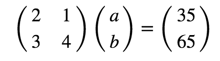

So first we'll need to calculate the inverse of the square matrix containing coefficient values:
```python
#\N{NO-BREAK SPACE}Define A and B
A = np.matrix([[2, 1], [3, 4]])
B = np.matrix([35, 65])

# Take the inverse of Matrix A
A_inv = np.linalg.inv(A)
A_inv
```

```python
# Code here
```
You can now take a dot product of `A_inv` and `B`. Also, as you want the output in the vector format (containing one column and two rows), you would need to transpose the matrix `B` to satisfy the multiplication rule you saw previously.

> **The product of an $M \times N$ matrix and an $N \times K$ matrix is an $M \times K$ matrix. The new matrix takes the number of rows from the first matrix and the number of columns from the second matrix**

```python
# Check the shape of B before after transposing
print(B.shape)
B = B.T
print (B.shape)
B
```

```python
#\N{NO-BREAK SPACE}Code here
```
Now, you can easily calculate $X$ as below:

```python
X = A_inv.dot(B)
X
```

```python
#\N{NO-BREAK SPACE}Code here
```
You can see that the prices of apples and bananas have been calculated as 15p per apple and 5p per banana, and these values satisfy both equations. Great!

The dot product of $A$ and $X$ should give matrix $B$. Let's try it:
```python
print(A.dot(X))
print(B)
```

```python
# Code here
```
Success!

**You can also use `numpy.linalg.solve()` to solve a system of linear equations!**

Numpy has a built-in function to solve such equations as `numpy.linalg.solve(a, b)` which takes in matrices in the correct orientation, and gives the answer by calculating the inverse. Here is how to use it.

```python
#\N{NO-BREAK SPACE}Use Numpy's built in function solve() to solve linear equations
x = np.linalg.solve(A, B)
x
```

```python
# Code here
```
## Further Reading

* [Youtube: Solving System of Linear Equations using Python](https://youtu.be/AqIrdW2-K6k)
* [Inverse of a matrix](http://www.mathwords.com/i/inverse_of_a_matrix.htm)
* [Don't invert that matrix](https://www.johndcook.com/blog/2010/01/19/dont-invert-that-matrix/)

## Summary

In this lesson, you learned how to calculate the inverse of a matrix in order to solve a system of linear equations. You applied the skills learned on the apples and bananas problem introduced earlier. The result of the calculations helped us get unit values of variables that satisfy both equations. In the next lab, you'll go through some other similar problems.


-----File-Boundary-----
# Regression Analysis using Linear Algebra and NumPy - Code Along

## Introduction

In the previous sections, you learned that in statistical modeling, regression analysis is a set of statistical processes for estimating the relationships between data entities (variables). Linear regression is an important predictive analytical tool in the data scientist's toolbox. Here, you'll try and develop a basic intuition for regression from a linear algebra perspective using vectors and matrix operations. This lesson covers least-squares regression with matrix algebra without digging deep into the geometric dimensions.

[You can find a deeper mathematical and geometric explanation of the topic here](http://math.mit.edu/~gs/linearalgebra/ila0403.pdf). In this lesson, we'll try to keep things more data-oriented.

## Objectives

You will be able to:

- Apply linear algebra to fit a function to data, describing linear mappings between input and output variables
- Indicate how linear algebra is related to regression modeling


## Regression analysis

By now, you know that the purpose of the regression process is to fit a mathematical model to a set of observed points, in order to later use that model for predicting new values e.g. predicting sales, based on historical sales figures, predicting house prices based on different features of the house, etc.

Let's use a very simple toy example to understand how this works with linear algebra. Say you are collecting data on total number of sales per day for some business. Imagine you've got three data points in the format:

(day, total number of sales(in hundreds))

> (1, 1) , (2, 2) , (3, 2)

If we plot these points on a scatter plot with day (x-axis) vs. sales figures (y-axis), this is what we get:

```python
import matplotlib.pyplot as plt
import numpy as np

x = np.array([1,2,3])
y = np.array([1,2,2])

plt.plot(x, y, 'o')
plt.xticks(x)

plt.show()
```

```python
#\N{NO-BREAK SPACE}Code here
```
## Fitting a model to data - A quick refresher

The purpose of linear regression would be to fit a mathematical model (a straight line) in the parameter space  that best describes the relationship between day and sales. Simple linear regression attempts to fit a line (in a 2-dimensional space) to describe the relationship between two variables as shown in the example below:

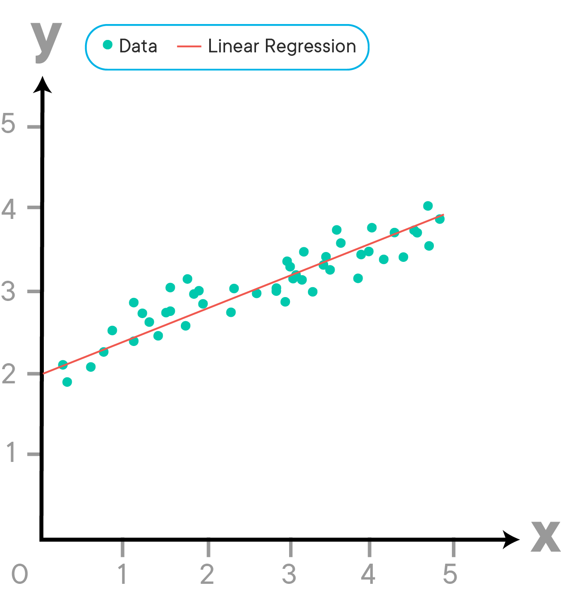


Following this, if you were to identify a relationship between the day and total number of sales, the goal would be to seek a function that describes this line and allows us to linearly map input data points (day) or **independent variable** to outcome values (sales) or **dependent variable**.  If you do this, you first assume that there is an underlying relationship that maps \N{LEFT DOUBLE QUOTATION MARK}days\N{RIGHT DOUBLE QUOTATION MARK} uniquely to \N{LEFT DOUBLE QUOTATION MARK}number of sales\N{RIGHT DOUBLE QUOTATION MARK}, that can be written in the function form as an equation of the straight line i.e.


$$y = mx+c$$


where $c$ is the intercept of the line and $m$ denotes the slope, as shown below:

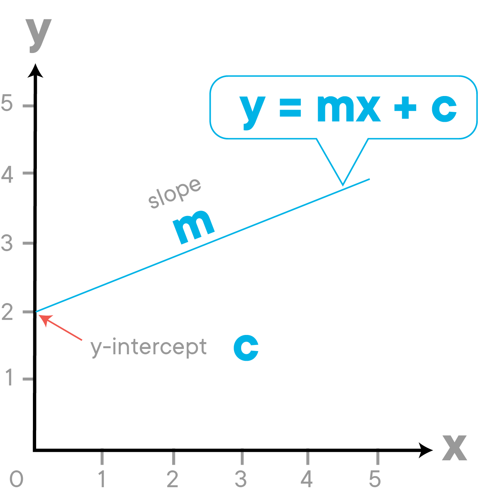


We can write the fitting function based on the above as sales being a **function** of days.

$$ \text{sales} = f(\text{days})$$


or, from $y= mx+c$

$$\text{sales} = \text{days}*x + \text{intercept} $$
>(where **y** is the number of sales per day and **x** represents the day. **c** (intercept) and **m** (slope) are the regression coefficients we are looking for hoping that these co-efficients will linearly map **day** to the **number of sales**).

So using this, we can show our three data points ((1, 1) , (2, 2) , (3, 2)) as:

> $c + m*1 = 1$

> $c + m*2 = 2$

> $c + m*3 = 2$


We can see that our data points do not lie on a line. The first two points make a perfect linear system. When $x = 1$, $y = 1$; and when $x = 2$, $y = 2$ i.e. we can draw a straight line passing through these points. When x = 3, b = 2, you know the three points do not lie on the same line as first two points, and our model will be an **approximation** i.e.
> there will be some error between the straight line and the REAL relationship between these parameters.

This behavior can be simulated by using NumPy's `polyfit()` function (similar to `statsmodels.ols`) to draw a regression line to the data points as shown below. [Here is the documentation for np.polyfit()](https://docs.scipy.org/doc/numpy-1.15.0/reference/generated/numpy.polyfit.html).

```python
from numpy.polynomial.polynomial import polyfit

# Fit with polyfit function to get c(intercept) and m(slope)
# the degree parameter = 1 to models this as a straight line
c, m = polyfit(x, y, 1)

# Plot the data points and line calculated from ployfit
plt.plot(x, y, 'o')
plt.plot(x, c + (m * x), '-')
plt.xticks(x)

plt.show()
print(c, m)
```

```python
#\N{NO-BREAK SPACE}Code here
```
The numbers obtained here reflect the slope (0.5) and intercept values (0.66).

The line drawn above using this built-in regression model clearly doesn't touch all the data points. As a result, this is an **approximation** of the function you're trying to find. Now let's see how to achieve the same functionality with matrix algebra instead of the `polyfit()` function.

## Create matrices and vectors

A linear system like the one above can be solved using linear algebra! You only need to deal with a few vectors and matrices to set this up.

Recalling linear systems from the previous lessons, you have:


$$
    \left[ {\begin{array}{cc}
   1 & 1 \\
   1 & 2 \\
   1 & 3 \\
  \end{array} } \right]
   \left[ {\begin{array}{c}
   c \\
   m \\
  \end{array} } \right] =
    \left[ {\begin{array}{c}
    1 \\
    2 \\
    2 \\
  \end{array} } \right]
$$

## The intercept and error terms

The column of ones in the first matrix refers to the intercept ($c$) from $mx+c$. If you don't include this constant, then the function is constrained to the origin (0,0), which would strongly limit the types of relationships the model could describe. You want to include an intercept to allow for linear models to intersect with the $y$-axis at values different from 0 (in the image shown earlier, $c$ was 2, because the straight line crossed the $y$-axis at $y$=2).

In above , we are hoping that there is some linear combination of the columns of the first matrix that gives us our vector of observed values (the vector with values 1,2,2).

Unfortunately, we already know that this vector does not fit our model perfectly. That means it is outside the column space of A and we can't solve that equation for the vector $x$ directly. Every line we draw will have some value of **error** $e$ associated with it.

**The goal is to choose the vector $x$ for unknown variables to make $e$ as small as possible**.

## Ordinary least squares

A common measure to find and minimize the value of this error is called *Ordinary Least Squares*.

This says that our dependent variable, is composed of a linear part and error. The linear part is composed of an intercept and independent variable(s), along with their associated raw score regression weights.

In matrix terms, the same equation can be written as:

$ y = \boldsymbol{X} b + e $

This says to get y (sales), multiply each $\boldsymbol{X}$ by the appropriate vector b (unknown parameters, the vector version of $m$ and $c$), then add an error term. We create a matrix $\boldsymbol{X}$ , which has an extra column of **1**s in it for the intercept. For each day, the **1** is used to add the intercept in the first row of the column vector $b$.

Let's assume that the error is equal to zero on average and drop it to sketch a proof:

$ y = \boldsymbol{X} b$


Now let's solve for $b$, so we need to get rid of $\boldsymbol{X}$. First we will make X into a nice square, symmetric matrix by multiplying both sides of the equation by $\boldsymbol{X}^T$ :

$\boldsymbol{X}^T y = \boldsymbol{X}^T \boldsymbol{X}b $

And now we have a square matrix that with any luck has an inverse, which we will call $(\boldsymbol{X}^T\boldsymbol{X})^{-1}$. Multiply both sides by this inverse, and we have

$(\boldsymbol{X}^T\boldsymbol{X})^{-1}\boldsymbol{X}^T y =(\boldsymbol{X}^T\boldsymbol{X})^{-1} \boldsymbol{X}^T \boldsymbol{X}b $


It turns out that a matrix multiplied by its inverse is the identity matrix $(\boldsymbol{X}^{-1}\boldsymbol{X})= I$:

$(\boldsymbol{X}^T\boldsymbol{X})^{-1}\boldsymbol{X}^T y =I b $


And you know that $Ib= b$ So if you want to solve for $b$ (that is, remember, equivalent to finding the values $m$ and $c$ in this case), you find that:

$ b= (\boldsymbol{X}^T\boldsymbol{X})^{-1}\boldsymbol{X}^T y $

Here, we'll focus on the matrix and vector algebra perspective. With least squares regression, in order to solve for the expected value of weights, referred to as $\hat{X}$ ("$X$-hat"), you need to solve the above equation.

Remember all above variables represent vectors. The elements of the vector X-hat are the estimated regression coefficients $c$ and $m$ that you're looking for. They minimize the error between the model and the observed data in an elegant way that uses no calculus or complicated algebraic sums.

The above description can be summarized as:

**Using linear regression is just trying to solve $Xb = y$. But if any of the observed points deviate from the model, you can't find a direct solution. To find a solution, you can multiply both sides by the transpose of $X$. The transpose of $X$ times $X$ will always allow us to solve for unknown variables.**

## Calculate an OLS regression line

Let's use the above formula to calculate a solution for our toy problem:
```python
# Calculate the solution

X = np.array([[1, 1],[1, 2],[1, 3]])
y = np.array([1, 2, 2])
Xt = X.T
XtX = Xt.dot(X)
XtX_inv = np.linalg.inv(XtX)
Xty = Xt.dot(y)
x_hat = XtX_inv.dot(Xty) #\N{NO-BREAK SPACE}the value for b shown above
x_hat
```

```python
# Code here
```
The solution gives an intercept of 0.6 and slope value 0.5. Let's see what you get if you draw a line with these values with given data:

```python
# Define data points
x = np.array([1, 2, 3])
y = np.array([1, 2, 2])

# Plot the data points and line parameters calculated above
plt.plot(x, y, 'o')
plt.plot(x, x_hat[0] + (x_hat[1] * x), '-')
plt.xticks(x)

plt.show()
```

```python
#\N{NO-BREAK SPACE}Code here
```
There you have it, an approximated line function! Just like the one you saw with `polyfit()`, by using simple matrix algebra.

## Regression with multiple variables

Above, you saw how you can draw a line on a 2D space using simple regression. If you perform a similar function with multiple variables, you can have a parameter space that is not 2D. With 3 parameters, i.e. two input and one output feature, the fitting function would not be a line, but would look like a plane:

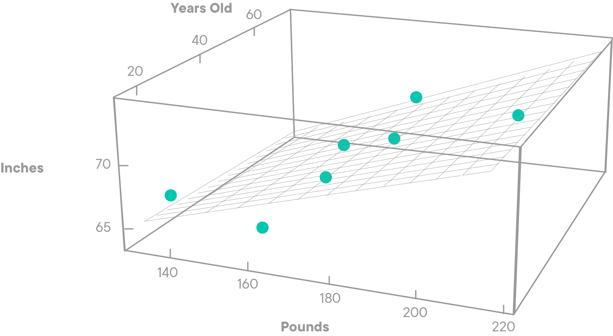

When you have more than one input variable, each data point can be seen as a feature vector $x_i$, composed of $x_1, x_2, \ldots , x_m$ , where $m$ is the total number of features (columns). For multiple regression, each data point can contain two or more features of the input. To represent all of the input data along with the vector of output values we set up a input matrix *X* and an output vector *y*.

you can write this in general terms, as you saw earlier:

> $\boldsymbol{X} \beta \approx y$


Where *X* are the input feature values, $\beta$ represents the coefficients and *y* is the output (value to be predicted). In a simple least-squares linear regression model you are looking for a vector $\beta$ so that the product $X \beta$ most closely approximates the outcome vector y.

For each value of input features $x_i$, we can compute a predicted outcome value as:

observed data $\rightarrow$ $y = b_0+b_1x_1+b_2x_2+ \ldots + b_px_p+ \epsilon $

predicted data $\rightarrow$ $\hat y = \hat b_0+\hat b_1x_1+\hat b_2x_2+ \ldots + \hat b_px_p $

error $\rightarrow$ $\epsilon = y - \hat y $

Just like before,  the formula to compute the beta vector remains:

$ \large b= (\boldsymbol{X}^T\boldsymbol{X})^{-1}\boldsymbol{X}^T y $


So you see that the general solution involves taking a matrix transpose, the inverse, and dot multiplications on the lines of solving a linear system of equations.

In the next lab, you'll use a simple dataset and with the above formulation for multivariate regression, you'll try to fit a model to the data and see how well it performs.

## Further reading

You're strongly advised to visit the following links to develop a strong mathematical and geometrical intuition around how least squares work. These documents will provide you with a visual intuition as well as an in-depth mathematical formulation for above equations along with their proofs.

* [Quora: Why do we need an extra column of ones in regression](https://www.quora.com/Why-do-we-add-an-extra-column-in-1-matrix-to-solve-normal-equation-in-linear-regression)

* [An excellent visual demonstration of oridnary least squares](http://setosa.io/ev/ordinary-least-squares-regression/)

* [Simple Regression in Matrix format](https://www.stat.cmu.edu/~cshalizi/mreg/15/lectures/13/lecture-13.pdf)

## Summary

In this lesson, you had a gentle introduction to how we can use linear algebra to solve regression problems. You saw a toy example in the case of simple linear regression, relating days to number of sales and calculated a function that approximates the linear mapping.

You also learned about how linear regression works in the context of multiple input variables and linear algebra. In the next lab, you'll use these equations to solve a real world problem.


-----File-Boundary-----
# Computational Complexity: From OLS to Gradient Descent

## Introduction

In this lesson, you'll be introduced to computational complexity. You'll learn about this idea in relationship with OLS regression and see how this may not be the most efficient algorithm to calculate the regression parameters when performing regression with large datasets. You'll set the stage for an optimization algorithm called "Gradient Descent" which will be covered in detail later.

## Objectives

You will be able to:

- Describe computational complexity and how it is related to Big O notation
- Describe why OLS with matrix algebra would become problematic for large/complex data
- Explain how optimizing techniques such as gradient descent can solve complexity issues

## Complexities in OLS

Recall the OLS formula for calculating the beta vector:

$ \beta =(\boldsymbol{X}^T\boldsymbol{X})^{-1}\boldsymbol{X}^T y$

This formula looks very simple, elegant, and intuitive. It works perfectly fine for the case of simple linear regression due to a limited number of computed dimensions, but with datasets that are very large or **big data** sets, it becomes computationally very expensive as it can potentially involve a huge number of complex mathematical operations.

For this formula, we need to find $(\boldsymbol{X}^T\boldsymbol{X})$, and invert it as well, which makes it very expensive. Imagine the matrix $X_{(N \times M+1)}$ has $(M+1)$ columns where $M$ is the number of predictors and $N$ is the number of rows of observations. In machine learning, you will often find datasets with $M >1000$ and $N > 1,000,000$. The $(\boldsymbol{X}^T\boldsymbol{X})$ matrix itself takes a while to calculate, then you have to invert an $M \times M$ matrix which adds more to the complexity - making it very expensive. You'll also come across situations where the input matrix grows so large that it cannot fit into your computer's memory.

## The Big O notation

In computer science, Big O notation is used to describe how "fast" an algorithm grows, by comparing the number of operations within the algorithm. Big O notation helps you see the worst-case scenario for an algorithm. Typically, we are most concerned with the Big O time because we are interested in how slowly a given algorithm will possibly run at worst.

#### Example

Imagine you need to find a person you only know the name of. What's the most straightforward way of finding this person? Well, you could go through every single name in the phone book until you find your target. This is known as a simple search. If the phone book is not very long, with say, only 10 names, this is a fairly fast process. But what if there are 10,000 names in the phone book?

At best, your target's name is at the front of the list and you only need to need to check the first item. At worst, your target's name is at the very end of the phone book and you will need to have searched all 10,000 names. As the "dataset" (or the phone book) increases in size, the maximum time it takes to run a simple search also linearly increases.

Big O notation allows you to describe what the worst case is. The worst case is that you will have to search through all elements ($n$) in the phone book. You can describe the run-time as:

**$O(n)$ where $n$ is the number of operations**

Because the maximum number of operations is equal to the maximum number of elements in our phone book, we say the Big $O$ of a simple search is $O(n)$. **A simple search will never be slower than $O(n)$ time.**

Different algorithms have different run-times. That is, algorithms grow at different rates. The most common Big O run-times, from fastest to slowest, are:

* $O(\log n)$: aka $\log$ time
* $O(n)$: aka linear time
* $O(n^2)$
* $O(n^3)$

These rates, as well as some other rates, can be visualized in the following figure:


### OLS and Big O notation

Inverting a matrix costs $O(n^3)$ for computation where n is the number of rows in $X$ matrix, i.e., the observations. Here is an explanation of how to calculate Big O for OLS.

OLS linear regression is computed as $(\boldsymbol{X}^T\boldsymbol{X})^{-1}\boldsymbol{X}^T y$.

If $\boldsymbol{X}$ is an $(n \times k)$ matrix:

- $(\boldsymbol{X}^T\boldsymbol{X})$ takes $O(n*k^2)$ time and produces a $(k \times k)$ matrix
- The matrix inversion of a (k x k) matrix takes $O(k^3)$ time
- $(\boldsymbol{X}^T\boldsymbol{Y})$ takes $O(n*k^2)$ time and produces a $(k \times k)$ matrix
- The final matrix multiplication of two $(k \times k)$ matrices takes $O(k^3)$ time

** So the Big O running time for OLS is $O(k^{2*(n + k)})$ - which is pretty expensive **

Moreover, if  $X$ is ill-conditioned  (i.e. it isn't a square matrix), there will be computational errors in the estimation.
Another common problem is overfitting and underfitting in estimation of regression coefficients.

So, this leads us to the gradient descent kind of optimization algorithm which can save us from this type of problem. The main reason why gradient descent is used for linear regression is the computational complexity: it's computationally cheaper (faster) to find the solution using the gradient descent in most cases.

## Gradient Descent


> Gradient Descent is an iterative approach to minimize the model loss (error), used while training a machine learning model like linear regression. It is an optimization algorithm based on a convex function as shown in the figure above, that tweaks its parameters iteratively to minimize a given function to its local minimum.

In regression, it is used to find the values of model parameters (coefficients, or the $\beta$ matrix) that minimize a cost function (like RMSE) as far as possible.

In order to fully understand how this works, you need to know what a gradient is and how is it calculated. And for this, you would need some Calculus. It may sound a bit intimidating at this stage, but don't worry. The next few sections will introduce you to the basics of calculus with gradients and derivatives.

## Further Reading

- [Wiki: Computational complexity of mathematical operations](https://en.wikipedia.org/wiki/Computational_complexity_of_mathematical_operations)

- [Simplified Big O notation](https://medium.com/karuna-sehgal/a-simplified-explanation-of-the-big-o-notation-82523585e835)

## Summary

In this lesson, you learned about the shortcomings and limitations of OLS and matrix inverses. You looked at the Big O notation to explain how calculating inverses and transposes for large matrix might make our analysis unstable and computationally very expensive. This lesson sets a stage for your next section on calculus and gradient descent. You will have a much better understanding of the gradient descent diagram shown above and how it all works by the end of next section.


-----File-Boundary-----
# Introduction to Derivatives

## Introduction

In the linear regression section, you learned about the basic notion of mathematical functions. Now, imagine that you used the number of bedrooms as a predictor and house rental price as the target variable, you can formulate this as follows:

$$\text{price} = f(\text{number of bedrooms})$$ or, alternatively

$$ y = f(\text{x})$$

Now let's say the price of the apartment is set in a very simplified way, and there is a perfectly linear relationship between the apartment size and the rental price. Say that the price goes up by 500 USD/month for every bedroom an apartment has. In that case, we can express the price as follows:

$$\text{price} = 500 * \text{number of bedrooms}$$ or $$y = f(x) = 500 * x = 500x$$

Note that there is no intercept here! Now, we want to dive deeper into how the rental price changes as the number of bedrooms changes. This is what derivatives are all about!

## Objectives

You will be able to:

* Describe what a derivative means in the context of a real-world example
* Calculate the derivative of a linear function
* Define derivatives as the instantaneous rate of change of a function

## Let's look at our function

Our rental price example can be coded using a Python function as follows:

```python
def f(x):
    return 500*x
```
Using matplotlib, we can visualize this as:

```python
import matplotlib.pyplot as plt
import numpy as np
%matplotlib inline

x = np.linspace(0, 8, 100)

plt.plot(x, f(x))
plt.xlabel("number of bedrooms")
plt.ylabel("monthly rent")
plt.show();
```
As you can see, we get a straight line here.

In this lesson, we'll introduce the concept of **derivatives**. Derivatives are important because they tell us how a function is changing at any given point. We'll focus on calculating the derivatives of straight line functions, or linear functions like the function above, before moving onto calculating the derivative of curved lines in a future lesson.

## Understanding the rate of change

To introduce derivatives, let's introduce a new example, and we'll go back to the housing example later on. Say that we want a function that represents a person taking a jog. We'll represent this by drawing the following straight line.

```python
def jog(miles):
    return 6*miles
x = np.linspace(0, 3, 100)

plt.plot(x, jog(x))
plt.ylabel("distance in miles")
plt.xlabel("number of hours")
plt.show()
```
The graph above helps us see how distance changes in relation to time, or in other words speed.  So here, when we ask about the **rate of change** (which is the core concept behind derivatives), we're basically asking how fast our is jogger traveling!

## Calculating the rate of change

To calculate the miles per hour we can see where a person is at a given time, then wait an hour and to see how far he traveled.  Or we can wait two hours and divide distance traveled by two.  Generally, our technique is to divide number of miles traveled by the number of hours passed.  In this specific example, we'll imagine doing the following to calculate the speed at hour 1.

> * Start a stopwatch after one hour and note the distance at that hour
> * Then, let one hour elapse and mark down the distance at that next hour.
> * Finally, divide the difference in the distances by the elapsed time.

In the below graph, we begin to calculate the speed at the first hour.

```python
fig, ax = plt.subplots(figsize=(7.5,5.5))

x = np.linspace(0, 3.5, 100)

plt.plot(x, jog(x), label = "distance given # hours")

plt.hlines(y=6, xmin=0, xmax=1, linestyle = "dashed", color= 'lightgrey')
plt.vlines(x=1, ymin=0, ymax=6, linestyle = "dashed", color= 'lightgrey')

plt.hlines(y=12, xmin=0, xmax=2, linestyle = "dashed", color= 'lightgrey')
plt.vlines(x=2, ymin=0, ymax=12, linestyle = "dashed", color= 'lightgrey')

plt.vlines(x=2, ymin=6, ymax=12, color="darkorange", label = "y2 - y1 = 12 - 6 = 6")
plt.hlines(y=6, xmin=1, xmax=2, color="lightgreen", label = "x2 - x1 = 2 - 1 = 1")
ax.legend(loc='upper left', fontsize='large')

plt.ylabel("distance in miles")
plt.xlabel("number of hours")
plt.show()
```
We calculate our jogger's speed by seeing where he starts at hour one and ends at hour two.  Our jogger went from mile numbers six to twelve -- indicated by the orange line, so miles per hour is:

 $$ \frac{\text{miles}}{\text{hour}} = \frac {\text{end distance - start distance}}{\text{end time - start time}} = \frac {12 - 6}{2 - 1} = 6$$

Miles per hour is just one example of the rate of change. Anytime we come across the word *per*, we know this is a form of rate of change.  All forms of **rate of change** are calculated the same way: the change in the value on our $y$-axis divided by the change in the value on our $x$-axis.

* Another way of expressing **change in $y$** is:
   * $y_2 - y_1$ or $\Delta y$, read "delta y"
* Likewise, another way of expressing **change in $x$** is:
   * $x_2 - x_1$ or $\Delta x$, read "delta x"

Generally, we can say that the derivative of a straight line is equal to the "rise over the run":

* rate of change $= \dfrac{\text{rise}}{\text{run}} = \dfrac{\Delta y}{\Delta x} = \dfrac{y_2 - y_1}{x_2 - x_1}$

Just like in our example, we saw:

* miles per hour =  $\dfrac{\text{distance}_2 - \text{distance}_1}{\text{time}_2 - \text{time}_1} = \dfrac{12 - 6}{2 - 1} = \dfrac{6}{1} = 6$ mph

Derivatives are a specific kind of rate of change -- the rate of change of a function **at a given point**.  For a linear function as we work with here, we calculate them through rise over run, or the change in $y$ divided by the change in $x$, expressed $\dfrac{\Delta y}{\Delta x}$.  The rest of this lesson will simply be introducing more math terms and symbols for expressing this same concept.

> Stick with us, fully understanding these will pay off when we take the derivative of more complex functions.

## Derivatives using our function expression

Since our jogger is running at a constant rate, our calculated rate of change of 6 miles per hour is also the derivative.  Of course, we already coded this before, but we know that the mathematical function for our run is

$$f(x) = 6x$$

or, in Python

```python
def f(x):
    return 6*x
```
If we are given a function $f(x)$, we say the derivative of that function is $f'(x)$ -- read $f$ primed of $x$.

We already can express the derivative of a linear function $f(x)$ many different ways:

* $ f'(x) = \dfrac{\text{rise}}{\text{run}} = \dfrac{\Delta y}{\Delta x} = \dfrac{y_2 - y_1}{x_2 - x_1} =  \dfrac{f(x_2) - f(x_1)}{x_2 - x_1}$

Take a look to at the equation far to the right:

$$f'(x) = \frac{f(x_2) - f(x_1)}{x_2 - x_1} $$

You see that we replaced $y_2 - y_1$ with $f(x_2) - f(x_1)$.  This makes sense, because really when we say $y_2$ and $y_1$, we mean the function's output at the first value of $x$ and the function's output at the second value of $x$.

We indicate that we are calculating the derivative of $f(x)$ at a specific point, say hour 1, by calling $f'(1)$.  That's the rate of change at hour 1.  Now we can plug in our values to calculate the derivative.

* $x_1 = 1$ as hour 1 is our starting point
* $x_2 = 2$ as hour 2 is ending point starting point

giving us:

$$f'(1) = \frac{f(2) - f(1)}{2 - 1} = \frac{12 - 6}{2 - 1} = 6 $$

So $f(x)$ equals the output at a given point.  And $f'(x)$ is the rate of change at a given point.  So then:
* $f(1)$ means the output at $x = 1$, or in our example, *the distance* at hour one, and
* $f'(1)$ means the rate of change at $x = 1$, or in our example, *the speed* at hour one

Because the jogger's speed never changes throughout and since the derivative is the rate of change at a given point, we can conclude that the derivative also never changes. That's right! Let's take $x_1=3$ and $x_2=4$:

$$f'(3) = \frac{f(4) - f(3)}{4 - 3} = \frac{24 - 18}{2 - 1} = 6$$

Let's plot the distance from hours zero through five on the left and the speed from hours zero through five on the right to visualize this steady pace.

```python
x = [0, 1, 2]
x = np.linspace(0, 5, 100)

fig, ax = plt.subplots(figsize=(10,4))

# plot 1
plt.subplot(121)
plt.plot(x, f(x), label = "f (x)")
plt.legend(loc="upper left", bbox_to_anchor=[0, 1],
           ncol=2, fancybox=True)

# plot 2
plt.subplot(122)
plt.hlines(y=6, xmin=1, xmax=5, color="darkorange",label = "f '(x)")
plt.legend(loc="upper left");


plt.show()
```
> * To the left is a graph of $f(x) = 6x$ for different values of $x$
> * And to the right is a plot of the rate of change of that function, $f'(x)$, for different values $x$
> * So while *the distance* changes through time, *the speed*, or rate of change, stays the same

## Expressing the derivative in terms of change

Now our above formulas for calculating the derivative do the job, but they don't exactly express our technique in the example of our jogger.  Remember that our technique for calculating the jogger's speed is the following:

> * Start a stop watch after one hour and see the distance at that hour
> * Then, let time elapse one hour and see the distance at that hour
> * Finally, divide the difference in the distances by the elapsed time

This is what this looks like in terms of math:

$f'(x) = \dfrac{f(x + \Delta x) - f(x)}{\Delta x} $

Let's take a second to fully understand this new formula because it's not going away.

* $f'(x)$ is the rate of change at a given value, or here the speed at a given time


* $f(x)$ is the distance at a given time


* $\Delta x$ is the elapsed time, or the change in $x$


* $f(x + \Delta x)$ is the distance at the starting time plus the elapsed time

This is the definition that we will often see.  It expresses our technique for calculating the derivative.
* Subtract the output at one input, $x$, from the output at that initial input plus a change in $x$
* Then divide that difference by the change in $x$

In summation, that is the derivative of a line, or the rate of change of a linear function.  The rate of change answers how much is our output changing at a given point. To wrap everything up, let's look at our house rental example again!

```python
def f(x):
    return 500*x

import matplotlib.pyplot as plt
import numpy as np

x = np.linspace(0, 8, 100)

plt.hlines(y=1500, xmin=0, xmax=3, linestyle = "dashed", color= 'lightgrey')
plt.vlines(x=3, ymin=0, ymax=1500, linestyle = "dashed", color= 'lightgrey')

plt.hlines(y=2000, xmin=0, xmax=4, linestyle = "dashed", color= 'lightgrey')
plt.vlines(x=4, ymin=0, ymax=2000, linestyle = "dashed", color= 'lightgrey')

plt.plot(x, f(x))
plt.xlabel("number of bedrooms")
plt.ylabel("monthly rent")
plt.show();
```
Using the definition of derivatives stated above, let's say $x=3$ and $\Delta x = 1$. Then:

$f'(x=3) = \dfrac{f(x + \Delta x) - f(x)}{\Delta x}= \dfrac{f(3 + 1) - f(3)}{1} = \dfrac{2000-1500}{1}= 500 $

In conclusion, our *derivative* or *rate of change* for the house rental example is equal to 500! The derivative as a function of any value $x$ is again given by a constant, and represented below:

```python
x = [0, 1, 2]
x = np.linspace(0, 8, 100)

fig, ax = plt.subplots(figsize=(10,4))

# plot 1
plt.subplot(121)
plt.plot(x, f(x), label = "f (x)")
plt.legend(loc="upper left", bbox_to_anchor=[0, 1],
           ncol=2, fancybox=True)

# plot 2
plt.subplot(122)
plt.hlines(y=500, xmin=1, xmax=5, color="darkorange",label = "f '(x)")
plt.legend(loc="upper left");


plt.show()
```
## Summary

In this lesson, we saw that the derivative is the change in output per change in input.  In the case of our jogger, the input was time and the output was the distance traveled.  We learned that the derivative is the change in the runner's distance traveled divided by the amount of time passed.

Graphically, we see that the derivative is simply the rise over run or change in $x$ divided by change in $y$ or:

$$ f'(x) = \frac{\Delta y}{\Delta x} = \frac{y_2 - y_1}{x_2 - x_1} $$

Then we saw that we can express the derivative in terms of $f(x)$ instead of $y_1$ and $y_2$ as in the output at second $x$ minus the output at the first x divided by the difference between the two $x$ values.  Or, in an equation:

$$ f'(x) = \frac{f(x_2) - f(x_1)}{x_2 - x_1} $$

And finally we saw how we can express the derivative in terms of $\Delta x$ as in subtract the output at an initial value $x$ from the output at that initial value $x$ plus some change in $x$, then divide by that change in $x$:

$$ f'(x) = \frac{f(x + \Delta x) - f(x)}{\Delta x} $$


-----File-Boundary-----
# Derivatives of Non-Linear Functions

## Introduction

In the last lesson, we saw that the derivative was the rate of change and that the derivative of a straight line is a constant. Let's explore non-linear functions and their derivatives in this lesson!

## Objectives

You will be able to:

* Calculate the derivative of a non-linear function

## Let's get started

Let's have another look at our the plot you saw previously:

```python
import matplotlib.pyplot as plt
%matplotlib inline
import numpy as np

def jog(miles):
    return 6*miles

fig, ax = plt.subplots(figsize=(7.5,5.5))

x = np.linspace(0, 3.5, 100)

plt.plot(x, jog(x), label = "distance given # hours")

plt.hlines(y=6, xmin=0, xmax=1, linestyle = "dashed", color= 'lightgrey')
plt.vlines(x=1, ymin=0, ymax=6, linestyle = "dashed", color= 'lightgrey')

plt.hlines(y=12, xmin=0, xmax=2, linestyle = "dashed", color= 'lightgrey')
plt.vlines(x=2, ymin=0, ymax=12, linestyle = "dashed", color= 'lightgrey')

plt.vlines(x=2, ymin=6, ymax=12, color="darkorange", label = "y2 - y1 = 12 - 6 = 6")
plt.hlines(y=6, xmin=1, xmax=2, color="lightgreen", label = "x2 - x1 = 2 - 1 = 1")
ax.legend(loc='upper left', fontsize='large')

plt.ylabel("distance in miles")
plt.xlabel("number of hours")
plt.show()
```
Where our function was given by $f(x)=6x$. We saw multiple ways of calculating the derivative:
* Essentially, the derivative is the rate of change of a function
* Graphically this is rise over run
* Which can be calculated by taking two points, $(x_1, y_1)$ and $(x_2, y_2)$ and calculating $\frac{y_2 - y_1}{x_2 - x_1}$

Finally, we said that when we have a function $f(x)$, we can calculate the derivative with knowing the starting point $x$ and the change in our input, $\Delta x$:

$$ \frac{f(x + \Delta x) - f(x)}{\Delta x} $$

## A non-linear function

So we saw previously that the derivative is the rate of change of our function.  We express this as $ f'(x) = \frac{\Delta f}{\Delta x}$. So far we have only calculated the derivatives with linear functions. As we'll see, things become trickier when working with more complicated functions.

For example, let's imagine that we are coaching our runner to perform in a track meet.


We may want to know how well our track start does at one part of the race, say the starting point, versus another point later in the race.  Then we will know what to focus on in practice.  We can imagine the distance traveled by our track star's distance through time as represented by the function $f(x) = x^2$:

```python
def f(x):
    return np.square(x)

fig, ax = plt.subplots(figsize=(7.5,5.5))

x = np.linspace(0, 7, 100)
plt.plot(x, f(x))

plt.ylabel("distance in feet")
plt.xlabel("number of seconds")
plt.show()
```
> The graph shows that from seconds zero through seven, our track runner gets faster over time.


## Calculating speed at second two
Now if we want to see how quickly our track star at the 2nd second as opposed to some other second, what would we do?  Well even if we knew nothing about derivatives, we would likely get a stopwatch and at second 2 would use it to calculate the speed.  Let's say that we start our stopwatch at second 2 and stop our stopwatch one second later.

```python
def f(x):
    return np.square(x)

fig, ax = plt.subplots(figsize=(7.5,5.5))

x = np.linspace(0, 4, 100)

plt.plot(x, f(x))

plt.hlines(y=9, xmin=0, xmax=3, linestyle = "dashed", color= 'lightgrey')
plt.vlines(x=2, ymin=0, ymax=4, linestyle = "dashed", color= 'lightgrey')
plt.hlines(y=4, xmin=0, xmax=2, linestyle = "dashed", color= 'lightgrey')
plt.vlines(x=3, ymin=0, ymax=9, linestyle = "dashed", color= 'lightgrey')

plt.vlines(x=3, ymin=4, ymax=9, color="darkorange", label = "y2 - y1 = 9 - 4 = 5")
plt.hlines(y=4, xmin=2, xmax=3, color="lightgreen", label = "x2 - x1 = 3 - 2 = 1")

# tangent line
x_dev = np.linspace(1.5, 3.5, 100)
a = 2
delta_a = 1
fprime = (f(a+delta_a)-f(a))/delta_a
tan = f(a)+fprime*(x_dev-a)

# plot of the function and the tangent
plt.plot(x_dev, tan, color = "black", linestyle="dashed")

ax.legend(loc='upper left', fontsize='large')

plt.ylabel("distance in feet")
plt.xlabel("number of seconds")
plt.show()
```
As the graph above shows, we measure the change at second two by starting our stopwatch at second 2 and stopping it one second later.  So turning this into our formula for calculating a derivative of:

$$ f'(x) = \frac{f(x + \Delta x) - f(x)}{\Delta x}  $$

we do the following:
* Set $x = 2$, as that's the point we want to calculate the rate of change at
* Set $\Delta x = 1$, as that's the number of seconds that elapsed on our stopwatch

and plugging in these values, we have:

$$ f'(2) =  \frac{f(2 + 1) - f(2)}{ 1} =  \frac{f(3) - f(2)}{1} $$

So our rate of change at second number 2, with a $\Delta x = 1$ is calculated by subtracting the function's output at second 2 from the function's output at second 3 and dividing by $\Delta x=1$.

Simplifying our calculation of $f'(x)$ further by calculating the outputs at $x = 2$ and $x = 3 $ we have:

* $f(3) = (3)^2 = 9$ is the output at $x = 3$ and
* $f(2) = (2)^2 = 4$ is the output at $x = 2$ so

$$f'(2) =  \frac{9 - 4}{1} = \frac{5}{1} = 5 $$

## The problem with our derivative formula

Let's take another close look at the straight line in the graph above.  That straight line is a supposed to be the rate of change of the function at the point $x = 2$.  And it comes close.  But it doesn't exactly line up.  Our black dashed line quickly begins to move above the blue line, indicating that it has a faster rate of change than the blue line at $x = 2$.  This means that our calculation that $f'(2) = 5 $ is actually too high.

Here is **the problem:**

* in our formula of $ f'(x) = \dfrac{f(x + \Delta x) - f(x)}{\Delta x} $, we are seeing the rate of change not just where $x = 2$, but from the period from $x = 2$ to $x = 3$.
Recall that the derivative is supposed to be the **instantaneous** rate of change! However, it seems that this interval does not reflect the **instantaneous** nature!

In other words, **the runner would tell us** that we are not capturing their speed at precisely second two:

> This is because in between the clicks of our stopwatch from seconds two to three, our runner is getting faster and while we are supposed to be calculating his speed just at second two, our calculation includes his increase in speed from seconds two to three.

> Therefore, the black dashed has a larger rate of change than the blue line because we have included this increase in speed at second three.

**A mathematician would make the same point** that we are not actually calculating the derivative:

> Our derivative means we are calculating how fast a function is changing at any given moment, and precisely at that moment.  And unlike in where our functions were linear, here the rate of change of our function is always changing.  The larger our value of $\Delta x$, the less our derivative reflects the rate of change at just that point.

## The solution: Decrease the change in $x$ ($\Delta x$)

If you were holding a stopwatch and someone asked you to calculate their speed at second number 2, how could you be more accurate?  Well, you would want to decrease the change in seconds.  Of course, our runner could continue to protest and say that we are still influenced by the speed at other times.

However, the mathematician has a solution to this. To calculate the rate of change at precisely one point, the solution is to use our imagination.  We calculate the derivative with a $\Delta $ of 1, then calculate it again with a $\Delta x$ of .1, then again with $\Delta x$ of .01, then again with $\Delta $ .001.  Our derivative calculation should show convergence on a single number as our $\Delta $ approaches zero and that number is our derivative.

> ** The derivative of a function is a change in the function's output across $\Delta x$, as $\Delta x $ approaches zero. **

In this example, by decreasing $\Delta x$ we can see a fairly clear pattern.

| $ \Delta x $        | $ \frac{\Delta y}{\Delta x} $|
| ------------- |:-------------:|
| 1      | 5   |
| .1      | 4.1|
| .01 | 4.01     |
| .001 | 4.001      |

## Seeing this visually: tangent lines

Another way to see how we approach the derivative is by seeing how a line becomes more tangent to the curve as $\Delta x$ decreases.

> Tangent to the curve means that our line is just touching the curve.

**The more that a line is tangent to the curve at a point, the more it's slope matches the derivative.**

Ok, let's get a sense of what we mean by tangent to the curve.  The black dashed line below is a line whose slope is calculated by using our derivative function, with $ \Delta x = 1$.  As you can see it is **not tangent to our function, $f(x)$ ** as it does not *just touch* the blue line, but rather touches it in two places.

```python
def make_plot(delta_a):

    lab= "delta x = " + str(delta_a)
    plt.plot(x, f(x), label = lab)

    plt.hlines(y=9, xmin=1, xmax=3, linestyle = "dashed", color= 'lightgrey')
    plt.vlines(x=2, ymin=1, ymax=4, linestyle = "dashed", color= 'lightgrey')
    plt.hlines(y=4, xmin=1, xmax=2, linestyle = "dashed", color= 'lightgrey')
    plt.vlines(x=3, ymin=1, ymax=9, linestyle = "dashed", color= 'lightgrey')

    # tangent line
    x_dev = np.linspace(1.5, 3.2, 100)
    a = 2
    fprime = (f(a+delta_a)-f(a))/delta_a
    tan = f(a)+fprime*(x_dev-a)

    # plot of the function and the tangent
    plt.plot(x_dev, tan, color = "black", linestyle="dashed")
    plt.legend(loc="upper left", bbox_to_anchor=[0, 1],
           ncol=2, fancybox=True);
    return
```
```python
x = np.linspace(1, 3.5, 100)
fig, ax = plt.subplots(figsize=(6,4))
make_plot(1)
```
If our black dashed line had the same slope, or rate of change, as our function at that $x = 2$, it would just touch the blue line.  We know from above that we get closer to the rate of change of the function as we decrease $ \Delta x$ in our derivative formula.

Let's look again using a smaller $\Delta x$.

Below are the plots of our lines using our derivative formula for when  $\Delta x = 1$, $\Delta x =0.1, \Delta x = 0.01$ and $\Delta x = 0.001$.

```python
x = np.linspace(1, 3.5, 100)
fig, ax = plt.subplots(figsize=(10,8))

# create 4 subplots
plt.subplot(221)
make_plot(delta_a = 1)
plt.subplot(222)
make_plot(delta_a = 0.1)
plt.subplot(223)
make_plot(delta_a = 0.01)
plt.subplot(224)
make_plot(delta_a = 0.001)
```
Going to the top left figure to the bottom right figure, you can see that for a smaller $\Delta x$, we get a more tangent line. This is particularly visible going from $\Delta x = 1$  to $\Delta x = .1$. This is no surprise, as the difference between a slope moving from 5 to 4.1 is still visible with the naked eye, but moving from 4.1 to 4.01 to 4.001 is fairly impossible to see.

As you can see, as $\Delta x $ approaches zero, $f'(2) $ approaches $ 4 $.

## Approaching our formula for a derivative

So to describe the above, at the point $x = 2 $, the **limit** of $\dfrac{\Delta y}{\Delta x} $ -- that is the number that $\dfrac{\Delta y}{\Delta x} $ converges to as  $ \Delta x $ approaches zero -- is 4.  We can abbreviate this into the following expression:

When $x = 2, \displaystyle\lim_{\Delta x\to 0} \frac{\Delta y}{\Delta x} = 4  $.

Or, better yet, we can update and correct our definition of derivative to be:

$$ f'(x) = \displaystyle {\lim_{ \Delta x \to 0}} \frac{f(x + \Delta x) - f(x)}{\Delta x} $$

So the derivative is the change in output as we *just nudge* our input.  That is how we calculate *instantaneous rate of change*.  We can determine the runner's speed at precisely second number 2, by calculating the runner's speed over shorter and shorter periods of time, to see what that number approaches.

One final definition before we go.  Instead of $\Delta x$, mathematicians sometimes use the variable $h$ to describe the change in inputs.  So replacing our $\Delta x$ symbols with $h$'s we have:

$$ f'(x) = \lim_{ h\to0} \frac{f(x + h) - f(x)}{h} $$

Above is the formula for the derivative for all types of functions linear and nonlinear.

## Summary

In this section, we learned about derivatives.  A derivative is the instantaneous rate of change of a function.  To calculate the instantaneous rate of change of a function, we see the value that $\dfrac{\Delta y}{\Delta x} $ approaches as $\Delta x $ approaches zero.  This way, we are not calculating the rate of change of a function across a given distance.  Instead, we are finding the rate of change at a specific moment.


-----File-Boundary-----
# Rules for Derivatives

## Introduction

In the previous lesson, we calculated the derivative by changing our delta to see the convergence around a number as reflected in the table above.  However, mathematicians have derived shortcuts to calculate the derivative.
You'll learn about these shortcuts in this lesson!

## Objectives

You will be able to:

- Calculate derivatives of more complex functions by using power rules, constant factor and the addition rule

## Review of derivatives

From previous lessons, you know that the derivative is the instantaneous rate of change of a function.  We said that the derivative of a function at a certain point is just the slope of the function at that point.  And to calculate that slope of the function at a given point, we make $\Delta x$ value smaller until it approaches zero, and see what our $ \dfrac{\Delta f}{\Delta x} $ converges upon.

For example, we saw the following table:

| $ \Delta x $        | $ \displaystyle \frac{\Delta y}{\Delta x} $|
| ------------- |:-------------:|
| 1      | 5      |
| .1      | 4.1|
| .01 | 4.01     |
| .001 | 4.001      |

This convergence around one number is called the **limit **.  And we can describe what we see in the above table as the expression:


 $$ f'(2) = \lim_{\Delta x\to0} \dfrac{\Delta f}{\Delta x} = 4  $$

We read this as the limit of $\dfrac{\Delta f}{\Delta x} $ as  $ \Delta x $ approaches zero equals 4.  So, in general our definition of the derivative is:

$$ f'(x) = \lim_{\Delta x\to0} \frac{\Delta f}{\Delta x}  = \lim_{h\to0} \frac{f(x + h) - f(x)}{h} $$

## Rules for calculating the derivative

Derivative rules allow us not just to evaluate the derivative at a single point, as we have done previously, but across any value of $x$ of the function. The most important rules for derivatives are classified in three groups:
- The power rule
- The constant factor rule
- The addition rule

### The power rule

The first rule for us to learn is the power rule.  The power rule is expressed as the following.  Given the following:

$$f(x) = x^r $$

Then, the derivative is:
$$ f'(x) = r*x^{r-1} $$

This says that if a variable, $x$, is raised to a exponent $r$, then the derivative of that function is the exponent $r$ multiplied by the variable, with the variable raised to the original exponent minus one.

Let's see this by way of example, with the function, $f(x) = 6*x $.  Remember that we originally calculated the derivative with our formula:

$$ f'(x) = \lim_{h\to0} \frac{f(x + h) - f(x)}{h} $$

$$ f'(4) = \lim_{h\to0} \frac{f(4 + h) - f(4)}{h} = 6 $$

$$ f'(8) = \lim_{h\to0} \frac{f(8 + h) - f(8)}{h} = 6 $$

We saw that our rate of change of our linear function $f(x) = 6x $ was always 6.  Since the rate of change is constant for linear functions, the derivative was the same across all values of $x$.

```python
import matplotlib.pyplot as plt
import numpy as np

def jog(miles):
    return 6*miles

fig, ax = plt.subplots(figsize=(7.5,5.5))

x = np.linspace(0, 6, 7)
c1= np.linspace(1,2,20)
c2= np.linspace(4,5,20)

plt.plot(x, jog(x), label = "distance given # hours", marker="|", markersize=12)
plt.plot(c1, jog(c1), label = "slope = 6", color="green")
plt.plot(c2, jog(c2), label = "slope = 6", color="red")

ax.legend(loc='upper left', fontsize='large')
plt.ylabel("distance in miles")
plt.xlabel("number of hours")
plt.show()
```
Now let's see how this works with our power rule:

$$f(x) = 6*x = 6*x^{1} $$

Now applying our rule that for a function with

$$f(x) = x^r $$

$$ f'(x) = r*x^{r-1} $$

we see that in this case $r = 1$.  So applying our power rule we have:

$$f'(x) = r*6*x^{r-1} = 1*6*x^{1-1} = 6*x^{0} = 6 $$

Great!  This is aligns with what our graph shows, as well as our calculation using the original definition of the derivative, $\displaystyle\lim_{\Delta x\to0} \dfrac{\Delta y}{\Delta x}$ .

*Another example*

Let's apply the power rule to another example which we used before: the example where the runner starts a race. Here:

$$f(x) = x^2 $$

$$f'(x) = 2*x^{2-1} = 2*x^1 = 2*x $$

Think about what our calculation for $f'(x)$ is saying about our function.  It says, for our function $f(x) = x^2$, a small change in $x$ produces an increase in $f(x) $ equal to 2 times the $ x $ value.  Or, in other words:
$$ f'(x) = 2*x $$

* So when $ x = 2$ then $f'(2) = 2*2 = 4 $
* When $ x = 5 $, then $ f'(5) = 2*5 = 10$
* And when $ x = 10 $, then $ f'(10) = 2*10 = 20$.

Note that $x$ represents the number of seconds our runner has run, so negative $x$ doesn't make sense here. But there are numerous examples where input variables can be negative, and the same rules are simply applicable here as well. For example, imagine the same function where $x$ represents temperatures.

- when $x=-2$, then $f'(-2) = -4$
- when $x=-7$, then $f'(-7)=-14$

We won't prove the power rule here.  But hopefully, you can see that it does seem to fit our graph of the function $f(x) = x^2$.  Let's take a look.

```python
def f(x):
    return np.square(x)
fig, ax = plt.subplots(figsize=(9.5,6.5))

x = np.linspace(-3, 6, 100)
c1= np.linspace(1.5,2.5,20)
c2= np.linspace(4.5,5.5,20)
c3= np.linspace(-2.5,-1.5,20)

plt.plot(x, f(x), label = "distance given # seconds")

x_dev = np.linspace(1.5, 3.2, 100)
a1 = 2
a2 = 5
a3 = -2
delta_a=0.001
fprime1 = (f(a1+delta_a)-f(a1))/delta_a
fprime2 = (f(a2+delta_a)-f(a2))/delta_a
fprime3 = (f(a3+delta_a)-f(a3))/delta_a

tan1 = f(a1)+fprime1*(c1-a1)
tan2 = f(a2)+fprime2*(c2-a2)
tan3 = f(a3)+fprime3*(c3-a3)

# plot of the function and the tangent
plt.plot(c1, tan1, color = "green", label="slope = 4")
plt.plot(c2, tan2, color = "red", label="slope = 10")
plt.plot(c3, tan3, color = "orange", label="slope = -4")

ax.legend(loc='upper left', fontsize='large')

plt.ylabel("distance in feet")
plt.xlabel("number of seconds")
plt.show()
```
It seems reasonable that the slope of the line tangent to a curve is $2*x$.  So our power rule for derivatives looks good.

### The constant factor rule

After learning the power rule, the constant factor is a breeze.  The constant factor addresses how to take the derivative of a function multiplied by a constant.

So in the above example, we have our function of $f(x) = 6*x$.  Now, the derivative of that function

$$f'(x) = 6 * \frac{\Delta f}{\Delta x} $$

Applying the power rule, we know that $ \frac{\Delta f}{\Delta x}x^1 = x^{1-1} = 1 $, so we have:

$$f'(x) = 6 * \frac{\Delta f}{\Delta x}x = 6*1 = 6$$

In the general case, we can say, consider the function $a*f(x)$ where $a$ is a constant (that is, is a number and not a variable).  Then

$$\frac{\Delta f}{\Delta x}(a*f(x)) = a * \frac{\Delta f}{\Delta x}*f(x) $$

> Now, don't let the fancy equations above confuse you.  The rule simply says if a variable is multiplied by a constant (i.e. a number), then to take the derivative of that term, apply our familiar power rule to the variable and multiply the variable by that same constant.

So given the function:

$$f(x) = 2x^2 $$


$$f'(x) = 2*\frac{\Delta f}{\Delta x} x^{2} = 2*2*x^{2-1} = 4x^1 = 4x $$

That's the constant factor rule in action.

### The addition rule

So far, all of our functions consisted of only one term.  Remember that a term is a constant or variable that is separated by a plus or minus sign.  For example, the function $f(x)$ below has three terms:

$ f(x) = 4x^3 - x^2 + 3x $

To take a derivative of a function that has multiple terms, simply take the derivative of each of the terms individually.  So for the function above,

$$ f(x) = 4x^3 - x^2 + 3x $$

$$ f'(x) = 12x^2 - 2x + 3  $$

Do you see what we did there?  We simply applied our previous rules to each of the terms individually and continued to add or subtract the terms accordingly.

## Derivatives Drill

Let's take the last few lines of this lesson to practice these derivative rules.

$$f(x) = 3x^5$$

$$g(x) = 10x$$

$$ z(x) = 10 $$

What are the derivatives of these respective functions?

> Take some time to think through it.

> Even a pen and paper could be in order.

> Ok, maybe the pen is too far away...Time for the answers.

$$f(x) = 3x^5$$
$$f'(x) = 15x^4$$

$$g(x) = 10x$$
$$g'(x) = 10$$

$$ z(x) = 10  $$
$$ z(x) = 10 * (x^0) $$
$$ z'(x) = 0*10x^{0-1} = 0 $$

So as you can see, we are just applying our rule:

$$f(x) = x^r $$

$$ f'(x) = r*x^{r-1} $$

And note that whenever we take the derivative of a constant like the number 10, then the derivative of that constant is 0. This also makes sense when thinking of this visually, as the slope of a constant function is 0!

### Evaluating derivatives

Let's evaluate $f'(x)$, $g'(x)$ and $z'(x)$, each at the value where $x = 3$.

Are you able to determine what the derivatives of each of these functions each will equal when $x = 3$?  We simply substitute x for 3, whenever we see $x$.

So:

$$f'(3) = 15x^4 = 15*3^4 = 15*81 = 1215 $$

$$g'(3) = 10 = 10 $$

$$z'(3) = 0 = 0 $$

### Try again

Let's try a couple more derivatives.

$$f(x) = 3x^3 + 8x + 12$$

$$g(x) = 12x^2 + 4x^2 + 2$$

Ok, now for the derivatives.

 Let's see it!

$$f(x) = 3x^3 + 8x + 12$$
$$f'(x) = 9x^2 + 8 $$

$$g(x) = 12x^2 + 4x^2 + 2$$
$$g'(x) = 24x + 8x = 32x$$

## Summary

In this lesson, we learned a different way to calculate the derivative.  The derivative of a function at a given point is still the instantaneous rate of change of that function at that point. Now we have three rules that allow us to calculate our derivative.  The most tricky of these is the power rule, which says that if $f(x) = x^r$, then $ f'(x) = r * x^{r-1} $.

Using our derivative rules, we can now calculate the derivative across the entire function.  So the derivative of $f(x) = 6x $ is always 6, and the derivative of $f(x) = x^2 $ is $f'(x) = 2x $.  To evaluate our derivative at a specific value of $x$, we simply plug that value of $x$ into our derivative.  When $f'(x) = 2x$, then $f'(2) = 2*2$.


-----File-Boundary-----
# Derivatives: Conclusion

## Introduction

Data science is all about finding good models to understand patterns in your data. You'll find yourself performing optimizations all the time. Examples are: maximizing model likelihoods and minimizing errors. Essentially, you'll perform a lot of minimizations and maximizations along the way when creating machine learning models. This is where derivatives come in very handy!

## Objectives

You will be able to:

- Describe how minima and maxima are related to machine learning and optimization
- Calculate minima and maxima mathematically

## Finding Minima and Maxima

To illustrate this point, let's have another look at some functions.

For this lecture, we'll use the `derivatives.py`-file containing some functions we have created previously.

```python
from derivatives import *
```
Let's look at the function $2x^2-8x$ and its derivative. In the code below, we create the `function_values` and `derivative_values` for $x$-es ranging from -6 to 10.

```python
import numpy as np
tuple_sq_pos  = np.array([[2, 2], [-8, 1]])
x_values = np.linspace(-6, 10, 100)
function_values = list(map(lambda x: output_at(tuple_sq_pos, x), x_values))
derivative_values = list(map(lambda x: derivative_at(tuple_sq_pos, x),x_values))
```
Now, let's look at their plots side by side.

```python
import matplotlib.pyplot as plt
%matplotlib inline

fig, ax = plt.subplots(figsize=(12,5))

# plot 1
plt.subplot(121)
plt.axhline(y=0, color='lightgrey', )
plt.axvline(x=0, color='lightgrey')
plt.plot(x_values, function_values, label = "f (x) = 2x^2\N{MINUS SIGN}8x ")

plt.legend(loc="upper left", bbox_to_anchor=[0, 1], ncol=2, fancybox=True)

# plot 2
plt.subplot(122)
plt.axhline(y=0, color='lightgrey')
plt.axvline(x=0, color='lightgrey')
plt.plot(x_values, derivative_values,color="darkorange", label = "f '(x) = 4x-8")

ax.grid(True, which='both')

plt.legend(loc="upper left");
```
We notice that our function, $2x^2-8x$ reaches a minimum at $x = 2$. Interestingly, it is exactly at $x=2$ that our function $f'(x)$ crosses the x-axis! In mathematical terms $f'(2) = 0$!

This is great... and this is always the case when looking for minima!

***OK, but what about maxima?***

Let's have a look!

```python
tuple_sq_neg  = np.array([[-3, 2], [30, 1]])
```
```python
x_values = np.linspace(-4, 12, 100)
function_values = list(map(lambda x: output_at(tuple_sq_neg, x), x_values))
derivative_values = list(map(lambda x: derivative_at(tuple_sq_neg, x),x_values))
```
```python
import matplotlib.pyplot as plt
%matplotlib inline

fig, ax = plt.subplots(figsize=(12,5))

# plot 1
plt.subplot(121)
plt.axhline(y=0, color='lightgrey', )
plt.axvline(x=0, color='lightgrey')
plt.plot(x_values, function_values, label = "f (x) = -3x^2+30x ")

plt.legend(loc="upper left", bbox_to_anchor=[0, 1], ncol=2, fancybox=True)

# plot 2
plt.subplot(122)
plt.axhline(y=0, color='lightgrey')
plt.axvline(x=0, color='lightgrey')
plt.plot(x_values, derivative_values,color="darkorange", label = "f '(x) = -6x + 30")

ax.grid(True, which='both')

plt.legend(loc="upper left");
```
You can see that here, $-3x^2+30x$ reaches a maximum at $x=5$. Similarly to what you've seen before like, we see that $f'(x) = 0$ when $x = 5$. So, in conclusion, minima or maxima can easily be found when looking at the derivative of a function.

## How Does This Happen?

To understand what's happening, let's take a minute to refreshen our memories. Remember that a derivative is the ***instantaneous rate of change*** or the ***slope*** of a function at a certain point $x$. Then, think about what happens when you reach a minimum or a maximum. Essentially, your slope changes from positive to negative for a maximum, and from negative to positive for a minimum. That is exactly what we see in the derivative functions: there is a change in sign for the $f'(x)$ values whenever $f(x)$ reaches a maximum or a minimum!

## Finding Minima or Maxima Mathematically

It is great to see this visually, but it is also easy to find minima or maxima just using the function expressions for $f(x)$ and $f'(x)$.

Let's look at our first example:

$f(x) = 2x^2-8x$

Then, we know that

$f'(x) = 4 x - 8 $

We know that $f(x)$ reaches an optimum (in this case, a minimum) for $f'(x) = 0$

So, we need to solve for $x$ as follows:

$$4x - 8 = 0 $$
$$ 4x = 8$$
$$ x= 2$$

And this is exactly where $f(x)$ reaches the minimum!

Great, now try this yourself for $-3x^2+30$!

## Summary

Great! That was quite a bit of theory. Now, all this will help you to code a more complicated linear regression model from scratch using gradient descent. That's what you'll do next!


-----File-Boundary-----
# Introduction to Gradient Descent

## Introduction

It's possible to solve for the optimal values of a regression using closed-form Ordinary Least Squares programming when there are a limited number of features, but this process might become computationally expensive when there are many features. Therefore, iterative algorithms like the *gradient descent* algorithm are the basis of many models in statistics and machine learning!

You previously saw how after choosing the slope and y-intercept values of a regression line, we can calculate the residual sum of squares (RSS) and related root mean squared error. We can use either the RSS or RMSE to calculate the accuracy of a line. In this lesson, we'll use the RSS to iteratively find the best fit line for our problem at hand!

Once calculating the accuracy of a line, we are pretty close to improving upon a line by minimizing the RSS.  This is the task of the gradient descent technique.  But before learning about gradient descent, let's review and ensure that we understand how to evaluate how our line fits our data.

## Objectives

You will be able to:

* Describe what gradient descent is, and its relationship to minima
* Describe a cost curve and what it means to move along it

## Review of plotting our data and a regression line

For this example, let's imagine that we have a predictor $x$ and a dependent variable $y$. We construct our data in a way that we know that the "actual" line that we're looking at has an
- intercept, $\beta_0$ equal to 3 (which we will refer to as $b$ when estimating it)
- $\beta_1$ equal to 50 (which we will refer to as $m$ when estimating it)

```python
import numpy as np
import matplotlib.pyplot as plt
np.random.seed(225)

x = np.random.rand(30, 1).reshape(30)
y_randterm = np.random.normal(0,3,30)
y = 3+ 50* x + y_randterm

plt.plot(x, y, '.b')
plt.xlabel("x", fontsize=14)
plt.ylabel("y", fontsize=14);
```
Let's again come up with some numbers for a slope and a y-intercept.

>One (not so great) technique to get the slope, is by drawing a line between the first and last points.  And from there, we calculate the value of $b$.  You can use the `build_regression_line` function, defined in our linear_equations library, `linear_equatuions.py`, which quickly does this for us.

```python
from linear_equations import build_regression_line
```
Let's pass $x$ and $y$ into our `build_regression_line` function.

```python
build_regression_line(x,y)
```
Turning this into a regression formula, we have the following.

```python
def regression_formula(x):
    return 1.319 + 54.550*x
```
Let's plot this regression formula with our data to get a sense of what it looks like.

```python
np.random.seed(225)

x = np.random.rand(30,1).reshape(30)
y_randterm = np.random.normal(0,3,30)
y = 3+ 50* x + y_randterm

plt.plot(x, y, '.b')
plt.plot(x, regression_formula(x), '-')
plt.xlabel("x", fontsize=14)
plt.ylabel("y", fontsize=14);
```
## Evaluating the regression line

From there, we can calculate the `residual sum of squared errors` and the `root mean squared error`.

```python
import math

def errors(x_values, y_values, m, b):
    y_line = (b + m*x_values)
    return (y_values - y_line)

def squared_errors(x_values, y_values, m, b):
    return np.round(errors(x_values, y_values, m, b)**2, 2)

def residual_sum_squares(x_values, y_values, m, b):
    return round(sum(squared_errors(x_values, y_values, m, b)), 2)

def root_mean_squared_error(x_values, y_values, m, b):
    return round(math.sqrt(sum(squared_errors(x_values, y_values, m, b)))/len(x_values), 2)
```
```python
squared_errors(x, y, 54.550, 1.319 )
```
```python
residual_sum_squares(x, y, 54.550, 1.319)
```
```python
root_mean_squared_error(x, y, 54.550, 1.319)
```
We can see that the RSS is equal to 279.99 and the RMSE is 0.56 for our regression line! Do you think we can do better?

### Moving towards gradient descent

Now that we have the residual sum of squares function to evaluate the accuracy of our regression line, we can simply try out different regression lines and use the regression line that has the lowest RSS.  The regression line that produces the lowest RSS for a given dataset is called the "best fit" line for that dataset.

So this will be our technique for finding our "best fit" line:

> * Choose a regression line with a guess of values for $m$ and $b$
> * Calculate the RSS
> * Adjust $m$ and $b$, as these are the only things that can vary in a single-variable regression line.
> * Again calculate the RSS
> * Repeat this process
> * The regression line (that is, the values of $b$ and $m$) with the smallest RSS is our **best fit line**

We'll eventually tweak and improve upon that process, but for now, it will do.  In fact, we will make things even easier at first by holding $b$ fixed to a constant value while we experiment with different $m$ values.  In later lessons, we will change both variables.

#### Updating the regression line to improve accuracy

Ok, so we have a regression line of $y = mx + b $, and we started with values of $b = 1.319 $ and $m = 54.550 $.  Then seeing how well this regression line matched our dataset, we calculated that $ RSS = 279.99 $.  Our next step is to plug in different values of $m$ and see how RSS changes.  Let's try $m$ = 54 instead of $54.550$.

```python
residual_sum_squares(x, y, 54, 1.319)
```
We can see that the RSS is already lower here! Now let's the RSS for a variety of $m$ values. We'll look at $m$-values between 40 and 59.

```python
table = np.zeros((20,2))
for idx, val in enumerate(range(40, 60)):
    table[idx,0] = val
    table[idx,1] = residual_sum_squares(x, y, val, 1.319)
```
```python
table
```
Notice what the above table represents.  While keeping our value of $b$ fixed at 1.319, we moved towards a smaller residual sum of squares (RSS) by changing our value of $m$, our slope.

Setting $m$ to 54 produced a lower error than at 54.550.  We kept moving our $m$ value lower until we set $m$ = 52, at which point our error began to increase.  Therefore, we know that a value of $m$ between 52 and 53 produces the smallest RSS for our data while $b = 1.319$.

This changing output of RSS based on a changing input of different regression lines is called our **cost function**.  Let's plot this chart to see it better.

We set:

* `m_values` as the input values (x values), and
* `rss_errors` as the output values (y values)

```python
plt.plot(table[:,0], table[:,1], '-')
plt.xlabel("m-values", fontsize=14)
plt.ylabel("RSS", fontsize=14);
```
The graph above is called the **cost curve**.  It is a plot of the RSS for different values of $m$.    The curve demonstrates that when $m$ is between 52 and 53, the RSS is lowest.  This technique of optimizing towards a minimum value is called *gradient descent*.  Here, we *descend* along a cost curve.  As we change our variable, we need to stop when the value of our RSS no longer decreases.

Note that we end up with a m-value which is not quite the same as $m$ the value which generated the data. The reason for this is 2-fold:
- We used a value for $b$ which was equal to 1.319, which was quite far from the actual value of 3. Therefore, there is a measurement in error for the slope.
- Secondly, randomness was (intentionally) included in our data, so even with the best algorithm, we would come up with a value *close* to 50, but not exactly 50!

## Summary

In this section we saw the path from going from calculating the RSS for a given regression line, to finding a line that minimizes our RSS - a best fit line.  We learned that we can move to a better regression line by descending along our cost curve.  Going forward, we will learn how to move towards our best fit line in an efficient manner.


-----File-Boundary-----
# Gradient Descent: Step Sizes

## Introduction

In the last section, you took a first look at the process for improving regression lines.  You began with some data then used a simple regression line in the form $\hat{y}= mx + b $ to predict an output, given an input.  Finally, you measured the accuracy of your regression line by calculating the differences between the outputs predicted by the regression line and the actual values. In this lesson, you'll look at how we can make your approach more efficient.

## Objectives

You will be able to:

- Define step sizes in the context of gradient descent

- Define a learning rate, and its relationship to step size when performing gradient descent
- Plot visualizations of the process of gradient descent


## The best fit

In the last lesson, we quantified the accuracy of the regression line by squaring all of the errors (to eliminate negative values) and adding these squares together to get our residual sum of squares (RSS).  Armed with a number that describes the line's accuracy (or goodness of fit), we iteratively tried new regression lines by adjusting our slope value, $m$, and then comparing these RSS values.  By finding the values $m$ and $b$ that minimize the RSS, we can found our "best fit line". For our case, a slope $m$ of 52 gave the best fit line given that the intercept was kept constant.

```python
import numpy as np
import matplotlib.pyplot as plt
%matplotlib inline

def regression_formula(x):
    return 1.319 + 52*x

np.random.seed(225)

x = np.random.rand(30,1).reshape(30)
y_randterm = np.random.normal(0,3,30)
y = 3+ 50* x + y_randterm

plt.figure(figsize=(8,6))
plt.plot(x, y, '.b')
plt.plot(x, regression_formula(x), '-')
plt.xlabel("x", fontsize=14)
plt.ylabel("y", fontsize=14);
```
In our cost function below, you can see the sequential values of $m$ and the related RSS values (given a constant value $b$).

```python
def errors(x_values, y_values, m, b):
    y_line = (b + m*x_values)
    return (y_values - y_line)

def squared_errors(x_values, y_values, m, b):
    return np.round(errors(x_values, y_values, m, b)**2, 2)

def residual_sum_squares(x_values, y_values, m, b):
    return round(sum(squared_errors(x_values, y_values, m, b)), 2)


table = np.zeros((20,2))
for idx, val in enumerate(range(40, 60)):
    table[idx,0] = val
    table[idx,1] = residual_sum_squares(x, y, val, 1.319)

plt.figure(figsize=(10,7))
plt.plot(table[:,0], table[:,1], '-')
plt.xlabel("m-values", fontsize=14)
plt.ylabel("RSS", fontsize=14)
plt.title("RSS with changes to slope", fontsize=16);
```
> The bottom of the blue curve displays the $m$ value that produces the lowest RSS.

### Things are not so simple

At this point, our problem of finding the minimum RSS may seem simple.  For example, why not simply try **all** of the different values for the slope, and find the value where RSS is the lowest?

So far, we have held one variable, the y-intercept, constant in order to experiment with the other. We need an approach that will continue to work as we change both of the variables in our regression line.  Altering the second variable makes things far more complicated.  Here is a quick look at our cost curve if we can change both our slope value $m$ *and* the y-intercept $b$:

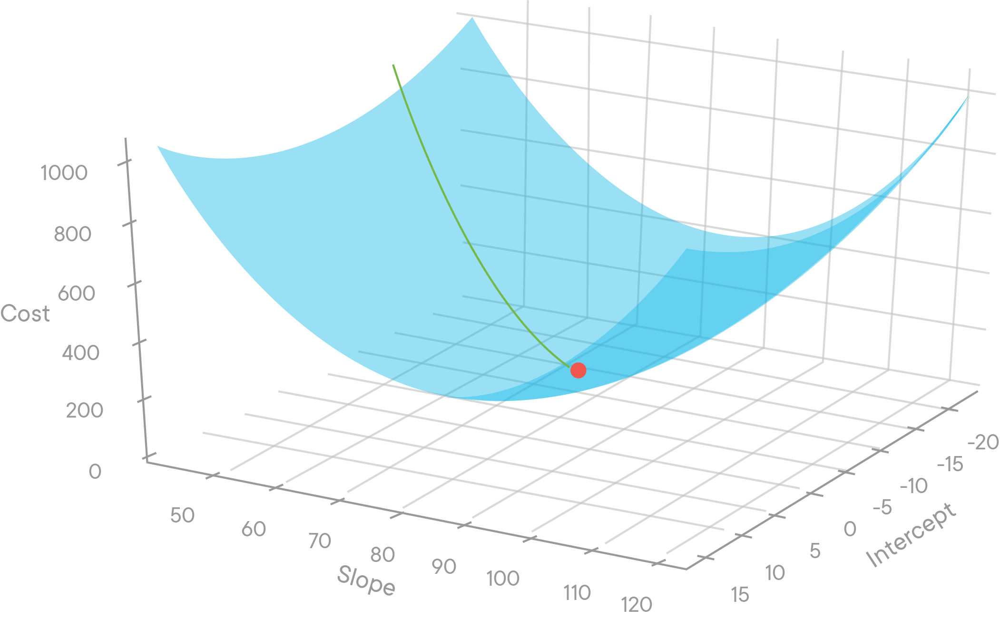

As we can see, exploring both variables (the slope and the y-intercept) requires plotting the second variable along the horizontal axis and turning our graph into a three-dimensional representation.  And in the future, we'll be able to change more than just that.

Furthermore, because we need to explore multiple variables in our regression lines, we are forced to rule out some approaches that are more computationally expensive, or simply not possible.

* We **cannot** simply use the derivative (more on that later) to find the minimum.  Using that approach will be impossible in many scenarios as our regression lines become more complicated.
* We **cannot** alter all of the variables of our regression line across all points and calculate the result.  It will take too much time, as we have more variables to alter.

However, we are on the right track by altering our regression line and calculating the resulting RSS values.

Remember in the last lesson, we evaluated our regression line by changing our slope by 1 to determine whether it produced a higher or lower RSS.

| m       | residual sum of squared           |
| ------------- |:-------------:|
|  44  | 1053.31|
|  45  |  870.75|
| 46  |  711.05|
|  47  |  574.3 |
|48  |  460.37|
|49  |  369.35|
|  50  | 301.17|
|  51  |  255.89|
|  52  |  233.49|
|  53  |  234  |
|  54  | 257.35|
| 55  | 303.64|
|  56  |  372.74|

Rather than arbitrarily changing our variables, as we have done by decrementing the slope value $m$ by 1 in the example above, we need to move carefully down the cost curve to be certain that our changes are reducing the RSS.

### Our approach

We don't want to adjust the slope value $m$ or another variable and hope that the RSS decreased.  Doing so is like trying to fly a plane just by sitting down and pressing buttons.

We want an approach that lets us be certain that we're moving in the right direction with every change.  Also, we want to know how much of a **change** to make to minimize RSS.

> Let's call each of these changes a **step**, and the size of the change our **step size**.

Our new task is to find step sizes that bring us to the best RSS quickly without overshooting the mark.


### The slope of the cost curve tells us our step size

Believe it or not, we can determine the proper step size just by looking at the slope of our cost function.

Imagine yourself standing on our cost curve like a skateboarder at the top of a halfpipe.  Even with your eyes closed, you could tell simply *by the way you tilted* whether to move forward or backward to approach the bottom of the cost curve.


* If the slope tilts downwards, then we should walk forward to approach the minimum.
* And if the slope tilts upwards, then we should point walk backwards to approach the minimum.
* The steeper the tilt, the further away we are from our cost curve's minimum, so we should take a larger step.

So by looking to the tilt of a cost curve at a given point, we can discover the direction of our next step and how large a step to take.  The beauty of this is that as our regression lines become more complicated, we need not plot all of the values of our regression line.  We can see the next variation of the regression line to study simply by looking at the slope of the cost curve.

To demonstrate this, let's look at our cost function. By adding the slopes at some of the points on the curve, we can get a sense of the direction and magnitude of change required to alter our linear regression slope $m$ in the next iteration.

```python
table_sm = np.zeros((401,2))
for idx, val in enumerate(np.linspace(40, 60, 401)):
    table_sm[idx,0] = val
    table_sm[idx,1] = residual_sum_squares(x, y, val, 1.319)
```
```python
def tan_line(start, stop, delta_a):
    x_dev = np.linspace(start, stop, 100)
    a = (start+stop)/2
    f_a= table_sm[(table_sm[:,0]==a),1]
    rounded_a_delta_a = round(a+delta_a,2)
    f_a_delta= table_sm[(table_sm[:,0]== (rounded_a_delta_a)),1]
    fprime = (f_a_delta-f_a)/delta_a
    tan = f_a+fprime*(x_dev-a)
    return fprime, x_dev, tan
```
```python
fprime_1, x_dev_1, y_dev_1 = tan_line(41, 43.5, 0.05)
fprime_2, x_dev_2,  y_dev_2 = tan_line(45, 48, 0.05)
fprime_3, x_dev_3,  y_dev_3 = tan_line(49, 52, 0.05)
```
```python
plt.figure(figsize=(10,7))
plt.plot(table[:,0], table[:,1], '-')
plt.plot(x_dev_1, y_dev_1, color = "red",  label = "slope =" + str(fprime_1))
plt.plot(x_dev_2, y_dev_2, color = "green",  label = "slope =" + str(fprime_2))
plt.plot(x_dev_3, y_dev_3, color = "orange", label = "slope =" + str(fprime_3))

plt.xlabel("m-values", fontsize=14)
plt.ylabel("RSS", fontsize=14)
plt.legend(loc='upper right', fontsize='large')

plt.title("RSS with changes to slope", fontsize=16);
```
### Stepping according to the slope

When you look at the above plot in detail you can see that we added numbers to our slope.  The slope of the curve at any given point is equal to the slope of the tangent line at that point.  By tangent line, we mean the line that just barely touches the curve at that point.  In the above graph, the red, green and orange lines are tangent to our cost curve at the points where $m$ equals 42.25, 46.5, and 50.5, respectively.  The slopes of our tangent lines, and therefore the slopes of the cost curves at those points, are labeled above.

Let's see how this works.

We use the following procedure to find the ideal $m$:
1.  Randomly choose a value of $m$, and
2.  Update $m$ with the formula $ m = (-.02) * slope_{m = i} + m_i$.

The formula above tells us which $m$ value to look at next. We start by choosing a random $m$ value that we can plug into our formula. We take the slope of the curve at that $m$ value and multiply it by $-.02$ then add it to our original $m$ value to produce our next $m$ value.

As we can surmise, the larger the slope, the larger the resulting step to the next $m$ value.

Here's an example.  We randomly choose a $m$ value of 42.  Then:

* $m_{t=0} = 42 $
* $m_{t=1} = (-.02) * -239  + 42 = 4.78 + 42 = 46.78 $
* $m_{t=2} = (-.02) * -129.4 + 46.8 = 2.588 + 46.8 = 49.388 $

* $m_{t=3} = (-.02) * -60.4 + 49.4 = 1.208 + 49.4 = 50.61  $

> Notice that we don't update our values of $m$ by just adding or subtracting the slope at that point.  The reason we multiply the slope by a fraction like .02 is so that we avoid the risk of overshooting the minimum.  This fraction is called the **learning rate**.  Here, the fraction is negative because we always want to move in the opposite direction of the slope. When the slope of the cost curve points downwards, we want to move to a higher $m$ slope for our linear regression problem. Conversely, when we are on the right side of the curve and the slope is rising, we want to move backwards to a lower y-intercept.

This technique is pretty magical.  By looking at the tangent line at each point, we no longer are  changing our $m$ value and just hoping that it has the correct impact on our RSS.  This is because, for one, the slope of the tangent line points us in the right direction.  And as you can see above, our technique properly adjusts the amount to change the $m$ value without even knowing the ideal $m$ value.  When our $m$ was far away from the ideal $m$ value, our formula increased $m$ by almost 5. By the third step, we were updating our $m$ value by only 1.2 because we were closer to the ideal slope for minimizing the RSS.

## Summary

We started this section by saying that we wanted a technique to find a $m$ value that would minimize our RSS, given a value of $b$.  We did not want to simply try all of the values of $m$ as doing so would be inefficient.  Instead, we went with the approach of gradient descent, where we try variations of regression lines iteratively changing our $m$ variable and assessing our RSS to see if we are making progress.

In this lesson, we focused in on how to know which direction to alter a given variable, $m$ or $b$, as well as a technique for determining the size of the change to apply to one of our variables.  We used the line tangent to our cost curve at a given point to indicate the direction and size of the update to $m$.  The further away, the steeper the curve and thus the larger the step we would want to take.  Appropriately, our tangent line slope would have us take a larger step.  And the closer we are to the ideal $b$ value, the flatter the tangent line to the curve, and the smaller a step we would take.


-----File-Boundary-----
# Gradient Descent in 3D

## Introduction

Previously, we talked about how to think about gradient descent when moving along a 3D cost curve.


We know that moving along the 3D cost curve above means changing the $m$ and $b$ variables of a regression line like the one below.  And we do so with the purpose of having our line better match our data. In this section, you'll learn about *partial derivatives* which will make you achieve this.

## Objectives

You will be able to:

* Define a partial derivative
* Interpret visual representations of gradient descent in more than two dimensions

## Review gradient descent in two dimensions

In this lesson, we'll learn about gradient descent in three dimensions, but let's first remember how it worked in two dimensions when we changed just one variable of our regression line.

In two dimensions, when changing just one variable, $m$ or $b$, gradient descent means stepping forwards or backwards along the cost curve and taking a specific step size.  To determine whether to move forwards or backwards as well as the step size, we imagine standing on this two-dimension curve (shown below) and feeling the slope of our cost curve to tell us how to move.  A step in a direction means a change in one of our regression variables.

```python
import numpy as np
import matplotlib.pyplot as plt
%matplotlib inline
np.random.seed(225)

def regression_formula(x):
    return 5 + 56*x

x = np.random.rand(30,1).reshape(30)
y_randterm = np.random.normal(0,3,30)
y = 3+ 50* x + y_randterm

plt.plot(x, y, '.b')
plt.plot(x, regression_formula(x), '-')
plt.xlabel("x", fontsize=14)
plt.ylabel("y", fontsize=14);
```
As we adjust to different slopes, we achieve different errors, represented by RSS.


So that is how gradient descent is represented in two dimensions. How is gradient descent represented in three dimensions?

## Gradient Descent in 3 dimensions

In three dimensions, we once again choose an initial regression line, which means that we are choosing a point on the graph below.  Then we begin taking steps towards the minimum.  But of course, we are now able to walk not just forwards and backwards but left and right as well -- as we now can alter two variables.

To get a sense of how this works, imagine our initial regression line places us at the back-left corner of the graph above, with a slope of 50, and y-intercept of negative 20.  Now imagine that we cannot see the rest of the graph - yet we still want to approach the minimum.  How do we do this?

Once again, we feel out the slope of the graph with our feet.  Only this time, as we shift our feet, we are preparing to walk in two-dimensional space.


So this is our approach.  We shift horizontally a little bit to determine the change in output in the right-left direction, and then we shift forward and back to determine the change in output in that direction.  From there we take the next step in the direction of the steepest descent.

So this is why our technique of gradient descent is so powerful.  Once we consider that in moving towards our best fit lines, we have a choice of moving anywhere in a two-dimensional space, then using the slope to guide us only becomes more important.

So how does this approach of shifting back and forth translate mathematically?  It means we determine the slope in one dimension, then the other. Then, we move where that slope is steepest downwards.  This moves us towards our minimum.

## Partial Derivatives

To measure the slope in each dimension, one after the other, we'll take the derivative with respect to one variable, and then take the derivative with respect to another variable.  Now let's be very explicit about what it means to take the partial derivative with respect to a variable.

Let's again talk about this procedure in general, and then we'll apply it to the cost curve.  So let's revisit our multivariable function:

$$f(x, y) = y*x^2 $$

Remember that the function looks like the following:


To take a derivative with respect to $x$ means to ask, how does the output change, as we make a nudge only in the $x$ direction. To express that we are nudging in the $x$ direction we say $\frac{\delta f}{\delta x}$.  That symbol is the lower case delta.  We read this as taking the derivative with respect to $x$.  But it just means seeing the change in output as we nudge in the $x$ direction.

And to express the change in output with respect to $y$, we say $\frac{\delta f}{\delta y}$.  And this just means calculating the change in output as we nudge our input over in the $y$ direction.

## Visualizing the partial derivative

So what does a derivative $\frac{\delta f}{\delta x}$ look like? How do we think of a partial derivative of a multivariable function?

Well, remember how we think of a standard derivative of a one variable function, for example $f(x) = x^2 $.


So in two dimensions, to take the derivative at a given point, we simply calculate the slope of the function at that x value.

Now the partial derivative of a multivariable function is fairly similar.  But here it's equal to the slope of the tangent line at a specific $x$ value **and** a specific $y$ value.  Let's break this down by using our patented "freeze-frame" method.  The graphs below show lines tangent to the curve in the $x$ direction.  (The tangent lines are a little small, but they and their corresponding slopes are there).

### Graphs for $\frac{df}{dx}$


Let's take a close look.  The top-left graph shows $\frac{\delta f}{\delta x}$ at different points of $f(x, y)$ where $y = -1$.  So as you can see, $\frac{\delta f}{\delta x}f(3, -1) = -6$ as shown in the cyan line in the top left.  That's because when you move to that point on the graph, $(3, -1)$ and then nudge a little bit in the $x$ direction, the change in output is $-6$.  And that is represented by the line tangent to the function at that point in the $x$ direction.  You can go through the other points in these graphs, and work through the same logic.

So with taking the partial derivative $\frac{\delta f}{\delta x}$, you may think about moving to the slice of the graph for a given value of $y$, then moving to the proper value of $x$, and then finding the tangent line at that point.

As you can see, $\frac{\delta f}{dx}$ means the change in output from a nudge in $x$ direction, but the derivative is still influenced by $y$ component of the function.  You can see this because, for different values of $y$, our slice of the graph looks different, and thus tangent lines for those slices look different.

## One more example

This can be a little mind-bending so let's go through this again for $\frac{df}{dy}f(x, y)$ where $f(x,y) = (yx^2) $.  Once again, the 3-d graph of $f(x,y) = yx^2$ is the following:


Now for $\frac{df}{dy}$ of a function $f(x, y) $ you can think sliding through different slices of the function but this time for different values of $x$.  So again, we have our freeze-frame, but this time each frame represents ascending values along the x-axis.

First, let's understand our plots below -- they may be surprising.  Starting at the top left quadrant the graph of the function $f(x,y)$ makes sense as when $x =-1$ then the function is just $f(y) = -1*y $.  And moving down to the bottom left, $f(2, y) = 2^2*y = 4y$.

So now, to think about taking the derivative, once again we move to a slice of graph for a value of $x$, and then move in the $y$ direction.  So $\frac{df}{dy}$ at $\frac{df}{dy}f(1, y)$ = 1.  And we know that the derivative of a line is always just equal to the line's slope.  For $f(1, y)$ that slope, and thus the derivative, is always $1$.  For $f(2, y)$ it's 4.

### Graphs for $\frac{df}{dy}$


So that is our technique for a partial derivative.  For $\frac{df}{dy} $ we move to a slice of the curve at a specific value of $x$, move to the point for y, and then calculate the change in output as we nudge in the $y$ direction.

For $\frac{df}{dx}$ (again below), we move to a slice of a curve of a specific value of $y$, move the correct value of $x$ and then calculate how much the output changes as we nudge in the $y$ direction.  Just think slide, slide then nudge.  That's a partial derivative.

### Graphs for $\frac{df}{dx}$


## Our rule for partial derivatives

Ok, so now that you understand the slide, slide, nudge, maybe you can understand this little shortcut that we can pull.  For any multivariable function, the variables that you are **not** taking the derivative with respect to can just be treated as a constant.

For example, with our function of $f(x, y) = y*x^2 $, when taking the partial derivative $\frac{df}{dy}f(x, y)$, we treat all values of $x$ as a constant.  Let's do it:


$$\frac{df}{dy}f(x,y) =  \frac{df}{dy}(y) * x^2 = 1*x^2 = x^2$$

So that's all it means to take a partial derivative of something: look at what you are taking a derivative with respect to, and only take the derivative of those types of variables.  And guess what, this result lines up to what we saw earlier.


We calculated that $\frac{df}{dy}f(x,y) = x^2 $, and that is what the graphs show.  When $x = 2$ our derivative is always 4.  And when $x$ is $3$ the derivative is always 9.  So even though we are taking $\frac{df}{dy}$, the $x$ value is influencing the steepness of that line.  But by the time we get to our nudge, that value of $x$ is **constant**, it's influenced has already been applied, and then we are seeing how the output changes as we nudge in the $y$ direction.

Now let's try our rule one more time, this time $\frac{df}{dx}f(x, y)$ for our function $f(x, y) = y*x^2 $.


$$\frac{df}{dx}f(x,y) = y*\frac{df}{dx}(x^2) = 2*y*x$$

So this time with $\frac{df}{dx}f(x,y) $, we treat $y$ as a constant, as the influence $y$ is first applied by moving to a slice of our graph for a value of $y$.  Then once there, we are evaluating the change in output as we nudge in the $x$ direction.


## Summary

In this section, we have learned how to think about taking the partial derivative of a function.  For the partial derivative, we say we are taking the derivative with respect to a variable.  So for example, we can say for the function $f(x, y)$, take the partial derivative with respect to the variable $x$.  This means we are assessing the output after nudging in the $x$ direction, and we can express this as $\frac{\delta f}{\delta x} $.  Our rule for taking the partial derivative is to treat the variables that we are not taking the derivative with respect to as constants.  Which makes sense, because at the time that we are taking the derivative by making our "nudge" the only variable that is changing is the variable we are taking the derivative with respect to.


-----File-Boundary-----
#  The Gradient in Gradient Descent

## Introduction

As you know, we entered our discussion of derivatives to determine the size and direction of a step with which to move along a cost curve.  We first used a derivative in a single variable function to see how the output of our cost curve changed with respect to change a change in one of our regression line's variables.  Then we learned about partial derivatives to see how a *three-dimensional cost curve* responded to a change in the regression line.

However, we have not yet explicitly showed how partial derivatives apply to gradient descent.

Well, that's what we hope to show in this lesson: explain how we can use partial derivatives to find the path to minimize our cost function, and thus find our "best fit" regression line.

## Objectives

You will be able to:

- Define a gradient in relation to gradient descent

## What is the gradient?

Now gradient descent literally means that we are taking the shortest path to *descend* towards our minimum.  However, it is somewhat easier to understand gradient *ascent* than descent, and the two are quite related, so that's where we'll begin.  Gradient ascent, as you could guess, simply means that we want to move in the direction of steepest ascent.

Now moving in the direction of greatest ascent for a function $f(x,y)$, means that our next step is a step some distance in the $x$ direction and some distance in the $y$ direction which is the steepest upward at that point.

Note how this is a different task from what we have previously worked on for multivariable functions.   So far, we have used partial derivatives to calculate the **gain** from moving directly in either the $x$ direction or the $y$ direction.

> Here, in finding gradient ascent, our task is not to calculate the gain from a move in either the $x$ or $y$ direction.  Instead, our task is to **find some combination of a change in $x$,$y$ that brings the largest change in output**.

So if you look at the path our climbers are taking in the picture above, *that* is the direction of gradient ascent.  If they tilt their path to the right or left, they will no longer be moving along the steepest upward path.

The direction of the greatest rate of increase of a function is called the gradient.  We denote the gradient with the nabla, which comes from the Greek word for harp, which is kind of what it looks like: $\nabla $.  So we can denote the gradient of a function, $f(x, y)$, with $\nabla f(x, y) $.

## Calculating the gradient

Now how do we find the direction for the greatest rate of increase?  We use partial derivatives.  Here's why.

As we know, the partial derivative $\frac{df}{dx}$ calculates the change in output from moving a little bit in the $x$ direction, and the partial derivative $\frac{df}{dy}$ calculates the change in output from moving in the $y$ direction.  Because with gradient ascent our goal is to make a nudge in $x, y$ that produces the greatest change in output, if $\frac{df}{dy} > \frac{df}{dx}$, we should make that move more in the $y$ direction than the $x$ direction, and vice versa.  That is, we want to get the biggest bang for our buck.


Let's relate this again to mountain climbers. Imagine the vertical edge on the left is our y-axis and the horizontal edge is on the bottom is our x-axis.  For the climber in the yellow jacket, imagine his step size is three feet. A step straight along the y-axis will move him further upwards than a step along the x-axis.  So in taking that step, he should direct himself more towards the y-axis than the x-axis.  That will produce a bigger increase per step size.

In fact, the direction of greatest ascent for a function,  $\nabla f(x, y)$, is the direction which is a proportion of $\frac{df}{dy}$ steps in the $y$ direction and $\frac{df}{dx}$ in the $x$ direction.  So, for example, if $\frac{df}{dy}$ = 5 and $\frac{df}{dx}$ = 1, the direction of gradient ascent is five times more in the $y$ direction than the $x$ direction.  And this seems to be the path, more or less that our climbers are taking - some combination of $x$ and $y$, but tilted more towards the $y$ direction.

## Applying Gradient Descent

Now that we have a better understanding of a gradient, let's apply our understanding to a multivariable function.  Here is a plot of a function:

$$f(x,y) = 2x + 3y $$


Imagine being at the bottom left of the graph at the point $x = 1$, $y = 1$.  What would be the direction of steepest ascent?  It seems, just sizing it up visually, that we should move both in the positive $y$ direction and the positive $x$ direction.  Looking more carefully, it seems we should move **more** in the $y$ direction than the $x$ direction.  Let's see what our technique of taking the partial derivative indicates.

The gradient of the function $f(x,y)$, that is $ \nabla f(x,y) = 2x + 3y $ is the following:

$\frac{df}{dx}(2x + 3y) = 2 $ and $\frac{df}{dy}(2x + 3y) = 3 $.

So what this tells us is to move in the direction of greatest ascent for the function $f(x,y) = 2x + 3y $, is to move up three and to the right two.  So we would expect our path of greatest ascent to look like the following.


So this path maps up well to what we see visually.  That is the idea behind gradient descent.  The gradient is the partial derivative with respect to each type of variable of a multivariable function, in this case $x$ and $y$.  And the importance of the gradient is that its direction is the direction of steepest ascent.  The negative gradient, that is the negative of each of the partial derivatives, is the direction of steepest descent.  So our direction of gradient descent for the graph above is $x = -2$, $y = -3$.  And looking at the two graphs above, it seems that the steepest downward direction is just the opposite of the steepest upward direction.  We get that by mathematically by simply taking the multiplying our partial derivatives by negative one.

## Summary

In this lesson, you saw how to use gradient descent to find the direction of steepest descent.  You saw that the direction of steepest descent is generally some combination of a change in your variables to produce the greatest negative rate of change.

You first how saw how to calculate the gradient **ascent**, or the gradient $\nabla $, by calculating the partial derivative of a function with respect to the variables of the function.  So $\nabla f(x, y) = \frac{\delta f}{\delta y}, \frac{\delta f}{\delta x} $.  This means that to take the path of greatest ascent, you should move $ \frac{\delta f}{\delta y} $ divided by $ \frac{\delta f}{\delta x} $.  So for example, when $ \frac{\delta f}{\delta y}f(x, y)  = 3 $ , and $ \frac{\delta f}{\delta x}f(x, y)  = 2$, you traveled in line with a slope of 3/2.

For gradient descent, that is to find the direction of greatest decrease, you simply reverse the direction of your partial derivatives and move in $ - \frac{\delta f}{\delta y}, - \frac{\delta f}{\delta x}$.


-----File-Boundary-----
# Gradient to Cost Function

## Introduction

In the previous lesson, we learned the mathematical definition of a gradient.  We saw that the gradient of a function was a combination of our partial derivatives with respect to each variable of that function.  We saw the direction of gradient descent was simply to move in the negative direction of the gradient.  For example, if the direction of ascent of a function is a move up and to the right, the descent is down and to the left. In this lesson, we will apply gradient descent to our cost function to see how we can move towards a best fit regression line by changing variables of $m$ and $b$.

## Objectives

You will be able to:

* Represent RSS as a multivariable function and take partial derivatives to perform gradient descent

## Representing RSS as a multivariable function

Think about why gradient descent applies so well to a cost function.  Initially, we said that the cost of our function, meaning the difference between what our regression line predicted and the dataset, changed as we altered the y-intercept or the slope of the function.

Remember that mathematically, when we say cost function, we use the residual sum of squares where
$$
\begin{align}
RSS &= \sum_{i=1}^n(actual - expected)^2 \\
&= \sum_{i=1}^n(y_i - \hat{y})^2 \\
&= \sum_{i=1}^n(y_i - (mx_i + b))^2
\end{align}
$$
for all $x$ and $y$ values of our dataset.  So in the graph directly below, $x_i$ and $y_i$  would be our points representing a movie's budget and revenue.  Meanwhile, $mx_i + b $ is our predicted $y$ value for a given $x$ value, of a budget.

And RSS takes the difference between $mx_i + b$, the $y_i$ value our regression line (the red line below) predicts, and our actual $y$, and sum up these squares for each piece of data in our dataset.  That is the residual sum of squares.

```python
import numpy as np
import matplotlib.pyplot as plt

def regression_formula(x):
    return 1.8 + 46*x

np.random.seed(225)

x = np.random.rand(30,1).reshape(30)
y_randterm = np.random.normal(0,3,30)
y = 3+ 50* x + y_randterm

plt.figure(figsize=(7,5))
plt.plot(x, y, '.b')
plt.plot(x, regression_formula(x), '-', color="red")
plt.xlabel("x", fontsize=14)
plt.ylabel("y", fontsize=14);
```
And we when we just plotted how RSS changes as we change one variable of our regression line, $m$ or $b$, we note how this looks like a curve, and call it our cost curve.

```python
def errors(x_values, y_values, m, b):
    y_line = (b + m*x_values)
    return (y_values - y_line)

def squared_errors(x_values, y_values, m, b):
    return np.round(errors(x_values, y_values, m, b)**2, 2)

def residual_sum_squares(x_values, y_values, m, b):
    return round(sum(squared_errors(x_values, y_values, m, b)), 2)

table = np.zeros((20,2))
for idx, val in enumerate(range(40, 60)):
    table[idx,0] = val
    table[idx,1] = residual_sum_squares(x, y, val, 1.319)

plt.figure(figsize=(10,7))
plt.plot(table[:,0], table[:,1], '-')
plt.xlabel("m-values", fontsize=14)
plt.ylabel("RSS", fontsize=14)
plt.title("RSS with changes to slope", fontsize=16);
```
In two dimensions, we decrease our RSS simply by moving forwards or backwards along the cost curve which is the equivalent of changing our variable, in this case y-intercept.  So the cost curve above indicates that changing the regression line from having a $m$ slope from 42 to 45 decreases our cost, the RSS.

Allowing us to change both variables, $m$ and $b$ means calculating how RSS varies with both $m$ and $b$.

Because the RSS is a function of how we change our values of $m$ and $b$, we can express this relationship mathematically by saying the cost function, $J$ is the following:
$$
\begin{align}
J(m, b) & = \sum_{i=1}^{n}(y_i - \hat{y})^2\\
J(m, b) & = \sum_{i=1}^{n}(y_i - (mx_i + b))^2 &&\text{notice $\hat{y} = mx + b$}\\
\end{align}
$$

In the function above, $J$ is a function of $m$ and $b$. $J$ just represents the residual sum of squares, which varies as the $m$ and $b$ variables of our regression line are changed.

Just our other multivariable functions we have seen thus far, we can display it in three dimensions, and it looks like the following.


The three-dimensional graph above shows how the cost associated with our regression line changes as the slope and y-intercept values are changed.

## Calculating the gradient of our cost function

Let's explore using gradient descent to determine how to change our regression line when we can alter both $m$ and $b$ variables.  When applied to a general multivariable function $f(x,y)$, gradient descent answered how much move the $x$ variable and the $y$ variable to produce the greatest decrease in output.

> Now that we are applying gradient descent to our cost curve $J(m, b)$, the technique should answer how much to move the $m$ variable and the $b$ variable to produce the greatest decrease in cost, or RSS. In other words, when altering our regression line, we want to know how much of this change should be derived from a move in the slope versus how much should be derived from a change in the y-intercept.

As we know, the gradient of a function is simply the partial derivatives with respect to each of the variables, so:

$$ \nabla J(m, b) = \frac{\delta J}{\delta m}, \frac{\delta J}{\delta b}$$

In calculating the partial derivatives of our function $J(m, b) = \sum_{i=1}^{n}(y_i - (mx_i + b))^2$, **we won't change the result if we ignore the summation until the very end**.  We'll do that to make our calculations easier.

Ok, so let's take our partial derivatives of the following:

$$
\begin{align}
\frac{\delta J}{\delta m}J(m, b) & = \boldsymbol{\frac{\delta J}{\delta m}}(y - (mx + b))^2  &&\text{partial derivative with respect to} \textbf{ m}\\
\\
\frac{\delta J}{\delta b}J(m, b) & = \boldsymbol{\frac{\delta J}{\delta b}}(y - (mx + b))^2  &&\text{partial derivative with respect to} \textbf{ b}\\
\end{align}
$$

You'll notice that taking the partial derivatives of these functions is not that simple. You've learned a set of rules about derivatives in this section, but if you want to take these two derivatives successfully, you'll need to use the **chain rule**. The chain rule is a formula to compute the derivative of a composite function.

The **chain rule** basically tells you how to compute the derivative of nearly _any function_ (or any "molecular" function built up from fundamental "atomic" functions like $sin(x)$ or $e^x$).

In this lesson, we don't want to get lost in the details of the chain rule and how to get to the the partial derivatives needed in this lesson, but in the appendix, you can find:
- a lesson on the chain rule in general
- A lesson that walks you through the details of finding the partial derivatives in this lesson.

The resulting partial derivatives are:

$$
\begin{align}
\frac{\delta J}{\delta m}J(m, b)&= -2x*(y - (mx + b ))
\end{align}
$$

$$
\begin{align}
\frac{\delta J}{\delta b}J(m, b) & = -2*(y - (mx + b))
\end{align}
$$

## Using both of our partial derivatives for gradient descent

Ok, so now we have our two partial derivatives for $\nabla J(m, b)$:

$$ \frac{dJ}{dm}J(m,b) = -2*x(y - (mx + b )) $$
$$ \frac{dJ}{db}J(m,b) = -2*(y - (mx + b)) $$

And as $mx + b$ = is just our regression line, we can simplify these formulas to be:

$$ \frac{dJ}{dm}J(m,b) = -2*x(y - \hat{y})  = -2x*\epsilon$$
$$ \frac{dJ}{db}J(m,b) = -2*(y - \hat{y}) = -2\epsilon$$

Remember, `error` = `actual` - `expected`, so we can replace $y - \hat{y}$ with $\epsilon$, our error. As we mentioned above, our last step is adding back the summations.  Since $-2$ is a constant, we can keep this outside of the summation.  Our value for $x$ changes depending upon what x value we are at, so it must be included inside the summation for the first equation.  Below, we have:

$$ \frac{dJ}{dm}J(m,b) = -2*\sum_{i=1}^n x(y_i - \hat{y}_i)  = -2*\sum_{i=1}^n x_i*\epsilon_i$$
$$ \frac{dJ}{db}J(m,b) = -2*\sum_{i=1}^n(y_i - \hat{y}_i) = -2*\sum_{i=1}^n \epsilon_i$$

So that is what what we'll do to find the "best fit regression line."  We'll start with an initial regression line with values of $m$ and $b$.  Then we'll go through our dataset, and we will use the above formulas with each point to tell us how to update our regression line such that it continues to minimize our cost function.

In the context of gradient descent, we use these partial derivatives to take a step size.  Remember that our step should be in the opposite direction of our partial derivatives as we are *descending* towards the minimum.  So to take a step towards gradient descent we use the general formula of:

`current_m` =  `old_m` $ - \frac{dJ}{dm}J(m,b)$

`current_b` =  `old_b` $ - \frac{dJ}{db}J(m,b) $

or in the code that we just calculated:

`current_m` = `old_m` $ -  (-2*\sum_{i=1}^n x_i*\epsilon_i )$

`current_b` =  `old_b` $ - ( -2*\sum_{i=1}^n \epsilon_i )$

In the next lesson, we'll work through translating this technique, with use of our $\nabla J(m, b)$, into code to descend along our cost curve and find the "best fit" regression line.

```python
import numpy as np
import matplotlib.pyplot as plt

def regression_formula(x):
    return 1.319 + 52*x

np.random.seed(225)

x = np.random.rand(30,1).reshape(30)
y_randterm = np.random.normal(0,3,30)
y = 3+ 50* x + y_randterm

plt.figure(figsize=(7,5))
plt.plot(x, y, '.b')
plt.plot(x, regression_formula(x), '-', color="red")
plt.xlabel("x", fontsize=14)
plt.ylabel("y", fontsize=14);
```
## Summary

In this section, we developed some intuition for why the gradient of a function is the direction of steepest ascent and the negative gradient of a function is the direction of steepest decent.  Essentially, the gradient uses the partial derivatives to see what change will result from changes in the function's dimensions, and then moves in that direction weighted more towards the partial derivative with the larger magnitude.

We also practiced calculating some gradients, and ultimately calculated the gradient for our cost function.  This gave us two formulas that tell us how to update our regression line so that it descends along our cost function and approaches a "best fit line".


-----File-Boundary-----
# Linear Algebra and Calculus - Recap


## Introduction

Congratulations! You have learned the fundamentals of the math at the core of machine learning: linear algebra and calculus.


## Key Takeaways

### Linear Algebra

The goal of this part was to provide both a conceptual and computational introduction to linear algebra. Some of the key takeaways include:

* Scalars, vectors, matrices, and tensors
  * A ***scalar*** is a single, real number
  * A ***vector*** is a one-dimensional array of numbers
  * A ***matrix*** is a 2-dimensional array of numbers
    * Two matrices can be added together if they have the same shape
    * Scalars can be added to matrices by adding the scalar (number) to each element
    * To calculate the dot product for matrix multiplication, the first matrix must have the same number of columns as the number of rows in the second matrix
  * A ***tensor*** is a generalized term for an n-dimensional rectangular grid of numbers. A vector is a one-dimensional (first-order tensor), a matrix is a two-dimensional (second-order tensor), etc.
  * One use case for vectors and matrices is for representing and solving systems of linear equations
* Linear algebra in Python
  * Operating on ***NumPy*** data types is substantially more computationally efficient than performing the same operations on native Python data types
  * It is possible to use linear algebra in NumPy to solve for a linear regression using the ***OLS*** method
  * OLS is not computationally efficient, so in practice, we usually perform a gradient descent instead to solve a linear regression

### Calculus and Gradient Descent

The goal of this part was to learn some of the foundational calculus that underpins the gradient descent algorithm. Some of the key takeaways include:

* Calculus
  * A ***derivative*** is the "instantaneous rate of change" of a function - or it can be thought of as the "slope of the curve" at a point in time
    * A derivative can also be thought of as a special case of the rate of change over a period of time - as that period of time is zero.
  * If you calculate the rate of change over a period of time and keep reducing the period of time, it usually tends to a limit - which is the value of that derivative
  * Rules can be used for finding derivatives
    * The ***power rule***, ***constant factor rule***, and ***addition rule*** are key tools for calculating derivatives for various kinds of functions
    * The ***chain rule*** can be a useful tool for calculating the derivate of composite functions
* Gradient descent
  * A derivative can be useful for identifying local ***maxima*** or ***minima*** as in both cases, the derivative tends to zero
  * A ***cost curve*** can be used to plot the values of a cost function (in the case of linear regression) for various values of offset and slope for the best fit line
  * ***Gradient descent*** can be used to move towards the local minimum on the cost curve and thus the ideal values for the y-intercept and slope to minimize the selected cost function when performing a linear regression


-----File-Boundary-----
