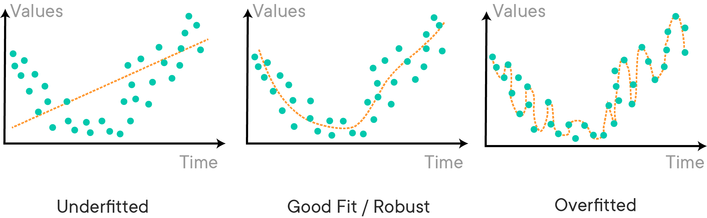
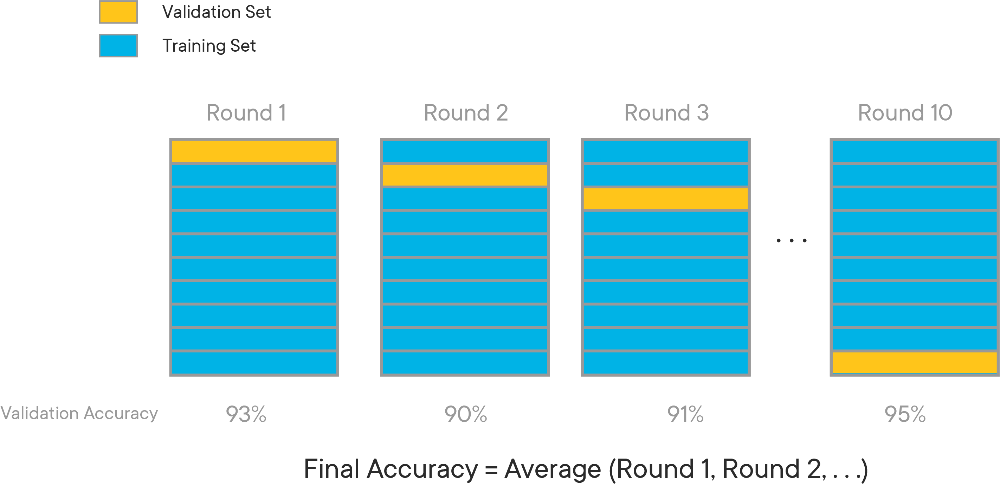
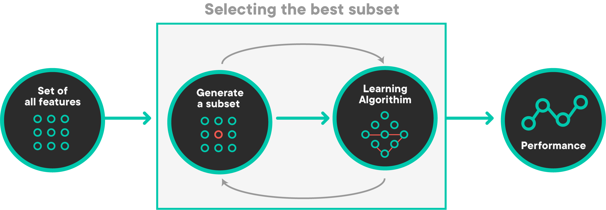
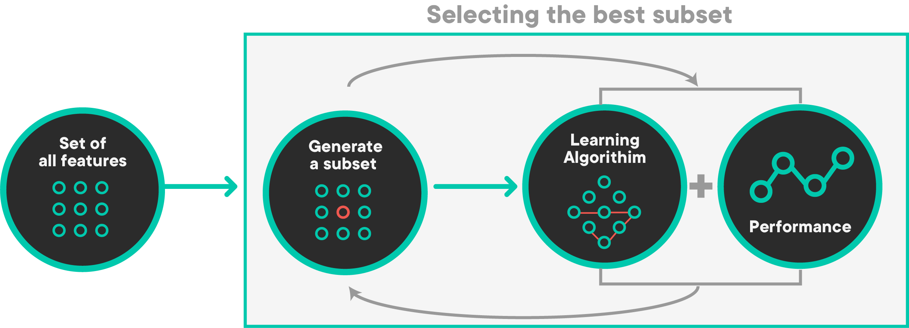

# Machine Learning Fundamentals - Introduction

## Introduction

Linear regression serves as the bridge between traditional statistics and machine learning in this curriculum. In this section you'll learn how to apply machine learning techniques using the familiar linear regression algorithm.

## Statistical Learning Theory

Statistical learning goes beyond the statistical modeling we have covered already. We will continue to build models that model the relationships between independent and dependent variables, but the emphasis will shift from ***inference*** to ***prediction***. In the predictive context we also need to consider model ***generalization*** and not just how well the model is fit to the training data.

### Model Validation

In order to assess how well a predictive model will generalize to unseen data, we need model ***validation*** techniques. These include a ***train-test split*** and ***cross-validation***.

### Bias-Variance Trade-Off

Predictive modeling often involves striking the right balance between ***bias*** and ***variance***, also referred to as the balance between ***underfitting*** and ***overfitting***. Especially as you learn models beyond linear regression, you'll be able to tune the model performance to strike the right balance.

## Regularization

***Regularization*** is a technique to help prevent overfitting in predictive modeling. We'll specifically discuss ***ridge*** and ***lasso*** regression, which are extensions to linear regression that include penalty terms to help prevent overfitting.

Lasso regression in particular does not have a closed form solution and therefore must be solved using an alternative approach such as gradient descent. It also can be helpful for feature selection purposes.

## Summary

Linear regression can be used for prediction as well as inference. This has implications for the modeling techniques required, because the emphasis is not solely on the fit to the training data. In this section we'll go over the theoretical concerns as well as the practical approaches to tackling them.


-----File-Boundary-----
# Data Science Processes

## Introduction

As discussed, this section is all about synthesizing your skills in order to work through a full Data Science workflow. In this lesson, you'll take a look at some general outlines for how Data Scientists organize their workflow and conceptualize their process.

## Objectives

You will be able to:

- List the different data science process frameworks
- Compare and contrast popular data science process frameworks such as CRISP-DM, KDD, OSEMN


## What is a Data Science Process?

Data Science projects are often complex, with many stakeholders, data sources, and goals. Due to this, the Data Science community has created several methodologies for helping organize and structure Data Science Projects.  In this lesson, you'll explore three of the most popular methodologies -- **_CRISP-DM_**, **_KDD_**, and **_OSEMN_**, and explore how you can make use of them to keep your projects well-structured and organized.

## CRoss-Industry Standard Process for Data Mining (CRISP-DM)


**_CRISP-DM_** is probably the most popular Data Science process in the Data Science world right now. Take a look at the visualization above to get a feel for CRISP-DM. Notice that CRISP-DM is an iterative process!

Let's take a look at the individual steps involved in CRISP-DM.

**_Business Understanding:_**  This stage is all about gathering facts and requirements. Who will be using the model you build? How will they be using it? How will this help the goals of the business or organization overall? Data Science projects are complex, with many moving parts and stakeholders. They're also time intensive to complete or modify. Because of this, it is very important that the Data Science team working on the project has a deep understanding of what the problem is, and how the solution will be used. Consider the fact that many stakeholders involved in the project may not have technical backgrounds, and may not even be from the same organization.  Stakeholders from one part of the organization may have wildly different expectations about the project than stakeholders from a different part of the organization -- for instance, the sales team may be under the impression that a recommendation system project is meant to increase sales by recommending upsells to current customers, while the marketing team may be under the impression that the project is meant to help generate new leads by personalizing product recommendations in a marketing email. These are two very different interpretations of a recommendation system project, and it's understandable that both departments would immediately assume that the primary goal of the project is one that helps their organization. As a Data Scientist, it's up to you to clarify the requirements and make sure that everyone involved understands what the project is and isn't.

During this stage, the goal is to get everyone on the same page and to provide clarity on the scope of the project for everyone involved, not just the Data Science team. Generate and answer as many contextual questions as you can about the project.

Good questions for this stage include:

- Who are the stakeholders in this project? Who will be directly affected by the creation of this project?
- What business problem(s) will this Data Science project solve for the organization?
- What problems are inside the scope of this project?
- What problems are outside the scope of this project?
- What data sources are available to us?
- What is the expected timeline for this project? Are there hard deadlines (e.g. "must be live before holiday season shopping") or is this an ongoing project?
- Do stakeholders from different parts of the company or organization all have the exact same understanding about what this project is and isn't?

**_Data Understanding:_**

Once we have a solid understanding of the business implications for this project, we move on to understanding our data. During this stage, we'll aim to get a solid understanding of the data needed to complete the project.  This step includes both understanding where our data is coming from, as well as the information contained within the data.

Consider the following questions when working through this stage:

- What data is available to us? Where does it live? Do we have the data, or can we scrape/buy/source the data from somewhere else?
- Who controls the data sources, and what steps are needed to get access to the data?
- What is our target?
- What predictors are available to us?
- What data types are the predictors we'll be working with?
- What is the distribution of our data?
- How many observations does our dataset contain? Do we have a lot of data? Only a little?
- Do we have enough data to build a model? Will we need to use resampling methods?
- How do we know the data is correct? How is the data collected? Is there a chance the data could be wrong?

**_Data Preparation:_**

Once we have a strong understanding of our data, we can move onto preparing the data for our modeling steps.

During this stage, we'll want to handle the following issues:

- Detecting and dealing with missing values
- Data type conversions (e.g. numeric data mistakenly encoded as strings)
- Checking for and removing multicollinearity (correlated predictors)
- Normalizing our numeric data
- Converting categorical data to numeric format through one-hot encoding

**_Modeling:_**

Once we have clean data, we can begin modeling! Remember, modeling, as with any of these other steps, is an iterative process. During this stage, we'll try to build and tune models to get the highest performance possible on our task.

Consider the following questions during the modeling step:

- Is this a classification task? A regression task? Something else?
- What models will we try?
- How do we deal with overfitting?
- Do we need to use regularization or not?
- What sort of validation strategy will we be using to check that our model works well on unseen data?
- What loss functions will we use?
- What threshold of performance do we consider as successful?

**_Evaluation:_**

During this step, we'll evaluate the results of our modeling efforts. Does our model solve the problems that we outlined all the way back during step 1? Why or why not? Often times, evaluating the results of our modeling step will raise new questions, or will cause us to consider changing our approach to the problem.  Notice from the CRISP-DM diagram above, that the "Evaluation" step is unique in that it points to both _Business Understanding_ and _Deployment_.  As we mentioned before, Data Science is an iterative process -- that means that given the new information our model has provided, we'll often want to start over with another iteration, armed with our newfound knowledge! Perhaps the results of our model showed us something important that we had originally failed to consider the goal of the project or the scope.  Perhaps we learned that the model can't be successful without more data, or different data. Perhaps our evaluation shows us that we should reconsider our approach to cleaning and structuring the data, or how we frame the project as a whole (e.g. realizing we should treat the problem as a classification rather than a regression task). In any of these cases, it is totally encouraged to revisit the earlier steps.

Of course, if the results are satisfactory, then we instead move onto deployment!

**_Deployment:_**

During this stage, we'll focus on moving our model into production and automating as much as possible. Everything before this serves as a proof-of-concept or an investigation.  If the project has proved successful, then you'll work with stakeholders to determine the best way to implement models and insights.  For example, you might set up an automated ETL (Extract-Transform-Load) pipelines of raw data in order to feed into a database and reformat it so that it is ready for modeling. During the deployment step, you'll actively work to determine the best course of action for getting the results of your project into the wild, and you'll often be involved with building everything needed to put the software into production.

This is one of the most rewarding steps of the entire Data Science process -- getting to see your work go live!

## Knowledge Discovery in Databases


**_Knowledge Discovery in Databases_**, or **_KDD_** is considered the oldest Data Science process. The creation of this process is credited to Gregory Piatetsky-Shapiro, who also runs the ever-popular Data Science blog, [kdnuggets](https://www.kdnuggets.com/). If you're interested, read the original white paper on KDD, which can be found [here](https://www.kdnuggets.com/gpspubs/aimag-kdd-overview-1992.pdf)!

The KDD process is quite similar to the CRISP-DM process. The diagram above illustrates every step of the KDD process, as well as the expected output at each stage.

**_Selection_**:

During this stage, you'll focus on selecting your problem, and the data that will help you answer it. This stage works much like the first stage of CRISP-DM -- you begin by focusing on developing an understanding of the domain the problem resides in (e.g. marketing, finance, increasing customer sales, etc), the previous work done in this domain, and the goals of the stakeholders involved with the process.

Once you've developed a strong understanding of the goals and the domain, you'll work to establish where your data is coming from, and which data will be useful to you.  Organizations and companies usually have a ton of data, and only some of it will be relevant to the problem you're trying to solve.  During this stage, you'll focus on examining the data sources available to you and gathering the data that you deem useful for the project.

The output of this stage is the dataset you'll be using for the Data Science project.

**_Preprocessing_**:

The preprocessing stage is pretty straightforward -- the goal of this stage is to "clean" the data by preprocessing it.  For text data, this may include things like tokenization.  You'll also identify and deal with issues like outliers and/or missing data in this stage.

In practice, this stage often blurs with the _Transformation_ stage.

The output of this stage is preprocessed data that is more "clean" than it was at the start of this stage -- although the dataset is not quite ready for modeling yet.

**_Transformation_**:

During this stage, you'll take your preprocessed data and transform it in a way that makes it more ideal for modeling.  This may include steps like feature engineering and dimensionality reduction.  At this stage, you'll also deal with things like checking for and removing multicollinearity from the dataset. Categorical data should also be converted to numeric format through one-hot encoding during this step.

The output of this stage is a dataset that is now ready for modeling. All null values and outliers are removed, categorical data has been converted to a format that a model can work with, and the dataset is generally ready for experimentation with modeling.

**_Data Mining_**:

The Data Mining stage refers to using different modeling techniques to try and build a model that solves the problem we're after -- often, this is a classification or regression task. During this stage, you'll also define your parameters for given models, as well as your overall criteria for measuring the performance of a model.

You may be wondering what Data Mining is, and how it relates to Data Science. In practice, it's just an older term that essentially means the same thing as Data Science. Dr. Piatetsky-Shapiro defines Data Mining as "the non-trivial extraction of implicit, previously unknown and potentially useful information from data."  Making of things such as Machine Learning algorithms to find insights in large datasets that aren't immediately obvious without these algorithms is at the heart of the concept of Data Mining, just as it is in Data Science. In a pragmatic sense, this is why the terms Data Mining and Data Science are typically used interchangeably, although the term Data Mining is considered an older term that isn't used as often nowadays.

The output of this stage results from a fit to the data for the problem we're trying to solve.

**_Interpretation/Evaluation_**:

During this final stage of KDD, we focus on interpreting the "patterns" discovered in the previous step to help us make generalizations or predictions that help us answer our original question. During this stage, you'll consolidate everything you've learned to present it to stakeholders for guiding future actions. Your output may be a presentation that you use to communicate to non-technical managers or executives (never discount the importance of knowing PowerPoint as a Data Scientist!).  Your conclusions for a project may range from "this approach didn't work" or "we need more data about {X}" to "this is ready for production, let's build it!".

## OSEMN


<a href="https://www.kdnuggets.com/2018/02/data-science-command-line-book-exploring-data.html" target="_blank">Adapted from: KDNuggets</a>

This brings us to the Data Science process we'll be using during this section -- OSEMN (sometimes referred as OSEMiN, and pronounced "OH-sum", rhymes with "possum"). This is the most straightforward of the Data Science processes discussed so far. Note that during this process, just like the others, the stages often blur together. It is completely acceptable (and often a best practice!) to float back and forth between stages as you learn new things about your problem, dataset, requirements, etc.  It's quite common to get to the modeling step and realize that you need to scrub your data a bit more or engineer a different feature and jump back to the "Scrub" stage, or go all the way back to the "Obtain" stage when you realize your current data isn't sufficient to solve this problem. As with any of these frameworks, OSEMN is meant to be treated more like a set of guidelines for structuring your project than set-in-stone steps that cannot be violated.

**_Obtain_**:

As with CRISP-DM and KDD, this step involves understanding stakeholder requirements, gathering information on the problem, and finally, sourcing data that we think will be necessary for solving this problem.

**_Scrub_**:

During this stage, we'll focus on preprocessing our data.  Important steps such as identifying and removing null values, dealing with outliers, normalizing data, and feature engineering/feature selection are handled around this stage.  The line with this stage really blurs with the _Explore_ stage, as it is common to only realize that certain columns require cleaning or preprocessing as a result of the visualizations and explorations done during Step 3.

Note that although technically, categorical data should be one-hot encoded during this step, in practice, it's usually done after data exploration.  This is because it is much less time-consuming to visualize and explore a few columns containing categorical data than it is to explore many different dummy columns that have been one-hot encoded.

**_Explore_**:

This step focuses on getting to know the dataset you're working with. As mentioned above, this step tends to blend with the _Scrub_ step mentioned above.  During this step, you'll create visualizations to really get a feel for your dataset.  You'll focus on things such as understanding the distribution of different columns, checking for multicollinearity, and other tasks like that.  If your project is a classification task, you may check the balance of the different classes in your dataset.  If your problem is a regression task, you may check that the dataset meets the assumptions necessary for a regression task.

At the end of this step, you should have a dataset ready for modeling that you've thoroughly explored and are extremely familiar with.

**_Model_**:

This step, as with the last two frameworks, is also pretty self-explanatory. It consists of building and tuning models using all the tools you have in your data science toolbox.  In practice, this often means defining a threshold for success, selecting machine learning algorithms to test on the project, and tuning the ones that show promise to try and increase your results.  As with the other stages, it is both common and accepted to realize something, jump back to a previous stage like _Scrub_ or _Explore_, and make some changes to see how it affects the model.

**_Interpret_**:

During this step, you'll interpret the results of your model(s), and communicate results to stakeholders.  As with the other frameworks, communication is incredibly important! During this stage, you may come to realize that further investigation is needed, or more data.  That's totally fine -- figure out what's needed, go get it, and start the process over! If your results are satisfactory to all stakeholders involved, you may also go from this stage right into putting your model into production and automating processes necessary to support it.


## A Note On Communicating Results

Regardless of the quality of your results, it's very important that you be aware of the business requirements and stakeholder expectations at all times! Generally, no matter which of the above processes you use, you'll communicate your results in a two-pronged manner:

- A short, high-level presentation covering your question, process, and results meant for non-technical audiences
- A detailed Jupyter Notebook demonstrating your entire process meant for technical audiences

In general, you can see why Data Scientists love Jupyter Notebooks! It is very easy to format results in a reproducible, easy-to-understand way.  Although a detailed Jupyter Notebook may seem like the more involved of the two deliverables listed above, the high-level presentation is often the hardest! Just remember -- even if the project took you/your team over a year and utilized the most cutting-edge machine learning techniques available, you still need to be able to communicate your results in about 5 slides (using graphics, not words, whenever possible!), in a 5 minute presentation in a way that someone that can't write code can still understand and be convinced by!


## Conclusion

In this lesson, you learned about the different data science process frameworks including CRISP-DM, KDD, and OSEMN. You also learned that the data science process is iterative and that a typical data science project involves many different stakeholders who may not have a technical background. As such, it's important to recognize that data scientists must be able to communicate their findings in a non-technical way.


-----File-Boundary-----
# Statistical Learning Theory

## Introduction

Before you get into building machine learning models, a basic understanding of statistical learning theory is essential.

## Objectives

You will be able to:

* Explain the difference between modeling for inference and prediction
* Explain generalization in the context of statistical modeling

## Statistical Learning Theory

Statistical learning theory is based on the idea of using data along with statistics to provide a framework for learning.

In statistical learning theory, the main idea is to construct a **model** to draw certain conclusions from data, and next, to use this model to make **predictions**.

This builds on statistical modeling, which represents the relationship between independent and dependent variables as a mathematical equation. For parametric statistical models such as linear regression, this means that the model learns **parameters** that will be used for future predictions.

## Inference vs. Prediction

There are two different modeling approaches to statistical modeling: modeling for ***inference*** and modeling for ***prediction***. A "perfect" model might be useful for both, but often your modeling strategy will need to be calibrated based on the goal of the model.

### Inference

When you are modeling for inference, you are asking the question:

> What is the relationship between `X` and `y`?

and sometimes, if you have good reason to infer a causal relationship:

> How does `X` affect `y`?

where `X` is your collection of independent variables (i.e. features) and `y` is your dependent variable (i.e. target). The focus is on _understanding_. Most of the history of statistics and all of the linear regression content so far has been focused on this approach.

When modeling for inference, it is important for the model to be **statistically significant** and **interpretable**, sometimes at the expense of overall model fit. Every feature used in the model should be carefully chosen based on underlying domain understanding.

### Prediction

When you are modeling for prediction, you are asking the question:

> How well can I use `X` to predict `y`?

`X` is still your collection of independent variables, and `y` is still your dependent variable. But you are less concerned about how and which features impact `y` as opposed to how you can efficiently use them to predict `y`.

When modeling for prediction, it is important for the model to ***generalize*** to unseen data. This means that the overall model fit is more important than the coefficients of features or statistical significance, and that you will often use all available features rather than carefully choosing them. Both in terms of the number of features and in terms of the type of model used, predictive models tend to be more ***complex*** than inferential models.

## Model Generalization

The model learns about the data during the ***training*** stage. Examples are presented to the model and the model tweaks its parameters to better understand the data.

Once the training is over, the model is unleashed upon new data and then uses what it has learned to make predictions with that data. This is where problems can emerge. If we over-train the model on the training data -- i.e. make the model memorize every detail of the data it is shown -- it will be able to identify all the relevant information in the training data, but will fail miserably when presented with the new data.

We then say that the **model is not capable of generalizing**, or that the **model is over-fitting the training data**.

Let's take a look at an example of the phenomenon: modeling happiness as a function of wealth.


In the top three diagrams, we have data and models (dashed curves). From left to right the models have been trained longer and longer on the training data. The training error curve in the bottom box shows that the training error gets better and better as we train longer (increasing model complexity).

You may think that if we train longer we'll get better! Well, yes, but **only better at describing the training data**. The top right box shows a very complex model that hits all the data points. This model does great on the training data, but when presented with new data (examine the prediction error curve in the bottom box) then it does worse! The gap between the training error and prediction error for new data (labeled "optimism") is growing as model complexity increases, which means that we are getting _worse_ at generalizing.

In order to create good predictive models in machine learning that are capable of generalizing, one needs to know when to stop training the model so that it doesn't over-fit.

### Model Validation

As the data which is available to us for modeling is finite, the available data needs to be used very effectively to build and **validate** a model. Model validation is a process of measuring overfitting and indicates the degree of generalizability.

Here is how we perform validation, in its simplest form:

* Split the data into two parts with a 70/30, 80/20, or a similar split
* Use the larger part for **training** so the model learns from it
* Use the smaller part for ***testing*** the model

This setup looks like as shown below:


This is called a ***train-test split*** and means that you can compare the model performance on training data vs. testing data using a given **metric**. The metric can be R-Squared or it can be an error-based metric like RMSE.

If the metric is much better on the training data than the test data, this indicates overfitting. A model that generalizes well will have similar metrics on the two datasets.

Another approach to validation is ***cross-validation***. This involves splitting the data multiple times and training multiple models, to get more of a distribution of possible metrics rather than relying on metrics from a single train-test split.

## Additional Resources

- [Youtube: Introduction to Statistical Learning Theory](https://www.youtube.com/watch?v=rqJ8SrnmWu0)

- [An Overview of Statistical Learning Theory with examples](https://www.princeton.edu/~kulkarni/Papers/Journals/j077_2011_KulHar_WileyTutorial.pdf)

## Summary

In this lesson, you briefly looked at statistical learning theory and its main components. When modeling for inference rather than prediction, some additional conceptual considerations become important. In particular, predictive models should generalize to unseen data. Model validation is used to measure how well a model will generalize.


-----File-Boundary-----
# Regression Model Validation

## Introduction

Previously you've evaluated a multiple linear regression model by calculating metrics based on the fit of the training data. In this lesson you'll learn why it's important to split your data in a train and a test set if you want to evaluate a model used for prediction.

## Objectives

You will be able to:

* Perform a train-test split
* Prepare training and testing data for modeling
* Compare training and testing errors to determine if model is over or underfitting

## Model Evaluation

Recall some ways that we can evaluate linear regression models.

### Residuals

It is pretty straightforward that, to evaluate the model, you'll want to compare your predicted values, $\hat y$ with the actual value, $y$. The difference between the two values is referred to as the **residuals**:

$r_{i} = y_{i} - \hat y_{i}$

To get a summarized measure over all the instances, a popular metric is the (Root) Mean Squared Error:

RMSE = $\sqrt{\frac{1}{n}\sum_{i=1}^{n}(y_{i} - \hat y_{i})^2}$

MSE = $\frac{1}{n}\sum_{i=1}^{n}(y_{i} - \hat y_{i})^2$

Larger (R)MSE indicates a _worse_ model fit.

## The Need for Train-Test Split

### Making Predictions and Evaluation

So far we've simply been fitting models to data, and evaluated our models calculating the errors between our $\hat y$ and our actual targets $y$, while these targets $y$ contributed in fitting the model.

Let's say we want to predict the outcome for observations that are not necessarily in our dataset now; e.g: we want to **predict** miles per gallon for a new car that isn't part of our dataset, or predict the price for a new house in Ames.

In order to get a good sense of how well your model will be doing on new instances, you'll have to perform a so-called "train-test-split". What you'll be doing here, is taking a sample of the data that serves as input to "train" our model - fit a linear regression and compute the parameter estimates for our variables, and calculate how well our predictive performance is doing comparing the actual targets $y$ and the fitted $\hat y$ obtained by our model.

### Underfitting and Overfitting

Another reason to use train-test-split is because of a common problem which doesn't only affect linear models, but nearly all (other) machine learning algorithms: overfitting and underfitting. An overfit model is not generalizable and will not hold to future cases. An underfit model does not make full use of the information available and produces weaker predictions than is feasible. The following image gives a nice, more general demonstration:



## Mechanics of Train-Test Split

When performing a train-test-split, it is important that the data is **randomly** split. At some point, you will encounter datasets that have certain characteristics that are only present in certain segments of the data. For example, if you were looking at sales data for a website, you might expect the data to look different on days that promotional deals were held versus days that deals were not held. If we don't randomly split the data, there is a chance we might overfit to the characteristics of certain segments of data.

Another thing to consider is just **how big** each training and testing set should be. There is no hard and fast rule for deciding the correct size, but the range of training set is usually anywhere from 66% - 80% (and testing set between 33% and 20%). Some types of machine learning models need a substantial amount of data to train on, and as such, the training sets should be larger. Some models with many different tuning parameters will need to be validated with larger sets (the test size should be larger) to determine what the optimal parameters should be. When in doubt, just stick with training set sizes around 70% and test set sizes around 30%.

## Train-Test Split with Scikit-Learn

You could write your own pandas code to shuffle and split your data, but we'll use the convenient `train_test_split` function from scikit-learn instead. We'll also use the Auto MPG dataset.

```python
import pandas as pd

data = pd.read_csv('auto-mpg.csv')
data
```
The `train_test_split` function ([documentation here](https://scikit-learn.org/stable/modules/generated/sklearn.model_selection.train_test_split.html)) takes in a series of array-like variables, as well as some optional arguments. It returns multiple arrays.

For example, this would be a valid way to use `train_test_split`:

```python
from sklearn.model_selection import train_test_split

train, test = train_test_split(data)
```
```python
train
```
```python
test
```
In this case, the DataFrame `data` was split into two DataFrames called `train` and `test`. `train` has 294 values (75% of the full dataset) and `test` has 98 values (25% of the full dataset). Note the randomized order of the index values on the left.

However you can also pass multiple array-like variables into `train_test_split` at once. For each variable that you pass in, you will get a train and a test copy back out.

Most commonly in this curriculum these are the inputs and outputs:

Inputs

- `X`
- `y`

Outputs

- `X_train`
- `X_test`
- `y_train`
- `y_test`

```python
y = data[['mpg']]
X = data.drop(['mpg', 'car name'], axis=1)

X_train, X_test, y_train, y_test = train_test_split(X, y)
```
```python
X_train
```
```python
y_train
```
We can view the lengths of the results like this:

```python
print(len(X_train), len(X_test), len(y_train), len(y_test))
```
However it is not recommended to pass in just the data to be split. This is because the randomization of the split means that you will get different results for `X_train` etc. every time you run the code. **For reproducibility, it is always recommended that you specify a `random_state`**, such as in this example:

```python
X_train, X_test, y_train, y_test = train_test_split(X, y, random_state=42)
```
Another optional argument is `test_size`, which makes it possible to choose the size of the test set and the training set instead of using the default 75% train/25% test proportions.

```python
X_train, X_test, y_train, y_test = train_test_split(X, y, test_size=0.2, random_state=42)
```
Note that the lengths of the resulting datasets will be different:

```python
print(len(X_train), len(X_test), len(y_train), len(y_test))
```
## Preparing Data for Modeling

When using a train-test split, data preparation should happen _after_ the split. This is to avoid ***data leakage***. The general idea is that the treatment of the test data should be as similar as possible to how genuinely unknown data should be treated. And genuinely unknown data would not have been there at the time of fitting the scikit-learn transformers, just like it would not have been there at the time of fitting the model!

In some cases you will see all of the data being prepared together for expediency, but the best practice is to prepare it separately.

### Log Transformation

```python
from sklearn.preprocessing import FunctionTransformer
import numpy as np

# Instantiate a custom transformer for log transformation
log_transformer = FunctionTransformer(np.log, validate=True)

# Columns to be log transformed
log_columns = ['displacement', 'horsepower', 'weight']

# New names for columns after transformation
new_log_columns = ['log_disp', 'log_hp', 'log_wt']

# Log transform the training columns and convert them into a DataFrame
X_train_log = pd.DataFrame(log_transformer.fit_transform(X_train[log_columns]),
                           columns=new_log_columns, index=X_train.index)

# Replace training columns with transformed versions
X_train = pd.concat([X_train.drop(log_columns, axis=1), X_train_log], axis=1)
X_train
```
```python
# Log transform the test columns and convert them into a DataFrame
X_test_log = pd.DataFrame(log_transformer.transform(X_test[log_columns]),
                          columns=new_log_columns, index=X_test.index)

# Replace testing columns with transformed versions
X_test = pd.concat([X_test.drop(log_columns, axis=1), X_test_log], axis=1)
X_test
```
### One-Hot Encoding

```python
from sklearn.preprocessing import OneHotEncoder

# Instantiate OneHotEncoder
ohe = OneHotEncoder(handle_unknown='ignore', sparse=False)

# Categorical columns
cat_columns = ['cylinders', 'model year', 'origin']

# Fit encoder on training set
ohe.fit(X_train[cat_columns])

# Get new column names
new_cat_columns = ohe.get_feature_names(input_features=cat_columns)

# Transform training set
X_train_ohe = pd.DataFrame(ohe.fit_transform(X_train[cat_columns]),
                           columns=new_cat_columns, index=X_train.index)

# Replace training columns with transformed versions
X_train = pd.concat([X_train.drop(cat_columns, axis=1), X_train_ohe], axis=1)
X_train
```
```python
# Transform testing set
X_test_ohe = pd.DataFrame(ohe.transform(X_test[cat_columns]),
                           columns=new_cat_columns, index=X_test.index)

# Replace testing columns with transformed versions
X_test = pd.concat([X_test.drop(cat_columns, axis=1), X_test_ohe], axis=1)
X_test
```
## Building, Evaluating, and Validating a Model

Great, now that you have preprocessed all the columns, you can fit a linear regression model:

```python
from sklearn.linear_model import LinearRegression
linreg = LinearRegression()
linreg.fit(X_train, y_train)

y_hat_train = linreg.predict(X_train)
y_hat_test = linreg.predict(X_test)
```
Look at the residuals and calculate the MSE for training and test sets:

```python
train_residuals = y_hat_train - y_train
test_residuals = y_hat_test - y_test
```
```python
mse_train = float(np.sum((y_train - y_hat_train)**2)/len(y_train))
mse_test = float(np.sum((y_test - y_hat_test)**2)/len(y_test))
print('Train Mean Squared Error:', mse_train)
print('Test Mean Squared Error:', mse_test)
```
You can also do this directly using sklearn's `mean_squared_error()` function:

```python
from sklearn.metrics import mean_squared_error

train_mse = mean_squared_error(y_train, y_hat_train)
test_mse = mean_squared_error(y_test, y_hat_test)
print('Train Mean Squared Error:', train_mse)
print('Test Mean Squared Error:', test_mse)
```
Great, there does not seem to be a big difference between the train and test MSE! Interestingly, the test set error is smaller than the training set error. This is fairly rare but does occasionally happen.

In other words, our validation process has indicated that we are **not** overfitting. In fact, we may be _underfitting_ because linear regression is not a very complex model.

## Overfitting with a Different Model

Just for the sake of example, here is a model that is overfit to the data. Don't worry about the model algorithm being shown! Instead, just look at the MSE for the train vs. test set, using the same preprocessed data:

```python
from sklearn.tree import DecisionTreeRegressor

other_model = DecisionTreeRegressor(random_state=42)
other_model.fit(X_train, y_train)

other_train_mse = mean_squared_error(y_train, other_model.predict(X_train))
other_test_mse = mean_squared_error(y_test, other_model.predict(X_test))
print('Train Mean Squared Error:', other_train_mse)
print('Test Mean Squared Error:', other_test_mse)
```
This model initially seems great...0 MSE for the training data! But then you see that it is performing much worse than our linear regression model on the test data. This model **is** overfitting.

## Additional Resources

[This blog post](https://towardsdatascience.com/linear-regression-in-python-9a1f5f000606) shows a walkthrough of the key steps for model validation with train-test split and scikit-learn.

## Summary

In this lesson, you learned the importance of the train-test split approach and used one of the most popular metrics for evaluating regression models, (R)MSE. You also saw how to use the `train_test_split` function from `sklearn` to split your data into training and test sets, and then evaluated whether models were overfitting using metrics on those training and test sets.


-----File-Boundary-----
# Introduction to Cross-Validation

## Introduction

Cross-validation is another model validation strategy, which addresses one of the limitations of the train-test split strategy.

## Objectives

You will be able to:

* Describe the process of cross-validation
* Perform cross-validation on a model
* Compare and contrast model validation strategies

## Limitations of Train-Test Split

Recall that a train-test split means shuffling the data and randomly selecting a subset to be the _test_ set. The test set is a stand-in for the genuinely unknown data that the model would encounter in the real world, and helps to give a realistic picture of model performance and to identify issues like overfitting.

The problem with this, as you may have already noticed, is that the metrics produced by a train-test split are **highly dependent on the particular split** that happened to be created. You might end up with an overly optimistic or overly pessimistic impression of model performance just because of which records ended up in the train vs. test sets.

For example, the code below creates two different splits of the Auto MPG dataset, each with the same ratio of train to test, but using different random seeds.

```python
import matplotlib.pyplot as plt
import pandas as pd

from sklearn.linear_model import LinearRegression
from sklearn.metrics import mean_squared_error
from sklearn.model_selection import train_test_split

# Set up data and model
data = pd.read_csv('auto-mpg.csv')
y = data['mpg']
X = data[['acceleration', 'horsepower', 'displacement', 'weight']]
linreg = LinearRegression()

# Split using random_state 87
X_train_1, X_test_1, y_train_1, y_test_1 = train_test_split(X, y, random_state=87, test_size=0.33)
linreg.fit(X_train_1, y_train_1)
train_mse_1 = mean_squared_error(y_train_1, linreg.predict(X_train_1))
test_mse_1 = mean_squared_error(y_test_1, linreg.predict(X_test_1))

# Split using random_state 41
X_train_2, X_test_2, y_train_2, y_test_2 = train_test_split(X, y, random_state=41, test_size=0.33)
linreg.fit(X_train_2, y_train_2)
train_mse_2 = mean_squared_error(y_train_2, linreg.predict(X_train_2))
test_mse_2 = mean_squared_error(y_test_2, linreg.predict(X_test_2))

# Plot metrics
fig, (left, right) = plt.subplots(ncols=2, figsize=(10,5), sharey=True)
labels = ["Train", "Test"]
colors = ["#00B3E6", "#FFC51B"]
left.bar(labels, [train_mse_1, test_mse_1], color=colors)
left.set_title("Split 1")
left.set_ylabel("MSE")
right.bar(labels, [train_mse_2, test_mse_2], color=colors)
right.set_title("Split 2");
```
Both of the models shown above are using the same `X` and `y` and the same ratio of train to test, but one seems to indicate that the train score is much better than the test score, and the other seems to indicate that the test score is much better than the train score.

Which one is the "real" result? And how do you know, if you only perform a single split, whether it's going to resemble the model on the left or the model on the right?

Unfortunately with a standard train-test split process, it's impossible to know. Essentially you are collecting a single point statistic and you might be "unlucky" in how the numbers happen to fall.

## K-Fold Cross-Validation

K-fold cross validation expands on the idea of training and test splits by splitting the entire dataset into `K` equal sections of data. We'll then iteratively train `K` linear regression models on the data, with each model using a different section of data as the test set, and all other sections combined as the training set.

We can then average the individual results from each of these linear models to get a cross-validation MSE. This will be closer to the model's "actual" MSE, since results that are higher than average will cancel out the results that are lower than average.

The diagram below gives an example of what cross-validation with `K = 10` might look like:



### Cross-Validation in Scikit-Learn

There are multiple ways to perform cross-validation with scikit-learn. You can read more extensive documentation [here](https://scikit-learn.org/stable/modules/cross_validation.html).

#### `cross_val_score`

If you are mainly just interested in the score on the validation (test) data, there is a function called `cross_val_score` ([documentation here](https://scikit-learn.org/stable/modules/generated/sklearn.model_selection.cross_val_score.html)). This takes in the model and the data, and returns the validation score for each split:

```python
from sklearn.model_selection import cross_val_score

cross_val_score(linreg, X, y)
```
By default there will be 5 splits and the score returned will be the result of the `.score()` method for the model. In the case shown here it's a `LinearRegression` ([documentation here](https://scikit-learn.org/stable/modules/generated/sklearn.linear_model.LinearRegression.html)) which means it returns the coefficient of determination ($R^2$).

If we wanted 10 splits rather than 5, we could use the `cv` argument:

```python
cross_val_score(linreg, X, y, cv=10)
```
And if we wanted to use MSE instead of R-Squared, we could use the `scoring` argument:

```python
cross_val_score(linreg, X, y, scoring="neg_mean_squared_error")
```
Why are the scores negative? Because conventionally in scikit-learn you want a larger score to be better. So for an error-based metric like MSE, the built-in scoring option uses _negative_ MSE.

If you want to use a custom metric you can use `make_scorer`. Here it is demonstrated with `mean_squared_error` (imported previously from scikit-learn) but you could also write your own function:

```python
from sklearn.metrics import make_scorer

cross_val_score(linreg, X, y, scoring=make_scorer(mean_squared_error))
```
#### `cross_validate`

If you want more information from the scoring process and not just the validation scores for a single metric, there is another function from scikit-learn called `cross_validate` ([documentation here](https://scikit-learn.org/stable/modules/generated/sklearn.model_selection.cross_validate.html)).

`cross_validate` can be used to get the same information as `cross_val_score`:

```python
from sklearn.model_selection import cross_validate

cross_validate(linreg, X, y)["test_score"]
```
But it also automatically provides information about timing:

```python
cross_validate(linreg, X, y)
```
Just like with `cross_val_score` you can use the `cv` argument to change the number of splits:

```python
cross_validate(linreg, X, y, cv=10)
```
If you want scores for multiple different metrics at once (e.g. R-Squared and negative MSE), that would look like this:

```python
cross_validate(linreg, X, y, scoring=["r2", "neg_mean_squared_error"])
```
And if you want to compare the train vs. test scores (e.g. to look for overfitting), that would look like this:

```python
cross_validate(linreg, X, y, return_train_score=True)
```
### Reporting Cross-Validation Scores

Often your stakeholders will want a single metric or visualization that represents model performance, not a list of scores like cross-validation produces.

One straightforward way to achieve this is to take the average:

```python
cross_val_results = cross_validate(linreg, X, y, scoring="neg_mean_squared_error", return_train_score=True)
# Negative signs in front to convert back to MSE from -MSE
train_avg = -cross_val_results["train_score"].mean()
test_avg = -cross_val_results["test_score"].mean()

fig, ax = plt.subplots()
ax.bar(labels, [train_avg, test_avg], color=colors)
ax.set_ylabel("MSE")
fig.suptitle("Average Cross-Validation Scores");
```
Another way, if you have enough folds to make it worthwhile, is to show the distribution of the train vs. test scores using a histogram or a box plot.

```python
cross_val_results = cross_validate(linreg, X, y, cv=100, scoring="neg_mean_squared_error", return_train_score=True)
train_scores = -cross_val_results["train_score"]
test_scores = -cross_val_results["test_score"]

fig, (left, right) = plt.subplots(ncols=2, figsize=(10,5), sharey=True)
bins=25
left.hist(train_scores, label=labels[0], bins=bins, color=colors[0])
left.set_ylabel("Count")
left.set_xlabel("MSE")
right.hist(test_scores, label=labels[1], bins=bins, color=colors[1])
right.set_xlabel("MSE")
fig.suptitle("Cross-Validation Score Distribution")
fig.legend();
```
## Comparing and Contrasting Train-Test Split and Cross-Validation

As noted previously, cross-validation is a more sophisticated approach than train-test split because it produces multiple metric estimates rather than a single estimate. You can start to get a sense of the _variance_ in the metrics from cross-validation in a way that you can't from a train-test split. So cross-validation is generally seen as a more **reliable** validation strategy than train-test split.

On the other hand, there are some downsides to cross-validation, particularly in scikit-learn.

First, cross-validation **does not shuffle** the data before splitting it into folds. This might mean that there are some aspects of the splits that are not representative of what true training data vs. unseen data would look like. This behavior can be modified by writing custom cross-validation code that builds on top of scikit-learn classes like `KFold` ([documentation here](https://scikit-learn.org/stable/modules/generated/sklearn.model_selection.KFold.html)).

Second, cross-validation is **more computationally expensive**, because it is fitting many models rather than fitting a single model and scoring it on multiple datasets. For linear regression this tends not to be a significant issue, but for more complex models (e.g. neural networks) we conventionally don't use cross-validation because it would take so much time and computational resources.

Finally, the scikit-learn implementation of cross-validation makes it more prone to **data leakage**. Because the `cross_val_score` or `cross_validate` functions take in the whole dataset _and_ the model (vs. `train_test_split` which just splits the data), you typically have to preprocess the data all together before passing it in. This can lead to overly optimistic results compared to unseen data that must be processed separately. The solution to this is using a more-advanced modeling technique called a `Pipeline` ([documentation here](https://scikit-learn.org/stable/modules/generated/sklearn.pipeline.Pipeline.html)) that combines all of the preprocessing and modeling into a single estimator that can be passed in to the cross-validation function.

Note that there is also not a strict choice between a train-test split and cross-validation. You might consider combining the approaches, e.g. performing a train-test split and then using cross-validation on just the training set. There are also additional variations on these validation techniques you might want to consider, such as [repeated](https://scikit-learn.org/stable/modules/generated/sklearn.model_selection.RepeatedKFold.html), [grouped](https://scikit-learn.org/stable/modules/generated/sklearn.model_selection.GroupKFold.html), and [leave one out](https://scikit-learn.org/stable/modules/generated/sklearn.model_selection.LeaveOneOut.html) validation.

## Summary

Well done! In this lesson you learned about the concept of cross-validation and how cross-validation can overcome the limitations of train-test split. You also saw how to use cross-validation with scikit-learn. In the next lesson, you will utilize cross-validation on the Ames Housing data.


-----File-Boundary-----
# Bias-Variance Tradeoff

## Introduction

You've seen how you can extend your linear models by including interaction effects as well as polynomial terms. Including these in models comes at a price though: not only do the models become more complex (with more parameter estimates), adding more terms can potentially harm model performance when making predictions. This tradeoff between performance on the training data and performance making predictions is called the bias-variance tradeoff. You'll learn about that in this lesson.

## Objectives

You will be able to:

- Describe the bias-variance tradeoff in machine learning
- Discuss how bias and variance are related to over and underfitting
- List the three components of error

## Using Models for Prediction

You have learned earlier how to use regression models to make predictions. This is without any doubt one of the main reasons why regression models are used.

When building models for predicting, we have previously seen the need for model **validation**, which tells us how well the model is likely to perform on unseen data (not just the data used for training the model). The main two validation approaches are a train-test split and cross-validation. We'll use a train-test split for these examples, with a modified version of the `Yield` dataset.

```python
import numpy as np
import pandas as pd
import matplotlib.pyplot as plt
%matplotlib inline
from sklearn.linear_model import LinearRegression
from sklearn.model_selection import train_test_split
from sklearn.preprocessing import PolynomialFeatures
from sklearn.metrics import mean_squared_error

yld = pd.read_csv('yield2.csv', sep='\s+', index_col=0)

y = yld['Yield']
X = yld[['Temp']]

fig, ax = plt.subplots()
ax.scatter(X, y, color='green')
ax.set_xlabel('Temperature')
ax.set_ylabel('Yield')
fig.suptitle('Full Dataset');
```
Let's split this dataset in a training set, containing 70% of the observations, and a test set, containing 30% of the observations.

```python
X_train, X_test, y_train, y_test = train_test_split(X, y, test_size=0.30, random_state=34567)
```
```python
fig, axes = plt.subplots(ncols=2, figsize=(13,4), sharey=True)

axes[0].scatter(X_train, y_train, color='green')
axes[0].set_xlabel('Temperature')
axes[0].set_ylabel('Yield')
axes[0].set_title('Train')

axes[1].scatter(X_test, y_test, color='green')
axes[1].set_xlabel('Temperature')
axes[1].set_title('Test')

fig.suptitle('Train-Test Split');
```
There seems to be a downward trend first, then upwards. Despite this, let's go ahead and start by fitting a simple linear regression:

```python
reg = LinearRegression().fit(X_train, y_train)
```
When plotting a simple linear regression model there are no unexpected results: the line is a bad fit, both for training and test set.

```python
fig, axes = plt.subplots(ncols=2, figsize=(13,4), sharey=True)
X_linspace = pd.DataFrame(np.linspace(50, 145, 50), columns=['Temp'])

axes[0].scatter(X_train, y_train, color='green', label="data points")
axes[0].plot(X_linspace, reg.predict(X_linspace), label="best fit line")
axes[0].set_xlabel('Temperature')
axes[0].set_ylabel('Yield')
axes[0].set_title('Train')

axes[1].scatter(X_test, y_test, color='green')
axes[1].plot(X_linspace, reg.predict(X_linspace))
axes[1].set_xlabel('Temperature')
axes[1].set_title('Test')

fig.legend()
fig.suptitle('Simple Linear Regression');
```
When including polynomials, however, the result changes. We included a polynomial of 6 here. The result seems to be very accurate for the training set, but the picture is definitely different for the test set on the right-hand side. Where the fit seemed to be good for the training set, the test set fit is not nearly as good. The problem is that our model did *not generalize well* to cases outside the training set.

```python
# 6th degree polynomial
poly = PolynomialFeatures(6)
reg_poly = LinearRegression().fit(poly.fit_transform(X_train), y_train)
```
```python
fig, axes = plt.subplots(ncols=2, figsize=(13,4), sharey=True)

axes[0].scatter(X_train, y_train, color='green', label="data points")
axes[0].plot(X_linspace, reg_poly.predict(poly.transform(X_linspace)), label="best fit line")
axes[0].set_xlabel('Temperature')
axes[0].set_ylabel('Yield')
axes[0].set_title('Train')

axes[1].scatter(X_test, y_test, color='green')
axes[1].plot(X_linspace, reg_poly.predict(poly.transform(X_linspace)))
axes[1].set_xlabel('Temperature')
axes[1].set_title('Test')

fig.legend()
fig.suptitle('6th Degree Polynomial');
```
Let's have a look at the train vs. test mean squared error for the two models:

```python
print(f"""
Simple Linear Regression
Train MSE: {mean_squared_error(y_train, reg.predict(X_train))}
Test MSE:  {mean_squared_error(y_test, reg.predict(X_test))}

6th Degree Polynomial
Train MSE: {mean_squared_error(y_train, reg_poly.predict(poly.transform(X_train)))}
Test MSE:  {mean_squared_error(y_test, reg_poly.predict(poly.transform(X_test)))}
""")
```
These numbers align with the plots above. The simple linear regression has poor MSE scores for both the train and test data. The 6th degree polynomial regression has a better train MSE than simple linear regression, and a worse test MSE.

## Underfitting and Overfitting

Let's formalize this:

> *Underfitting* happens when a model cannot learn the training data, nor can it generalize to new data.

The **simple linear regression** model fitted earlier was an **underfitted** model.

> *Overfitting* happens when a model learns the training data too well. In fact, so well that it is not generalizeable to new data

The **6-degree polynomial** was **overfitted**.

Now, let's have a look at the same plots but with second degree polynomial.

```python
# 2nd degree polynomial
poly_2 = PolynomialFeatures(2)
reg_poly_2 = LinearRegression().fit(poly_2.fit_transform(X_train), y_train)
```
```python
fig, axes = plt.subplots(ncols=2, figsize=(13,4), sharey=True)

axes[0].scatter(X_train, y_train, color='green', label="data points")
axes[0].plot(X_linspace, reg_poly_2.predict(poly_2.transform(X_linspace)), label="best fit line")
axes[0].set_xlabel('Temperature')
axes[0].set_ylabel('Yield')
axes[0].set_title('Train')

axes[1].scatter(X_test, y_test, color='green')
axes[1].plot(X_linspace, reg_poly_2.predict(poly_2.transform(X_linspace)))
axes[1].set_xlabel('Temperature')
axes[1].set_title('Test')

fig.legend()
fig.suptitle('2nd Degree Polynomial');
```
That looks like a more reasonable model. Let's look at the MSE scores:

```python
print(f"""
Simple Linear Regression
Train MSE: {mean_squared_error(y_train, reg.predict(X_train))}
Test MSE:  {mean_squared_error(y_test, reg.predict(X_test))}

6th Degree Polynomial
Train MSE: {mean_squared_error(y_train, reg_poly.predict(poly.transform(X_train)))}
Test MSE:  {mean_squared_error(y_test, reg_poly.predict(poly.transform(X_test)))}

2nd Degree Polynomial
Train MSE: {mean_squared_error(y_train, reg_poly_2.predict(poly_2.transform(X_train)))}
Test MSE:  {mean_squared_error(y_test, reg_poly_2.predict(poly_2.transform(X_test)))}
""")
```
The fit for the training set became worse with the 2nd degree polynomial compared to the 6th degree polynomial, but we can clearly see how the test set performance improved by looking at the mean squared error. Also, it seems like the results for training and test set are comparable, which is what you would want in general.

Based on this analysis, it appears that a 2nd degree polynomial achieves the correct degree of balance between underfitting (like the simple linear regression) and overfitting (like the 6th degree polynomial).

## Bias-Variance Tradeoff

Another perspective on this problem of overfitting versus underfitting is the bias-variance tradeoff. The idea is that we can decompose the mean squared error as the sum of:

- *bias*
- *variance*, and
- *irreducible error*

Formally, this is written as:
$ MSE = Bias(\hat{f}(x))^2 + Var(\hat{f}(x)) + \sigma^2$. The derivation of this result can be found on the Wikipedia page of the bias-variance trade-off, [here](https://en.wikipedia.org/wiki/Bias%E2%80%93variance_tradeoff#Derivation).

### Bias

While you have probably heard of "machine learning bias" in a colloquial sense, e.g. [racial discrimination in facial recognition technologies](https://sitn.hms.harvard.edu/flash/2020/racial-discrimination-in-face-recognition-technology/), this is using a different definition of "bias". Bias in this context means a poor model fit. For example, the simple linear regression applied to the `Yield` dataset has high bias, because the model assumes a linear relationship when it appears that the actual relationship is polynomial.

This kind of bias can arise from model assumptions being violated, or simply using the wrong type of model for the underlying relationship.

**High bias** leads to **underfitting**.

### Variance

Variance is also a term used elsewhere in statistics, but in this context it means that the model's performance varies too much based on small fluctuations in the training set. A model with high variance is usually trying to fit based on the irreducible error, which is actually just random noise and is not helpful in making predictions on unseen data.

**High variance** leads to **overfitting**.

### Irreducible Error

Most of the time there will be some amount of error that is impossible to remove, regardless of whether the model is perfectly specified based on the available features. Often this is because there is some missing feature, or simply because there is random variation in the variables that is not related to the underlying relationship.

If error is larger than 0, this may because of irreducible error, not because of underfitting or overfitting.


The balance between bias and variance is a tradeoff. We can reduce the variance but then there is a risk of running a bigger bias, and vice versa. **Bias** is usually associated with **low model complexity**, **variance** with **high model complexity**. There is generally a "sweet spot" in-between, compromising between bias and variance.

## Additional resources

https://towardsdatascience.com/understanding-the-bias-variance-tradeoff-165e6942b229

## Summary

Great, now you know what bias-variance tradeoff is, what underfitting and overfitting are, and how all of these relate, let's dive in for some practice!


-----File-Boundary-----
# Ridge and Lasso Regression

## Introduction

At this point, you've seen a number of criteria and algorithms for fitting regression models to data. You've seen the simple linear regression using ordinary least squares, and its more general regression of polynomial functions. You've also seen how we can overfit models to data using polynomials and interactions. With all of that, you began to explore other tools to analyze this general problem of overfitting versus underfitting, all this using training and test splits, bias and variance, and cross validation.

Now you're going to take a look at another way to tune the models you create. These methods all modify the mean squared error function that you are optimizing against. The modifications will add a penalty for large coefficient weights in the resulting model.

## Objectives

You will be able to:

- Define lasso regression
- Define ridge regression
- Describe why standardization is necessary before ridge and lasso regression
- Compare and contrast lasso, ridge, and non-regularized regression
- Use lasso and ridge regression with scikit-learn

## Linear Regression Cost Function

From an earlier lesson, you know that when solving for a linear regression, you can express the cost function as

$$ \text{cost_function}= \sum_{i=1}^n(y_i - \hat{y})^2 = \sum_{i=1}^n(y_i - (mx_i + b))^2$$

This is the expression for simple linear regression (for 1 predictor $x$). If you have multiple predictors, you would have something that looks like:

$$ \text{cost_function}= \sum_{i=1}^n(y_i - \hat{y})^2 = \sum_{i=1}^n(y_i - \sum_{j=1}^k(m_jx_{ij} ) -b )^2$$

where $k$ is the number of predictors.

## Penalized Estimation

You've seen that **when the number of predictors increases, your model complexity increases, with a higher chance of overfitting as a result**. We've previously seen fairly ad-hoc variable selection methods (such as forward/backward selection), to simply select a few variables from a longer list of variables as predictors.

Now, instead of completely "deleting" certain predictors from a model (which is equal to setting coefficients equal to zero), wouldn't it be interesting to just reduce the values of the coefficients to make them less sensitive to noise in the data? ***Penalized estimation*** operates in a way where parameter shrinkage effects are used to make some or all of the coefficients smaller in magnitude (closer to zero). Some of the penalties have the property of performing both variable selection (setting some coefficients exactly equal to zero) and shrinking the other coefficients.

- They reduce model complexity
- They may prevent overfitting
- Some of them may perform variable selection at the same time (when coefficients are set to 0)
- They can be used to counter multicollinearity

Penalized estimation is a commonly used ***regularization*** technique. **Regularization is a general term used when one tries to battle overfitting.**

Two commonly-used models that use penalized estimation are ***ridge regression*** and ***lasso regression***. While linear regression has been in use since the 1800s, ridge regression was proposed in 1970 ([journal article here](https://web.archive.org/web/20180413003503id_/http://math.arizona.edu:80/~hzhang/math574m/Read/Ridge.pdf)) and lasso regression in 1996 ([journal article here](https://biostat.app.vumc.org/wiki/pub/Main/MSJournalClub/lasso.pdf)).

## Ridge Regression

In ridge regression, the cost function is changed by adding a penalty term to the square of the magnitude of the coefficients.

$$ \text{cost_function_ridge}= \sum_{i=1}^n(y_i - \hat{y})^2 = \sum_{i=1}^n(y_i - \sum_{j=1}^k(m_jx_{ij})-b)^2 + \lambda \sum_{j=1}^p m_j^2$$

If you have two predictors the full equation would look like this (notice that there is a penalty term $\lambda m^2$ for each predictor in the model - in this case, two) :

$$ \text{cost_function_ridge}= \sum_{i=1}^n(y_i - \hat{y})^2 = $$

$$ \sum_{i=1}^n(y_i - ((m_1x_{1i})-b)^2 + \lambda m_1^2 + (m_2x_{2i})-b)^2 + \lambda m_2^2)$$

Remember that you want to minimize your cost function, so by adding the penalty term $\lambda$, ridge regression puts a constraint on the coefficients $m$. This means that large coefficients penalize the optimization function. That's why **ridge regression leads to a shrinkage of the coefficients** and helps to reduce model complexity and multicollinearity.

$\lambda$ is a ***hyperparameter***, which means you have to specify the value for lambda when creating the model. (This differs from a regular model parameter, which is determined by the fitting algorithm.) For a small lambda, the outcome of your ridge regression will resemble a linear regression model. For large lambda, penalization will increase and more parameters will shrink.

Ridge regression is often also referred to as **L2 norm regularization**. This is the same L2 norm from linear algebra used in the concepts of variance, MSE, and Euclidean distance.

## Lasso regression

Lasso regression is very similar to ridge regression, except that the magnitude of the coefficients are not squared in the penalty term. So, while ridge regression keeps the sum of the squared regression coefficients (except for the intercept) bounded, the lasso method bounds the sum of the absolute values.

The resulting cost function looks like this:

$$ \text{cost_function_lasso}= \sum_{i=1}^n(y_i - \hat{y})^2 = \sum_{i=1}^n(y_i - \sum_{j=1}^k(m_jx_{ij})-b)^2 + \lambda \sum_{j=1}^p \vert m_j \vert$$

If you have two predictors the full equation would look like this (notice that there is a penalty term $\lambda \vert m \vert$ for each predictor in the model - in this case, two):

$$ \text{cost_function_lasso}= \sum_{i=1}^n(y_i - \hat{y})^2 = $$

$$\sum_{i=1}^n(y_i - ((m_1x_{1i})-b)^2 + \lambda \vert m_1 \vert) + ((m_2x_{2i})-b)^2 + \lambda \vert m_2 \vert) $$

The name "lasso" comes from "Least Absolute Shrinkage and Selection Operator".

While it may look similar to the definition of the ridge estimator, the effect of the absolute values is that some coefficients might be set exactly equal to zero, while other coefficients are shrunk towards zero. Hence the lasso method is attractive because it performs estimation *and* selection simultaneously. This is especially valuable for variable selection when the number of predictors is very high.

Lasso regression is often also referred to as **L1 norm regularization**. This is the same L1 norm from linear algebra used in the concepts of absolute deviation, MAE, and Manhattan distance.

### Standardization Before Regularization

An important step before using either lasso or ridge regularization is to **first standardize your data such that it is all on the same scale**.

Regularization is based on the concept of penalizing larger coefficients, so if you have features that are on different scales, some will get unfairly penalized.

Below, you can see that we are using a `MinMaxScaler` to standardize our data to the same scale.

## Examples Using Our `auto-mpg` Data

### Regularized Linear Regression vs. Linear Regression

Let's transform our continuous predictors in `auto-mpg` and see how they perform as predictors in a ridge versus lasso regression.

We import the dataset, separate the target and predictors, and then split the data into training and test sets:

```python
import pandas as pd
from sklearn.linear_model import Lasso, Ridge, LinearRegression
from sklearn.metrics import mean_squared_error
from sklearn.model_selection import train_test_split
from sklearn.preprocessing import MinMaxScaler, PolynomialFeatures

data = pd.read_csv('auto-mpg.csv')

y = data[['mpg']]
X = data.drop(['mpg', 'car name', 'origin'], axis=1)

# Perform test train split
X_train , X_test, y_train, y_test = train_test_split(X, y, test_size=0.3, random_state=12)
```
After splitting the data into training and test sets, we use the `MixMaxScaler()` to fit and transform `X_train` and transform `X_test`.

> NOTE: You want to **fit and transform** only the **training** data because in a real-world setting, you only have access to this data. You can then use the same scalar object to **transform** the **test** data. If you first transform the data and then split into training and test sets this leads to **data leakage**.

```python
scale = MinMaxScaler()
X_train_transformed = scale.fit_transform(X_train)
X_test_transformed = scale.transform(X_test)
```
We will now fit the ridge, lasso, and linear regression models to the transformed training data. Notice that the ridge and lasso models have the parameter `alpha`, which is scikit-learn's version of $\lambda$ in the regularization cost functions.

```python
# Build a ridge, lasso and regular linear regression model
# Note that in scikit-learn, the regularization parameter is denoted by alpha (and not lambda)
ridge = Ridge(alpha=0.5)
ridge.fit(X_train_transformed, y_train)

lasso = Lasso(alpha=0.5)
lasso.fit(X_train_transformed, y_train)

lin = LinearRegression()
lin.fit(X_train_transformed, y_train)
```
Next, let's generate predictions for both the training and test sets:

```python
# Generate preditions for training and test sets
y_h_ridge_train = ridge.predict(X_train_transformed)
y_h_ridge_test = ridge.predict(X_test_transformed)

y_h_lasso_train = lasso.predict(X_train_transformed)
y_h_lasso_test = lasso.predict(X_test_transformed)

y_h_lin_train = lin.predict(X_train_transformed)
y_h_lin_test = lin.predict(X_test_transformed)
```
Look at the MSE for training and test sets for each of the three models:

```python
print('Train Error Ridge Model', mean_squared_error(y_train, y_h_ridge_train))
print('Test Error Ridge Model', mean_squared_error(y_test, y_h_ridge_test))
print('\n')

print('Train Error Lasso Model', mean_squared_error(y_train, y_h_lasso_train))
print('Test Error Lasso Model', mean_squared_error(y_test, y_h_lasso_test))
print('\n')

print('Train Error Unpenalized Linear Model', mean_squared_error(y_train, y_h_lin_train))
print('Test Error Unpenalized Linear Model', mean_squared_error(y_test, y_h_lin_test))
```
We note that ridge is clearly better than lasso here, but that the unpenalized model performs best here. This makes sense because a linear regression model with these features is probably not overfitting, so adding regularization just contributes to underfitting.

Let's see how including ridge and lasso changed our parameter estimates.

```python
print('Ridge parameter coefficients:', ridge.coef_)
print('Lasso parameter coefficients:', lasso.coef_)
print('Linear model parameter coefficients:', lin.coef_)
```
Did you notice that lasso shrank a few parameters to 0? The ridge regression mostly affected the fourth parameter (estimated to be -19.26 for the linear regression model).

### Regularized Polynomial Regression vs. Polynomial Regression

Now let's compare this to a model built using `PolynomialFeatures`, which has more complexity than an ordinary multiple regression.

```python
# Prepare data
poly = PolynomialFeatures(degree=6)
X_train_poly = poly.fit_transform(X_train)
X_test_poly = poly.transform(X_test)

X_train_transformed = scale.fit_transform(X_train_poly)
X_test_transformed = scale.transform(X_test_poly)

# Fit models
ridge.fit(X_train_transformed, y_train)
lasso.fit(X_train_transformed, y_train)
lin.fit(X_train_transformed, y_train)

# Generate predictions
y_h_ridge_train = ridge.predict(X_train_transformed)
y_h_ridge_test = ridge.predict(X_test_transformed)
y_h_lasso_train = lasso.predict(X_train_transformed)
y_h_lasso_test = lasso.predict(X_test_transformed)
y_h_lin_train = lin.predict(X_train_transformed)
y_h_lin_test = lin.predict(X_test_transformed)

# Display results
print('Train Error Polynomial Ridge Model', mean_squared_error(y_train, y_h_ridge_train))
print('Test Error Polynomial Ridge Model', mean_squared_error(y_test, y_h_ridge_test))
print('\n')
print('Train Error Polynomial Lasso Model', mean_squared_error(y_train, y_h_lasso_train))
print('Test Error Polynomial Lasso Model', mean_squared_error(y_test, y_h_lasso_test))
print('\n')
print('Train Error Unpenalized Polynomial Model', mean_squared_error(y_train, y_h_lin_train))
print('Test Error Unpenalized Polynomial Model', mean_squared_error(y_test, y_h_lin_test))
print('\n')
print('Polynomial Ridge Parameter Coefficients:', len(ridge.coef_[ridge.coef_ != 0]),
      'non-zero coefficient(s) and', len(ridge.coef_[ridge.coef_ == 0]), 'zeroed-out coefficient(s)')
print('Polynomial Lasso Parameter Coefficients:',  len(lasso.coef_[lasso.coef_ != 0]),
      'non-zero coefficient(s) and', len(lasso.coef_[lasso.coef_ == 0]), 'zeroed-out coefficient(s)')
print('Polynomial Model Parameter Coefficients:',  len(lin.coef_[lin.coef_ != 0]),
      'non-zero coefficient(s) and', len(lin.coef_[lin.coef_ == 0]), 'zeroed-out coefficient(s)')
```
In this case, the unpenalized model was overfitting. Therefore when ridge and lasso regression were applied, this reduced overfitting and made the overall model fit better. Note that the best model we have seen so far is the polynomial + ridge model, which seems to have the best balance of bias and variance.

If we were to continue tweaking our models, we might want to reduce the `alpha` ($\lambda$) for the lasso model, because it seems to be underfitting compared to the ridge model. Reducing `alpha` would reduce the strength of the regularization, allowing for more non-zero coefficients.

## Additional Reading

Full code examples for ridge and lasso regression, advantages and disadvantages, and how to code ridge and lasso in Python can be found [here](https://www.analyticsvidhya.com/blog/2016/01/complete-tutorial-ridge-lasso-regression-python/).

Make sure to have a look at the scikit-learn documentation for [`Ridge`](https://scikit-learn.org/stable/modules/generated/sklearn.linear_model.Ridge.html) and [`Lasso`](https://scikit-learn.org/stable/modules/generated/sklearn.linear_model.Lasso.html).

## Summary

Great! You now know how to perform lasso and ridge regression. Let's move on to the lab so you can use these!


-----File-Boundary-----
# Feature Selection Methods

## Introduction

In this lesson, you'll learn about the different techniques you can use to only use features that are most relevant to your model.

### Objectives

You will be able to:

- Use feature selection to obtain the optimal subset of features in a dataset
- Identify when it is appropriate to use certain methods of feature selection

## Feature Selection

Feature selection is the process by which you **select a subset of features** relevant for model construction. Feature selection comes with several benefits, the most obvious being the improvement in performance of a machine learning algorithm. Other benefits include:

* Decrease in computational complexity: As the number of features is reduced in a model, the easier it will be to compute the parameters of your model. It will also mean a decrease in the amount of data storage required to maintain the features of your model
* Understanding your data: In the process of feature selection, you will potentially gain more understanding of how features relate to one another

Now, let's look at the different types of feature selection approaches and their advantages/disadvantages.

### Types of Feature Selection

Like many things in data science, there is no clear and easy answer for deciding which features to include in a model. There are, however, different strategies you can use to process features in an efficient way:

* Domain knowledge
* Filter methods
* Wrapper methods
* Embedded methods

#### Domain Knowledge

One of the most important aspects when determining important features is the knowledge of the specific domain related to your dataset. This might mean reading past research papers that have explored similar topics or asking key stakeholders to determine what they believe the most important factors are for predicting the target variable.

#### Filter Methods

Filter methods are feature selection methods carried out as a preprocessing step before even running a model. Filter methods work by observing characteristics of how variables are related to one another. Depending on the model that is being used, different metrics are used to determine which features will get eliminated and which will remain. Typically, filter methods will return a "feature ranking" that will tell you how features are ordered in relation to one another. They will remove the variables that are considered redundant. It's up to the data scientist to determine the cut-off point at which they will keep the top $n$ features, and this $n$ is usually determined through cross-validation.


In the linear regression context, a common filter method is to eliminate features that are highly **correlated** with one another.

Another method is to use a ***variance threshold***. This sets some threshold of required variance among features in order to include them in a model. The thought process behind this is that if variables do not have a high variance, they will not change much and will therefore not have much impact on our dependent variable.

#### Wrapper Methods

Wrapper methods determine the optimal subset of features using different combinations of features to train models and then calculating performance. Every subset is used to train models and then evaluated on a test set. As you might imagine, wrapper methods can end up being very computationally intensive, however, they are highly effective in determining the optimal subset. Because wrapper methods are so time-consuming, it becomes challenging to use them with large feature sets.



An example of a wrapper method in linear regression is ***recursive feature elimination***, which starts with all features included in a model and removes them one by one. After the model has had a feature removed, whichever subset of features resulted in the least significant deterioration of the model fit will indicate which omitted feature is the least useful for prediction.

The opposite of this process is ***forward selection***, which undergoes the same process in reverse. It begins with a single feature and continues to add the one feature at a time that improves model performance the most.

#### Embedded Methods

Embedded methods are feature selection methods that are included within the actual formulation of your machine learning algorithm. The most common kind of embedded method is regularization, in particular lasso regression, because it has the capability of reducing your set of features automatically.



## Feature Selection in Action

Now, we're going to review the process behind performing feature selection with a dataset pertaining to diabetes. The dataset contains the independent variables age, sex, body mass index, blood pressure, and 6 different blood serum measurements. The target variable represents a quantitative measurement progression of diabetes from one year after a baseline observation. With feature selection, our goal is to find a model that is able to maintain high accuracy while not overfitting to noise.

### Preprocess the Data

To begin with, we are going to load the necessary libraries and functions, load the data, and create a dummy variable for the variable `'SEX'`. The target variable is in the column `'Y'`.

```python
# Importing necessary libraries
import matplotlib.pyplot as plt
import numpy as np
import pandas as pd
from sklearn.feature_selection import (VarianceThreshold, SelectKBest, f_regression, mutual_info_regression,
    RFE, RFECV)
from sklearn.linear_model import LinearRegression, LassoCV
from sklearn.metrics import mean_squared_error
from sklearn.model_selection import train_test_split
from sklearn.preprocessing import OneHotEncoder, StandardScaler, PolynomialFeatures

# Load the data
df = pd.read_csv('diabetes.tab.txt', sep='\t')
df.head()
```
```python
# Obtain the target and features from the DataFrame
target = df['Y']
features = df.drop(columns='Y')
```
```python
# Split the data
X_train, X_test, y_train, y_test = train_test_split(features, target, random_state=20, test_size=0.2)
```
```python
# Create dummy variable for sex
ohe = OneHotEncoder(drop='first', sparse=False)
train_female = ohe.fit_transform(X_train[['SEX']]).flatten()
test_female = ohe.transform(X_test[['SEX']]).flatten()
```
For both regularization (an embedded method) and various filters, it is important to standardize the data. This next cell is fitting a `StandardScaler` from `sklearn` to the training data and using it to transform all of the numeric features.

```python
# Initialize the scaler
scaler = StandardScaler()

# Scale every feature except the binary column - female
transformed_training_features = scaler.fit_transform(X_train.iloc[:,:-1])
transformed_testing_features = scaler.transform(X_test.iloc[:,:-1])

# Convert the scaled features into a DataFrame
X_train_transformed = pd.DataFrame(scaler.transform(X_train.iloc[:,:-1]),
                                   columns=X_train.columns[:-1],
                                   index=X_train.index)
X_test_transformed = pd.DataFrame(scaler.transform(X_test.iloc[:,:-1]),
                                  columns=X_train.columns[:-1],
                                  index=X_test.index)

# Add binary column back in
X_train_transformed['female'] = train_female
X_test_transformed['female'] = test_female

X_train_transformed
```
We'll also use `PolynomialFeatures` to transform the data and create interactions and squared terms:

```python
poly = PolynomialFeatures(degree=2, interaction_only=False, include_bias=False)
X_poly_train = pd.DataFrame(poly.fit_transform(X_train_transformed),
                            columns=poly.get_feature_names(X_train_transformed.columns))
X_poly_test = pd.DataFrame(poly.transform(X_test_transformed),
                           columns=poly.get_feature_names(X_test_transformed.columns))
X_poly_train.head()
```
As you can see, we now have 65 total columns! You can imagine that this model will greatly overfit to the data. Let's try it out with our training and test set.

### Establish Baseline Model Metrics

Before we perform feature selection, we should see how well the baseline model performs. Because we are going to be running many different models here, we have created a function to ensure that we are following the D.R.Y. principle.

```python
def run_model(model, X_train, X_test, y_train, y_test, display=True):

    train_r2 = model.score(X_train, y_train)
    y_pred_train = model.predict(X_train)
    train_rmse = mean_squared_error(y_train, y_pred_train, squared=False)

    test_r2 = model.score(X_test, y_test)
    y_pred_test = model.predict(X_test)
    test_rmse = mean_squared_error(y_test, y_pred_test, squared=False)

    if (display):
        print('Training R^2:', train_r2)
        print('Training Root Mean Squared Error:', train_rmse)
        print('\n----------------\n')
        print('Testing R^2:', test_r2)
        print('Testing Root Mean Squared Error:', test_rmse)

    return test_r2, test_rmse
```
```python
lr_poly = LinearRegression()
lr_poly.fit(X_poly_train, y_train)

poly_r2, poly_rmse = run_model(lr_poly, X_poly_train, X_poly_test, y_train, y_test)
```
Clearly, the model has fit very well to the training data, but it has fit to a lot of noise. It's time to get rid of some features to see if this improves the model.

## Filter Methods

Let's begin by trying out some filter methods for feature selection. The benefit of filter methods is that they can provide us with some useful visualizations for helping us gain an understanding about the characteristics of our data. To begin with, let's use a simple variance threshold to eliminate the features with low variance.

### `VarianceThreshold`

The `VarianceThreshold` class from scikit-learn ([documentation here](https://scikit-learn.org/stable/modules/generated/sklearn.feature_selection.VarianceThreshold.html)) works similarly to other preprocessing tools like `StandardScaler`. You fit it on the training data and transform both the train and test data, before fitting the model or making predictions.

The default variance threshold is 0.0, meaning that `VarianceThreshold` will eliminate only features that have the same value in every row. This means that if you don't specify any parameters, there will be no difference in the features used for this particular dataset:

```python
selector = VarianceThreshold()
reduced_feature_train = pd.DataFrame(selector.fit_transform(X_poly_train), columns=X_poly_train.columns, index=X_poly_train.index)
reduced_feature_test = pd.DataFrame(selector.transform(X_poly_test), columns=X_poly_test.columns, index=X_poly_test.index)

lr = LinearRegression()
lr.fit(reduced_feature_train, y_train)
reduced_r2, reduced_rmse = run_model(lr, reduced_feature_train, reduced_feature_test, y_train, y_test)

print('\n----------------\n')
print(f"{reduced_feature_train.shape[1]} out of {X_poly_train.shape[1]} features used")
print('Baseline R-Squared:', round(poly_r2, 2))
print('Reduced R-Squared: ', round(reduced_r2, 2))
```
We can also try out some different variance thresholds to see how they impact the results:

```python
np.linspace(np.percentile(selector.variances_,10), np.percentile(selector.variances_, 90), 10)
```
```python
threshold_ranges = np.linspace(np.percentile(selector.variances_,10), np.percentile(selector.variances_, 90), 10)
reduced_r2s = []
for thresh in threshold_ranges:
    selector = VarianceThreshold(thresh)
    reduced_feature_train = selector.fit_transform(X_poly_train)
    reduced_feature_test = selector.transform(X_poly_test)
    lr = LinearRegression()
    lr.fit(reduced_feature_train, y_train)
    reduced_r2, reduced_rmse = run_model(lr, reduced_feature_train, reduced_feature_test, y_train, y_test, display=False)
    reduced_r2s.append(reduced_r2)

    print('Variance threshold:', thresh)
    print(f"{reduced_feature_train.shape[1]} out of {X_poly_train.shape[1]} features used")
    print('Baseline R-Squared:', round(poly_r2, 2))
    print('Reduced R-Squared: ', round(reduced_r2, 2))
    print('\n--------------------------------------------------------------------\n')
```
```python
fig, ax = plt.subplots()
ax.scatter(threshold_ranges, reduced_r2s, label="features reduced with VarianceThreshold")
ax.axhline(y=poly_r2, linestyle="--", label="baseline")
ax.set_xlabel("Variance Threshold")
ax.set_ylabel("Test R-Squared")
ax.legend();
```
Well, that did not seem to eliminate the features very well. For some of the lower thresholds it only does a little better than the base polynomial. And for larger thresholds performance is much worse than baseline.

### `SelectKBest`

`SelectKBest` ([documentation here](https://scikit-learn.org/stable/modules/generated/sklearn.feature_selection.SelectKBest.html)) works a little differently. Instead of just looking at the feature values, this transformer uses a particular statistic to compare features to the target one by one. Then it selects the top `k` features based on this statistic. The default `k` is 10.

One statistic we can try is `f_regression` ([documentation here](https://scikit-learn.org/stable/modules/generated/sklearn.feature_selection.f_regression.html)):

```python
selector = SelectKBest(score_func=f_regression)
X_k_best_train = selector.fit_transform(X_poly_train, y_train)
X_k_best_test = selector.transform(X_poly_test)
lr = LinearRegression()
lr.fit(X_k_best_train, y_train)
k_best_r2, k_best_rmse = run_model(lr, X_k_best_train, X_k_best_test, y_train, y_test)

print('\n----------------\n')
print(f"{X_k_best_train.shape[1]} out of {X_poly_train.shape[1]} features used")
print('Baseline R-Squared:', round(poly_r2, 2))
print('Reduced R-Squared: ', round(k_best_r2, 2))
```
Another is `mutual_info_regression` ([documentation here](https://scikit-learn.org/stable/modules/generated/sklearn.feature_selection.mutual_info_regression.html)):

```python
selector = SelectKBest(score_func=mutual_info_regression)
X_k_best_train = selector.fit_transform(X_poly_train, y_train)
X_k_best_test = selector.transform(X_poly_test)
lr = LinearRegression()
lr.fit(X_k_best_train, y_train)
k_best_r2, k_best_rmse = run_model(lr, X_k_best_train, X_k_best_test, y_train, y_test)

print('\n----------------\n')
print(f"{X_k_best_train.shape[1]} out of {X_poly_train.shape[1]} features used")
print('Baseline R-Squared:', round(poly_r2, 2))
print('Reduced R-Squared: ', round(k_best_r2, 2))
```
Looks like `f_regression` was more successful. Let's try that with some different values for `k`:

```python
ks = np.arange(1, len(X_poly_train.columns), 10)
reduced_r2s = []
for k in ks:
    selector = SelectKBest(score_func=f_regression, k=k)
    X_k_best_train = selector.fit_transform(X_poly_train, y_train)
    X_k_best_test = selector.transform(X_poly_test)
    lr = LinearRegression()
    lr.fit(X_k_best_train, y_train)
    k_best_r2, k_best_rmse = run_model(lr, X_k_best_train, X_k_best_test, y_train, y_test, display=False)
    reduced_r2s.append(k_best_r2)

    print(f"{k} out of {X_poly_train.shape[1]} features used")
    print('Baseline R-Squared:', round(poly_r2, 2))
    print('Reduced R-Squared: ', round(k_best_r2, 2))
    print('\n--------------------------------------------------------------------\n')
```
```python
fig, ax = plt.subplots()
ax.scatter(ks, reduced_r2s, label="features reduced with SelectKBest")
ax.axhline(y=poly_r2, linestyle="--", label="baseline")
ax.set_xlabel("k")
ax.set_ylabel("Test R-Squared")
ax.legend(loc="lower right");
```
Looks like the default `k` of 10 was pretty good! If we wanted to tune this further we would probably try some more values near 10.

## Wrapper Methods

Now let's use recursive feature elimination (RFE) to try out a wrapper method. This method fits a model, assigns weights to features based on the model fit (in linear regression, these weights are the coefficients), and repeatedly removes the feature with the smallest weight until the desired fraction of features remains.

Both this approach and the `SelectKBest` approach use both features and target. The difference is that `SelectKBest` computes a pairwise statistic for each feature vs. the target, whereas RFE actually fits the kind of model you are using.

### `RFE`

The `RFE` class from scikit-learn ([documentation here](https://scikit-learn.org/stable/modules/generated/sklearn.feature_selection.RFE.html)) reduces the number of features down to 50% of the original features. Here it is in action:

```python
rfe = RFE(LinearRegression())
X_rfe_train = rfe.fit_transform(X_poly_train, y_train)
X_rfe_test = rfe.transform(X_poly_test)
lr = LinearRegression()
lr.fit(X_rfe_train, y_train)

rfe_r2, rfe_rmse = run_model(lr, X_rfe_train, X_rfe_test, y_train, y_test)
print('\n----------------\n')
print(f"{X_rfe_train.shape[1]} out of {X_poly_train.shape[1]} features used")
print('Baseline R-Squared:', round(poly_r2, 2))
print('Reduced R-Squared: ', round(rfe_r2, 2))
```
We can also tune the number of features to select:

```python
feature_ns = np.arange(1, len(X_poly_train.columns), 10)
reduced_r2s = []
for n in feature_ns:
    rfe = RFE(LinearRegression(), n_features_to_select=n)
    X_rfe_train = rfe.fit_transform(X_poly_train, y_train)
    X_rfe_test = rfe.transform(X_poly_test)
    lr = LinearRegression()
    lr.fit(X_rfe_train, y_train)
    rfe_r2, rfe_rmse = run_model(lr, X_rfe_train, X_rfe_test, y_train, y_test, display=False)
    reduced_r2s.append(rfe_r2)

    print(f"{n} out of {X_poly_train.shape[1]} features used")
    print('Baseline R-Squared:', round(poly_r2, 2))
    print('Reduced R-Squared: ', round(rfe_r2, 2))
    print('\n--------------------------------------------------------------------\n')
```
```python
fig, ax = plt.subplots()
ax.scatter(feature_ns, reduced_r2s, label="features reduced with RFE")
ax.axhline(y=poly_r2, linestyle="--", label="baseline")
ax.set_xlabel("n_features_to_select")
ax.set_ylabel("Test R-Squared")
ax.legend(loc="lower right");
```
It looks like sometimes `RFE` is able to get better metrics than the baseline polynomial model, but there is a lot of variance in the results.

### `RFECV`

A tool to address this kind of variance is `RFECV` ([documentation here](https://scikit-learn.org/stable/modules/generated/sklearn.feature_selection.RFECV.html)). The "CV" in the name stands for "cross-validation". This estimator fits _multiple_ models for each number of features, and thus also automatically selects an `n_features_to_select` value for you:

```python
rfe_cv = RFECV(LinearRegression(), cv=15)
X_rfe_train = rfe_cv.fit_transform(X_poly_train, y_train)
X_rfe_test = rfe_cv.transform(X_poly_test)
lr = LinearRegression()
lr.fit(X_rfe_train, y_train)

rfe_r2, rfe_rmse = run_model(lr, X_rfe_train, X_rfe_test, y_train, y_test)
print('\n----------------\n')
print(f"{X_rfe_train.shape[1]} out of {X_poly_train.shape[1]} features used")
print('Baseline R-Squared:', round(poly_r2, 2))
print('Reduced R-Squared: ', round(rfe_r2, 2))
```
With recursive feature elimination, we went from an $R^2$ score of 0.36 to 0.38 (a tiny bit better). Let's see if we can improve upon these results even more by trying embedded methods.

## Embedded Methods

To compare to our other methods, we will use lasso as the embedded method of feature selection. Luckily for us, `sklearn` has a built-in class `LassoCV` ([documentation here](https://scikit-learn.org/stable/modules/generated/sklearn.linear_model.LassoCV.html)) to help us find the optimal features! It performs cross validation to determine the best regularization parameter (how much to penalize our function).

```python
lasso = LassoCV(max_iter=100000, cv=15)

lasso.fit(X_poly_train, y_train)
lasso_r2, lasso_rmse = run_model(lasso, X_poly_train, X_poly_test, y_train, y_test)

print('\n----------------\n')
print('The optimal alpha for the lasso regression is: ', lasso.alpha_)
print(f"{sum(abs(lasso.coef_) < 10**(-10))} out of {X_poly_train.shape[1]} features used")
print('Baseline R-Squared:', round(poly_r2, 2))
print('Reduced R-Squared: ', round(lasso_r2, 2))
```
As we can see, the regularization had minimal effect on the performance of the model, but it did improve the metrics for the test set ever so slightly!

There are no set steps someone should take in order to determine the optimal feature set. In fact, now there are automated machine learning pipelines that will determine the optimal subset of features for a given problem. One of the most important and often overlooked methods of feature selection is using domain knowledge about a given area to either eliminate features or create new ones.

## Additional Resources

- [Feature Selection](https://www.researchgate.net/profile/Amparo_Alonso-Betanzos/publication/221252792_Filter_Methods_for_Feature_Selection_-_A_Comparative_Study/links/543fd9ec0cf21227a11b8e05.pdf)


- [An Introduction to Variable and Feature Selection](http://www.jmlr.org/papers/volume3/guyon03a/guyon03a.pdf)

## Summary

This lesson formalized the different types of feature selection methods and introduced some new techniques to you. You learned about filter methods, wrapper methods, and embedded methods as well as their advantages and disadvantages. Then you saw how these methods can be applied using classes from scikit-learn.


-----File-Boundary-----
# Machine Learning Fundamentals - Recap

## Introduction

In this section you used a familiar model, linear regression, to learn about machine learning fundamentals.

## Key Takeaways

* ***Inference*** and ***prediction*** are two different use cases for statistical modeling
  * Linear regression can be used for both kinds of modeling
  * While inference is most interested in understanding relationships in the data, prediction is most interested in ***generalization***, i.e. making good predictions on unseen data
* ***Model validation*** techniques allow you to measure how well your model generalizes
  * The two most popular validation techniques are ***train-test split*** (which randomly shuffles the data into a training set and a test set) and ***cross-validation*** (which splits the data into folds and uses one fold at a time as the test set)
* Predictive modeling involves balancing between ***bias*** and ***variance***
  * Bias is associated with ***underfitting*** and less-complex models
    * An example of a less-complex model would be linear regression
    * A high-bias model will perform poorly on both the training and the test data
  * Variance is associated with ***overfitting*** and more-complex models
    * An example of a more-complex model would be polynomial regression
    * A high-variance model will perform well on the training data and poorly on the test data
* ***Regularization*** is a technique to reduce overfitting
  * Two popular penalized coefficient regularization techniques are ***ridge*** regression and ***lasso*** regression
  * Lasso regression penalizes coefficients to 0, which means that it can be used for ***feature selection*** in addition to other feature selection techniques such as recursive feature elimination


-----File-Boundary-----
