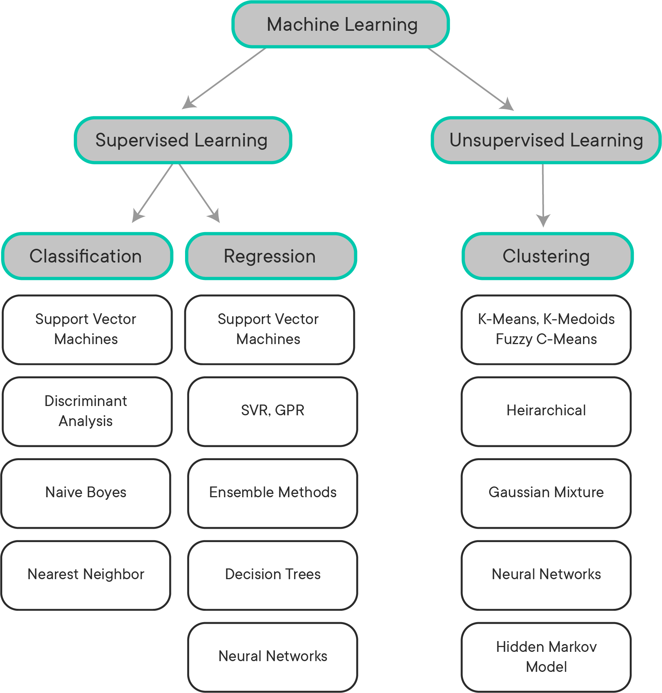

# Logistic Regression - Introduction

## Introduction

In this you'll be introduced to a new type of machine learning technique: classification! You'll learn about an algorithm called logistic regression and how it can be seen through a statistical point of view with maximum likelihood estimation (MLE). This should provide you some additional time to wrangle with statistical concepts and improve your overall coding abilities.


## Logistic Regression

You're familiar with linear regression to predict continuous values. You're now going to return to regression to look at how it can be used as a classifier instead to determine the likelihood of a given data point being associated with one of two categories.

We'll start by introducing the sigmoid function and showing how it can be used to fit a curve that matches a binary classifier (e.g. does someone make over or under &dollar;40k a year or are they a good or bad credit risk).

## Maximum Likelihood Estimation (MLE)

Maximum likelihood estimation is a statistical procedure for determining underlying parameter distributions. As the name implies, the underlying motivation is to find parameters that maximize the theoretical chances of observing the actual observations.

## MLE and Logistic Regression

Logistic regression, despite its name, is a classification algorithm. An interesting nuance is that it provides confidence values with its predictions since the raw output is a probability of a class between 0 and 1. The general process for this is similar to linear regression, where coefficients for various feature weights are altered in order to optimize the accuracy of subsequent predictions from the model.


## Summary

It's important to be aware of logistic regression as one of the most basic classifiers that you can use. In this section you'll learn how it works and how to use it.


-----File-Boundary-----
# Introduction to Supervised Learning

## Introduction

In this lesson, we'll examine what exactly the term "Supervised Learning" means, and where it fits in Data Science.


## Objectives

- Describe the components of what makes something a supervised learning task


## What is Supervised Learning?

The term **_Supervised Learning_** refers to a class of machine learning algorithms that can "learn" a task through **_labeled training data_**. We'll explore this definition more fully in a bit -- but first, it's worth taking some time to understand where supervised learning fits in the overall picture in regards to Data Science. By now, you've probably noticed that many of the things we've learned in Data Science and Computer Science are very hierarchical. This is especially true when it comes to AI and Machine Learning. Let's break down the hierarchy a bit, and see where **_Supervised Learning_** fits.

## Artificial Intelligence

At the top of the hierarchy is **_Artificial Intelligence_**.  AI is a catch-all term for various kinds of algorithms that can complete tasks that normally require human intelligence to complete. AI is made up of several subcategories, and is also a subcategory itself in the greater hierarchy of Computer Science. When data scientists talk about AI, we're almost focused on a single branch of AI, **_Machine Learning_**. Machine Learning is responsible for the boom in AI technologies and abilities in the last few decades, but it's worth noting that there are other areas of AI that do not fall under the umbrella of 'Machine Learning'. Other branches of AI include things like _Genetic Algorithms_ for optimization, or rules-based AI for things like building a bot for players to play against in a video game. While these are still active areas of research, they have little to no application in Data Science, so they're beyond the scope of this lesson. In general, when you see the phrase 'Artificial Intelligence', it's generally safe to assume that that the speaker is probably referring to the subfield of AI known as **_Machine Learning_** (which is also sometimes referred to by it's older, more traditional name -- **_Statistical Learning_**).

The following graphic shows the breakdown of the 'Machine Learning' branch of AI:




## Machine Learning

The field of _Machine Learning_ can be further divided into two overall categories:

1. **_Supervised Learning_**
2. _Unsupervised Learning_

The main difference between these two areas of machine learning is the need for **_labeled training data_**. In **_Supervised Learning_**, any data used must have a **_label_**. These labels are the _ground truth_ , which allows our supervised learning algorithms to 'check their work'. By comparing its predictions against the actual labels, our algorithm can learn to make less incorrect predictions and improve the overall performance of the task its learning to do. It helps to think of Supervised Learning as close to the type of learning we do as students in grade school. Imagine using practice exams to study for the SAT or ACT test. We can go through all the practice questions we want, but in order to learn from our performance on those practice questions, we need to know what the correct answers are! Without them, we would have no way of knowing which questions we got right and which ones we got wrong, so we wouldn't be able to learn what changes we would need to make to improve our overall performance!

> "A computer program is said to **learn** from experience _E_ with respect to some class of tasks _T_ and performance measure _P_, if its performance at tasks in _T_, as measured by _P_, improves with experience _E_."  -- [Tom Mitchell](http://www.cs.cmu.edu/~tom/)

Let's pretend we've built and trained a model to detect if a picture contains a cat or not. Using the language from the definition above:

* **Task (T)**: predict if a picture contains a cat or not
* **Performance Measure (P)**: The objective function used to score the predictions made by our model for each image
* **Experience (E)**: All of our labeled training data. The more training data we provide, the more 'experience' our model gets!

We'll spend some time learning about **_Unsupervised Learning_** in the next module, so don't worry about it for now!


## Classification and Regression

The field of _Supervised Learning_ can be further broken down into two categories -- **_Classification_** and **_Regression_**. At this point in your studies, you already have significant experience with regression -- specifically **Linear Regression** , probably the most foundational (and important) machine learning model. Recall that regression allows us to answer questions like "how much?" or "how many?". If our label is a real-valued number, then the supervised learning problem you're trying to solve is a _regression_ problem.

The other main kind of supervised learning problem is **_Classification_**. Classification allows us to tell if something belongs to one class or the other. In the case of the [titanic](https://www.kaggle.com/c/titanic) dataset, this may be something like survival. For example, given various characteristics of a passenger, predict whether they will survive or not. Questions that can be answered in a True/False format (in the titanic example, "Survived" or "Not survived") are a type of **_Binary Classification_**. To perform binary classification, you will be introduced to **Logistic Regression**. Don't let the name confuse you, although the name contains the word "regression," this important foundational technique is very important in understanding classification problems. There are several other classification techniques you will be learning in this module, but in order to gain a sound understanding of **Classification** tasks, this section will be focused exclusively on building and evaluating logistic regression models.

However, we are not limited to only two classes when working with classification algorithms -- we can have as many classes as we see fit. When a supervised learning problem has more than two classes, we refer to it as a **_Multiclass Classification_** problem.


## Objective Functions

Whenever we're dealing with supervised learning, we have an **_Objective Function_** (also commonly called a **_Loss Function_**) that we're trying to optimize against. Regardless of the supervised learning model we're working with, we can be sure that we have some sort of function under the hood that we're using to grade the predictions made by our model against the actual ground-truth labels for each prediction. In the quote from Tom Mitchell listed above, objective functions are _P_. While classification and regression models use different kinds of objective functions to evaluate their performance, the concept is the same -- these functions allow the model to evaluate exactly how right or wrong a prediction is, which the algorithm can then "learn" from. These objective functions serve an important purpose, because they act as the ground-truth for determining if our model is getting better or not.

### The Limitations of Labeled Data

Because supervised learning requires **_Labels_** for any data used, this severely limits the amount of available data we have for use with supervised learning algorithms.  Of all the data in the world, only a very, very small percentage is labeled. Why? Because labeling data is a purposeful activity that can only be done by humans, and is therefore time-consuming and expensive. In supervised learning, labels are not universal -- they are unique to the problem we're trying to solve. If we're trying to train a model to predict if someone survived the titanic disaster, we need to know the survival results of every passenger in our dataset -- there's no way around it. However, if we're trying to predict how much a person paid for a ticket on the titanic, survival data now no longer works as a label -- instead, we need to know how much each passenger paid for a ticket. In a more generalized sense, this means that for whatever problem we're trying to train a supervised learning model to solve, we need to have a large enough dataset containing examples where humans have already done the things we're trying to get our model to learn how to do.

Although labeled data is still expensive and time-consuming to get, the internet has made the overall process of getting labeled data a bit easier than it used to be. Nowadays, when companies need to construct a dataset of labeled training data to solve a problem, they typically make use of services like Amazon's [AWS Mechanical Turk](https://docs.aws.amazon.com/mturk/index.html), or 'MTurk' for short. Services like this obtain labels by paying people for each label they generate. In this way, a company can crowdsource the work to label the training data needed. The company simply uploads unlabeled training data like an image, and a "turker" will then provide a label for that image according to the instructions from the company. Depending on the problem the company is trying to solve, the label for the image might be something as simple as the word "cat", or as complex as as boxes drawn around all the cats in the image.

### Negative Examples

When creating a labeled dataset for a classification problem, it is worth noting that negative examples are just as important to be included in the dataset as positive examples. If our training data in the titanic dataset only contained data on passengers that all survived, no supervised learning algorithm would be able to learn how to predict if a passenger survived or died with any sort of accuracy. **_Positive Examples_** are data points that belong to the class we're training our model to recognize. For instance, let's pretend we're building a model to tell if a picture is of a cat or not. All the pictures of cats in our dataset would be positive examples. However, in order to build a good cat classifier, our dataset would also need to contain many different kinds of pictures that don't include cats. Intuitively, this makes sense -- if every picture that our model ever saw had a cat in it, then the only thing that model will learn is that everything is a cat. To truly learn what we need it to learn, this model will also need to learn what a cat _isn't_, by looking at pictures that don't include cats -- our **_Negative Examples_**. In this way, with a complex enough model and enough labeled training data, our classifier will eventually learn that the differentiating factor between images with positive labels and images with negative labels are the shapes and patterns common to cats, but not dogs (or other animals). In this way, supervised learning can be a bit tricky. For instance, if all of the negative examples in our cat classifier dataset are of cars and houses, then the model will almost certainly get a picture of a dog incorrect by predicting that the picture is of a cat. Why does this happen? Because the model hasn't seen a dog before, and therefore has no idea whether this fits. In this particular example, we can guess that any picture of a dog will look more like a cat than it would a house or car, which from the model's perspective means that this is probably a picture of a cat.

In summary, this part of supervised learning can often be more art than science -- when creating a dataset, make sure that your dataset contains enough negative examples, and that you are very thoughtful about what those negative examples actually contain!

## Summary

In this lesson, we learned about _Supervised Learning_, and where it fits in relation to Machine Learning and Artificial Intelligence.


-----File-Boundary-----
# Linear to Logistic regression

## Introduction

In this lesson, you'll be introduced to the logistic regression model. You'll start with an introductory example using linear regression, which you've seen before, to act as a segue into logistic regression. After that, you'll learn about the formal notation of logistic regression models. Then, you'll conclude this lesson by looking at a real-world example.

## Objectives

You will be able to:

* Describe the need for logistic regression
* Interpret the parameters of a logistic regression model

## Recap of the linear regression model

You have previously learned about linear regression models. In these models, you are trying to fit a linear relationship between two variables. An example is given below. In this example, you want to find a relationship between age and monthly income. It is reasonable to assume that, on average, older people have a higher income than younger people who are newer to the job market and have less experience. A potential relationship could look like the plot below. The monthly income is shown in 1000s of USD.

```python
import pandas as pd
import numpy as np
import matplotlib.pyplot as plt
%matplotlib inline

np.random.seed(1234)

age = np.random.uniform(18, 65, 100)
income = np.random.normal((age/10), 0.5)
age = age.reshape(-1,1)

fig = plt.figure(figsize=(8,6))
fig.suptitle('age vs income', fontsize=16)
plt.scatter(age, income)
plt.xlabel('age', fontsize=14)
plt.ylabel('monthly income', fontsize=14)
plt.show()
```
In linear regression, you would try to find a relationship between age and monthly income. Conceptually, this means fitting a line that represents the relationship between age and monthly income, as shown below.

```python
fig = plt.figure(figsize=(8, 6))
fig.suptitle('linear regression', fontsize=16)
plt.scatter(age, income)
plt.plot(age, age/10, c='black')
plt.xlabel('age', fontsize=14)
plt.ylabel('monthly income', fontsize=14)
plt.show()
```
The idea is that you could use this line to make predictions in the future. In this case, the relationship is modeled as follows: the expected monthly income for someone who is, say, 40 years old, is 3000 (3 on the y-axis). Of course, the actual income will most likely be different, but this indicates what the model predicts as the salary value.

## So how is this related to logistic regression?

Now, imagine you get a dataset where no information on exact income is given (after all, people don't like to talk about how much they earn!), but you only have information on whether or not they earn more than 4000 USD per month. Starting from the generated data we used before, the new variable `income_bin` was transformed to 1 when someone's income is over 4000 USD, and 0 when the income is less than 4000 USD.

```python
income_bin = income > 4
income_bin = income_bin.astype(int)
print(income_bin)
```
Have a look at what happens when you plot this.

```python
fig = plt.figure(figsize=(8, 6))
fig.suptitle('age vs binary income', fontsize=16)
plt.scatter(age, income_bin)
plt.xlabel('age', fontsize=14)
plt.ylabel('monthly income (> or < 4000)', fontsize=14)
plt.show()
```
You can already tell that fitting a straight line will not work here. Take a look at what happens when you fit a regression line to these data.

```python
from sklearn.linear_model import LogisticRegression
from sklearn.linear_model import LinearRegression

# Create linear regression model
lin_reg = LinearRegression()
lin_reg.fit(age, income_bin)
# Store the coefficients
coef = lin_reg.coef_
interc = lin_reg.intercept_
# Create the line
lin_income = (interc + age * coef)
```
```python
fig = plt.figure(figsize=(8, 6))
fig.suptitle('linear regression', fontsize=16)
plt.scatter(age, income_bin)
plt.xlabel('age', fontsize=14)
plt.ylabel('monthly income', fontsize=14)
plt.plot(age, lin_income, c='black')
plt.show()
```
You can see that this doesn't make a lot of sense. This straight line cannot grasp the true structure of what is going on when using a linear regression model. Now, without going into the mathematical details for now, look at a logistic regression model and fit that to the dataset.

```python
# Instantiate a Logistic regression model
# Solver must be specified to avoid warning, see documentation for more information
# liblinear is recommended for small datasets
# https://scikit-learn.org/stable/modules/generated/sklearn.linear_model.LogisticRegression.html
regr = LogisticRegression(C=1e5, solver='liblinear')

# Fit the model to the training set
regr.fit(age, income_bin)
```
```python
# Store the coefficients
coef = regr.coef_
interc = regr.intercept_

# Create the linear predictor
lin_pred = (age * coef + interc)

# Perform the log transformation
mod_income = 1 / (1 + np.exp(-lin_pred))

# Sort the numbers to make sure plot looks right
age_ordered, mod_income_ordered = zip(*sorted(zip(age ,mod_income.ravel()),key=lambda x: x[0]))
```
```python
fig = plt.figure(figsize=(8, 6))
fig.suptitle('logistic regression', fontsize=16)
plt.scatter(age, income_bin)
plt.xlabel('age', fontsize=14)
plt.ylabel('monthly income', fontsize=14)
plt.plot(age_ordered, mod_income_ordered, c='black')
plt.show()
```
This already looks a lot better! You can see that this function has an S-shape which plateaus to 0 in the left tale and 1 to the right tale. This is exactly what we needed here. Hopefully this example was a good way of showing why logistic regression is useful. Now, it's time to dive into the mathematics that make logistic regression possible.

## Logistic regression model formulation

### The model

As you might remember from the linear regression lesson, a linear regression model can be written as:

$$ \hat y = \hat\beta_0 + \hat\beta_1 x_1 + \hat\beta_2 x_2 +\ldots + \beta_n x_n $$

When there are $n$ predictors $x_1,\ldots,x_n$ and $n+1$ parameter estimates that are estimated by the model $\hat\beta_0, \hat\beta_1,\ldots, \hat\beta_n$.  $ \hat y $ is an estimator for the outcome variable.

Translating this model formulation to our example, this boils down to:

$$ \text{income} = \beta_0 + \beta_1 \text{age} $$

When you want to apply this to a binary dataset, what you actually want to do is perform a **classification** of your data in one group versus another one. In our case, we want to classify our observations (the 100 people in our dataset) as good as possible in "earns more than 4k" and "earns less than 4k". A model will have to guess what the **probability** is of belonging to one group versus another. And that is exactly what logistic regression models can do!

Essentially, what happens is, the linear regression is *transformed* in a way that the outcome takes a value between 0 and 1. This can then be interpreted as a probability (e.g., 0.2 is a probability of 20%). Applied to our example, the expression for a logistic regression model would look like this:

$$ P(\text{income} > 4000) = \displaystyle \frac{1}{1+e^{-(\hat \beta_0+\hat \beta_1 \text{age})}}$$

Note that the outcome is written as $P(\text{income} > 4000)$. This means that the output should be interpreted as *the probability that the monthly income is over 4000 USD*.

It is important to note that this is the case because the income variable was relabeled to be equal to 1 when the income is bigger than 4000, and 0 when smaller than 4000. In other words, the outcome variable should be interpreted as *the probability of the class label to be equal to 1*.

### Interpretation

As mentioned before, the probability of an income over 4000 can be calculated using:

$$ P(\text{income} > 4000) = \displaystyle \frac{1}{1+e^{-(\hat \beta_o+\hat \beta_1 \text{age})}}$$

You can show that, by multiplying both numerator and denominator by $e^{(\hat \beta_0+\hat \beta_1 \text{age})}$


$$ P(\text{income} > 4000) = \displaystyle \frac{e^{\hat \beta_0+\hat \beta_1 \text{age}}}{1+e^{\hat \beta_o+\hat \beta_1 \text{age}}}$$

As a result, you can compute $P(\text{income} \leq 4000)$ as:

$$ P(\text{income} < 4000) = 1- \displaystyle \frac{e^{\hat \beta_0+\hat \beta_1 \text{age}}}{1+e^{\hat \beta_o+\hat \beta_1 \text{age}}}= \displaystyle \frac{1}{1+e^{\hat \beta_0+\hat \beta_1 \text{age}}}$$


This doesn't seem to be very spectacular, but combining these two results leads to an easy interpretation of the model parameters, triggered by the *odds*

$$ \dfrac{P(\text{income} > 4000)}{P(\text{income} < 4000)} = e^{\hat \beta_0+\hat \beta_1 \text{age}} $$

This expression can be interpreted as the *odds in favor of an income greater than 4000 USD*.

This result, in combination with mathematical properties of exponential functions, leads to the fact that, applied to our example:

if *age* goes up by 1, the odds are multiplied by $e^{\beta_1}$

In our example, there is a positive relationship between age and income, this will lead a positive $\beta_1 > 0$, so $e^{\beta_1}>1$, and the odds will increase as *age* increases.


# A real-world example

Now you will apply these concepts to a real-world dataset:

```python
import statsmodels as sm
import sklearn.preprocessing as preprocessing
from sklearn.linear_model import LogisticRegression
from sklearn.model_selection import train_test_split
from scipy import stats
```
```python
salaries = pd.read_csv('salaries_final.csv', index_col=0)
salaries.head()
```
For this example, you will fit a logistic regression model to `Target` using `Age`, `Race`, and `Sex`. Since `Target`, `Race`, and `Sex` are categorical, they need to be be converted to a numeric datatype first.

The `get_dummies()` function will only convert `object` and `category` datatypes to dummy variables so it is safe to pass `Age` to `get_dummies()`. Note that we also pass two additional arguments, `drop_first=True` and `dtype=float`. The `drop_first=True` argument removes the first level for each categorical variable and the `dtype=float` argument converts the datatype of all the dummy variables to float. The data must be float in order to obtain accurate statistical results from `statsmodels`.

```python
# Convert race and sex using get_dummies()
x_feats = ['Race', 'Sex', 'Age']
X = pd.get_dummies(salaries[x_feats], drop_first=True, dtype=float)

# Convert target using get_dummies
y = pd.get_dummies(salaries['Target'], drop_first=True, dtype=float)
y = y['>50K']
```
```python
import statsmodels.api as sm

# Create intercept term required for sm.Logit, see documentation for more information
X = sm.add_constant(X)

# Fit model
logit_model = sm.Logit(y, X)

# Get results of the fit
result = logit_model.fit()
```
```python
result.summary()
```
```python
np.exp(result.params)
```
You can also use scikit-learn to retrieve the parameter estimates. The disadvantage here though is that there are no p-values for your parameter estimates!

```python
logreg = LogisticRegression(fit_intercept = False, C = 1e15, solver='liblinear')
model_log = logreg.fit(X, y)
model_log
```
```python
model_log.coef_
```
## Summary

In this lab you built upon your previous knowledge of linear regression and built an intuitive understanding of how this could be adapted for classification. We then demonstrated tools for performing logistic regression. In the upcoming lessons you will continue to investigate logistic regression from other viewpoints.


-----File-Boundary-----
# Logistic Regression in scikit-learn


## Introduction

Generally, the process for fitting a logistic regression model using scikit-learn is very similar to that which you previously saw for `statsmodels`. One important exception is that scikit-learn will not display statistical measures such as the p-values associated with the various features. This is a shortcoming of scikit-learn, although scikit-learn has other useful tools for tuning models which we will investigate in future lessons.

The other main process of model building and evaluation which we didn't discuss previously is performing a train-test split. As we saw in linear regression, model validation is an essential part of model building as it helps determine how our model will generalize to future unseen cases. After all, the point of any model is to provide future predictions where we don't already know the answer but have other informative data (`X`).

With that, let's take a look at implementing logistic regression in scikit-learn using dummy variables and a proper train-test split.


## Objectives

You will be able to:

- Fit a logistic regression model using scikit-learn

## Importing the Data

```python
import pandas as pd

df = pd.read_csv('titanic.csv')
df.head()
```
## Defining `X` and `y`

To start out, we'll consider `y` to be the target variable (`Survived`) and everything else to be `X`.

```python
y = df["Survived"]
X = df.drop("Survived", axis=1)
```
## Train-Test Split

Specifying a `random_state` means that we will get consistent results even if the kernel is restarted.

```python
from sklearn.model_selection import train_test_split
X_train, X_test, y_train, y_test = train_test_split(X, y, random_state=0)
```
## Preprocessing

### Dealing with Missing Data

Some of the data is missing, which won't work with a scikit-learn model:

```python
X_train.isna().sum()
```
For `Cabin` and `Embarked` (categorical features), we'll manually fill this in with "missing" labels:

```python
X_train_fill_na = X_train.copy()
X_train_fill_na.fillna({"Cabin":"cabin_missing", "Embarked":"embarked_missing"}, inplace=True)
X_train_fill_na.isna().sum()
```
For `Age` (a numeric feature), we'll use a `SimpleImputer` from scikit-learn ([documentation here](https://scikit-learn.org/stable/modules/generated/sklearn.impute.SimpleImputer.html)) to fill in the mean:

```python
from sklearn.impute import SimpleImputer

imputer = SimpleImputer()

imputer.fit(X_train_fill_na[["Age"]])
age_imputed = pd.DataFrame(
    imputer.transform(X_train_fill_na[["Age"]]),
    # index is important to ensure we can concatenate with other columns
    index=X_train_fill_na.index,
    columns=["Age"]
)

X_train_fill_na["Age"] = age_imputed
X_train_fill_na.isna().sum()
```
### Dealing with Categorical Data

Some of the columns of `X_train_fill_na` currently contain categorical data (i.e. Dtype `object`):

```python
X_train_fill_na.info()
```
```python
X_train_categorical = X_train_fill_na.select_dtypes(exclude=["int64", "float64"]).copy()
X_train_categorical
```
`OneHotEncoder` from scikit-learn ([documentation here](https://scikit-learn.org/stable/modules/generated/sklearn.preprocessing.OneHotEncoder.html)) can be used to convert categorical variables into dummy one-hot encoded variables:

```python
from sklearn.preprocessing import OneHotEncoder
import numpy as np

ohe = OneHotEncoder(handle_unknown="ignore", sparse=False)

ohe.fit(X_train_categorical)
X_train_ohe = pd.DataFrame(
    ohe.transform(X_train_categorical),
    # index is important to ensure we can concatenate with other columns
    index=X_train_categorical.index,
    # we are dummying multiple columns at once, so stack the names
    columns=np.hstack(ohe.categories_)
)
X_train_ohe
```
Wow! That's a lot of columns! Way more than is useful in practice: we now have columns for each of the passenger's names. This is an example of what not to do. Let's try that again, this time being mindful of which variables we actually want to include in our model.

Instead of just selecting every single categorical feature for dummying, let's only include the ones that make sense as categories rather than being the names of individual people:

```python
categorical_features = ["Sex", "Cabin", "Embarked"]
X_train_categorical = X_train_fill_na[categorical_features].copy()
X_train_categorical
```
```python
ohe.fit(X_train_categorical)

X_train_ohe = pd.DataFrame(
    ohe.transform(X_train_categorical),
    index=X_train_categorical.index,
    columns=np.hstack(ohe.categories_)
)
X_train_ohe
```
That's still a lot of columns, but we no longer have more columns than records!

### Normalization

Now let's look at the numeric features. This time we'll also pay more attention to the meaning of the features, and only include relevant ones (e.g. not including `PassengerId` because this is a data artifact, not a true feature).

Another important data preparation practice is to normalize your data. That is, if the features are on different scales, some features may impact the model more heavily then others. To level the playing field, we often normalize all features to a consistent scale of 0 to 1.

As you can see, our features are currently not on a consistent scale:

```python
numeric_features = ["Pclass", "Age", "SibSp", "Fare"]
X_train_numeric = X_train_fill_na[numeric_features].copy()
X_train_numeric
```
Let's use a `MinMaxScaler` from scikit-learn ([documentation here](https://scikit-learn.org/stable/modules/generated/sklearn.preprocessing.MinMaxScaler.html)) with default parameters to create a maximum value of 1 and a minimum value of 0. This will work well with our binary one-hot encoded data.

```python
from sklearn.preprocessing import MinMaxScaler

scaler = MinMaxScaler()

scaler.fit(X_train_numeric)
X_train_scaled = pd.DataFrame(
    scaler.transform(X_train_numeric),
    # index is important to ensure we can concatenate with other columns
    index=X_train_numeric.index,
    columns=X_train_numeric.columns
)
X_train_scaled
```
Then we concatenate everything together:

```python
X_train_full = pd.concat([X_train_scaled, X_train_ohe], axis=1)
X_train_full
```
## Fitting a Model

Now let's fit a model to the preprocessed training set. In scikit-learn, you do this by first creating an instance of the `LogisticRegression` class. From there, then use the `.fit()` method from your class instance to fit a model to the training data.

```python
from sklearn.linear_model import LogisticRegression

logreg = LogisticRegression(fit_intercept=False, C=1e12, solver='liblinear')
model_log = logreg.fit(X_train_full, y_train)
model_log
```
## Model Evaluation

Now that we have a model, lets take a look at how it performs.

### Performance on Training Data

First, how does it perform on the training data?

In the cell below, `0` means the prediction and the actual value matched, whereas `1` means the prediction and the actual value did not match.

```python
y_hat_train = logreg.predict(X_train_full)

train_residuals = np.abs(y_train - y_hat_train)
print(pd.Series(train_residuals, name="Residuals (counts)").value_counts())
print()
print(pd.Series(train_residuals, name="Residuals (proportions)").value_counts(normalize=True))
```
Not bad; our classifier was about 85% correct on our training data!

### Performance on Test Data

Now let's apply the same preprocessing process to our test data, so we can evaluate the model's performance on unseen data.

```python
# Filling in missing categorical data
X_test_fill_na = X_test.copy()
X_test_fill_na.fillna({"Cabin":"cabin_missing", "Embarked":"embarked_missing"}, inplace=True)

# Filling in missing numeric data
test_age_imputed = pd.DataFrame(
    imputer.transform(X_test_fill_na[["Age"]]),
    index=X_test_fill_na.index,
    columns=["Age"]
)
X_test_fill_na["Age"] = test_age_imputed

# Handling categorical data
X_test_categorical = X_test_fill_na[categorical_features].copy()
X_test_ohe = pd.DataFrame(
    ohe.transform(X_test_categorical),
    index=X_test_categorical.index,
    columns=np.hstack(ohe.categories_)
)

# Normalization
X_test_numeric = X_test_fill_na[numeric_features].copy()
X_test_scaled = pd.DataFrame(
    scaler.transform(X_test_numeric),
    index=X_test_numeric.index,
    columns=X_test_numeric.columns
)

# Concatenating categorical and numeric data
X_test_full = pd.concat([X_test_scaled, X_test_ohe], axis=1)
X_test_full
```
```python
y_hat_test = logreg.predict(X_test_full)

test_residuals = np.abs(y_test - y_hat_test)
print(pd.Series(test_residuals, name="Residuals (counts)").value_counts())
print()
print(pd.Series(test_residuals, name="Residuals (proportions)").value_counts(normalize=True))
```
And still about 78% accurate on our test data!

## Summary

In this lesson, you took a more complete look at a data science pipeline for logistic regression, splitting the data into training and test sets and using the model to make predictions. You'll practice this on your own in the upcoming lab before having a more detailed discussion of more nuanced methods for evaluating a classifier's performance.


-----File-Boundary-----
# MLE Review

## Introduction

You've seen MLE (Maximum Likelihood Estimation) when discussing Bayesian statistics, but did you know logistic regression can also be seen from this statistical perspective? In this section, you'll gain a deeper understanding of logistic regression by coding it from scratch and analyzing the statistical motivations backing it. But first take some time to review maximum likelihood estimation.

## Objectives

You will be able to:

- Describe how to take MLE of a binomial variable

## MLE

Maximum likelihood estimation can often sound academic, confusing, and cryptic when first introduced. It is often presented and introduced with complex integrals of statistical distributions that scare away many readers. Hopefully, this hasn't been your experience. While the mathematics can quickly become complex, the underlying concepts are actually quite intuitive.

To demonstrate this, imagine a simple coin flipping example. Let's say that you flip a coin 100 times and get 55 heads. Maximum likelihood estimation attempts to uncover the underlying theoretical probability of this coin landing on heads given your observations. In other words, given the observations, what is the chance that the coin was fair and had a 0.5 chance of landing on heads each time? Or what is the chance that the coin actually had a 0.75 probability of lands of heads, given what we observed? It turns out that the answer to these questions is rather intuitive. If you observe 55 out of 100 coin flips, the underlying probability which maximizes the chance of us observing 55 out of 100 coin flips is 0.55. In this simple example, MLE simply returns the current sample mean as the underlying parameter that makes the observations most probable. Slight deviations to this would be almost as probable but slightly less so, and large deviations from our sample mean should be rare. This intuitively makes some sense; as your sample size increases, you expect the sample mean to converge to the true underlying parameter. MLE takes a flipped perspective, asking what underlying parameter is most probable given the observations.

## Log-likelihood

When calculating maximum likelihood, it is common to use the log-likelihood, as taking the logarithm can simplify calculations. For example, taking the logarithm of a set of products allows you to decompose the problem from products into sums. (You may recall from high school mathematics that $x^{(a+b)} = x^a \bullet x^b$. Similarly, taking the logarithm of both sides of a function allows you to transform products into sums.

## MLE for a binomial variable

Let's take a deeper mathematical investigation into the coin flipping example above.

In general, if you were to observe $n$ flips, you would have observations $y_1, y_2, ..., y_n$.

In maximum likelihood estimation, you are looking to maximize the likelihood:

$L(p) = L(y_1, y_2, ..., y_n | p) = p^y (1-p)^{n-y}$  where $ y = \sum_{i=1}^{n}y_i$

Taking the log of both sides:

$ln[L(p)] = ln[p^y (1-p)^{n-y}] = y ln(p)+(n-y)ln(1-p)$

If $y = 1, 2, ..., n-1$ the derivative of $ln[L(p)]$ with respect to $p$ is:

$\frac{d\,ln[L(p)]}{dp} = y (\frac{1}{p})+(n-y)(\frac{-1}{1-p})$

As you've seen previously, the maximum will then occur when the derivative equals zero:

$0 = y (\frac{1}{p})+(n-y)(\frac{-1}{1-p})$

Distributing, you have

$0 = \frac{y}{p} - \frac{n-y}{1-p}$

And solving for p:

$ \frac{n-y}{1-p} = \frac{y}{p} $

$p(n-y) = \frac{y(1-p)}{p}$
$\frac{n-y}{y} = \frac{1-p}{p}$
$\frac{n}{y}-1 = \frac{1}{p}-1$
$\frac{n}{y} = \frac{1}{p} $
$p = \frac{y}{n}$

And voil\N{LATIN SMALL LETTER A WITH GRAVE}, you've verified the intuitive solution discussed above; the maximum likelihood for a binomial sample is the observed frequency!


## Summary

In this lesson, you briefly reviewed maximum likelihood estimation. In the upcoming lesson, you'll see how logistic regression can also be interpreted from this framework, which will help set the stage for you to code a logistic regression function from scratch using NumPy. Continue on to the next lesson to take a look at how this works for logistic regression.


-----File-Boundary-----
# MLE and Logistic Regression

## Introduction

In this lesson, you'll further investigate the connections between maximum likelihood estimation and logistic regression. This is a common perspective for logistic regression and will be the underlying intuition for upcoming lessons where you'll code the algorithm from the ground up using NumPy.

## Objectives

You will be able to:

- Determine how MLE is tied into logistic regression

## MLE formulation

As discussed, maximum likelihood estimation finds the underlying parameters of an assumed distribution to maximize the likelihood of the observations. Logistic regression expands upon this by investigating the conditional probabilities associated with the various features, treating them as independent probabilities and calculating the respective total probability.

For example, when predicting an individual's risk for heart disease, you might consider various factors such as their family history, weight, diet, exercise routines, blood pressure, and cholesterol. When looked at individually, each of these has an associated conditional probability that the individual has heart disease based on each of these factors. Mathematically, you can write each of these probabilities for each factor $X$ as:

$\pi_i=Pr(Y_i=1|X_i=x_i)=\dfrac{\text{exp}(\beta_0+\beta_1 x_i)}{1+\text{exp}(\beta_0+\beta_1 x_i)}$

This is the standard linear regression model ($\beta_0+\beta_1 x_i$) you have seen previously, modified to have a range of 0 to 1. The range is modified and constrained by applying the sigmoid function since you're predicting probabilities.

Then, combining these conditional probabilities from multiple features, you maximize the likelihood function of each of those independent conditional probabilities, giving you:

$ L(\beta_0,\beta_1)=\prod\limits_{i=1}^N \pi_i^{y_i}(1-\pi_i)^{n_i-y_i}=\prod\limits_{i=1}^N \dfrac{\text{exp}\{y_i(\beta_0+\beta_1 x_i)\}}{1+\text{exp}(\beta_0+\beta_1 x_i)}$


## Notes on mathematical symbols

Recall that the $\prod$ sign stands for a product of each of these individual probabilities. (Similar to how $\sum$ stands for the sum of a series.) Since this is a monotonically increasing function, its maximum will be the same as the logarithm of the function, which is typically used in practice in order to decompose this product of probabilities into a sum of log probabilities for easier calculation of the derivative. In future sections, you'll investigate the derivative of this function and then use that in order to code up our own function for logistic regression.

## Algorithm bias and ethical concerns

It should also be noted that while this is mathematically sound and a powerful tool, the model will simply reflect the data that is fed in. For example, logistic regression and other algorithms are used to inform a wide range of decisions including whether to provide someone with a loan, the degree of criminal sentencing, or whether to hire an individual for a job. In all of these scenarios, it is again important to remember that the algorithm is simply reflective of the underlying data itself. If an algorithm is trained on a dataset where African Americans have had disproportionate criminal prosecution, the algorithm will continue to perpetuate these racial injustices. Similarly, algorithms trained on data that reflect a gender pay-gap will also continue to promote this bias unless adequately accounted for through careful preprocessing and normalization. With this, substantial thought and analysis regarding problem set up and the resulting model is incredibly important. While future lessons and labs in this section return to underlying mathematical theory and how to implement logistic regression on your own, it is worthwhile to investigate some of the current problems regarding some of these algorithms, and how naive implementations can perpetuate unjust biases.

## Additional resources

Below are a handful of resources providing further information regarding some of the topics discussed here. Be sure to check out some of the news articles describing how poor safeguards and problem formulation surrounding algorithms such as logistic regression can lead to unjust biases:

### Algorithm bias and ethical concerns

- [Machine Bias](https://www.propublica.org/article/machine-bias-risk-assessments-in-criminal-sentencing)

- [Amazon\N{RIGHT SINGLE QUOTATION MARK}s Gender-Biased Algorithm Is Not Alone](https://www.bloomberg.com/opinion/articles/2018-10-16/amazon-s-gender-biased-algorithm-is-not-alone)

- [The software that runs our lives can be bigoted and unfair. But we can fix it](https://www.bostonglobe.com/business/2017/12/21/the-software-that-runs-our-lives-can-bigoted-and-unfair-but-can-fix/RK4xG4gYxcVNVTIubeC1JI/story.html)

- [Why artificial intelligence is far too human](https://www.bostonglobe.com/ideas/2017/07/07/why-artificial-intelligence-far-too-human/jvG77QR5xPbpwBL2ApAFAN/story.html)

- [Can Computers Be Racist? The Human-Like Bias Of Algorithms](https://www.npr.org/2016/03/14/470427605/can-computers-be-racist-the-human-like-bias-of-algorithms)

### Additional mathematical resources

If you want to really go down the math rabbit-hole, check out section 4.4 on Logistic Regression from the Elements of Statistical Learning which can be found here: https://web.stanford.edu/~hastie/ElemStatLearn//.

## Summary

In this lesson, you further analyzed logistic regression from the perspective of maximum likelihood estimation. Additionally, there was a brief pause to consider the setup and interpretation of algorithms such as logistic regression. In particular, remember that issues regarding racial and gender bias that can be perpetuated by these algorithms. Always try to ensure your models are ethically sound. In the proceeding labs and lessons, you will continue to formalize your knowledge of logistic regression, implementing gradient descent and then a full logistic regression algorithm using Python packages in order to give you a deeper understanding of how logistic regression works.


-----File-Boundary-----
# Gradient Descent Review

## Introduction

Recall that gradient descent is a numerical approximation method for finding optimized solutions to problems with no closed form. That is, some mathematical problems are very easy to solve analytically. A trivial example is basic algebra problems which you undoubtedly saw in grade school:
$x + 2 = 10$ subtracting 2 from both sides you get $x = 8$. Similarly, some more complex mathematical problems such as ordinary least squares, our preliminary regression approach, also have closed-form solutions where we can follow a rote procedure and be guaranteed a solution. In other cases, this is not possible and numerical approximation methods are used to find a solution. The first instance that you witnessed of this was adding the L1 and L2 (lasso and ridge, respectively) penalties to OLS regression. In these cases, numerical approximation methods, such as gradient descent, are used in order to find optimal or near-optimal solutions.


## Objectives

You will be able to:

- Describe the elements of gradient descent in the context of a logistic regression

## Gradient descent

Gradient descent is grounded in basic calculus theory. Whenever you have a minimum or maximum, the derivative at that point is equal to zero. This is displayed visually in the picture below; the slope of the red tangent lines is equal to the derivative of the curve at that point. As you can see, the slope of all of these horizontal tangent lines will be zero.


**The gradient is simply another term for the derivative. Typically, this is the term used when we are dealing with multivariate data. The gradient is the rate of change, which is also the slope of the line tangent.**

Building upon this, gradient descent attempts to find the minimum of a function by taking successive steps in the steepest direction downhill.


While this process guarantees a local minimum, the starting point and step size can affect the outcome. For example, for two different runs of gradient descent, one may lead to the global minimum while the other may lead to a local minimum.

Recall that the general outline for gradient descent is:

1. Define initial parameters:
    1. Pick a starting point
    2. Pick a step size $\alpha$ (alpha)
    3. Choose a maximum number of iterations; the algorithm will terminate after this many iterations if a minimum has yet to be found
    4. (optionally) define a precision parameter; similar to the maximum number of iterations, this will terminate the algorithm early. For example, one might define a precision parameter of 0.00001, in which case if the change in the loss function were less then 0.00001, the algorithm would terminate. The idea is that we are very close to the bottom and further iterations would make a negligible difference
2. Calculate the gradient at the current point (initially, the starting point)
3. Take a step (of size alpha) in the direction of the gradient
4. Repeat steps 2 and 3 until the maximum number of iterations is met, or the difference between two points is less then your precision parameter

## Summary

In this lesson, you briefly reviewed that a gradient is the derivative of a function, which is the rate of change at a specific point. You then reviewed the intuition behind gradient descent, as well as some of its pitfalls. Finally, you saw a brief outline of the algorithm itself. In the next lab, you'll practice coding gradient descent and applying that to some simple mathematical functions.


-----File-Boundary-----
# Coding Logistic Regression From Scratch - Lab

## Introduction

In this lab, you'll practice your ability to translate mathematical algorithms into Python functions. This will deepen and solidify your understanding of logistic regression!

## Objectives

In this lab you will:

- Build a logistic regression model from scratch using gradient descent

## Overview

Recall that the logistic regression algorithm builds upon the intuition from linear regression. In logistic regression, you start by taking the input data, `X`, and multiplying it by a vector of weights for each of the individual features, which produces an output, `y`. Afterward, you'll work on using an iterative approach via gradient descent to tune these weights.

## Linear regression setup

Write a simple function `predict_y()` that takes in a matrix `X` of observations and a vector of feature weights `w` and outputs a vector of predictions for the various observations.

Recall that this is the sum of the product of each of the feature observations and their corresponding feature weights:

$\large \hat{y}_i = X_{i1} \cdot w_1 + X_{i2} \cdot w_2 + X_{i3} \cdot w_3 + ... + X_{in} \cdot w_n$

> **Hint**: Think about which mathematical operation you've seen previously that will take a matrix (`X`) and multiply it by a vector of weights (`w`). Use NumPy!

```python
# Your code here
import numpy as np

def predict_y(X, w):
    pass
```
## The sigmoid function

Recall that the sigmoid function is used to map the linear regression model output to a range of 0 to 1, satisfying basic premises of probability. As a reminder, the sigmoid function is defined by:

$S(x) = \dfrac{1}{1+e^(-x)}$

Write this as a Python function where `x` is the input and the function outputs the result of the sigmoid function.

> **Hint**: Use NumPy!

```python
# Your code here
```
## Plot the sigmoid

For good measure, let's do a brief investigation of your new function. Plot the output of your `sigmoid()` function using 10,000 values evenly spaced from -20 to 20.

```python
import matplotlib.pyplot as plt
%matplotlib inline

# Plot sigmoid
```
## Gradient descent with the sigmoid function

Recall that gradient descent is a numerical method for finding a minimum to a cost function. In the case of logistic regression, you are looking to minimize the error between the model's predictions and the actual data labels. To do this, you first calculate an error vector based on the current model's feature weights. You then multiply the transpose of the training matrix itself by this error vector in order to obtain the gradient. Finally, you take the gradient, multiply it by the step size and add this to our current weight vector to update it. Below, write such a function. It will take 5 inputs:

* `X`
* `y`
* `max_iterations`
* `alpha` (the step size)
* `initial_weights`


By default, have your function set the `initial_weights` parameter to a vector where all feature weights are set to 1.

```python
# Your code here
def grad_desc(X, y, max_iterations, alpha, initial_weights=None):
    """Be sure to set default behavior for the initial_weights parameter."""
    # Create a for loop of iterations
        # Generate predictions using the current feature weights
        # Calculate an error vector based on these initial predictions and the correct labels
        # Calculate the gradient
        # As we saw in the previous lab, calculating the gradient is often the most difficult task.
        # Here, your are provided with the closed form solution for the gradient of the log-loss function derived from MLE
        # For more details on the derivation, see the additional resources section below.
        gradient = np.dot(X.transpose(), error_vector)
        # Update the weight vector take a step of alpha in direction of gradient
    # Return finalized weights

```
## Running your algorithm

Now that you've coded everything from the ground up, you can further investigate the convergence behavior of the gradient descent algorithm. Remember that gradient descent does not guarantee a global minimum, only a local minimum, and that small deviations in the starting point or step size can lead to different outputs.

First, run the following cell to import the data and create the predictor and target variables:

```python
# Import data
import pandas as pd
df = pd.read_csv('heart.csv')

# Create the predictor and target variables
y = df['target']
X = df.drop(columns=['target'], axis=1)

print(y.value_counts())
X.head()
```
Run your algorithm and plot the successive weights of the features through iterations. Below is a dataset, with `X` and `y` predefined for you. Use your logistic regression function to train a model. As the model trains, record the iteration cycle of the gradient descent algorithm and the weights of the various features. Then, plot this data on subplots for each of the individual features. Each graph should have the iteration number on the x-axis and the value of that feature weight for that iteration cycle on the y-axis. This will visually display how the algorithm is adjusting the weights over successive iterations, and hopefully show convergence to stable weights.

```python
# Your code here
```
## Scikit-learn

For comparison, import scikit-learn's standard `LogisticRegression()` function. Initialize it with **no intercept** and **C=1e16** or another very high number. The reason is as follows: our implementation has not used an intercept, and you have not performed any regularization such as Lasso or Ridge (scikit-learn uses l2 by default). The high value of `C` will essentially negate this. Also, set the `random_state` to 2 and use the `'liblinear'` solver.

After initializing a regression object, fit it to `X` and `y`.

```python
# Your code here
```
## Compare the models

Compare the coefficient weights of your model to that generated by scikit-learn.

```python
# Your code here
```
## Level up (Optional)

Update the gradient descent algorithm to also return the cost after each iteration. Then rerun the algorithm and create a graph displaying the cost versus the iteration number.

```python
# Your code here
```
## Additional Resources

If you want to see more of the mathematics behind the gradient derivation above, check out section 4.4.1 from the Elements of Statistical Learning which can be found here: https://web.stanford.edu/~hastie/ElemStatLearn//.

## Summary

Congratulations! You just coded logistic regression from the ground up using NumPy! With this, you should have a fairly deep understanding of logistic regression and how the algorithm works! In the upcoming labs, you'll continue to explore this from a few more angles, plotting your data along with the decision boundary for our predictions.


-----File-Boundary-----
# Logistic Regression - Recap

## Introduction

Well done! In this section you learned about a different supervised learning technique: classification.

You also reviewed maximum likelihood estimation and saw how it applies to logistic regression. This included writing some challenging code, including gradient descent, which pushed you to think critically regarding algorithm implementation.

## Logistic Regression

Specifically, you practiced building a very basic classification model from scratch - a logistic regression model. Logistic regression uses a sigmoid function which helps to plot an "s"-like curve that enables a linear function to act as a binary classifier.

## Log-likelihoods in Maximum Likelihood Estimation

One of the nuances you saw in maximum likelihood estimation was that of log-likelihoods. Recall that the purpose of taking log-likelihoods as opposed to likelihoods themselves is that it allows us to decompose the product of probabilities as sums of log probabilities. Analytically, this is essential to calculating subsequent gradients in order to find the next steps for our optimization algorithm.


## Local Minima in Gradient Descent

One of the most important notes from this section is that **gradient descent does not guarantee an optimal solution**. Gradient descent is meant to find optimal solutions, but it only guarantees a local minimum. For this reason, gradient descent is frequently run multiple times, and the parameters with the lowest loss function then being selected for the final model.


## Summary

This section was designed to give you additional practice coding algorithms in Python, and a deeper understanding of how iterative algorithms such as logistic regression converge to produce underlying model parameters.


-----File-Boundary-----
