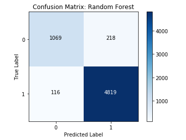
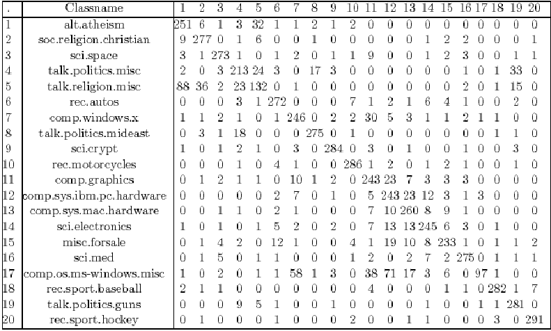
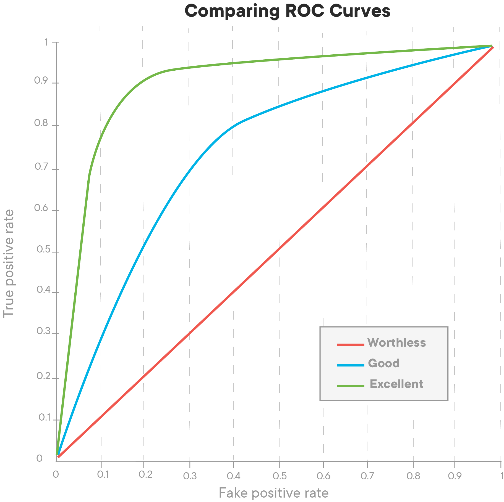
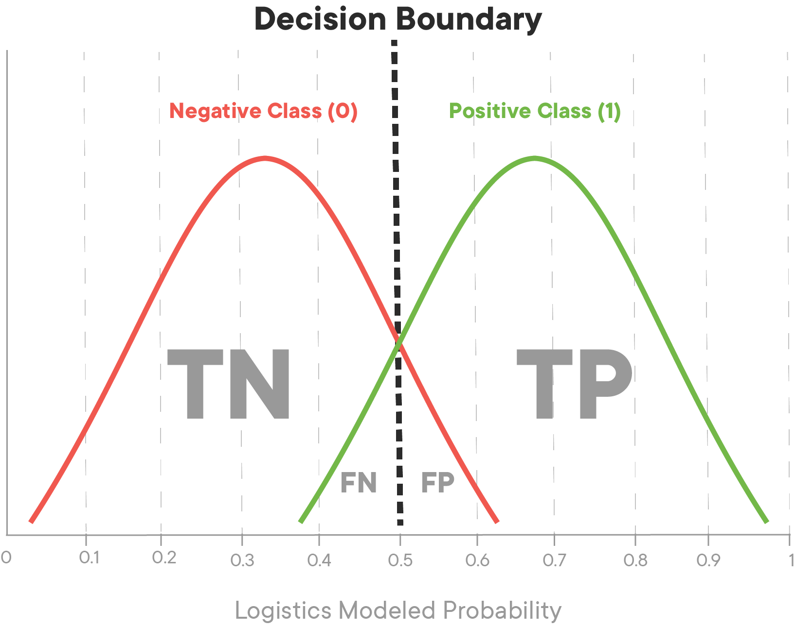
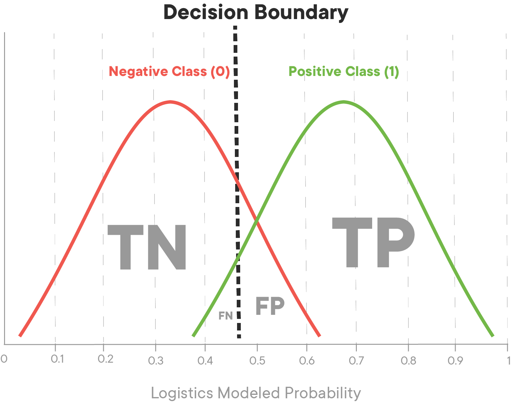
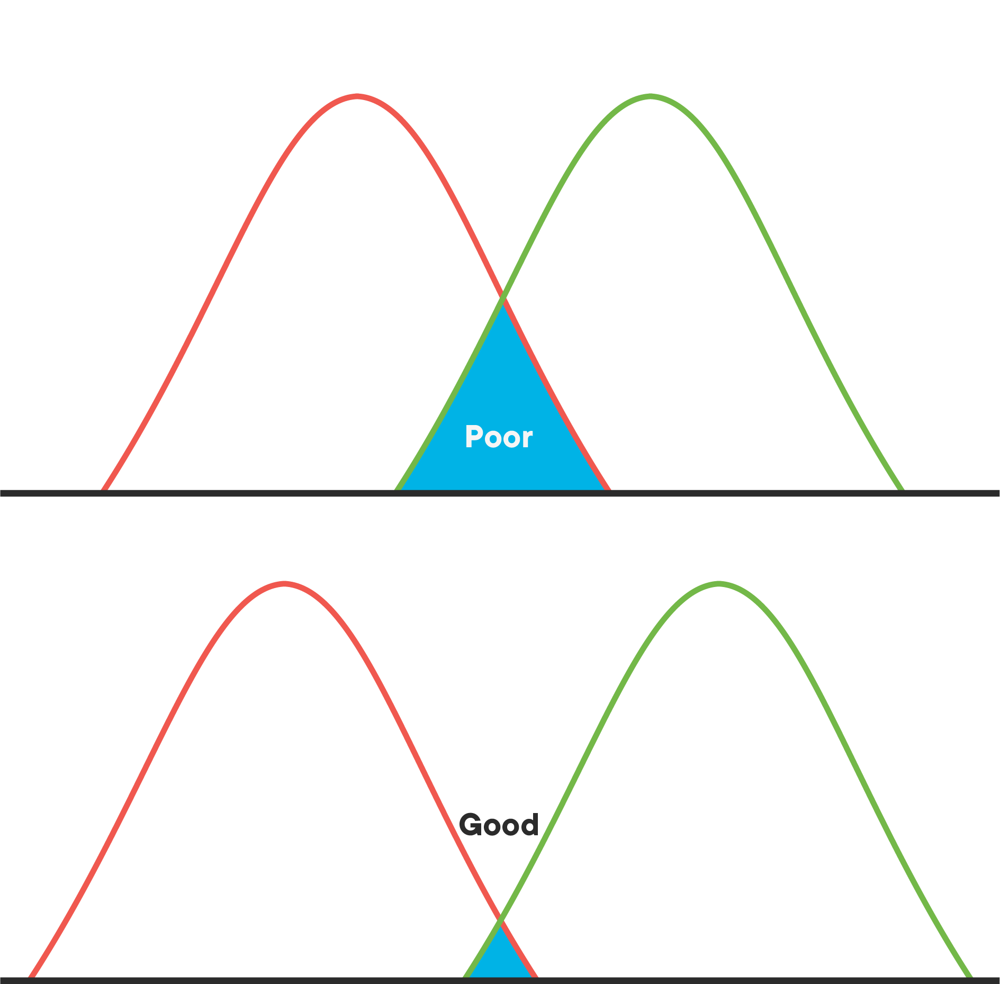
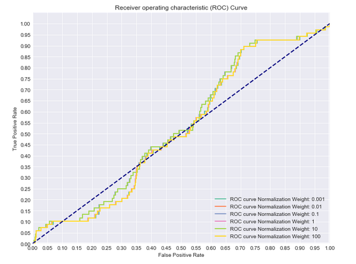

# Classification Metrics - Introduction

## Introduction

Classification models can be more complex to evaluate than regression models. There are more trade-offs involved as well as different metrics that can be used.

## Evaluating Classifiers

We'll look at the practicalities of evaluating logistic regression models based on precision, recall, and accuracy to evaluate other classifiers.

We also take a little time to look at how to plot a confusion matrix for a logistic regression classifier and introduce a couple of key concepts for determining the optimal precision-recall trade-off for a given classifier - Receiver Operating Characteristic (ROC) curves and AUC (the Area Under the Curve).

## Class Imbalance Problems

We then introduce the concept of class imbalance. Imagine a classifier for cancer where only 1 screened individual in 1000 is sick. You could obtain over 99 percent accuracy by just saying everyone is fine, but that wouldn't be a very useful approach. We look at the ideas of class weights and over/undersampling and how they can be used to work with highly imbalanced classes.


## Summary

Many of the concepts around model evaluation will be useful whenever you're trying to solve a classification problem.


-----File-Boundary-----
# Confusion Matrices

## Introduction

In this lesson, you'll learn how to construct and interpret a **_Confusion Matrix_** to evaluate the performance of a classifier!

## Objectives

You will be able to:

- Describe the four quadrants of a confusion matrix
- Interpret a confusion matrix
- Create a confusion matrix using scikit-learn

## How to evaluate classifier performance?

A confusion matrix tells us four important things. Let's assume a model was trained for a **_Binary Classification_** task, meaning that every item in the dataset has a ground-truth value of 1 or 0. To make it easier to understand, let's pretend this model is trying to predict whether or not someone has a disease. A confusion matrix gives you the following information:

**_True Positives (TP)_**: The number of observations where the model predicted the person has the disease (1), and they actually do have the disease (1).

**_True Negatives (TN)_**: The number of observations where the model predicted the person is healthy (0), and they are actually healthy (0).

**_False Positives (FP)_**: The number of observations where the model predicted the person has the disease (1), but they are actually healthy (0).

**_False Negatives (FN)_**: The number of observations where the model predicted the person is healthy (0), but they actually have the disease (1).

Let's take a look at an example confusion matrix:



As you can see, one axis of the confusion matrix represents the ground-truth value of the items the model made predictions on, while the other axis represents the labels predicted by the classifier. To read a confusion matrix, look at the intersection of each row and column to tell what each cell represents. For instance, in the example above, the bottom right square represents _True Positives_, because it is the intersection of "True Label: 1" row and the "Predicted Label: 1" column.

Take another look at the diagram above and see if you can figure out which cells represent TN, FP, and FN.

## Confusion matrices for multi-categorical classification

So far, we've kept it simple by only focusing on confusion matrices for binary classification problems. However, it's common to see classification tasks that are **_multi-categorical_** in nature. We can keep track of these by just expanding the number of rows and columns in our confusion matrix!



This example is from the Reuters Newsgroups dataset. As we can see in the example above, we use an equivalent number of rows and columns, with each row and column sharing the same index referring to the same class. In this, the true labels are represented by the rows, while the predicted classes are represented by the columns.

Take a look at the diagonal starting in the top-left and moving down to the right. This diagonal represents our **_True Positives_** since the indexes are the same for both row and column. For instance, we can see at location \[19, 19\] that 281 political articles about guns were correctly classified as political articles about guns. Since our model is multi-categorical, we may also be interested in exactly **_how_** a model was incorrect with certain predictions. For instance, by looking at \[4, 19\], you can conclude that 33 articles that were of category _talk.politics.misc_ were incorrectly classified as _talk.politics.guns_.  Note that when viewed through the lens of the *talk.politics.misc*, these are **_False Negatives_** -- our model said they weren't about this topic, and they were. However, they are also **_False Positives_** for *talk.politics.guns*, since our model said they were about this, and they weren't!


### Use `sklearn` to create confusion matrices

Since **_confusion matrices_** are a vital part of evaluating supervised learning classification problems, it's only natural that `sklearn` has a quick and easy way to create them. You'll find the `confusion_matrix()` function inside the `sklearn.metrics` module. This function expects two arguments -- the labels, and the predictions, in that order.

```python
from sklearn.metrics import confusion_matrix
example_labels = [0, 1, 1, 1, 0, 1, 0, 1, 0, 0, 1]
example_preds  = [0, 1, 0, 1, 0, 0, 1, 1, 1, 1, 1]

cf = confusion_matrix(example_labels, example_preds)
cf
```
One nice thing about using `sklearn`'s implementation of a confusion matrix is that it automatically adjusts to the number of categories present in the labels. For example:

```python
ex2_labels = [0, 1, 2, 2, 3, 1, 0, 2, 1, 2, 3, 3, 1, 0]
ex2_preds =  [0, 1, 1, 2, 3, 3, 2, 2, 1, 2, 3, 0, 2, 0]

cf2 = confusion_matrix(ex2_labels, ex2_preds)
cf2
```
Take a minute to examine the output above, and see if you can interpret the confusion matrix correctly. For instance, see if you can figure out how many 3's were mistakenly predicted to be a 0.

## Summary

Confusion matrices are a very handy tool to help us quickly understand how well a classification model is performing. However, you'll see that the truly useful information comes when you use confusion matrices to calculate **_Evaluation Metrics_** such as *accuracy*, *precision*, and *recall*!


-----File-Boundary-----
# Evaluation Metrics

## Introduction

In this lesson, you'll learn about common **_evaluation metrics_** used to quantify the performance of classifiers!

## Objectives

You will be able to:

- Evaluate classification models using the evaluation metrics appropriate for a specific problem
- Define precision and recall
- Define accuracy and F1 score


## Evaluation metrics for classification

Now that we've started discussing classification, it's time to examine comparing models to one other and choosing the models that have the best fit. Previously in regression, you were predicting values so it made sense to discuss error as a distance of how far off the estimates were from the actual values. However, in classifying a binary variable you are either correct or incorrect. As a result, we tend to deconstruct this as how many false positives versus false negatives there are in a model. In particular, there are a few different specific measurements when evaluating the performance of a classification algorithm.

Let's work through these evaluation metrics to understand what each metric tells us.

## Precision and recall

**_Precision_** and **_Recall_** are two of the most basic evaluation metrics available to us. **_Precision_** measures how precise the predictions are, while **_Recall_** indicates what percentage of the classes we're interested in were actually captured by the model.


### Precision

The following formula shows how to use information found in a confusion matrix to calculate the precision of a model:

$$ \text{Precision} = \frac{\text{Number of True Positives}}{\text{Number of Predicted Positives}} $$

To reuse a previous analogy of a model that predicts whether or not a person has a certain disease, precision allows us to answer the following question:

"Out of all the times the model said someone had a disease, how many times did the patient in question actually have the disease?"

Note that a high precision score can be a bit misleading.  For instance, let's say we take a model and train it to make predictions on a sample of 10,000 patients. This model predicts that 6000 patients have the disease when in reality, only 5500 have the disease.  This model would have a precision of 91.6%. Now, let's assume we create a second model that only predicts that a person is sick when it's incredibly obvious.  Out of 10,000 patients, this model only predicts that 5 people in the entire population are sick.  However, each of those 5 times, it is correct.  model 2 would have a precision score of 100%, even though it missed 5,495 cases where the patient actually had the disease! In this way, more conservative models can have a high precision score, but this doesn't necessarily mean that they are the _best performing_ model!

### Recall

The following formula shows how we can use the information found in a confusion matrix to calculate the recall of a model:

$$ \text{Recall} = \frac{\text{Number of True Positives}}{\text{Number of Actual Total Positives}} $$

Following the same disease analogy, recall allows us to ask:

"Out of all the patients we saw that actually had the disease, what percentage of them did our model correctly identify as having the disease?"

Note that recall can be a bit of a tricky statistic because improving our recall score doesn't necessarily always mean a better model overall. For example, our model could easily score 100% for recall by just classifying every single patient that walks through the door as having the disease in question. Sure, it would have many False Positives, but it would also correctly identify every single sick person as having the disease!


### The relationship between precision and recall

As you may have guessed, precision and recall have an inverse relationship. As our recall goes up, our precision will go down, and vice versa. If this doesn't seem intuitive, let's examine this through the lens of our disease analogy.

A doctor that is overly obsessed with recall will have a very low threshold for declaring someone as sick because they are most worried about sick patients. Their precision will be quite low, because they classify almost everyone as sick, and don't care when they're wrong -- they only care about making sure that sick people are identified as sick.

A doctor that is overly obsessed with precision will have a very high threshold for declaring someone as sick, because they only declare someone as sick when they are completely sure that they will be correct if they declare a person as sick. Although their precision will be very high, their recall will be incredibly low, because a lot of people that are sick but don't meet the doctor's threshold will be incorrectly classified as healthy.

### Which metric is better?

A classic Data Science interview question is to ask "What is better -- more false positives, or false negatives?" This is a trick question designed to test your critical thinking on the topics of precision and recall. As you're probably thinking, the answer is "It depends on the problem!".  Sometimes, our model may be focused on a problem where False Positives are much worse than False Negatives, or vice versa. For instance, detecting credit card fraud. A False Positive would be when our model flags a transaction as fraudulent, and it isn't.  This results in a slightly annoyed customer. On the other hand, a False Negative might be a fraudulent transaction that the company mistakenly lets through as normal consumer behavior. In this case, the credit card company could be on the hook for reimbursing the customer for thousands of dollars because they missed the signs that the transaction was fraudulent! Although being wrong is never ideal, it makes sense that credit card companies tend to build their models to be a bit too sensitive, because having a high recall saves them more money than having a high precision score.

Take a few minutes and see if you can think of at least two examples each of situations where a high precision might be preferable to high recall, and two examples where high recall might be preferable to high precision. This is a common interview topic, so it's always handy to have a few examples ready!

## Accuracy and F1 score

The two most informative metrics that are often cited to describe the performance of a model are **_Accuracy_** and **_F1 score_**. Let's take a look at each and see what's so special about them.

### Accuracy

**_Accuracy_** is probably the most intuitive metric. The formula for accuracy is:

$$ \text{Accuracy} = \frac{\text{Number of True Positives + True Negatives}}{\text{Total Observations}} $$

Accuracy is useful because it allows us to measure the total number of predictions a model gets right, including both **_True Positives_** and **_True Negatives_**.

Sticking with our analogy, accuracy allows us to answer:

"Out of all the predictions our model made, what percentage were correct?"

Accuracy is the most common metric for classification. It provides a solid holistic view of the overall performance of our model.

### F1 score

The F1 score is a bit more tricky, but also more informative. F1 score represents the **_Harmonic Mean of Precision and Recall_**.  In short, this means that the F1 score cannot be high without both precision and recall also being high. When a model's F1 score is high, you know that your model is doing well all around.

The formula for F1 score is:

$$ \text{F1 score} = 2\ \frac{Precision\ x\ Recall}{Precision + Recall} $$

To demonstrate the effectiveness of F1 score, let's plug in some numbers and compare F1 score with a regular arithmetic average of precision and recall.

Let's assume that the model has 98% recall and 6% precision.

Taking the arithmetic mean of the two, we get: $ \frac{0.98 + 0.06}{2} = \frac{1.04}{2} = 0.52 $

However, using these numbers in the F1 score formula results in:

$$ \text{F1 score} = 2 \frac{0.98 * 0.06}{0.98 + 0.06} = 2 \frac{0.0588}{1.04} = 2(0.061152) = 0.122304$$ or 12.2%!

As you can see, F1 score penalizes models heavily if it skews too hard towards either precision or recall. For this reason, F1 score is generally the most used metric for describing the performance of a model.

## Which metric to use?

The metrics that are most important to a project will often be dependent on the business use case or goals for that model. This is why it's **_very important_** to understand why you're doing what you're doing, and how your model will be used in the real world! Otherwise, you may optimize your model for the wrong metric!

In general, it is worth noting that it's a good idea to calculate all relevant metrics, when in doubt.  In most classification tasks, you don't know which model will perform best when you start. The common workflow is to train each different type of classifier, and select the best by comparing the performance of each. It's common to make tables like the one below, and highlight the best performer for each metric:


## Calculate evaluation metrics with confusion matrices

Note that we can only calculate any of the metrics discussed here if we know the **_True Positives, True Negatives, False Positives, and False Negatives_** resulting from the predictions of a model. If we have a confusion matrix, we can easily calculate **_Precision_**, **_Recall_** and **_Accuracy_** -- and if we know precision and recall, we can easily calculate **_F1 score_**!

## Classification reports

Scikit-learn has a built-in function that will create a **_Classification Report_**. This classification report even breaks down performance by individual class predictions for your model. You can find the `classification_report()` function in the `sklearn.metrics` module, which takes labels and predictions and returns the precision, recall, F1 score and support (number of occurrences of each label in `y_true`) for the results of a model.

## Summary

In this lesson you were introduced to several metrics which can be used to evaluate classification models. In the following lab, you'll write functions to calculate each of these manually, as well as explore how you can use existing functions in scikit-learn to quickly calculate and interpret each of these metrics.


-----File-Boundary-----
# ROC Curves and AUC


## Introduction

This lesson will introduce ROC: Receiver Operating Characteristic curves and AUC: Area Under [the] Curve.

Some of the accuracy scores you've encountered thus far probably seem pretty impressive; an 80% accuracy seems pretty darn good on the first try! What you have to keep in mind is that for binary classification, you are bound to be right sometimes, even just by random guessing. For example, a person should be roughly 50% accurate in guessing whether or not a coin lands on heads. This also can lead to issues when tuning models down the road. If you have a skewed dataset with rare events (such as a disease or winning the lottery) where there are only 2 positive cases in 1000, then even a trivial algorithm that classifies everything as 'not a member' will achieve an accuracy of 99.8% (998 out of 1000 times it was correct). So remember that an 80% accuracy must be taken into account in a larger context. AUC is an alternative comprehensive metric to confusion matrices, and ROC graphs allow us to determine optimal precision-recall tradeoff balances specific to the problem you are looking to solve.

## Objectives

You will be able to:

- Define ROC curves and AUC
- Explain how ROC and AUC are used to evaluate and choose models

## The ROC curve

The Receiver Operator Characteristic curve (ROC curve) illustrates the true positive rate against the false positive rate of our classifier.

You've already seen the True Positive Rate before, it's another name for **recall**! As a reminder, it's the ratio of the true positive predictions compared to all values that are actually positive. Mathematically, it is represented by:

$$ \text{TPR} = \frac{\text{TP}}{\text{TP}+\text{FN}} $$

False positive rate is the ratio of the false positive predictions compared to all values that are actually negative. Mathematically, it's represented as:

$$ \text{FPR} = \frac{\text{FP}}{\text{FP}+\text{TN}}$$

When training a classifier, the best performing models will have an ROC curve that hugs the upper left corner of the graph. A classifier with 50-50 accuracy is deemed 'worthless'; this is no better than random guessing, as in the case of a coin flip.



The ROC curve gives us a graph of the tradeoff between this false positive and true positive rate. The AUC, or area under the curve, gives us a singular metric to compare these. An AUC of 1 being a perfect classifier, and an AUC of 0.5 being that which has a precision of 50%.

Another perspective to help understand the ROC curve is to think about the underlying model fueling our classification algorithm. Remember that the logistic model produces probabilities that each observation is of a specific class. Imagine that the values produced from the logistic model look something like this:



Here you see the majority of the two classes probabilities land at around 0.25 or 0.75. If we alter the cutoff point, it could sacrifice precision, increasing the false positive rate in order to also increase the true positive rate or vice versa. Imagine in this instance that green is the positive case 1 (in this case heart disease) and red the negative case 0. Shifting the decision boundary to the left from 0.5 will result in capturing more of the positive (1) cases. At the same time, it will pick up some false positives, those red cases at the far right of the negative (0) case distribution that will be incorrectly identified as being part of the positive case distribution.




Models with poor ROC might have large overlaps in the probability estimates for the two classes. This would indicate that the algorithm performed poorly and had difficulty separating the two classes from each other.



With that, let's take a look at drawing the ROC curve in practice.

## Train a classifier

```python
from sklearn.linear_model import LogisticRegression
from sklearn.model_selection import train_test_split
import pandas as pd

# Load the data
df = pd.read_csv('heart.csv')

# Define appropriate X and y
y = df['target']
X = df.drop(columns='target', axis=1)

# Normalize the Data
X = X.apply(lambda x : (x - x.min()) /(x.max() - x.min()),axis=0)

# Split the data into train and test sets.
X_train, X_test, y_train, y_test = train_test_split(X, y, random_state=0)

# Fit a model
logreg = LogisticRegression(fit_intercept=False, C=1e12, solver='liblinear')
logreg.fit(X_train, y_train)
print(logreg) # Preview model params

# Predict
y_hat_test = logreg.predict(X_test)

# Data preview
print("")
df.head()
```
## Draw the ROC curve

In practice, a good way to implement AUC and ROC is via `sklearn`'s  built-in functions:

```python
from sklearn.metrics import roc_curve, auc

# Scikit-learn's built in roc_curve method returns the fpr, tpr, and thresholds
# for various decision boundaries given the case member probabilites

# First calculate the probability scores of each of the datapoints:
y_score = logreg.fit(X_train, y_train).decision_function(X_test)

fpr, tpr, thresholds = roc_curve(y_test, y_score)
```
From there it's easy to calculate the AUC:

```python
print('AUC: {}'.format(auc(fpr, tpr)))
```
## Putting it all together as a cohesive visual

```python
import matplotlib.pyplot as plt
import seaborn as sns
%matplotlib inline

# Seaborn's beautiful styling
sns.set_style('darkgrid', {'axes.facecolor': '0.9'})

print('AUC: {}'.format(auc(fpr, tpr)))
plt.figure(figsize=(10, 8))
lw = 2
plt.plot(fpr, tpr, color='darkorange',
         lw=lw, label='ROC curve')
plt.plot([0, 1], [0, 1], color='navy', lw=lw, linestyle='--')
plt.xlim([0.0, 1.0])
plt.ylim([0.0, 1.05])
plt.yticks([i/20.0 for i in range(21)])
plt.xticks([i/20.0 for i in range(21)])
plt.xlabel('False Positive Rate')
plt.ylabel('True Positive Rate')
plt.title('Receiver operating characteristic (ROC) Curve')
plt.legend(loc='lower right')
plt.show()
```
## Summary

In this lesson, we investigated another evaluation metric for classification algorithms (including logistic regression). Namely, the **Receiver Operating Characteristic** curve (ROC) which graphs the *False Positive Rate* against the *True Positive Rate*. The overall accuracy of a classifier can thus be quantified by the AUC, the **Area Under the Curve**. Perfect classifiers would have an AUC score of 1.0 while an AUC of 0.5 is deemed trivial or worthless. Next, you're going to get more practice graphing the ROC and AUC curves and making interpretations based on them.


-----File-Boundary-----
# Class Imbalance Problems

## Introduction


You've learned about precision, recall, accuracy, f1 score, ROC curves, and AUC as metrics for evaluating the performance of classifiers. With this, you've seen how measuring the performance of classification algorithms is substantially different from that of regression. For example, we briefly discussed a scenario where only 2 in 1000 cases were labeled 'positive'. In such drastically cases, even a naive classifier that simply always predicts a 'negative' label would be 99.8% accurate. Moreover, such scenarios are relatively common in areas such as medical conditions or credit card fraud. This is known as the 'class imbalance' problem. As such, there has been a lot of work and research regarding class imbalance problems and methods for tuning classification algorithms to better fit these scenarios.


## Objectives

You will be able to:

- Describe why class imbalance can lead to problems in machine learning
- List the different methods of fixing class imbalance issues

## Class weight

One initial option for dealing with class imbalance problems is to weight the two classes. By default the class weights for logistic regression in scikit-learn is `None`, meaning that both classes will be given equal importance in tuning the model. Alternatively, you can pass `'balanced'` in order to assign weights that are inversely proportional to that class's frequency. The final option is to explicitly pass weights to each class using a dictionary of the form `{'class_label': weight}`.

First, here's the documentation for this parameter of `LogisticRegression()`:

```
class_weight : dict or 'balanced', default: None
    Weights associated with classes in the form {class_label: weight}.
    If not given, all classes are supposed to have weight one.

    The "balanced" mode uses the values of y to automatically adjust
    weights inversely proportional to class frequencies in the input data
    as n_samples / (n_classes * np.bincount(y)).

    Note that these weights will be multiplied with sample_weight (passed
    through the fit method) if sample_weight is specified.

    .. versionadded:: 0.17
       *class_weight='balanced'*
```

To investigate this, we'll load a dataset on **Mobile App Downloads**. The data represents information regarding users of a website and whether or not they downloaded the app to their phone. As you can guess, most visitors don't download the app making it an imbalanced dataset as we had been discussing.

First, load in the dataset and relevant functions:

```python
from sklearn.linear_model import LogisticRegression
from sklearn.model_selection import train_test_split
from sklearn.metrics import roc_auc_score, roc_curve, auc
import pandas as pd
import warnings
warnings.filterwarnings("ignore")

# Load the data
df = pd.read_csv('mobile_app_attribution.csv')

# Data preview
df.head()
```
Let's look at the level of class imbalance in the dataset:

```python
print('Raw counts: \n')
print(df['is_attributed'].value_counts())
print('-----------------------------------')
print('Normalized counts: \n')
print(df['is_attributed'].value_counts(normalize=True))
```
As you can see, over 99% of the data is the negative case.

Then we'll define `X` and `y`:

```python
# Define appropriate X and y
y = df['is_attributed']
X = df[['ip', 'app', 'device', 'os', 'channel']]
X = pd.get_dummies(X)

# Split the data into training and test sets
X_train, X_test, y_train, y_test = train_test_split(X, y, random_state=0)
```
With that, let's compare a few models with varying class weights.

## Compare models with varying class weights

```python
import matplotlib.pyplot as plt
import seaborn as sns
sns.set_style('darkgrid')
%matplotlib inline
```
```python
# Now let's compare a few different regularization performances on the dataset:
weights = [None, 'balanced', {1:2, 0:1}, {1:10, 0:1}, {1:100, 0:1}, {1:1000, 0:1}]
names = ['None', 'Balanced', '2 to 1', '10 to 1', '100 to 1', '1000 to 1']
colors = sns.color_palette('Set2')

plt.figure(figsize=(10,8))

for n, weight in enumerate(weights):
    # Fit a model
    logreg = LogisticRegression(fit_intercept=False, C=1e20, class_weight=weight, solver='lbfgs')
    model_log = logreg.fit(X_train, y_train)
    print(model_log)

    # Predict
    y_hat_test = logreg.predict(X_test)

    y_score = logreg.fit(X_train, y_train).decision_function(X_test)

    fpr, tpr, thresholds = roc_curve(y_test, y_score)

    print('AUC for {}: {}'.format(names[n], auc(fpr, tpr)))
    print('-------------------------------------------------------------------------------------')
    lw = 2
    plt.plot(fpr, tpr, color=colors[n],
             lw=lw, label='ROC curve {}'.format(names[n]))

plt.plot([0, 1], [0, 1], color='navy', lw=lw, linestyle='--')
plt.xlim([0.0, 1.0])
plt.ylim([0.0, 1.05])

plt.yticks([i/20.0 for i in range(21)])
plt.xticks([i/20.0 for i in range(21)])
plt.xlabel('False Positive Rate')
plt.ylabel('True Positive Rate')
plt.title('Receiver operating characteristic (ROC) Curve')
plt.legend(loc='lower right')
plt.show()
```
As you can see, class weight can have a significant impact! In this case, typically the heavier we weight the positive case, the better our classifier appears to be performing.

### Oversampling and undersampling

Another technique that can be used is oversampling or undersampling. This can help address class imbalance problems when one category is far more prevalent than the other. This is a common case that occurs in medicine, image classification or fraud detection. In many of these scenarios, class imbalance can cause difficulties for the learning algorithm. After all, simply predicting the majority class could yield 99%+ accuracy if the rare class occurs <1% of the time. Due to this, sampling techniques such as **oversampling the minority class** or **undersampling the majority class** can help by producing a synthetic dataset that the learning algorithm is trained on. With this, it is important to still maintain a test set from the original dataset in order to accurately judge the accuracy of the algorithm overall.

Undersampling can only be used when you have a truly massive dataset and can afford to lose data points. However, even with very large datasets, you are losing potentially useful data. Oversampling can run into the issue of overfitting to certain characteristics of certain data points because there will be exact replicas of data points.

While these initial modifications will improve the performance of classification algorithms on imbalanced datasets, a more advanced technique known as SMOTE has produced even better results in practice.


#### SMOTE

SMOTE stands for **Synthetic Minority Oversampling**. Here, rather then simply oversampling the minority class with replacement (which simply adds duplicate cases to the dataset), the algorithm generates new sample data by creating 'synthetic' examples that are combinations of the closest minority class cases. You can read more about SMOTE [here](https://jair.org/index.php/jair/article/view/10302/24590).

SMOTE is generally a powerful way to deal with class imbalances, but it runs into computational issues when you have a large number of features due to the curse of dimensionality.

Implementing this technique is very easy using the `imblearn` package:

```python
from imblearn.over_sampling import SMOTE
```
```python
# Previous original class distribution
print('Original class distribution: \n')
print(y.value_counts())
smote = SMOTE()
X_train_resampled, y_train_resampled = smote.fit_resample(X_train, y_train)
# Preview synthetic sample class distribution
print('-----------------------------------------')
print('Synthetic sample class distribution: \n')
print(pd.Series(y_train_resampled).value_counts())
```
```python
# Now let's compare a few different ratios of minority class to majority class
ratios = [0.1, 0.25, 0.33, 0.5, 0.7, 1]
names = ['0.1', '0.25', '0.33','0.5','0.7','even']
colors = sns.color_palette('Set2')

plt.figure(figsize=(10, 8))

for n, ratio in enumerate(ratios):
    # Fit a model
    smote = SMOTE(sampling_strategy=ratio)
    X_train_resampled, y_train_resampled = smote.fit_resample(X_train, y_train)
    logreg = LogisticRegression(fit_intercept=False, C=1e20, solver ='lbfgs')
    model_log = logreg.fit(X_train_resampled, y_train_resampled)
    print(model_log)

    # Predict
    y_hat_test = logreg.predict(X_test)

    y_score = logreg.decision_function(X_test)

    fpr, tpr, thresholds = roc_curve(y_test, y_score)

    print('AUC for {}: {}'.format(names[n], auc(fpr, tpr)))
    print('-------------------------------------------------------------------------------------')
    lw = 2
    plt.plot(fpr, tpr, color=colors[n],
             lw=lw, label='ROC curve {}'.format(names[n]))

plt.plot([0, 1], [0, 1], color='navy', lw=lw, linestyle='--')
plt.xlim([0.0, 1.0])
plt.ylim([0.0, 1.05])

plt.yticks([i/20.0 for i in range(21)])
plt.xticks([i/20.0 for i in range(21)])
plt.xlabel('False Positive Rate')
plt.ylabel('True Positive Rate')
plt.title('Receiver operating characteristic (ROC) Curve')
plt.legend(loc='lower right')
plt.show()
```
Hopefully this should make sense; after synthetically resampling our data, we no longer need to lean on penalized class weights in order to improve our model tuning. Since *SMOTE* recreated our dataset to have a balanced number of positive and negative cases, aggressive weighting schemas such as 10:1, 100:1 or 1000:1 drastically impact our model performance; the data is effectively no longer class imbalanced, so creating the class weights effectively reintroduces the original problem. Overall, our SMOTE unweighted model appears to be the current top performer. In practice, it is up to you the modeler, to make this and other choices when comparing models. For example, you may also wish to tune other parameters in your model such as how to perform regularization.

As a review, recall that regularization terms are penalties to a more straightforward error expression between our model and its outputs. The two most common regularizations are the l1 lasso and l2 ridge penalties. These add additional complexity to the loss function. In scikit-learn, these can be specified when initializing your regression object as in:

```{python}
logreg = LogisticRegression(penalty='l1')
```

The default is to use an 'l2' penalty, so unless you specified otherwise, that's what you've been using.

In addition to simply specifying how to regularize the model, you can also specify the amount of regularization. This is controlled through the `C` parameter. For example, here is the ROC curve of various regularization values with no corrections for class imbalance:



As you can see, all of these models perform poorly regardless of the amount of regularization.

## Summary
In this lesson, we investigated various tuning parameters for our model, as well as dealing with class imbalance as a whole. In the upcoming lab, you'll have a chance to try and adjust these parameters yourself in order to optimize a model for predicting credit fraud.


-----File-Boundary-----
# Classification Metrics - Recap

## Introduction

In this section you learned about the different ways to evaluate classification models such as logistic regression.

## Classification Metrics

While precision, recall, and accuracy are useful metrics for evaluating classifiers, determining an appropriate balance between false positives and false negatives will depend on the particular problem application and the relative costs of each. For example, in the context of medical screening, a false negative could be devastating, eliminating the possibility for early intervention of the given disease. On the other hand, in another context, such as finding spam email, the cost of false positives might be much higher than false negatives -- after all, having a spam email sneak its way into your inbox is probably preferable then missing an important time-sensitive email because it was marked as spam. Due to these contextual considerations, you as the practitioner are responsible for selecting appropriate trade-offs.


## Key Takeaways

* You can evaluate logistic regression models using some combination of precision, recall, and accuracy
* A confusion matrix is another common way to visualize the performance of a classification model
* Receiver Operating Characteristic (ROC) curve and the Area Under the Curve (AUC) can be used to help determine the best precision-recall trade-off for a given classifier
* Class weights, under/oversampling, and SMOTE can be used to deal with class imbalance problems


-----File-Boundary-----
