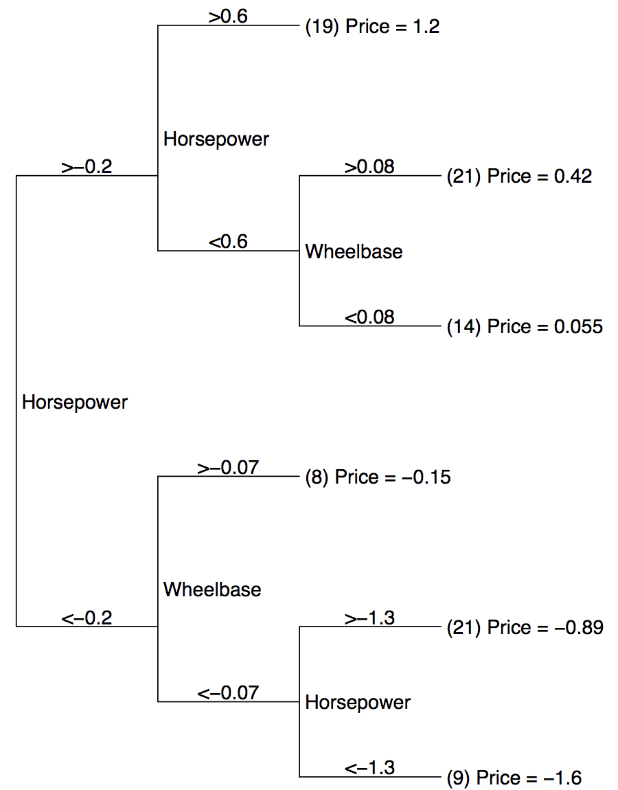
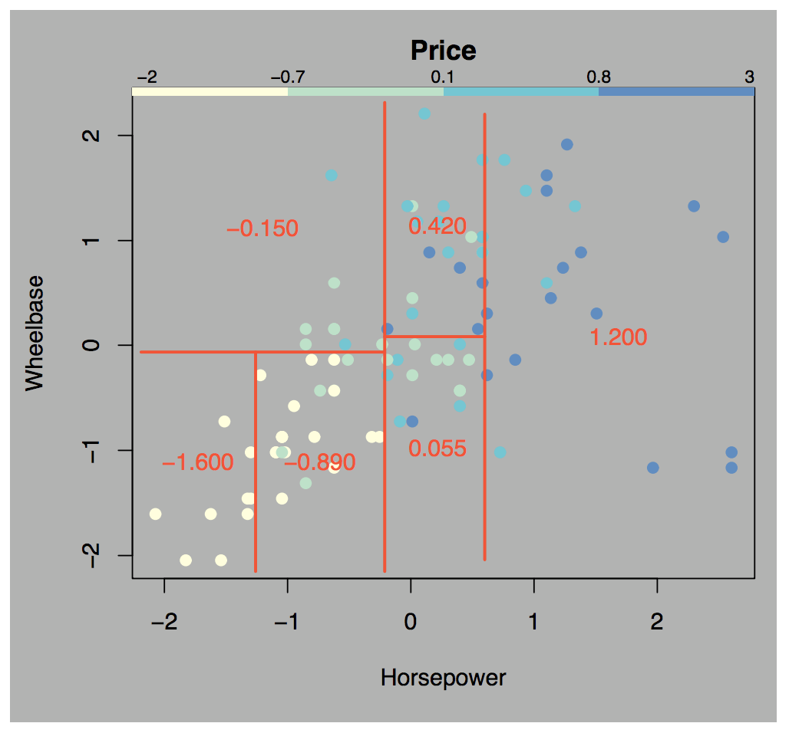
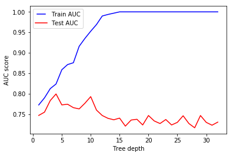
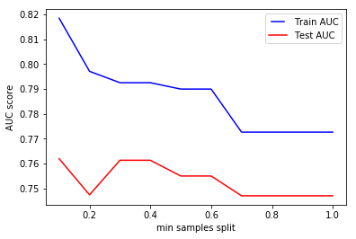
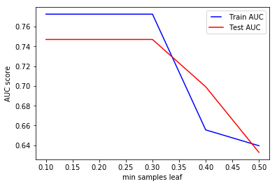

# Decision Trees - Introduction


## Introduction


In this section, we're going to introduce another kind of model for predicting values that can be used for both continuous and categorical predictions - decision trees. Decision trees are used to classify (or estimate continuous values) by partitioning the sample space as efficiently as possible into sets with similar data points until you get to (or close to) a homogenous set and can reasonably predict the value for new data points.

Despite the fact that they've been around for decades, they are still (in conjunction with ensemble methods that we'll learn about in the next section) one of the most powerful modeling tools available in the field of machine learning. They are also highly interpretable when compared to more complex models (they're simple to explain and it's easy to understand how they make their decisions).


### Entropy and Information Gain

Due to the nature of decision trees, you can get very different predictions depending on what questions you ask and in what order. The question then is how to come up with the right questions to ask in the right order. In this section, we also introduce the idea of entropy and information gain as mechanisms for selecting the most promising questions to ask in a decision tree.


### ID3 Classification Trees

We also talk about Ross Quinlan's ID3 (Iterative Dichotomiser 3) algorithm for generating a decision tree from a dataset.


### Building Trees using Scikit-learn

Next up, we look at how to build a decision tree using the built-in functions available in scikit-learn, and how to test the accuracy of the predictions using a simple accuracy measure, AUC, and a confusion matrix. We also show how to use the `graph_viz` library to generate a visualization of the resulting decision tree.


### Hyperparameter Tuning and Pruning

We then look at some of the hyperparameters available when optimizing a decision tree. For example, if you're not careful, generated decision trees can lead to overfitting of data (wherein a model is a perfect match for training data, but horrible for test data). There are a number of hyperparameters you can use when generating a tree to minimize overfitting such as maximum depth or minimum leaf sample size. We look at these various "pruning" strategies to avoid overfitting of the data and to create a better model.

### Regression with CART Trees

In addition to building decision tree classifiers, you will also build decision trees for regression problems.


## Summary

Decision trees are highly effective and interpretable. This section will provide you with the skills to create both classifiers and to perform regression using decision trees and to use hyperparameter tuning to optimize your model.


-----File-Boundary-----
# Introduction to Decision Trees

## Introduction

In this lesson, we'll take a look at **_decision tree classifiers_**. These are rule-based classifiers and belong to the first generation of modern AI. Despite the fact that this algorithm has been used in practice for decades, its simplicity and effectiveness for routine classification tasks is still on par with more sophisticated approaches. They are quite common in the business world because they have decent effectiveness without sacrificing explainability. Let's get started!

## Objectives

You will be able to:

- Describe a decision tree algorithm in terms of graph architecture
- Describe how decision trees are used to create partitions in a sample space
- Describe the training and prediction process of a decision tree


## From graphs to decision trees

We have seen basic classification algorithms (a.k.a classifiers), including Naive Bayes and logistic regression, in earlier sections. A decision tree is a different type of classifier that performs a **recursive partition of the sample space**. In this lesson, you will get a conceptual understanding of how this is achieved.

A decision tree comprises of decisions that originate from a chosen point in sample space. If you are familiar with Graph theory, a tree is a **directed acyclic graph with a root called "root node" that has no incoming edges**. All other nodes have one (and only one) incoming edge. Nodes having outgoing edges are known as **internal** nodes. All other nodes are called **leaves**. Nodes with an incoming edge, but no outgoing edges, are called **terminal nodes**.

>__Directed Acyclic Graphs__
>
> In computer science and mathematics, a directed graph is a collection of nodes and edges such that edges can be traversed only in a specified direction (eg, from node A to node B, but not from node B to node A). An acyclic graph is a graph such that it is impossible for a node to be visited twice along any path from one node to another. So, a directed acyclic graph (or, a DAG) is a directed graph with no cycles. A DAG has a **topological ordering**, or, a sequence of the nodes such that every edge is directed from earlier to later in the sequence.


## Partitioning the sample space

So, a decision tree is effectively a DAG, such as the one seen below where **each internal node partitions the sample space into two (or more) sub-spaces**. These nodes are partitioned according to some discrete function that takes the attributes of the sample space as input.

In the simplest and most frequent case, each internal node considers a single attribute so that space is partitioned according to the attribute\N{RIGHT SINGLE QUOTATION MARK}s value. In the case of numeric attributes, the condition refers to a range.



This is the basic idea behind decision trees: every internal node checks for a condition and performs a decision, and every terminal node (AKA leaf node) represents a discrete class. Decision tree induction is closely related to **rule induction**. In essence, a decision tree is a just series of IF-ELSE statements (rules). Each path from the root of a decision tree to one of its leaves can be transformed into a rule simply by combining the decisions along the path to form the antecedent, and taking the leaf\N{RIGHT SINGLE QUOTATION MARK}s class prediction as the consequence (IF-ELSE statements follow the form: IF _antecedent_ THEN _consequence_
).

## Definition

> A decision tree is a DAG type of classifier where each internal node represents a choice between a number of alternatives and each leaf node represents a classification. An unknown (or test) instance is routed down the tree according to the values of the attributes in the successive nodes. When the instance reaches a leaf, it is classified according to the label assigned to the corresponded leaf.



A real dataset would usually have a lot more features than the example above and will create much bigger trees, but the idea will remain exactly the same. The idea of feature importance is crucial to decision trees, since selecting the correct feature to make a split on will affect the complexity and efficacy of the classification process. Regression trees are represented in the same manner, but instead they predict continuous values like the price of a house.

## Training process

The process of training a decision tree and predicting the target features of a dataset is as follows:

1. Present a dataset of training examples containing features/predictors and a target (similar to classifiers we have seen earlier).

2. Train the tree model by making splits for the target using the values of predictors. Which features to use as predictors gets selected following the idea of feature selection and uses measures like "__information gain__" and "__Gini Index__". We shall cover these shortly.

3. The tree is grown until some __stopping criteria__ is achieved. This could be a set depth of the tree or any other similar measure.

4. Show a new set of features to the tree, with an unknown class and let the example propagate through a trained tree. The resulting leaf node represents the class prediction for this example datum.


## Splitting criteria

The training process of a decision tree can be generalized as "__recursive binary splitting__".
> In this procedure, all the features are considered and different split points are tried and tested using some __cost function__. The split with the lowest cost is selected.

There are a couple of algorithms used to build a decision tree:

* __CART (Classification and Regression Trees)__ uses the Gini Index as a metric
* __ID3 (Iterative Dichotomiser 3)__ uses the entropy function and information gain as metrics

## Greedy search

We need to determine the attribute that __best__ classifies the training data, and use this attribute at the root of the tree. At each node, we repeat this process creating further splits, until a leaf node is achieved, i.e., all data gets classified.

> This means we are performing a top-down, greedy search through the space of possible decision trees.

In order to identify the best attribute for ID3 classification trees, we use the "information gain" criteria.  Information gain (IG) measures how much "information" a feature gives us about the class. Decision trees always try to maximize information gain. So, the attribute with the highest information gain will be split on first.

Let's move on to the next lesson where we shall look into these criteria with simple examples.

## Additional resources

* [R2D3](http://www.r2d3.us/visual-intro-to-machine-learning-part-1/): This is highly recommended for getting a visual introduction to decision trees. Excellent animations explaining the training and prediction stages shown above.
* [Dataversity: Decision Trees Intro](http://www.dataversity.net/introduction-machine-learning-decision-trees/): A quick and visual introduction to DTs.

* [Directed Acyclic Graphs](https://cran.r-project.org/web/packages/ggdag/vignettes/intro-to-dags.html): This would help relate early understanding of graph computation to decision tree architectures.

## Summary

In this lesson, we saw an introduction to decision trees as simple yet effective classifiers. We looked at how decision trees partition the sample space based on learning rules from a given dataset. We also looked at how feature selection for splitting the tree is of such high importance. Next, we shall look at information gain criteria used for feature selection.


-----File-Boundary-----
# Entropy and Information Gain

## Introduction
**_Information gain_** is calculated using a statistical measure called **_Entropy_**. Entropy is a widely used concept in the fields of Physics, Mathematics, Computer Science (information theory), and more. You may have come across the idea of entropy in thermodynamics, societal dynamics, and a number of other domains. In electronics and computer science, the idea of entropy is usually derived from __Shannon's__ description of entropy to measure the information gain against some cost incurred in the process. In this lesson, we shall look at how this works with the simple example we introduced in the previous lesson.

## Objectives

You will be able to:


- Explain the process for selecting the best attribute for a split
- Calculate entropy and information gain by hand for a simple dataset
- Compare and contrast entropy and information gain


## Shannon's Entropy

> __Entropy is a measure of disorder or uncertainty.__

The measure is named after *Claude Shannon*, who is known as the "father of information theory". Information theory provides measures of uncertainty associated with random variables. These measures help calculate the average information content one is missing when one does not know the value of the random variable. This uncertainty is measured in bits, i.e., the amount of information (in bits) contained per average instance in a stream of instances.

Conceptually, information can be thought of as being stored or transmitted as variables that can take on different values. A variable can be thought of as a unit of storage that can take on, at different times, one of several different specified values, following some process for taking on those values. Informally, we get information from a variable by looking at its value, just as we get information from an email by reading its contents. In the case of the variable, the information is about the process behind the variable.

> The entropy of a variable is the "amount of information" contained in the variable.

This amount is not only determined by the number of different values the variable can take, just as the information in an email is not quantified just by the number of words in the email or the different possible words in the language of the email. Informally, the amount of information in an email is proportional to the amount of \N{LEFT DOUBLE QUOTATION MARK}surprise\N{RIGHT DOUBLE QUOTATION MARK} its reading causes.

For example, if an email is simply a repeat of an earlier email, then it is not informative at all. On the other hand, if, for example, the email reveals the outcome of an election, then it is highly informative. Similarly, the information in a variable is tied to the amount of surprise the value of that variable causes when revealed.

> Shannon\N{RIGHT SINGLE QUOTATION MARK}s entropy quantifies the amount of information in a variable, thus providing the foundation for a theory around the notion of information.

In terms of data, we can informally describe entropy as an indicator of how messy your data is.  A high degree of entropy always reflects "messed-up" data with low/no information content. The uncertainty about the content of the data, before viewing the data remains the same (or almost the same) as that before the data was available.

In a nutshell, higher entropy means less predictive power when it comes to doing data science with that data.

## Entropy and decision trees

> Decision trees aim to tidy the data by separating the samples and re-grouping them in the classes they belong to.

Because decision trees use a supervised learning approach, we know the target variable of our data. So, we maximize the **purity** of the classes __as much as possible__ while making splits, aiming to have __clarity__ in the leaf nodes. Remember, it may not be possible to remove the uncertainty totally, i.e., to fully clean up the data. Have a look at the image below:


We can see that the split has not __FULLY__ classified the data above, but the resulting data is __tidier__ than it was before the split. By using a series of such splits that focus on different features, we try to clean up the data as much as possible in the leaf nodes. At each step, we want to decrease the entropy, so __entropy is computed before and after the split__. If it decreases, the split is retained and we can proceed to the next step, otherwise, we must try to split with another feature or stop this branch (or quit, in which case we claim that the current tree is the best solution).


###  Calculating entropy

Let's pretend we have a sample, $S$. This sample contains $N$ total items falling into two different categories, `True` and `False`. Of the $N$ total items we have, $n$ observations have a target value equal to $True$, and $m$ observations have a target value equal to $False$. Note that if we know $N$ and $n$, we can easily calculate $m$ to be $m = N - n$.

Let's assume our boss brings us the dataset $S$, and asks us to group each observation in $N$ according to whether their target value is True or False. They also want to know the ratio of Trues to Falses in our dataset. We can calculate this as follows:

$$p = n/N - (class 1)$$ $$q = m/N = 1-p - (class 2)$$


If we know these ratios, we can calculate the _entropy_ of the dataset $S$. This will provide us with an easy way to see how organized or disorganized our dataset is. For instance, let's assume that our boss believes that the dataset should mostly be full of "True"'s, with some occasional "False"'s slipping through. The more Falses in with the Trues (or Trues in with the Falses!), the more disorganized our dataset is. We can calculate entropy using the following equation:

$$E = -p . log_2(p) - q . log_2(q)$$

Don't worry too much about this equation yet -- we'll dig deeper into what it means in a minute.

The equation above tells us that a dataset is considered tidy if it only contains one class (i.e. no uncertainty or confusion). If the dataset contains a mix of classes for our target variable, the entropy increases. This is easier to understand when we visualize it. Consider the following graph of entropy in a dataset that has two classes for our target variable:


As you can see, when the classes are split equally, $p = 0.5$ and $q = 1 - p = 0.5$, the entropy value is at its maximum, 1. Conversely, when the proportion of the split is at 0 (all of one target class) or at 1 (all of the other target class), the entropy value is 0! This means that we can easily think of entropy as follows: the more one-sided the proportion of target classes, the less entropy. Think of a sock drawer that may or may not have some underwear mixed in. If the sock drawer contains only socks (or only underwear), then entropy is 0. If you reach in and pull out an article of clothing, you know exactly what you're going to get. However, if 10% of the items in that sock drawer are actually underwear, you are less certain what that random draw will give you. That uncertainty increases as more and more underwear gets mixed into that sock drawer, right up until there is the exact same amount of socks and underwear in the drawer. When the proportion is exactly equal, you have no way of knowing item of clothing a random draw might give you -- maximum entropy, and perfect chaos!

This is where the logic behind decision trees comes in -- what if we could split the contents of our sock drawer into different subsets, which might divide the drawer into more organized subsets? For instance, let's assume that we've built a laundry robot that can separate items of clothing by color. If a majority of our socks are white, and a majority of our underwear is some other color, then we can safely assume that the two subsets will have a better separation between socks and underwear, even if the original chaotic drawer had a 50/50 mix of the two!

### Generalization of entropy

Now that we have a good real-world example to cling to, let's get back to thinking about the mathematical definition of entropy.

Entropy $H(S)$ is a measure of the amount of uncertainty in the dataset $S$. We can see this is a measurement or characterization of the amount of information contained within the dataset $S$.

We saw how to calculate entropy for a two-class variable before. However, in the real world we deal with multiclass problems very often, so it would be a good idea to see a general representation of the formula we saw before. The general representation is:

$$\large H(S) = -\sum (P_i . log_2(P_i))$$


When  $H(S) = 0$, this means that the set $S$ is perfectly classified, meaning that there is no disorganization in our data because all of our data in S is the exact same class. If we know how much entropy exists in a subset (and remember, we can subset our data by just splitting it into 2 or more groups according to whatever metric we choose), then we can easily calculate how much **_information gain_** each potential split would give us!

## Information gain

> __Information gain is an impurity/uncertainty based criterion that uses the entropy as the measure of impurity.__

There are several different algorithms out there for creating decision trees. Of those, the ID3 algorithm is one of the most popular. Information gain is the key criterion that is used by the ID3 classification tree algorithm to construct a decision tree. The decision tree algorithm will always try to __maximize information gain__. The entropy of the dataset is calculated using each attribute, and the attribute showing highest information gain is used to create the split at each node. A simple understanding of information gain can be written as:

$$Information~Gain  = Entropy_{parent} - Entropy_{child}.[child ~weighted ~average]$$


A weighted average based on the number of samples in each class is multiplied by the child's entropy, since most datasets have class imbalance. Thus the information gain calculation for each attribute is calculated and compared, and the attribute showing the highest information gain will be selected for the split. Below is a more generalized form of the equation:

When we measure information gain, we're really measuring the difference in entropy from before the split (an untidy sock drawer) to after the split (a group of white socks and underwear, and a group of non-white socks and underwear). Information gain allows us to put a number to exactly how much we've reduced our _uncertainty_ after splitting a dataset $S$ on some attribute, $A$.  The equation for information gain is:

$$\large IG(A, S) = H(S) - \sum{}{p(t)H(t)}  $$

Where:

* $H(S)$ is the entropy of set $S$
* $t$ is a subset of the attributes contained in $A$ (we represent all subsets $t$ as $T$)
* $p(t)$ is the proportion of the number of elements in $t$ to the number of elements in $S$
* $H(t)$ is the entropy of a given subset $t$

In the ID3 algorithm, we use entropy to calculate information gain, and then pick the attribute with the largest possible information gain to split our data on at each iteration.

## Entropy and information gain example

So far, we've focused heavily on the math behind entropy and information gain. This usually makes the calculations look scarier than they actually are. To show that calculating entropy/information gain is actually pretty simple, let's take a look at an example problem -- predicting if we want to play tennis or not, based on the weather, temperature, humidity, and windiness of a given day!

Our dataset is as follows:

|  outlook | temp | humidity | windy | play |
|:--------:|:----:|:--------:|:-----:|:----:|
| overcast | cool |   high   |   Y   |  yes |
| overcast | mild |  normal  |   N   |  yes |
|   sunny  | cool |  normal  |   N   |  yes |
| overcast |  hot |   high   |   Y   |  no  |
|   sunny  |  hot |  normal  |   Y   |  yes |
|   rain   | mild |   high   |   N   |  no  |
|   rain   | cool |  normal  |   N   |  no  |
|   sunny  | mild |   high   |   N   |  yes |
|   sunny  | cool |  normal  |   Y   |  yes |
|   sunny  | mild |  normal  |   Y   |  yes |
| overcast | cool |   high   |   N   |  yes |
|   rain   | cool |   high   |   Y   |  no  |
|   sunny  |  hot |  normal  |   Y   |  no  |
|   sunny  | mild |   high   |   N   |  yes |


Let's apply the formulas we saw earlier to this problem:

$$\Large  H(S) = \sum{}{-p(c) log_2 p(c)}$$

$$\large C={\{yes, no\}}$$

Out of 14 instances, 9 are classified as yes, and 5 as no. So:

$$\large  p(yes) = -(9/14)log_2(9/14) = 0.28$$
$$\large  p(no) = -(5/14)log_2(5/14) = 0.37$$
$$\large  H(S) = p(yes) + p(no) = 0.65$$

The current entropy of our dataset is 0.65. In the next lesson, we'll see how we can improve this by subsetting our dataset into different groups by calculating the entropy/information gain of each possible split, and then picking the one that performs best until we have a fully fleshed-out decision tree!

## Summary

In this lesson, we looked at calculating entropy and information gain measures for building decision trees. We looked at a simple example and saw how to use these measures to select the best split at each node. Next, we calculate these measures in Python, before digging deeper into decision trees.


-----File-Boundary-----
# Building Trees using scikit-learn

## Introduction

In this lesson, we will cover decision trees (for classification) in Python, using scikit-learn and pandas. The emphasis will be on the basics and understanding the resulting decision tree. Scikit-learn provides a consistent interface for running different classifiers/regressors. For classification tasks, evaluation is performed using the same measures as we have seen before. Let's look at our example from earlier lessons and grow a tree to find our solution.

## Objectives

You will be able to:

- Use scikit-learn to fit a decision tree classification model
- Plot a decision tree using Python


## Import necessary modules and data

In order to prepare data, train, evaluate, and visualize a decision tree, we will make use of several modules in the scikit-learn package. Run the cell below to import everything we'll need for this lesson:

```python
import numpy as np
import pandas as pd
import matplotlib.pyplot as plt
from sklearn.model_selection import train_test_split
from sklearn.tree import DecisionTreeClassifier
from sklearn.metrics import accuracy_score
from sklearn.preprocessing import OneHotEncoder
from sklearn import tree
```
The play tennis dataset is available in the repo as `'tennis.csv'`. For this step, we'll start by importing the csv file as a pandas DataFrame.

```python
# Load the dataset
df = pd.read_csv('tennis.csv')

df.head()
```
## Create training and test sets

Before we do anything we'll want to split our data into **_training_** and **_test_** sets.  We'll accomplish this by first splitting the DataFrame into features (`X`) and target (`y`), then passing `X` and `y` to the `train_test_split()` function to split the data so that 70% of it is in the training set, and 30% of it is in the testing set.

```python
X = df[['outlook', 'temp', 'humidity', 'windy']]
y = df[['play']]

X_train, X_test, y_train, y_test = train_test_split(X, y, test_size = 0.3, random_state = 42)
```
## Encode categorical data as numbers

Since all of our data is currently categorical (recall that each column is in string format), we need to encode them as numbers. For this, we'll use a handy helper object from sklearn's `preprocessing` module called `OneHotEncoder`.

```python
# One-hot encode the training data and show the resulting DataFrame with proper column names
ohe = OneHotEncoder()

ohe.fit(X_train)
X_train_ohe = ohe.transform(X_train).toarray()

# Creating this DataFrame is not necessary its only to show the result of the ohe
ohe_df = pd.DataFrame(X_train_ohe, columns=ohe.get_feature_names(X_train.columns))

ohe_df.head()
```
## Train the decision tree

One awesome feature of scikit-learn is the uniformity of its interfaces for every classifier -- no matter what classifier we're using, we can expect it to have the same important methods such as `.fit()` and `.predict()`. This means that this next part should feel familiar.

We'll first create an instance of the classifier with any parameter values we have, and then we'll fit our data to the model using `.fit()`.

```python
# Create the classifier, fit it on the training data and make predictions on the test set
clf = DecisionTreeClassifier(criterion='entropy')

clf.fit(X_train_ohe, y_train)
```
## Plot the decision tree

You can see what rules the tree learned by plotting this decision tree, using matplotlib and sklearn's `plot_tree` function.

```python
fig, axes = plt.subplots(nrows = 1,ncols = 1, figsize = (3,3), dpi=300)
tree.plot_tree(clf,
               feature_names = ohe_df.columns,
               class_names=np.unique(y).astype('str'),
               filled = True)
plt.show()
```
## Evaluate the predictive performance

Now that we have a trained model, we can generate some predictions, and go on to see how accurate our predictions are. We can use a simple accuracy measure, AUC, a confusion matrix, or all of them. This step is performed in the exactly the same manner, so it doesn't matter which classifier you are dealing with.

```python
X_test_ohe = ohe.transform(X_test)
y_preds = clf.predict(X_test_ohe)

print('Accuracy: ', accuracy_score(y_test, y_preds))
```
##\N{NO-BREAK SPACE}Summary

In this lesson, we looked at how to grow a decision tree using `scikit-learn`. We looked at different stages of data processing, training, and evaluation that you would normally come across while growing a tree or training any other such classifier. We shall now move to a lab, where you will be required to build a tree for a given problem, following the steps shown in this lesson.


-----File-Boundary-----
# Hyperparameter Tuning and Pruning in Decision Trees

## Introduction

Hyperparameter tuning relates to how we sample candidate model architectures from the space of all possible hyperparameter values. This is often referred to as __searching the hyperparameter space for the optimum values__. In this lesson, we'll look at some of the key hyperparameters for decision trees and how they affect the learning and prediction processes.

## Objectives

- Identify the role of pruning while training decision trees
- List the different hyperparameters for tuning decision trees

## Hyperparameter Optimization

>__In machine learning, a hyperparameter is a parameter whose value is set before the learning process begins.__

By contrast, the values of model parameters are derived via training as we have seen previously.
Different model training algorithms require different hyperparameters, some simple algorithms (such as ordinary least squares regression) require none. Given these hyperparameters, the training algorithm learns the parameters from the data. For instance, Lasso is an algorithm that adds a regularization hyperparameter to ordinary least squares regression, which has to be set before estimating the parameters through the training algorithm.

In this lesson, we'll look at these sorts of optimizations in the context of decision trees and see how these can affect the predictive performance as well as the computational complexity of the tree.

## Tree pruning

Now that we know how to grow a decision tree using Python and scikit-learn, let's move on and practice __optimizing__ a classifier. We can tweak a few parameters in the decision tree algorithm before the actual learning takes place.

A decision tree, grown beyond a certain level of complexity leads to overfitting. If we grow our tree and carry on using poor predictors that don't have any impact on the accuracy, we will eventually a) slow down the learning, and b) cause overfitting.  Different tree pruning parameters can adjust the amount of overfitting or underfitting in order to optimize for increased accuracy, precision, and/or recall.

> __This process of trimming decision trees to optimize the learning process is called "tree pruning".__

We can prune our trees using:

- Maximum depth: Reduce the depth of the tree to build a generalized tree. Set the depth of the tree to 3, 5, 10 depending after verification on test data

- Minimum samples leaf with split: Restrict the size of sample leaf

- Minimum leaf sample size: Size in terminal nodes can be fixed to 30, 100, 300 or 5% of total

- Maximum leaf nodes: Reduce the number of leaf nodes

- Maximum features: Maximum number of features to consider when splitting a node

Let's look at a few hyperparameters and learn about their impact on classifier performance:


## `max_depth`

The parameter for decision trees that we normally tune first is `max_depth`. This parameter indicates how deep we want our tree to be. If the tree is too deep, it means we are creating a large number of splits in the parameter space and capturing more information about underlying data. This may result in __overfitting__ as it will lead to learning granular information from given data, which makes it difficult for our model to generalize on unseen data.
Generally speaking, a low training error but a large testing error is a strong indication of this.

If, on the other hand, the tree is too shallow, we may run into __underfitting__, i.e., we are not learning enough information about the data and the accuracy of the model stays low for both the test and training samples. The following example shows the training and test AUC scores for a decision tree with depths ranging from 1 to 32.




In the above example, we see that as the tree depth increases, our validation/test accuracy starts to go down after a depth of around 4. But with even greater depths, the training accuracy keeps on rising, as the classifier learns more information from the data. However this information can not be mapped onto unseen examples, hence the validation accuracy falls down constantly. Finding the sweet spot (e.g. depth = 4) in this case would be the first hyperparameter that we need to tune.

## `min_samples_split`

The hyperparameter `min_samples_split` is used to set the __minimum number of samples required to split an internal node__. This can vary between two extremes, i.e., considering only one sample at each node vs. considering all of the samples at each node - for a given attribute.

When we increase this parameter value, the tree becomes more constrained as it has to consider more samples at each node. Here we will vary the parameter from 10% to 100% of the samples.




In the above plot, we see that the training and test accuracy stabilize at a certain minimum sample split size, and stays the same even if we carry on increasing the size of the split. This means that we will have a complex model, with similar accuracy than a much simpler model could potentially exhibit. Therefore, it is imperative that we try to identify the optimal sample size during the training phase.

> **Note**: `max_depth` and `min_samples_split` are also both related to the computational cost involved with growing the tree. Large values for these parameters can create complex, dense, and long trees. For large datasets, it may become extremely time-consuming to use default values.


## `min_samples_leaf`

This hyperparameter is used to identify the minimum number of samples that we want a leaf node to contain. When this minimum size is achieved at a node, it does not get split any further.  This parameter is similar to `min_samples_splits`, however, this describes the minimum number of samples at the leaves, the base of the tree.




The above plot shows the impact of this parameter on the accuracy of the classifier. We see that increasing this parameter value after an optimal point reduces accuracy. That is due to underfitting again, as keeping too many samples in our leaf nodes means that there is still a high level of uncertainty in the data.

The main difference between the two is that `min_samples_leaf` guarantees a minimum number of samples in a leaf, while `min_samples_split` can create arbitrary small leaves, though `min_samples_split` is more common in practice. These two hyperparameters make the distinction between a leaf (terminal/external node) and an internal node. An internal node will have further splits (also called children), while a leaf is by definition a node without any children (without any further splits).

For instance, if `min_samples_split = 5`, and there are 7 samples at an internal node, then the split is allowed. But let's say the split results in two leaves, one with 1 sample, and another with 6 samples. If `min_samples_leaf = 2`, then the split won't be allowed (even if the internal node has 7 samples) because one of the leaves resulted will have less than the minimum number of samples required to be at a leaf node.

### Are there more hyperparameters?

Yes, there are! Scikit-learn offers a number of other hyperparameters for further fine-tuning the learning process. [Consult the official doc](https://scikit-learn.org/stable/modules/generated/sklearn.tree.DecisionTreeClassifier.html) to look at them in detail. The hyperparameters mentioned here are directly related to the complexity which may arise in decision trees and are normally tuned when growing trees. We'll shortly see this in action with a real dataset.

## Additional Resources
- [Overview of hyperparameter tuning](https://cloud.google.com/ml-engine/docs/tensorflow/hyperparameter-tuning-overview)
- [Demystifying hyperparameter tuning](https://towardsdatascience.com/demystifying-hyper-parameter-tuning-acb83af0258f)
- [Pruning decision trees](https://www.displayr.com/machine-learning-pruning-decision-trees/)

## Summary

In this lesson, we looked at the idea of optimizing hyperparameters and how pruning plays an important role in restricting the growth of a decision tree. We looked at a few hyperparameters which directly impact the potential overfitting/underfitting in trees. Next, we'll see these in practice using scikit-learn.


-----File-Boundary-----
# Regression with CART Trees

## Introduction

As we've learned, a decision tree is a supervised machine learning model that can be used both for classification and regression tasks. We have seen that a decision tree uses a tree structure to predict an output class for a given input example in a classification task. For regression analysis, each path in the tree from the root node to a leaf node represents a decision path that ends in a predicted value. In this lesson, we shall see how regression is performed in using a decision tree regressor using a simple example.

**Note**: Kindly visit the [official documentation](https://scikit-learn.org/stable/modules/generated/sklearn.tree.DecisionTreeRegressor.html) for the regressor tree function used in this lesson.


## Objectives

You will be able to:

- Explain recursive partitioning
- Fit a decision tree regression model with scikit-learn

## Recursive partitioning

Linear regression is considered a __global model__ as there is a single model holding over the entire sample space. For data containing complex features with complicated and nonlinear relations, assembling such a single global model can be a very difficult and computationally expensive task.

Another way to handle nonlinear regressions is to __partition the sample space into smaller regions__, as we have already seen in previous lessons with classification trees. This isn't much different in regression. Our goal is partition down to increasingly smaller, simpler subsets until we can fit simple regression models to them. Since each subset is a partition of a smaller subset that is itself a subset, this makes it a textbook example of **_Recursive Partioning_**.

Recall that in classification trees, the leaf nodes (the deepest nodes, or the ones at the end of each particular path) are the ones that contain the purest subsets of the data. Regression trees work a bit differently, but the general idea is still the same. With regression trees, each leaf node of the tree represents a __cell of the partition__. These cells are the smallest unit where a simple regression can be fit to the data accurately. Splitting the data still works the same way as we saw in previous lessons for classification -- we use our tree model to continuously subset down to smaller, more specific subsets until we reach a level where we can build the simplest regression model to the most specific subset in our data. For example, a regression tree may recursively partition the model down further and further until it gets all customers over the age of 50 residing in Florida with an income over \$60k/year, and then fit a simple regression model to only the data points that fit within this specific subset.


## Simple local models

One point worth noting is that the simple regression models for each partition aren't being used as regressions in real-time. Instead, they take the sample mean of the dependent variable for that partition. Whenever the model makes a prediction, it uses this sample mean rather than calculating the actual regression model. In practice, this works quite well, and has some distinct advantages. Models are easier to interpret, and faster to use for **_inference_** (making predictions) since they are just retrieving the stored mean value rather than calculating the actual output of the regression.

This is more easily understood when visualized. Consider the regression tree below, which predicts the price of cars based on wheelbase and horsepower:


Once we have created a decision tree, we can visualize the decision boundaries of that tree (assuming that the dimensionality is small enough for visualization). Notice that all the dividing lines are parallel to the axes because each internal node checks whether a single variable is above or below a given value. In simpler terms, all decision boundaries with decision trees will always be horizontal or vertical if visualized -- there are no diagonal, wavy, or curvy lines, because of the nature of the boolean (true/false) logic used by decision trees to determine the splits!


The tree correctly represents the interaction between Horsepower and Wheelbase, i.e. when Horsepower > 0.6, Wheelbase no longer matters. When both are equally important, the tree switches between them.

Once we train the tree, the local models are completely understood,  so all the effort should go into finding a good partitioning of the data.

### CART training algorithm

In this lab, we will focus on the *CART* algorithm (Classification and Regression Trees) for *regression*.

> The CART algorithm builds a *binary tree* in which every non-leaf node has exactly two children (corresponding to a yes/no answer).

Given a set of training examples and their labels, the algorithm repeatedly splits the training examples $D$ into two subsets $D_{left}, D_{right}$ using some feature set $f$ and feature threshold $t_f$ such that samples with the same label are grouped together.

At each node, the algorithm selects the split $\theta = (f, t_f)$ that produces the smallest *mean squared error* (MSE) (alternatively, we could use the mean absolute error).

So at each step, the algorithm selects the parameters $\theta$ that minimizes the following cost function:

\begin{equation}
J(D, \theta) = \frac{n_{left}}{n_{total}} MSE_{left} + \frac{n_{right}}{n_{total}} MSE_{right}
\end{equation}

- $D$: remaining training examples
- $n_{total}$ : number of remaining training examples
- $\theta = (f, t_f)$: feature and feature threshold
- $n_{left}/n_{right}$: number of samples in the left/right subset
- $MSE_{left}/MSE_{right}$: MSE of the left/right subset

This step is repeated recursively until the *maximum allowable depth* is reached or the current number of samples $n_{total}$ drops below some minimum number. The original equations can be found [here](http://scikit-learn.org/stable/modules/tree.html).

After building the tree, new examples can be classified by navigating through the tree, testing at each node the corresponding feature until a leaf node/prediction is reached.

### Mean Squared Error (MSE)

When performing regression with CART trees (i.e. the target values are continuous) we can evaluate a split using its MSE. The MSE of node $m$ is computed as follows:

\begin{equation}
\hat{y}_m = \frac{1}{n_{m}} \sum_{i \in D_m} y_i
\end{equation}
\begin{equation}
MSE_m = \frac{1}{n_{m}} \sum_{i \in D_m} (y_i - \hat{y}_m)^2
\end{equation}

- $D_m$: training examples in node $m$
- $n_{m}$ : total number of training examples in node $m$
- $y_i$: target value of $i-$th example

Let's see the above in action with a simple experiment. We shall generate some non-linear synthetic data for our `X` and `y` attributes and fit it to a regression tree. So let's move ahead with this. In order to have a visual understanding of how this works, we shall deal with a simple regression problem between two variables `X` and `y`, where `y` is a simple function of `X` that we want to learn. Let's see this below:

## Genarate data

Run the cell below to generate the data we will be using in this lesson:

```python
import numpy as np
import matplotlib.pyplot as plt
%matplotlib inline
from sklearn.model_selection import train_test_split
plt.style.use('seaborn')
np.random.seed(124)

# Generate 100 examples of X and y (a simple cubic function of X)
X = np.linspace(-3, 3, 100)
y = X ** 3 + np.random.randn(100)

# Plot the data
plt.figure(figsize=(15,6))
plt.scatter(X, y)
plt.title("Simple quadratic dataset with noise")
plt.xlabel("Feature values")
plt.ylabel("Target values")
plt.show()
```
Let's now create our features and labels, and also perform a 75/25 split for the training and test sets:

```python
X = X.reshape(-1, 1)
X_train, X_test, y_train, y_test = train_test_split(X, y, test_size=0.25, random_state=42)

# Print the data dimensions
print('Shape X_train:', X_train.shape)
print('Shape y_train:', y_train.shape)
print('Shape X_test:', X_test.shape)
print('Shape y_test:', y_test.shape)
```
## Fit a Regression tree

You can use `DecisionTreeRegressor()` to fit a decision tree regressor in Scikit-learn. Let's create an instance of this class just like the classification tasks and fit it to data. For now, we'll set the max depth parameter to 3, as we now know that increasing this could lead to overfitting. We can experiment with different depths later.

```python
from sklearn.tree import DecisionTreeRegressor
regressor = DecisionTreeRegressor(random_state=42, max_depth=3)
regressor.fit(X_train, y_train)
```
## Prediction and evaluation

The output of the cell above shows us the default values for most hyperparameters. You are encouraged to check the official documentation for this class for details on options available to you for growing regression trees!

We can now predict labels with previously unseen data and calculate MSE. As an extra measure, we can also look at calculating the R-squared value to inspect the goodness of fit for our model.

```python
from sklearn.metrics import mean_squared_error as mse
from sklearn.metrics import r2_score

# Make predictions and evaluate
y_pred = regressor.predict(X_test)
print('MSE score:', mse(y_test, y_pred))
print('R-sq score:', r2_score(y_test,y_pred))
```
## Visualize the model fit

Our R-squared score tells us that this appears to be a very good fit (remember $r^2$ ranges from 0 (poor) to 1 (best)). Let's visualize the learned function below with our scatter plot from earlier and see how well it fits.

```python
X_grid = np.arange(min(X), max(X), 0.01)
X_grid = X_grid.reshape((len(X_grid), 1))
plt.figure(figsize=(15,6))
plt.scatter(X, y, color = 'red', label='data')
plt.plot(X_grid, regressor.predict(X_grid), color = 'green', label='Regression function')
plt.title('Decision Tree Regression')
plt.xlabel('Features')
plt.ylabel('Target')
plt.legend()
plt.show()
```
We found this regression line without using any complex non-linear functions, in a fraction of time. This is the key benefit of regression trees over other regression techniques that we have seen earlier.

### Some observations

- The function is not continuous
- Horizontal lines are averages of all data points in sections created
- These horizontal lines represent sections. Predictions are averages of data points in these sections. So prediction for all values from the same section will be the same

__Try changing the `max_depth` parameter in the model and grow the tree again. The resulting visualization will clearly show you the impact of tree depth on overfitting.__

## Caveats

Without **regularization**, decision trees are likely to overfit the training examples. This can be prevented using techniques like *pruning* or by providing a maximum allowed tree depth and/or a minimum number of samples required to split a node further as we saw with classification.

## Additional resources

- [An Introduction to Recursive Partitioning: Rationale, Application and Characteristics of Classification and Regression Trees, Bagging and Random Forests](https://www.ncbi.nlm.nih.gov/pmc/articles/PMC2927982/)
- [CART: Classification And Regression Trees for Machine Learning](https://machinelearningmastery.com/classification-and-regression-trees-for-machine-learning/)
- [Popular Decision Tree: Classification and Regression Trees (C&RT)](http://www.statsoft.com/Textbook/Classification-and-Regression-Trees)
- [Youtube: CART trees](https://www.youtube.com/watch?v=DCZ3tsQIoGU)

## Summary

In this lesson, you learned about CART trees for regression. You looked at how the CART algorithm works, along with MSE as a loss measure which is used as a learning mechanism. You saw a simple experiment with some synthetic data where we used a tree regressor to learn a non-linear function.


-----File-Boundary-----
# Decision Trees - Recap


## Key Takeaways

The key takeaways from this section include:

* Decision trees can be used for both categorization and regression tasks
* They are a powerful and interpretable technique for many machine learning problems (especially when combined with ensemble methods)
* Decision trees are a form of Directed Acyclic Graphs (DAGs) - you traverse them in a specified direction, and there are no "loops" in the graphs to go backward
* Algorithms for generating decision trees are designed to maximize the information gain from each split
* A popular algorithm for generating decision trees is ID3 - the Iterative Dichotomiser 3 algorithm
* There are several hyperparameters for decision trees to reduce overfitting - including maximum depth, minimum samples to split a node that is currently a leaf, minimum leaf sample size, maximum leaf nodes, and maximum features


-----File-Boundary-----
