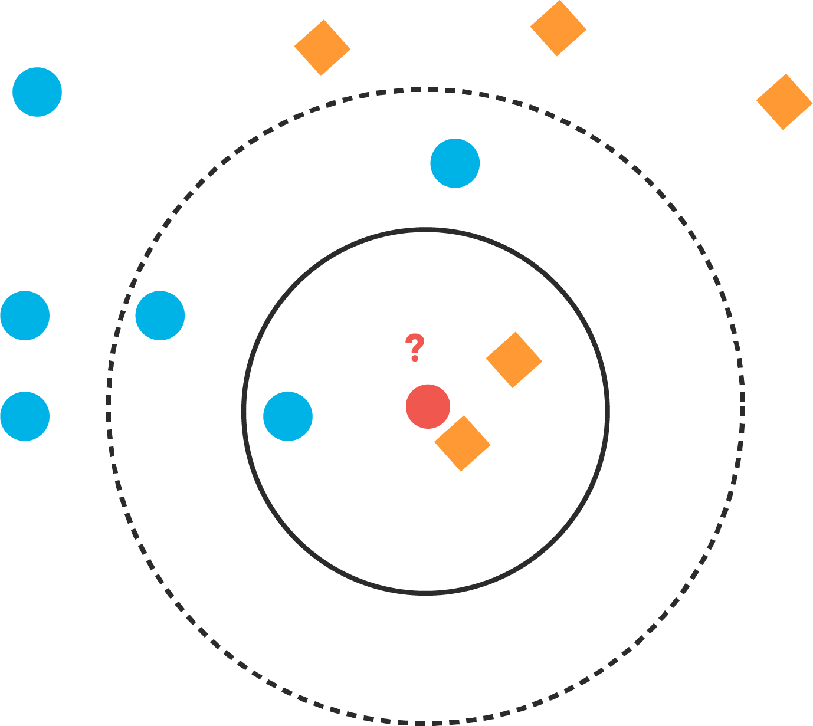
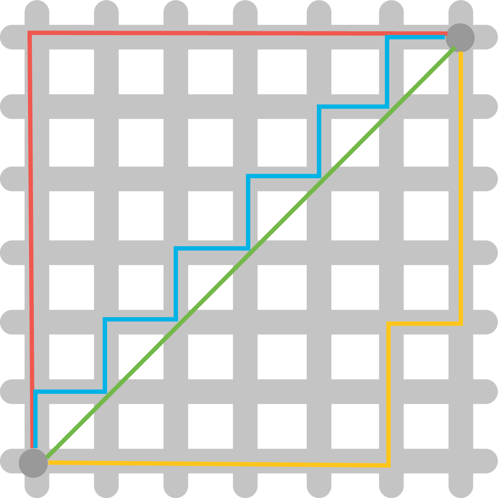
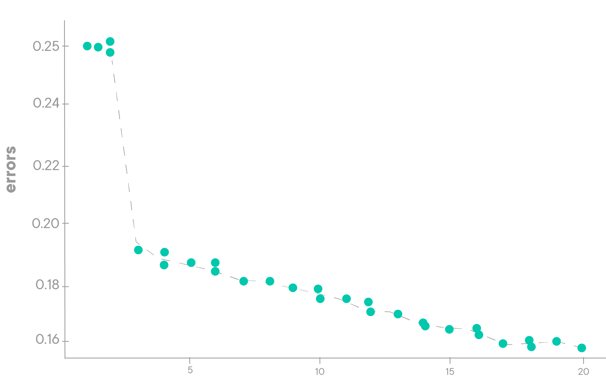

# K-Nearest Neighbors - Introduction

## Introduction

In this section you'll look at an intuitive algorithm known as K-Nearest Neighbors (KNN). KNN is an effective classification and regression algorithm that uses nearby points in order to generate a prediction.


## KNN

The K-Nearest Neighbors algorithm works as follows:

1. Choose a point
2. Find the K-nearest points
    1. K is a predefined user constant such as 1, 3, 5, or 11
3. Predict a label for the current point:
    1. Classification - Take the most common class of the k neighbors
    2. Regression - Take the average target metric of the k neighbors
    3. Both classification or regression can also be modified to use weighted averages based on the distance of the neighbors


## Distance metrics

An incredibly important decision when using the KNN algorithm is determining an appropriate distance metric. This makes a monumental impact to the output of the algorithm. While there are additional distance metrics, such as cosine distance which we will not cover, you'll get a solid introduction to distance metrics by looking at the standard Euclidean distance and its more generic counterpart, Minkowski distance.

## K-means

While outside the scope of this section, it is worth mentioning the related K-means algorithm which uses similar principles as KNN but serves as an unsupervised learning clustering algorithm. In the K-means algorithm, K represents the number of clusters rather then the number of neighbors. Unlike KNN, K-means is an iterative algorithm which repeats until convergence. Nonetheless, its underlying principle is the same, in that it groups data points together using a distance metric in order to create homogeneous groupings.


## Summary

In this brief lesson, you were introduced to the KNN algorithm. From here, you'll jump straight to the details of KNN, practice coding your own implementation and then get an introduction to use pre-built tools within scikit-learn for KNN.


-----File-Boundary-----
# Distance Metrics

## Introduction

In this lesson, you'll learn about various kinds of distance metrics that you can use as a way to quantify similarity!


## Objectives

You will be able to:

- Calculate Manhattan distance between two points
- Calculate Euclidean distance between two points
- Compare and contrast Manhattan, Euclidean, and Minkowski distance


## Relationship between similarity and distance

In this section, you'll be focusing on a foundational **_Supervised Learning_** algorithm, the **_K-Nearest Neighbors_**, or **_KNN_** for short. In order to understand how this algorithm works, you first have to understand some **_distance metrics_**, and how you can use them to tell us how similar two objects are.



The assumption that distance-based classifiers like KNN are built on is that **_distance helps us quantify similarity_**.  Objects that are more alike are more likely to be the same class. By treating each column in your dataset as a separate dimension, you can plot each data point that you have and measure the distance between them!

You might remember learning about how to calculate the distance between two points on a Cartesian plane from school. That's certainly an important distance metric that you'll be using -- however, there is more than one distance metric you can use, and all of them can be useful depending on the context of the problem.  In this lesson, you'll learn how to calculate different distance metrics so that you have a tool to evaluate how similar or different data points are from one another when we begin exploring the KNN algorithm!


## Manhattan distance

The first (and easiest) distance metric you'll cover is **_Manhattan distance_**.  Manhattan distance is aptly named, because it measures the distance from one point to another traveling along the axes of a grid. Take a look at the following image:



In this image, all the lines except for the green line measure the Manhattan distance between the two points.  You'll notice that if you start from the point in the bottom left corner of the grid and count the number of units moved in the X dimension (left and right) and the number of units moved in the Y dimension (up and down), the distance is the for the red, blue, and yellow lines.

The easiest way to remember Manhattan distance is to use the analogy that provides this distance metric it's name -- look at the picture above, but picture this grid as the famous grid of streets in Manhattan. If you were to take a taxi from point A (bottom left) to point b (top right), how many blocks east or west would the taxi have to travel? How many blocks north or south? How many blocks total?  By calculating the total number of blocks we have to drive, we're actually calculating the Manhattan distance between point A and point B.

So far, this discussion has explored Manhattan distance in a 2-dimensional space.  However, all of the distance metrics you're going to learn can generalize to an n-dimensional space.  For instance, in 3 dimensions, it's no harder to calculate the distance from one square on a Rubik's Cube to any other square -- all you do is take into account how many squares we need to move towards or away from ourselves to measure depth, as well as left/right and up/down. Once you know the total units you need to move in each of these 3 dimensions, you just sum them to calculate the Manhattan distance in 3 dimensions.

Here's the formula for Manhattan distance:

$$ \large d(x,y) = \sum_{i=1}^{n}|x_i - y_i | $$

Let's break this formula down:


The left side of the equals sign just means "the distance between point x and point y".

The right side of the equals sign looks like it has a bit more going on, but don't let the mathematical notation scare you. In basic English, it essentially means "calculate the absolute number of units you move in each distinct dimension, and then sum them all up".

The $\sum$ just means "the cumulative sum of each step". In a given step, you take a dimension, and then look at the corresponding values for that dimension on point X and point Y. You then compute the absolute value of the difference between them by subtracting Y's value for that dimension from X's value for that dimension, and then add it to our total.

If the rationale here seems unclear to you, think of it this way -- from a practical standpoint, walking 3 blocks to the west is the same as walking 3 blocks to the east. However, when you're doing this on a grid, you still want movements in the opposite (negative) direction to count! In order to make them count, you calculate the absolute difference between them. This makes it so that a move from 0 to -3 and a move from 0 to 3 measure the same amount of distance.

Let's think about what this would look like in code.  Let's assume that each point is stored as a tuple of values. If you wanted to calculate the distance between them, you can easily do this with a `for` loop!

```python
# Locations of two points A and B
A = (2, 3, 5)
B = (1, -1, 3)

manhattan_distance = 0

# Use a for loop to iterate over each element
for i in range(3):
    # Calculate the absolute difference and add it
    manhattan_distance += abs(A[i] - B[i])

manhattan_distance
```

### A hint on turning mathematical notation into code

Anytime you see mathematical notation that includes the $\sum$ symbol, this can reliably be represented as a `for` loop! The math to the right of the symbol tells you what the body of the `for` loop should look like (what unique things you're doing in each given step).  Similarly, the numbers on the bottom and top of the $\sum$ sign tell you the starting and stopping indexes, respectively. In the case of the Manhattan distance equation above, the $n$ means "length n", the length of the entire number of dimensions, because we want to count them all in our calculations.

> **_NOTE_**: Be careful interpreting the starting dimensions. Remember that although mathematicians start counting at 1, computer scientists start counting at 0! Whereas from a mathematical perspective, you are starting at dimension 1 and counting up to and including dimension 3, in your code, you start at dimension 0 and count up to and including dimension 2.

## Euclidean distance

The next and most common distance metric is **_Euclidean distance_**.  The equation at the heart of this one is probably familiar to you: $a^2 + b^2 = c^2$, or the **_Pythagorean theorem_**! Take a look at the diagram above with all the colored lines on it. The green line measures the Euclidean distance between the two points, by moving in a straight line. If you take the horizontal and vertical sections of the red line and treat them as $a$ and $b$, then you can easily use the Pythagorean theorem to calculate the length of the green line to calculate the euclidean distance between the two points.

In this case, that is:  $6^2 + 6^2 =  \sqrt{72} \approx 8.485$


### Working with more than two dimensions

Just as with Manhattan distance, you can generalize this equation to $n$ dimensions. You just add any extra dimensions in, same as we did with the first two. For instance, if you wanted to calculate the Euclidean distance between two points in a 3-dimensional space, then the formula would be $d^2 = a^2 + b^2 + c^2$, with $d$ being the Euclidean distance.

Let's take a look at formula for the Euclidean distance:

$$ \large d(x,y) = \sqrt{\sum_{i=1}^{n}(x_i - y_i)^2} $$

This is a straightforward equation -- for each dimension, you subtract one point's value from the other's to get the length of that "side" of the triangle in that dimension, square it, and add it to our running total. The square root of that running total is our Euclidean distance.

In Python, you can easily calculate Euclidean distance as follows:

```python
from math import sqrt

# Locations of two points A and B
A = (2, 3, 5)
B = (1, -1, 3)

euclidean_distance = 0

# Use a for loop to iterate over each element
for i in range(3):
    # Calculate the difference, square, and add it
    euclidean_distance += (A[i] - B[i])**2

# Square root of the final result
euclidean_distance = sqrt(euclidean_distance)

euclidean_distance
```
## Minkowski distance

A final distance metric you should be familiar with is **_Minkowski distance_**. THe Minkowski distance is a generalized distance metric across a _Normed Vector Space_. A Normed Vector Space is just a fancy way of saying a collection of space where each point has been run through a function. It can be any function, as long it meets two criteria:
1. the zero vector (just a vector filled with zeros) will output a length of 0, and
2. every other vector must have a positive length

Don't worry too much about the specifics of the mathematical definition above. Instead, try to gain an intuition for what Minkowski distance actually measures. Both the Manhattan and Euclidean distances are actually _special cases of Minkowski distance_. Take a look:

$$\large d(x, y) = \left(\sum_{i=1}^{n}|x_i - y_i|^c\right)^\frac{1}{c}$$


Do you see it? It's the exponent! In this case, the function is just an exponent. If you were to define a value for the exponent, you could say that:

```python
# Manhattan Distance is the sum of all side lengths to the first power
manhattan_distance = np.power((length_side_1 + length_side_2 + ... length_side_n)**1 , 1/1)

# Euclidean Distance is the square root of the sum of all side lengths to the second power
euclidean_distance = np.power((length_side_1 + length_side_2 + ... length_side_n)**2, 1/2)

# Minkowski Distance with a value of 3 would be the cube root of the sum of all side lengths to the third power
minkowski_distance_3 = np.power((length_side_1 + length_side_2 + ... length_side_n)**3, 1/3)

# Minkowski Distance with a value of 5
minkowski_distance_5 = np.power((length_side_1 + length_side_2 + ... length_side_n)**5, 1/5)
```

> **NOTE**: You'll often see Minkowski distance used as a parameter for any distance-based machine learning algorithms inside `sklearn`.


## Summary

Knowing what you now know about Minkowski distance, and its two special cases, Manhattan and Euclidean distances, think about how you could write a generalized distance function that can calculate any of these, because it's exactly what you'll be doing in our next lab!


-----File-Boundary-----
# K-Nearest Neighbors

## Introduction

In this lesson, you'll learn about a supervised learning algorithm, **_K-Nearest Neighbors_**; and how you can use it to make predictions for classification and regression tasks!

## Objectives

You will be able to:

* Describe how KNN makes classifications


## What is K-Nearest Neighbors?

**_K-Nearest Neighbors_** (or KNN, for short) is a supervised learning algorithm that can be used for both **_Classification_** and **_Regression_** tasks. However, in this section, we will cover KNN only in the context of classification. KNN is a distance-based classifier, meaning that it implicitly assumes that the smaller the distance between two points, the more similar they are. In KNN, each column acts as a dimension. In a dataset with two columns, we can easily visualize this by treating values for one column as X coordinates and and the other as Y coordinates. Since this is a **_Supervised learning algorithm_**, you must also have the labels for each point in the dataset, or else you wouldn't know what to predict!

## Fitting the model

KNN is unique compared to other classifiers in that it does almost nothing during the "fit" step, and all the work during the "predict" step. During the "fit" step, KNN just stores all the training data and corresponding labels. No distances are calculated at this point.

## Making predictions with K

All the magic happens during the "predict" step. During this step, KNN takes a point that you want a class prediction for, and calculates the distances between that point and every single point in the training set. It then finds the `K` closest points, or **_Neighbors_**, and examines the labels of each. You can think of each of the K-closest points getting to 'vote' about the predicted class. Naturally, they all vote for the same class that they belong to. The majority wins, and the algorithm predicts the point in question as whichever class has the highest count among all of the k-nearest neighbors.

In the following animation, K=3:


[gif source](https://gfycat.com/wildsorrowfulchevrotain)

## Distance metrics

When using KNN, you can use **_Manhattan_**, **_Euclidean_**, **_Minkowski distance_**, or any other distance metric. Choosing an appropriate distance metric is essential and will depend on the context of the problem at hand.

## Evaluating model performance

How to evaluate the model performance depends on whether you're using the model for a classification or regression task. KNN can be used for regression (by averaging the target scores from each of the K-nearest neighbors), as well as for both binary and multicategorical classification tasks.

Evaluating classification performance for KNN works the same as evaluating performance for any other classification algorithm -- you need a set of predictions, and the corresponding ground-truth labels for each of the points you made a prediction on. You can then compute evaluation metrics such as **_Precision, Recall, Accuracy, F1-Score_** etc.

## Summary
Great! Now that you know how the KNN classifier works, you'll implement KNN using Python from scratch in the next lab.


-----File-Boundary-----
# Finding the Best Value for K

## Introduction

In this lesson, you'll investigate how changing the value for K can affect the performance of the model, and how to use this to find the best value for K.

## Objectives

- Conduct a parameter search to find the optimal value for K
- Explain how KNN is related to the curse of dimensionality

## Finding the optimal number of neighbors

By now, you've got a strong understanding of how the K-Nearest Neighbors algorithm works, but you likely have at least one lingering question&mdash;**_what is the best value to use for K_**? There's no set number that works best. If there was, it wouldn't be called **_K_**-nearest neighbors. While the best value for K is not immediately obvious for any problem, there are some strategies that you can use to select a good or near optimal value.

## K, overfitting, and underfitting

In general, the smaller K is, the tighter the "fit" of the model. Remember that with supervised learning, you want to fit a model to the data as closely as possible without **_overfitting_** to patterns in the training set that don't generalize.  This can happen if your model pays too much attention to every little detail and makes a very complex decision boundary. Conversely, if your model is overly simplistic, then you may have **_underfit_** the model, limiting its potential. A visual explanation helps demonstrate this concept in practice:


When K is small, any given prediction only takes into account a very small number of points around it to make the prediction. If K is too small, this can end up with a decision boundary that looks like the overfit picture on the right.

Conversely, as K grows larger, it takes into account more and more points, that are farther and farther away from the point in question, increasing the overall size of the region taken into account. If K grows too large, then the model begins to underfit the data.

It's important to try to find the best value for K by iterating over a multiple values and comparing performance at each step.


As you can see from the image above, `k=1` and `k=3` will provide different results!

## Iterating over values of K

Since the model arrives at a prediction by voting, it makes sense that you should only use odd values for k, to avoid ties and subsequent arbitrary guesswork. By adding this constraint (an odd value for k) the model will never be able to evenly split between two classes. From here, finding an optimal value of K requires some iterative investigation.

The best way to find an optimal value for K is to choose a minimum and maximum boundary and try them all! In practice, this means:

1. Fit a KNN classifier for each value of K
2. Generate predictions with that model
3. Calculate and evaluate a performance metric using the predictions the model made
4. Compare the results for every model and find the one with the lowest overall error, or highest overall score!



A common way to find the best value for K at a glance is to plot the error for each value of K. Find the value for K where the error is lowest. If this graph continued into higher values of K, we would likely see the error numbers go back up as K increased.

## KNN and the curse of dimensionality

Note that KNN isn't the best choice for extremely large datasets, and/or models with high dimensionality. This is because the time complexity (what computer scientists call "Big O", which you saw briefly earlier) of this algorithm is exponential. As you add more data points to the dataset, the number of operations needed to complete all the steps of the algorithm grows exponentially! That said, for smaller datasets, KNN often works surprisingly well, given the simplicity of the overall algorithm. However, if your dataset contains millions of rows and thousands of columns, you may want to choose another algorithm, as the algorithm may not run in any reasonable amount of time;in some cases, it could quite literally take years to complete!

## Summary

In this lesson you learned how to determine the best value for K and that the KNN algorithm may not necessarily be the best choice for large datasets due to the large amount of time it can take for the algorithm to run.


-----File-Boundary-----
# KNN with scikit-learn

## Introduction

In this lesson, you'll explore how to use scikit-learn's implementation of the K-Nearest Neighbors algorithm. In addition, you'll also learn about best practices for using the algorithm.

## Objectives

You will be able to:

- List the considerations when fitting a KNN model using scikit-learn

## Why use scikit-learn?

While you've written your own implementation of the KNN algorithm, scikit-learn adds many backend optimizations which can make the algorithm perform faster and more efficiently. Building your own implementation of any machine learning algorithm is a valuable experience, providing great insight into how said algorithm works. However, in general, you should always use professional toolsets such as scikit-learn whenever possible; since their implementations will always be best-in-class, in a way a single developer or data scientist simply can't hope to rival on their own. In the case of KNN, you'll find scikit-learn's implementation to be much more robust and fast, because of optimizations such as caching distances in clever ways under the hood.

## Read the `sklearn` docs

As a rule of thumb, you should familiarize yourself with any documentation available for any libraries or frameworks you use. scikit-learn provides high-quality documentation. For every algorithm, you'll find a general [documentation page](https://scikit-learn.org/stable/modules/generated/sklearn.neighbors.KNeighborsClassifier.html) which tells you inputs, parameters, outputs, and caveats of any algorithm. In addition, you'll also find very informative [User Guides](https://scikit-learn.org/stable/modules/neighbors.html#classification) that explain both how the algorithm works, and how to best use it, complete with sample code!

For example, the following image can be found in the scikit-learn user guide for K-Nearest Neighbors, along with an explanation of how different parameters can affect the overall performance of the model.


## Best practices

You'll also find that scikit-learn provides robust implementations for additional components of the algorithm implementation process such as evaluation metrics. With that, you can easily evaluate models using precision, accuracy, or recall scores on the fly using built-in functions!

With that, it's important to focus on practical questions when completing the upcoming lab. In particular, try to focus on the following questions:

* What decisions do I need to make regarding my data? How might these decisions affect overall performance?

* Which predictors do I need? How can I confirm that I have the right predictors?

* What parameter values (if any) should I choose for my model? How can I find the optimal value for a given parameter?

* What metrics will I use to evaluate the performance of my model? Why?

* How do I know if there's room left for improvement with my model? Are the potential performance gains worth the time needed to reach them?


## A final note

After cleaning, preprocessing, and modeling the data in the next lab, you'll be given the opportunity to iterate on your model.

## Summary
In this section, you got a brief overview of some of the advantages of using scikit-learn's built-in KNN implementation. While you haven't seen specific code examples, you now have an indispensable resource: the official documentation to guide you. Since it's an incredibly important skill to know where to seek out information and how to digest that into actionable processes, it'll be up to you to piece through the necessary documentation to complete the upcoming lab. Good luck!


-----File-Boundary-----
# K-Nearest Neighbors - Recap

## Introduction

In this lesson you'll briefly review some of the key concepts covered in this section including KNN's computational complexity and how to properly tune a model using scikit-learn.

## K-Nearest Neighbors

As you saw, KNN is an intuitive algorithm: to generate a prediction for a given data point, it finds the k-nearest data points and then predicts the majority class of these k points.

### Computational complexity

Also of note is the computational complexity of the KNN algorithm. As the number of data points and features increase, the required calculations increases exponentially! As such, KNN is extremely resource intensive for large datasets.

## Distance metrics

You learned about Minkowski distance and two cases of Minkowski distance: Euclidean and Manhattan distance. Other distance metrics such as Hamming distance can even be used to compare strings! (Hamming distance can be used to offer typo correction-suggestions for instance by comparing similar words generated by changing only one or two letters from the mistyped word).

## Model tuning in scikit-learn

Remember that model tuning encapsulates the entire gamut of the data science process from problem formulation and preprocessing through hyperparameter tuning. Furthermore, you also need to choose a validation method to determine the model's ability to generalize to new cases such as train-test split or cross-validation. Good models require careful thought, ample preprocessing, and exploration followed by hyperparameter tuning.

## Summary

Well done! You have added another algorithm in your toolset. Even though KNN doesn't scale well to larger datasets, it has many useful applications from recommendations to classification.


-----File-Boundary-----
