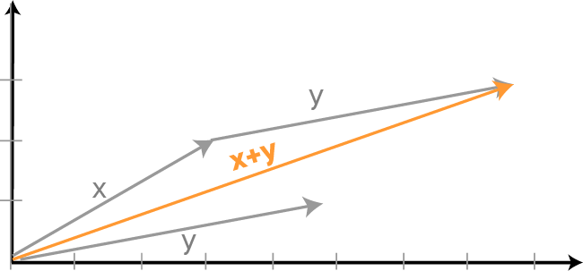

# Ensembles - Introduction


## Introduction

In this section, you'll learn about some of the most powerful machine learning algorithms: ensemble models! This lesson summarizes the topics we'll be covering in this section.


## Ensembles

The idea of ensembles is to bring together multiple models to use them to improve the quality of your predictions when compared to just using a single model. In many real-world problems and Kaggle competitions, ensemble methods tend to outperform any single model.

### Ensemble Methods

We start the section by providing an introduction to the concept of ensemble methods, explaining how they take advantage of the delphic technique (or "wisdom of crowds") where the average of multiple independent estimates is usually more consistently accurate than the individual estimates.

We also provide an introduction to the idea of bagging (Bootstrap Aggregation).

### Random Forests

We then look at random forests - an ensemble method for decision trees that takes advantage of bagging and the subspace sampling method to create a "forest" of decision trees that provides consistently better predictions than any single decision tree.

### GridsearchCV

We will also introduce some of the common hyperparameters for tuning decision trees. In this lesson, we look at how you can use GridSearchCV to perform an exhaustive search across multiple hyperparameters and multiple possible values to come up with a better performing model.

### Gradient Boosting and Weak Learners

Next up, we introduce the concept of boosting which is at the heart of some of the most powerful ensemble methods such as Adaboost and Gradient Boosted Trees.

### XGBoost

Finally, we end this section by introducing XGBoost (eXtreme Gradient Boosting) - the top gradient boosting algorithm currently in use.

## Summary

You will often find yourself using a range of ensemble techniques to improve the performance of your models, so this section will introduce you to the techniques that will help you to improve the quality of your models.


-----File-Boundary-----
# Ensemble Methods

## Introduction

In this lesson, we'll learn about **_ensembles_** and why they're such an effective technique for supervised learning.

## Objectives

You will be able to:

- Explain what is meant by "ensemble methods"
- Explain the concept of bagging as it applies to ensemble methods


## What are ensembles?

In Data Science, the term **_ensemble_** refers to an algorithm that makes use of more than one model to make a prediction. Typically, when people talk about ensembles, they are referring to Supervised Learning, although there has been some ongoing research on using ensembles for unsupervised learning tasks. Ensemble methods are typically more effective when compared with single-model results for supervised learning tasks. Most Kaggle competitions are won using ensemble methods, and [much has been written](https://blogs.sas.com/content/subconsciousmusings/2017/05/18/stacked-ensemble-models-win-data-science-competitions/) about why they tend to be so successful for these tasks.

### Example

Consider the following scenario -- you are looking to invest in a company, and you want to know if that company's stock will go up or down in the next year. Instead of just asking a single person, you have the following experts available to you:

1. **_Stock Broker_**: This person makes correct predictions 80% of the time
2. **_Finance Professor_**: This person is correct 65% of the time
3. **_Investment Expert_**: This person is correct 85% of the time

If we could only take advice from one person, we would pick the Investment Expert, and we can only be 85% sure that they are right.

However, if we can use all three, we can combine their knowledge to increase our overall accuracy. If they all agree that the stock is a good investment, what is the overall accuracy of the combined prediction?

We can calculate this by multiplying the chances that each of them are wrong together, which is $ 0.2 * 0.35 * 0.15 = 0.0105\ error\ rate$, which means that our combined accuracy is $1 - 0.0105 = 0.9895$, or **_98.95%_**!

Obviously, this analogy is a bit of an oversimplification -- we're assuming that each prediction is independent, which is unlikely in the real world since there's likely some overlap between the things each person is using to make their prediction. We also haven't calculated the accuracy percentages for the cases where they disagree. However, the main point of this example is that when we combine predictions, we get better overall results.


## Resiliency to variance

Ensemble methods are analogous to "Wisdom of the crowd". This phrase refers to the phenomenon that the average estimate of all predictions typically outperforms any single prediction by a statistically significant margin -- often, quite a large one.  A Finance Professor named Jack Treynor once demonstrated this with the classic jar full of jellybeans. Professor Treynor asked all 850 of his students to guess the number of jellybeans in the jar. When he averaged the guesses, he found that of all the guesses in the class, only one student had guessed a better estimate than the group average.

Think back to what you've learned about sampling, inferential statistics, and the Central Limit theorem. The same magic is at work here. Estimators are rarely perfect. When Professor Treynor asked each student to provide an estimate of the number of jellybeans in the jar, he found that the estimates were normally distributed. This is where "Wisdom of the crowd" kicks in because we can expect the number of people who underestimate the number of jellybeans in the jar to be roughly equal to the number of people who overestimate the number of jellybeans. So we can safely assume the extra variance above and below the average essentially cancel each other out, leaving our average close to the ground truth value!

Consider the top-right example in this graphic that visually demonstrates high variance:


Most points miss the bullseye, but they are just as likely to miss in any direction. If we averaged all of these points, we would be extremely close to the bullseye! This is a great analogy for how ensemble methods work so well -- we know that no model is likely to make perfect estimates, so we have many of them make predictions, and average them, knowing that the overestimates and the underestimates will likely cancel out to be very close to the ground truth. The idea that the overestimates and underestimates will (at least partially) cancel each other out is sometimes referred to as **_smoothing_**.

### Which models are used in ensembles?

For this section, we'll be focusing exclusively on tree-based ensemble methods, such as **_Random forests_** and **_Gradient boosted trees_**. However, we can technically use any models in an ensemble! It's not uncommon to see **_Model stacking_**, also called **_Meta-ensembling_**, where multiple different models are stacked, and their predictions are aggregated. In this case, the more different the models are, the better! This is because the more different the models are, the more likely they have the potential to pick up on different characteristics of the data. It's not uncommon to see ensembles consisting of multiple logistic regressions, Naive Bayes classifiers, Tree-based models (including ensembles such as random forests), and even deep neural networks!

For a much more in-depth explanation of what model stacking looks like and why it is effective, take a look at this great [article from Kaggle's blog, No Free Hunch!](http://blog.kaggle.com/2016/12/27/a-kagglers-guide-to-model-stacking-in-practice/)


## Bootstrap aggregation

The main concept that makes ensembling possible is **_Bagging_**, which is short for **_Bootstrap Aggregation_**. Bootstrap aggregation is itself a combination of two ideas -- bootstrap resampling and aggregation. You're already familiar with bootstrap resampling from our section on the Central Limit theorem. It refers to the subsets of your dataset by sampling with replacement, much as we did to calculate our sample means when working with the Central Limit theorem. Aggregation is exactly as it sounds -- the practice of combining all the different estimates to arrive at a single estimate -- although the specifics for how we combine them are up to us. A common approach is to treat each classifier in the ensemble's prediction as a "vote" and let our overall prediction be the majority vote.  It's also common to see ensembles that take the arithmetic mean of all predictions, or compute a weighted average.

The process for training an ensemble through bootstrap aggregation is as follows:

1. Grab a sizable sample from your dataset, with replacement
2. Train a classifier on this sample
3. Repeat until all classifiers have been trained on their own sample from the dataset
4. When making a prediction, have each classifier in the ensemble make a prediction
5. Aggregate all predictions from all classifiers into a single prediction, using the method of your choice


Decision trees are often used because they are very sensitive to variance. On their own, this is a weakness. However, when aggregated together into an ensemble, this actually becomes a good thing!

## Summary

In this lesson, we learned about what constitutes an **Ensemble**, and how **Bagging** plays a central role in this. In the next lesson, we'll see how bagging is combined with another important technique to create one of the most effective ensemble algorithms available today -- **_Random forests_**!


-----File-Boundary-----
# Random Forests


## Introduction

In this lesson, we'll learn about a powerful and popular ensemble method that makes use of decision trees -- a random forest!


## Objectives

You will be able to:

- Describe how the random forest algorithm works
- Describe the subspace sampling method that makes random forests "random"
- Explain the benefits and drawbacks of random forest models


## Understanding the Random forest algorithm

The **_Random Forest_** algorithm is a supervised learning algorithm that can be used both for classification and regression tasks. Decision trees are the cornerstone of random forests -- if you don't remember much about decision trees, now may be a good time to go back and review that section until you feel comfortable with the topic.

Put simply, the random forest algorithm is an ensemble of decision trees. However, you may recall that decision trees use a **_greedy algorithm_**, meaning that given the same data, the algorithm will make a choice that maximizes information gain at every step. By itself, this presents a problem -- it doesn't matter how many trees we add to our forest if they're all the same tree! Trees trained on the same dataset will come out the exact same way every time -- there is no randomness to this algorithm. It doesn't matter if our forest has a million decision trees; if they are all exactly the same, then our performance will be no better than if we just had a single tree.

Think about this from a business perspective -- would you rather have a team at your disposal where everyone has exactly the same training and skills, or a team where each member has their own individual strengths and weaknesses? The second team will almost always do much better!

As we learned when reading up on ensemble methods, variance is a good thing in any ensemble. So how do we create high variance among all the trees in our random forest? The answer lies in two clever techniques that the algorithm uses to make sure that each tree focuses on different things -- **_Bagging_** and the **_Subspace Sampling Method_**.


## Bagging

The first way to encourage differences among the trees in our forest is to train them on different samples of data. Although more data is generally better, if we gave every tree the entire dataset, we would end up with each tree being exactly the same. Because of this, we instead use **_Bootstrap Aggregation_** (AKA **_Bagging_**) to obtain a portion of our data by sampling with replacement. For each tree, we sample two-thirds of our training data with replacement -- this is the data that will be used to build our tree. The remaining data is used as an internal test set to test each tree -- this remaining one-third is referred to as **_Out-Of-Bag Data_**, or **_OOB_**. For each new tree created, the algorithm then uses the remaining one-third of data that wasn't sampled to calculate the **_Out-Of-Bag Error_**, in order to get a running, unbiased estimate of overall tree performance for each tree in the forest.

Training each tree on its own individual "bag" of data is a great start for getting us some variability between the decision trees in our forest. However, with just bagging, all the trees are still focusing on all the same predictors. This allows for a potential weakness to affect all the trees at once -- if a predictor that usually provides strong signal provides bad information for a given observation, then it's likely that all the trees will fall for this false signal and make the wrong prediction. This is where the second major part of the Random forest algorithm comes in!

## Subspace sampling method

After bagging the data, the random forest uses the **_Subspace sampling method_** to further increase variability between the trees. Although it has a fancy mathematical-sounding name, all this method does is randomly select a subset of features to use as predictors for each node when training a decision tree, instead of using all predictors available at each node.

Let's pretend we're training our random forest on a dataset with 3000 rows and 10 columns. For each given tree, we would randomly "bag" 2000 rows with replacement. Next, we perform a subspace sample by randomly selecting a number of predictors at each node of a decision tree. Exactly how many predictors are used is a tunable parameter for this algorithm -- for simplicity's sake, let's assume we pick 6 predictors in this example.

This brings us to the following pseudocode so far:

For each tree in the dataset:

1. Bag 2/3 of the overall data -- in our example, 2000 rows
2. Randomly select a set number of features to use for training each node within this -- in this example, 6 features
3. Train the tree on the modified dataset, which is now a DataFrame consisting of 2000 rows and 6 columns
4. Drop the unused columns from step 3 from the out-of-bag rows that weren't bagged in step 1, and then use this as an internal testing set to calculate the out-of-bag error for this particular tree


### Resiliency to overfitting

Once we've created our target number of trees, we'll be left with a random forest filled with a diverse set of decision trees that are trained on different sets of data, and also look at different subsets of features to make predictions. This amount of diversity among the trees in our forest will make for a model that is extremely resilient to noisy data, thus reducing the chance of overfitting.

To understand why this is the case, let's put it in practical terms. Let's assume that of the 10 columns that we mentioned in our hypothetical dataset, column 2 correlates heavily with our target. However, there is still some noise in this dataset, and this column doesn't correlate _perfectly_ with our target -- there will be times where it suggests one class or another, but this isn't actually the case -- let's call these rows "false signals". In the case of a single decision tree, or even a forest where all trees focus on all the same predictors, we can expect to get the model to almost always get these false signal examples wrong. Why? Because the model will have learned to treat column 2 as a "star player" of sorts. When column 2 provides a false signal, our model will fall for it and get the prediction wrong.

Now, let's assume that we have a random forest complete with subspace sampling. If we randomly use 6 out of 10 predictors when creating each node of each tree, then this means that ~40% of the nodes of the trees in our forest won't even know column 2 exists! In the cases where column 2 provides a "false signal", the nodes of trees that use column 2 will likely make an incorrect prediction -- but that only matters to the ~60% that look at column 2. Our forest still contains another 40% of nodes within trees that are essentially "immune" to the false signal in column 2, because they don't use that predictor. In this way, the "wisdom of the crowd" buffers the performance of every constituent in that crowd. Although for any given example, some trees may draw the wrong conclusion from a particular predictor, the odds that _every tree_ makes the same mistake because they looked at the same predictor is infinitesimally small!

### Making predictions with random forests

Once we have trained all the trees in our random forest, we can effectively use it to make predictions! When given data to make predictions on, the algorithm provides only the appropriate features to each tree in the forest, gets that tree's individual prediction, and then aggregates all predictions together to determine the overall prediction that the algorithm will make for said data. In essence, each tree "votes" for the prediction that the forest will make, with the majority winning.

## Benefits and drawbacks

Like any algorithm, the random forest comes with its own benefits and drawbacks.

### Benefits

* **_Strong performance_**: The random forest algorithm usually has very strong performance on most problems, when compared with other classification algorithms. Because this is an ensemble algorithm, the model is naturally resistant to noise and variance in the data, and generally tends to perform quite well.

* **_Interpretability_**:  Conveniently, since each tree in the random forest is a **_Glass-Box Model_** (meaning that the model is interpretable, allowing us to see how it arrived at a certain decision), the overall random forest is, as well! You'll demonstrate this yourself in the upcoming lab, by inspecting feature importances for both individual trees and the entire random forest.

### Drawbacks

* **_Computational complexity_**: Like any ensemble method, training multiple models means paying the computational cost of training each model. On large datasets, the runtime can be quite slow compared to other algorithms.

* **_Memory usage_**: Another side effect of the ensembled nature of this algorithm, having multiple models means storing each in memory. Random forests tend to have a larger memory footprint than other models. Whereas a parametric model like a logistic regression just needs to store each of the coefficients, a random forest has to remember every aspect of every tree! It's not uncommon to see random forests that were trained on large datasets have memory footprints in the tens or even hundreds of MB. For data scientists working on modern computers, this isn't typically a problem -- however, there are special cases where the memory footprint can make this an untenable choice -- for instance, an app on a smartphone that uses machine learning may not be able to afford to spend that much disk space on a random forest model!


## (Optional) Random forests White paper

This algorithm was not invented all at once -- there were several iterations by different researchers that built upon each previous idea. However, the version used today is the one created by Leo Breiman and Adele Cutler, who also own the trademark for the name "random forest".

Although not strictly necessary for understanding how to use random forests, we highly recommend taking a look at the following resources from Breiman and Cutler if you're interested in really digging into how random forests work:

- [Random forests paper](https://www.stat.berkeley.edu/~breiman/randomforest2001.pdf)

- [Random forests website](https://www.stat.berkeley.edu/~breiman/RandomForests/cc_home.htm)

## Summary

In this lesson, you learned about a random forest, which is a powerful and popular ensemble method that uses decision trees!


-----File-Boundary-----
# Gradient Boosting and Weak Learners

## Introduction

In this lesson, we'll explore one of the most powerful ensemble methods around -- gradient boosting!

## Objectives

You will be able to:

- Compare and contrast weak and strong learners and explain the role of weak learners in boosting algorithms
- Describe the process of boosting in Adaboost and Gradient Boosting
- Explain the concept of a learning rate and the role it plays in gradient boosting algorithms


## Weak learners and boosting

The first ensemble technique we learned about was **_Bagging_**, which refers to training different models independently on different subsets of data by sampling with replacement. The goal of bagging is to create variability in the ensemble of models. The next ensemble technique we'll learn about is **_Boosting_**. This technique is at the heart of some very powerful, top-of-class ensemble methods currently used in machine learning, such as **_Adaboost_** and **_Gradient Boosted Trees_**.

In order to understand boosting, let's first examine the cornerstone of boosting algorithms -- **_Weak Learners_**.

### Weak learners

All the models we've learned so far are **_Strong Learners_** -- models with the goal of doing as well as possible on the classification or regression task they are given. The term **_Weak Learner_** refers to simple models that do only slightly better than random chance. Boosting algorithms start with a single weak learner (tree methods are overwhelmingly used here), but technically, any model will do. Boosting works as follows:

1. Train a single weak learner
2. Figure out which examples the weak learner got wrong
3. Build another weak learner that focuses on the areas the first weak learner got wrong
4. Continue this process until a predetermined stopping condition is met, such as until a set number of weak learners have been created, or the model's performance has plateaued

In this way, each new weak learner is specifically tuned to focus on the weak points of the previous weak learner(s). The more often an example is missed, the more likely it is that the next weak learner will be the one that can classify that example correctly. In this way, all the weak learners work together to make up a single strong learner.

## Boosting and random forests

### Similarities

Boosting algorithms share some similarities with random forests, as well as some notable differences. Like random forests, boosting algorithms are an ensemble of many different models with high inter-group diversity. Boosting algorithms also aggregate the predictions of each constituent model into an overall prediction. Both algorithms also make use of tree models (although this isn't strictly required, in the case of boosting).

### Differences

#### 1: Independent vs. iterative

The difference is in the approach to training the trees. Whereas a random forest trains each tree independently and at the same time, boosting trains each tree iteratively. In a random forest model, how well or poorly a given tree does has no effect on any of the other trees since they are all trained at the same time. Boosting, on the other hand, trains trees one at a time, identifies the weak points for those trees, and then purposefully creates the next round of trees in such a way as to specialize in those weak points.

#### 2: Weak vs. strong

Another major difference between random forests and boosting algorithms is the overall size of the trees. In a random forest, each tree is a strong learner -- they would do just fine as a decision tree on their own. In boosting algorithms, trees are artificially limited to a very shallow depth (usually only 1 split), to ensure that each model is only slightly better than random chance. For this reason, boosting algorithms are also highly resilient against noisy data and overfitting. Since the individual weak learners are too simple to overfit, it is very hard to combine them in such a way as to overfit the training data as a whole -- especially when they focus on different things, due to the iterative nature of the algorithm.

#### 3: Aggregate predictions

The final major difference we'll talk about between the two is the way predictions are aggregated. Whereas in a random forest, each tree simply votes for the final result, boosting algorithms usually employ a system of weights to determine how important the input for each tree is. Since we know how well each weak learner performs on the dataset by calculating its performance at each step, we can see which weak learners do better on hard tasks. Think of it like this -- harder problems deserve more weight. If there are many learners in the overall ensemble that can get the same questions right, then that tree isn't super important -- other trees already provide the same value that it does. This tree will have its overall weight reduced. As more and more trees get a hard problem wrong, the "reward" for a tree getting that hard problem correct goes higher and higher. This "reward" is actually just a higher weight when calculating the overall vote. Intuitively, this makes sense -- trees that can do what few other trees can do are the ones that we should probably listen to more than others, as they are the most likely to get hard examples correct. Since other trees tend to get this wrong, we can expect to see a general split of about 50/50 among the trees that do not "specialize" in the hard problems. Since our "specialized" tree has more weight, its correct vote will carry more weight than the combined votes of the half of the "unspecialized" trees that get it wrong. It is worth noting that the "specialized" trees will often do quite poorly on the examples that are easy to predict. However, since these examples are easier, we can expect a strong majority of the trees in our ensemble to get it right, meaning that the combined, collective weight of their agreement will be enough to overrule the trees with higher weights that get it wrong.


## Understanding Adaboost and Gradient boosting

There are two main algorithms that come to mind when Data Scientists talk about boosting: **_Adaboost_** (short for Adaptive Boosting), and **_Gradient Boosted Trees_**. Both are generally very effective, but they use different methods to achieve their results.

### Adaboost

Adaboost was the first boosting algorithm invented. Although there have been marked improvements made to this algorithm, Adaboost still tends to be quite an effective algorithm!  More importantly, it's a good starting place for understanding how boosting algorithms actually work.

In Adaboost, each learner is trained on a subsample of the dataset, much like we saw with **_Bagging_**. Initially, the bag is randomly sampled with replacement. However, each data point in the dataset has a weight assigned. As learners correctly classify an example, that example's weight is reduced. Conversely, when learners get an example wrong, the weight for that sample increases. In each iteration, these weights act as the probability that an item will be sampled into the "bag" which will be used to train the next weak learner. As the number of learners grows, you can imagine that the examples that are easy to get correct will become less and less prevalent in the samples used to train each new learner. This is a good thing -- if our ensemble already contains multiple learners that can correctly classify that example, then we don't need more that can do this. Instead, the "bags" of data will contain multiple instances of the hard examples, thereby increasing the likelihood that the learner will create a split that focuses on getting the hard example correct.

The following diagram demonstrates how the weights change for each example as classifiers get them right and wrong.


Pay attention to the colors of the pluses and minuses -- pluses are meant to be in the blue section, and minuses are meant to be in the red. The decision boundary of the tree can be interpreted as the line drawn between the red and blue sections. As you can see above, examples that were misclassified are larger in the next iteration, while examples that were classified correctly are smaller. As we combine the decision boundaries of each new classifier, we end up with a classifier that correctly classifies all of the examples!

**_Key Takeaway:_** Adaboost creates new classifiers by continually influencing the distribution of the data sampled to train each successive learner.


### Gradient boosting

**_Gradient Boosted Trees_** are a more advanced boosting algorithm that makes use of **_Gradient Descent._**  Much like Adaboost, gradient boosting starts with a weak learner that makes predictions on the dataset. The algorithm then checks this learner's performance, identifying examples that it got right and wrong. However, this is where the gradient boosting algorithm diverges from Adaboost's methodology. The model then calculates the **_Residuals_** for each data point, to determine how far off the mark each prediction was. The model then combines these residuals with a **_Loss Function_** to calculate the overall loss. There are many loss functions that are used -- the thing that matters most is that the loss function is **_differentiable_** so that we can use calculus to compute the gradient for the loss, given the inputs of the model. We then use the gradients and the loss as predictors to train the next tree against! In this way, we can use **_Gradient Descent_** to minimize the overall loss.

Since the loss is most heavily inflated by examples where the model was wrong, gradient descent will push the algorithm towards creating a new learner that will focus on these harder examples. If the next tree gets these right, then the loss goes down! In this way, gradient descent allows us to continually train and improve on the loss for each model to improve the overall performance of the ensemble as a whole by focusing on the "hard" examples that cause the loss to be high.


### Learning rates

Often, we want to artificially limit the "step size" we take in gradient descent. Small, controlled changes in the parameters we're optimizing with gradient descent will mean that the overall process is slower, but the parameters are more likely to converge to their optimal values. The learning rate for your model is a small scalar meant to artificially reduce the step size in gradient descent. Learning rate is a tunable parameter for your model that you can set -- large learning rates get closer to the optimal values more quickly, but have trouble landing exactly at the optimal values because the step size is too big for the small distances it needs to travel when it gets close. Conversely, small learning rates means the model will take a longer time to get to the optimal parameters, but when it does get there, it will be extremely close to the optimal values, thereby providing the best overall performance for the model.

You'll often see learning rates denoted by the symbol, $\gamma$ -- this is the greek letter, **_gamma_**.  Don't worry if you're still hazy on the concept of gradient descent -- we'll explore it in much more detail when we start studying deep learning!


The `sklearn` library contains some excellent implementations of Adaboost, as well as several different types of gradient boosting classifiers. These classifiers can be found in the `ensemble` module, which you will make use of in the upcoming lesson.

## Summary

In this lesson, we learned about **_Weak Learners_**, and how they are used in various **_Gradient Boosting_** algorithms. We also learned about two specific algorithms -- **_AdaBoost_** and **_Gradient Boosted Trees_**, and we compared how they are similar and how they are different!


-----File-Boundary-----
# Ensembles - Recap

## Key Takeaways

The key takeaways from this section include:

* Multiple independent estimates are consistently more accurate than any single estimate, so ensemble techniques are a powerful way for improving the quality of your models
* Sometimes you'll use model stacking or meta-ensembles where you use a combination of different types of models for your ensemble
* It's also common to have multiple similar models in an ensemble - e.g. a bunch of decision trees
* Bagging (Bootstrap AGGregation) is a technique that leverages Bootstrap Resampling and Aggregation
* Bootstrap resampling uses multiple smaller samples from the test dataset to create independent estimates, and aggregate these estimates to make predictions
* A random forest is an ensemble method for decision trees using Bagging and the Subspace Sampling method to create variance among the trees
* With a random forest, for each tree, we sample two-thirds of the training data and the remaining third is used to calculate the out-of-bag error
* In addition, the Subspace Sampling method is used to further increase variability by randomly selecting the subset of features to use as predictors for training any given tree
* `GridsearchCV` is an exhaustive search technique for finding optimal combinations of hyperparameters
* Boosting leverages an ensemble of weak learners (weak models) to create a strong combined model
* Boosting (when compared to random forests) is an iterative rather than independent process, using each iteration to strengthen the weaknesses of the previous iterations
* Two of the most common algorithms for Boosting are Adaboost (Adaptive Boosting) and Gradient Boosted Trees
* Adaboost creates new classifiers by continually influencing the distribution of the data sampled to train each successive tree
* Gradient Boosting is a more advanced boosting algorithm that makes use of Gradient Descent
* XGBoost (eXtreme Gradient Boosting) is one of the top gradient boosting algorithms currently in use
* `XGBoost` is a stand-alone library that implements popular gradient boosting algorithms in the fastest, most performant way possible


-----File-Boundary-----
# Object Oriented Attributes with Functions

## Introduction
You've been learning a lot about different parts of object-oriented programming; you've seen the purpose of classes, you've seen instance objects, instance variables, and instance methods and how these things all work with each other. In this lab, you'll talk about what a **domain model** is and how it ties into object-oriented programming.

## Objectives

You will be able to:

* Describe the concept of a domain model
* Create a domain model using OOP
* Create instance methods that operate on instance attributes

## What is a Domain Model?

A domain model is the representation of a real-world concept or structure translated into software. This is a key function of object orientation. So far, your Python classes have been used as blueprints or templates for instance objects of that class. As an example, a `Driver` class would create driver instance objects, and the class would define a basic structure for what that driver instance object should look like and what capabilities it should have. But a class is only one part of a domain model just as, typically, a driver is only one part of a larger structure.

A domain model is meant to mirror that larger, real-world structure. It is more than just one class, it is an entire environment that often depends on other parts or classes to function properly. So, in keeping with a `Driver` class, you could use the example of a taxi and limousine service as our domain model. There are many more parts to a service like this than drivers alone. Imagine dispatchers, mechanics, accountants, passengers, etc., all being part of the structure of this domain model. In a simplified example, you could have instance and class methods handle things like `dispatch_driver`, `calculate_revenue_from_rides`, `service_taxi`, or any other function of a taxi and limousine service.

As you become more fluent in object-oriented programming and your programs become more complex, you'll see that the other parts of a domain model like passengers, dispatchers, etc., will be classes of their own that interact with each other.

In this lecture, you'll be using a business as our domain model. With this, you'll continue to see how attributes and methods can be combined to perform operations and store values simultaneously.

## Creating the Class

Here's a simple class template:

```python
class Business():
    def __init__(name=None, biz_type=None, city=None, customers = []):
        business.name = name
        business.biz_type = biz_type
        business.city = city
        business.customers = customers
```
## Defining Methods with Attributes

As you've seen, you can define both methods (functions) and attributes of class objects. Here's a method that lets you update an attribute.

```python
class Business():
    def __init__(self, name=None, biz_type=None, city=None, customers = []):
        self.name = name
        self.biz_type = biz_type
        self.city = city
        self.customers = customers
    def add_customer(self, customer):
        self.customers.append(customer)
```
## Thinking about appropriate structures
At this point in creating our data structures, you can think about what you want a customer to be. It could be a dictionary storing various attributes about that customer such as name, orders, etc. It could also be a class of its own. Thinking through the use case and allowing flexibility is a key design decision.

For maximum future flexibility, you might define an additional class for customers like this:

```python
class Customer():
    def __init__(self, name=None, orders=[], location=None):
        self.name=name
        self.orders = orders
        self.location = location
    def add_order(item_name, item_cost, quantity):
        self.orders.append({'item_name': item_name, 'item_cost':item_cost, 'quantity':quantity})
```
## Writing more complicated methods using attriubtes

Imagine a reporting method for the business that will return the top 5 customers to date based on their purchase history. To do this, you'd have to determine the total purchases made by customers and then sort our customers by this. Currently, the data needed for that is stored within a customer object within the orders attribute which is a list of dictionaries. Quite the mouthful there; an object with an attribute that's a list of dictionaries. Breaking down the problem into constituent parts can help reduce solving the same problems over and over again. As such, before writing a larger business function to retrieve the top 5 customers, a constituent piece is to update the customer object to also keep track of the total spent.

```python
class Customer():
    def __init__(self, name=None, orders=[], location=None):
        self.name=name
        self.orders = orders
        self.location = location
        self.total_spent = sum([i['item_cost']*i['quantity'] for i in orders])
    def add_order(self, item_name, item_cost, quantity):
        self.orders.append({'item_name': item_name, 'item_cost':item_cost, 'quantity':quantity})
        self.total_spent += item_cost * quantity
```
Now the previous problem is greatly simplified; the customer objects directly have an attribute for the total spent. You can write a method for top customers with much greater ease:

```python
class Business():
    def __init__(self, name=None, biz_type=None, city=None, customers = []):
        self.name = name
        self.biz_type = biz_type
        self.city = city
        self.customers = customers
    def add_customer(self, customer):
        self.customers.append(customer)
    def top_n_customers(self, n):
        top_n = sorted(self.customers, key = lambda x: x.total_spent, reverse=True)[:n]
        for c in top_n:
            print(c.name, c.total_spent)
```
## Trying it out: Creating an Instance

Finally you can try it all out:

```python
startup = Business('etsy_store2076', 'crafts')
```
```python
customer1 = Customer(name='Bob', orders=[])
customer1.add_order('sweater', 24.99, 1)
```
```python
customer1.orders
```
```python
customer1.total_spent
```
## Generating customers and orders at scale

Now you can systematically add some fake data to test the fancier method on. You can use some NumPy's built-in random methods to randomly select quantities of orders and items.

```python
import numpy as np
```
```python
names = ['Liam',  'Emma', 'Noah','Olivia','William','Ava',
         'James','Isabella','Logan','Sophia','Benjamin','Mia','Mason',
         'Charlotte','Elijah','Amelia','Oliver','Evelyn','Jacob','Abigail]']
items = [('sweater',50), ('scarf', 35), ('gloves', 20), ('hat', 20)]

for i in range(10):
    customer = Customer(name=np.random.choice(names)) # Create a customer
    n_orders = np.random.randint(1, 5) # Create an order or two, or three, or four, or five!
    for order_n in range(n_orders):
        idx = np.random.choice(len(items)) # np.random.choice doesn't work with nested lists; workaround
        item = items[idx]
        item_name = item[0]
        item_price = item[1]
        quantity = np.random.randint(1,4)
        customer.add_order(item_name, item_price, quantity)
    # Add the customer to our business
    startup.add_customer(customer)
```
## Trying out our complex method

```python
startup.top_n_customers(5)
```
```python
startup.top_n_customers(50)
```
## Summary
In this lesson, you were able to mimic a complex domain model using a business and customer class with a few instance methods and variables.


-----File-Boundary-----
# Building an Object-Oriented Simulation

## Introduction

In this lesson, you'll learn a bit more about best practices for running simulations in the real world using object-oriented programming!

## Objectives

You will be able to:

* Use inheritance to write nonredundant code
* Create methods that calculate statistics of the attributes of an object
* Create object-oriented data models that describe the real world with multiple classes and subclasses and interaction between classes


## Creating Stochastic Simulations

As a capstone for everything you've learned about object-oriented programming, you'll be creating a **_Herd Immunity Simulation_**.


[gif created by u/theotheredmund](https://www.reddit.com/r/dataisbeautiful/comments/5v72fw/how_herd_immunity_works_oc/)

This simulation is meant to model the effects that vaccinations have on the way a communicable disease spreads through a population. The simulation you're building depends on just a few statistics from the CDC (Center for Disease Control):

* `r0`, the average number of people a contagious person infects before they are no longer contagious (because they got better or they died)
* `mortality_rate`, the percentage chance a person infected with a disease will die from it

The main workflow of this simulation is as follows:

1. Create a `Person()` class with the following attributes:
    * `alive`
    * `vaccinated`
    * `is_infected`
    * `has_been_infected`
    * `newly_infected`

2. Create a `Simulation()` class with the following attributes:
    * `population`
    * `virus_name`
    * `num_time_steps`
    * `r0`
    * `percent_pop_vaccinated`

3. Create methods for our `Simulation()` class that will cover each step of the simulation.

In order for our simulation to work, you'll need to define some rules for it:

* Each infected person will "interact" with 100 random people from the `population`. If the person the infected individual interacts with is sick, vaccinated, or has had the disease before, nothing happens. However, if the person the infected individual interacts with is healthy, unvaccinated, and has not been infected yet, then that person becomes infected.

* At the end of each round, the following things happen:
    * All currently infected people either get better from the disease or die, with the chance of death corresponding to the mortality rate of the disease
    * All people that were newly infected during this round become the new infected for the next round

The simulation continues for the set number of time steps.  Any time someone dies or gets infected, log it in a text file called `'simulation_logs.txt'`.  Once the simulation is over, write some code to quickly parse the text logs into data and visualize the results, so that you can run multiple simulations and answer questions like:

* If vaccination rates for {disease x} dropped by 5%, how many more people become infected in an epidemic? How many more die?
* What does the spread of {disease x} through a population look like?

If this all seems a bit daunting, don't worry! You'll be provided with much more detail as you build this step-by-step during the lab.

With that, go ahead and take a look at this cool simulation lab!

## Summary

In this lesson, you reviewed some best practices for simulating things in the real world using object-oriented programming!


-----File-Boundary-----
# Vector Addition and Broadcasting in Numpy - Code Along

## Introduction

This lesson is a supplement to the previous lesson where you learned how to create Numpy arrays as vectors and matrices. In this lesson, you'll look at matrix addition and broadcasting features offered by Numpy.

## Objectives
You will be able to:
- Implement vector addition in Numpy
- Describe how broadcasting differs from addition if there are mismatched dimensions


## Vector addition

Let's look at simple vector addition, where all operations are performed element-wise between two vectors/matrices of equal size to result in a new vector/matrix with the same size.

Imagine two arrays A and B with the same dimensions. They can be added together if:

* they have the same shape
* each cell of A is added to the corresponding cell of B

$A_{i,j} +B_{i,j} = C_{i,j}$


$$ C=
  \left[ {\begin{array}{cc}
   A_{1,1} & A_{1,2} \\
   A_{2,1} & A_{2,2} \\
   A_{3,1} & A_{3,2} \\
  \end{array} } \right] +
    \left[ {\begin{array}{cc}
   B_{1,1} & B_{1,2} \\
   B_{2,1} & B_{2,2} \\
   B_{3,1} & B_{3,2} \\
  \end{array} } \right] =
   \left[ {\begin{array}{cc}
   A_{1,1} + B_{1,1} & A_{1,2} + B_{1,2}\\
   A_{2,1} + B_{2,1}& A_{2,2} + B_{2,2} \\
   A_{3,1} + B_{3,1} & A_{3,2} + B_{3,2} \\
  \end{array} } \right]
$$


here $A_(i, j)$ and $B_(i, j)$ represent row and column locations. This is a more standard notation that you will find in most literature. Another visual representation is shown below:


1D-arrays can be added together in exactly the same way using similar assumptions. The addition of two vectors $x$ and $y$ may be represented graphically by placing the start of the arrow y at the tip of the arrow x, and then drawing an arrow from the start (tail) of $x$ to the tip (head) of $y$. The new arrow represents the vector $x + y$.


You can perform addition operations in Numpy in the following way:
```python
import numpy as np

# Adding 1D arrays
a = np.array([1, 2, 3])
b = np.array([4, 5, 6])
c = a + b
c
```

```python
# Code here
```
Subtracting a vector is the same as adding its negative. So, the difference of the vectors x and y is equal to the sum of x and -y:
> $x - y = x + (-y)$

Geometrically, when we subtract y from x, we place the end points of x and y at the same point, and then draw an arrow from the tip of y to the tip of x. That arrow represents the vector x - y.


Mathematically, we subtract the corresponding components of vector y from the vector x:

```python
# Subtracting 1D arrays
a = np.array([1, 2, 3])
b = np.array([4, 5, 6])
c = b - a
c
```

```python
# Code here
```
Now lets try addition with matrices:

``` python
# Adding 2D matrices
A = np.array([[1, 2], [3, 4], [5, 6]])
B = np.array([[1, 4], [2, 5], [2, 3]])
# Add matrices A and B
C = A + B
C
```

```python
# Code here
```
```python
# Add matrices with mismatched dimensions
A = np.array([[1, 2], [3, 4], [5, 6]])
B = np.array([[1, 4], [2, 5]])
# Add matrices A and B
C = A + B
C
```

```python
# Code here
```
You received an error, as expected, because there is a dimension mismatch. Here, it seems intuitive to know why this happened, but when working with large matrices and tensors, shape mismatch could become a real problem and as data scientists, you need to make sure to be aware about the dimensions of your datasets.

## Vector scalar addition

Scalar values can be added to matrices and vectors. In this case, the scalar value is added to each element of array as shown below:
```python
# Add scalars to arrays
# Add a scalar to a 1D vector
print(a + 4)
# Add a scalar to a 2D matrix
print(A + 4)
```

## Broadcasting

Numpy can also handle operations on arrays of different shapes as some machine learning algorithms need that. The smaller array gets **extended** to match the shape of the larger array. In the scalar-vector addition, we used broadcasting so the scalar was converted in an array of same shape as $A$.


$$
  \left[ {\begin{array}{cc}
   A_{1,1} & A_{1,2} \\
   A_{2,1} & A_{2,2} \\
   A_{3,1} & A_{3,2} \\
  \end{array} } \right] +
    \left[ {\begin{array}{c}
   B_{1,1}\\
   B_{2,1}\\
   B_{3,1}\\
   \end{array} } \right]
$$


$$
  \left[ {\begin{array}{cc}
   A_{1,1} & A_{1,2} \\
   A_{2,1} & A_{2,2} \\
   A_{3,1} & A_{3,2} \\
  \end{array} } \right] +
    \left[ {\begin{array}{cc}
   B_{1,1} & B_{1,1} \\
   B_{2,1} & B_{2,1} \\
   B_{3,1} & B_{3,1} \\
  \end{array} } \right] =
   \left[ {\begin{array}{cc}
   A_{1,1} + B_{1,1} & A_{1,2} + B_{1,1}\\
   A_{2,1} + B_{2,1}& A_{2,2} + B_{2,1} \\
   A_{3,1} + B_{3,1} & A_{3,2} + B_{3,1} \\
  \end{array} } \right]
$$

Let's see this in action while trying to add arrays with different shapes

```python
A = np.array([[1, 2], [3, 4], [5, 6]])
print(A)
B = np.array([[2], [4], [6]])
print(B)
A + B
```

```python
#\N{NO-BREAK SPACE}Code here
```
## Summary

In this lesson, you learned how to add vectors and matrices and looked at the dimension match assumption necessary for this addition. You also looked at how Numpy allows you to use broadcasting to add scalars and vector/matrices to other objects with different dimensions. In the following lessons, you'll learn about more complicated mathematical operations and their use in real life data analysis.


-----File-Boundary-----
# Derivatives: the Chain Rule

## Introduction

So far we have seen that the derivative of a function is the instantaneous rate of change of that function.  In other words, how does a function's output change as we change one of the variables?  In this lesson, you will learn about the chain rule, which will allow you to see how a function's output change as we change a variable that function does not directly depend on.  The chain rule may seem complicated, but it is just a matter of following the prescribed procedure.  Learning about the chain rule will allow you to take the derivative of more complicated functions that we will encounter in machine learning.

## Objectives

You will be able to:
- Use chain rule to calculate the derivative of composite funtions

## The chain rule

Ok, now let's talk about the chain rule.  Imagine that we would like to take the derivative of the following function:

$$f(x) = (0.5x + 3)^2 $$

Doing something like that can be pretty tricky right off the bat.  Lucky for us, we can use the chain rule.  The chain rule is essentially a trick that can be applied when our functions get complicated.  The first step is using functional composition to break our function down. Ok, let's do it.

$$g(x) = 0.5x + 3 $$
$$f(x) = (g(x))^2$$

Let's turn these two into functions while we are at it.

```python
def g_of_x(x):
    return 0.5*x + 3
```
```python
g_of_x(2) # 4
```
```python
def f_of_x(x):
    return (g_of_x(x))**2
```
```python
f_of_x(2) # 16
```
Looking at both the mathematical and code representations of $f(x)$ and $g(x)$, we can see that the $f(x)$ function wraps the $g(x)$ function.  So let's call $f(x)$ **the outer function**, and $g(x)$ **the inner function**.

```python

def g_of_x(x):
    return 0.5*x + 3

def f_of_x(x): # outer function f(x)
    return (g_of_x(x))**2 #inner function g(x)

```

Ok, so now let's begin to take derivatives of these functions, starting with the derivative of $g(x)$, the inner function.

From our rules about derivatives we know that the power rule tells us that the derivative of $g(x) = 0.5x$ is

$$g'(x) = 1*0.5x^0 = 0.5$$

Now a trickier question is: what is the derivative of our outer function $f(x)$? How does the output of our outer function, $f(x)$, change as we vary $x$?

Notice that the outer function $f(x)$'s output does not directly vary with $x$. As $f(x)=(g(x))^2$, its output varies based on the output, $g(x)$, whose output varies with $x$.

> ** The chain rule**: In taking the derivative, $\frac{\Delta f}{\Delta x}$ of an outer function, $f(x)$, which depends on an inner function $g(x)$, which depends on $x$, the derivative equals the derivative of the outer function times the derivative of the inner function.

**Or: **

More generally, if we let $ F(x) = f(g(x)) $

$$ F'(x) = f'(g(x))*g'(x) $$

## Work through our steps

Ok, so that is the chain rule.  Let's apply this to our example.

### 1. Separate the function into two functions

Remember we started with the function $f(x) = (0.5x + 3)^2 $.  Then we used functional composition to split this into two.

$$g(x) = (0.5x + 3)$$
$$f(x) = (g(x))^2$$

### 2. Find the derivatives, $f'(x)$ and $g'(x)$

* as we know $g'(x) = 0.5$
* and $f'(g(x)) = 2*(g(x))^{1} = 2*g(x)$

### 3. Substitute into our chain rule

We have:
* $ f'(g(x)) = f'g(x)*g'(x) = 2*g(x)*0.5 = 1*g(x)$

Then substituting for $g(x)$, which we already defined, we have:

$f'(g(x)) = g(x) = (0.5x + 3)$

So the derivative of the function $f(x) = (0.5x + 3)^2 $ is $f'(x) = (0.5x + 3) $

### Say it again

The chain rule is allows us to the rate of change of a function that does not directly depend on a variable, $x$, but rather depends on a separate function, that depends on $x$.  For example, the function $f(x)$ below.

```python

def g_of_x(x):
    return 0.5*x + 3

def f_of_x(x): # outer function f(x)
    return (g_of_x(x))**2 #inner function g(x)

```

It does not directly depend on $x$, but it does depend on a function $g(x)$, which varies with different outputs of $x$.  So now we want to take the derivative of $f(x)$.

> Remember, taking a derivative means changing a variable $x$ a little, and seeing the change in the output.  The chain rule allows us to solve the problem of seeing the change in output when our function does not **directly** depend on that changing variable; rather, it depends on **a function ** that depends on a variable.

We can take the derivative of a function that indirectly depends on $x$, by taking the derivative of the outer function and multiplying it by the derivative of the inner function, or

$f'(x) = f'(g(x))*g'(x)$

## Try it again

Let's go through some more examples.

$$ f(x) = (3x^2 + 10x)^3$$

> Stop here, and give this a shot on your own.  The answer will always be waiting for you right below, so you really have nothing to lose.  No one will know if you struggle - and it's kinda the point.

### 1. Divide the function into two components

$$g(x) = 3x^2 + 10x $$
$$f(x) = (g(x))^3$$


### 2. Take the derivative of each of the component functions

$$g'(x) = 6x + 10 $$
$$f'(x) = 3(g(x))^2$$

### 3. Substitution

$$f'(x) = f'(g(x))*g'(x) = 3(g(x))^2*(6x+10)$$

Then substituting in $g(x) = 3x^2 + 10x $ we have:

$$f'(x) = 3*(3x^2 + 10x)^2*(6x+10) $$

And we can leave it there for now.

## Summary

In this lesson, we learned about the chain rule. The chain rule allows us to take the derivative of a function that comprises of another function that depends on $x$. We apply the chain by taking the derivative of the outer function and multiplying that by the derivative of the inner function. We'll see the chain rule in the future when in our work with gradient descent.


-----File-Boundary-----
# Gradient to Cost Function - Appendix

## Introduction

In this lesson, you'll find the details on how to compute the partial derivatives in the "Gradient to cost function" lesson.

## Computing the First Partial Derivative

Let's start with taking the **partial derivative** with respect to $m$.

$$\frac{\delta J}{\delta m}J(m, b) = \frac{\delta J}{\delta m}(y - (mx + b))^2$$

Now this is a tricky function to take the derivative of.  So we can use functional composition followed by the chain rule to make it easier.  Using functional composition, we can rewrite our function $J$ as two functions:

$$
\begin{align}
g(m,b)&= y - (mx + b) &&\text{set $g$ equal to $y-\hat{y}$}\\
\\
J(g(m,b))&= (g(m,b))^2 &&\text{now $J$ is a function of $g$ and $J=g^2$}\\
\end{align}
$$

Now using the chain rule to find the partial derivative with respect to a change in the slope, gives us:

$$
[1]\mspace{5ex}\frac{dJ}{dm}J(g) = \frac{dJ}{dg}J(g(m, b))*\frac{dg}{dm}g(m,b)
$$

Because **g** is a function of **m** we get $\boldsymbol{\frac{dg}{dm}}(g)$ and

**J** is a function of **g (which is a function of m**) we get $\boldsymbol{\frac{dJ}{dg}}(J)$.

Our next step is to solve these derivatives individually:
$$
\begin{align}
\frac{dJ}{dg}J(g(m, b))&=\frac{dJ}{dg}g(m,b)^2 &&\text{Solve $\boldsymbol{\frac{dJ}{dg}}(J)$}\\
\\
&= 2*g(m,b)\\
\\
\frac{dg}{dm}g(m,b)&=\frac{dg}{dm} (y - (mx +b)) &&\text{Solve $\boldsymbol{\frac{dg}{dm}}(g)$}\\
\\
&=\frac{dg}{dm} (y - mx - b)\\
\\
&=\frac{dg}{dm}y - \frac{dg}{dm}mx - \frac{dg}{dm}b\\
\\
&= 0-x-0\\
\\
&=-x\\
\end{align}
$$

> Each of the terms are treated as constants, except for the middle term.

Now plugging these back into our chain rule [1] we have:
$$
\begin{align}
\color{blue}{\frac{dJ}{dg}J(g(m,b))}*\color{red}{\frac{dg}{dm}g(m,b)}&=\color{blue}{(2*g(m,b))}*\color{red}{-x}\\
\\
&= 2*(y - (mx + b))*-x
\\
\end{align}
$$
 So

$$
\begin{align}
[1]\mspace{5ex}\frac{\delta J}{\delta m}J(m, b)&=2*(y - (mx + b))*-x\\
\\
&= -2x*(y - (mx + b ))\\
\end{align}
$$

## Computing the Second Partial Derivative

Ok, now let's calculate the partial derivative with respect to a change in the y-intercept.  We express this mathematically with the following:

$$\frac{\delta J}{\delta b}J(m, b) = \frac{dJ}{db}(y - (mx + b))^2$$

Then once again, we use functional composition following by the chain rule.  So we view our cost function as the same two functions $g(m,b)$ and $J(g(m,b))$.

$$g(m,b) = y - (mx + b)$$

$$J(g(m,b)) = (g(m,b))^2$$

So applying the chain rule, to this same function composition, we get:

$$[2]\mspace{5ex}\frac{dJ}{db}J(g) = \frac{dJ}{dg}J(g)*\frac{dg}{db}g(m,b)$$

Now, our next step is to calculate these partial derivatives individually.

From our earlier calculation of the partial derivative, we know that $\frac{dJ}{dg}J(g(m,b)) = \frac{dJ}{dg}g(m,b)^2 = 2*g(m,b)$.  The only thing left to calculate is $\frac{dg}{db}g(m,b)$.

$$
\begin{align}
\frac{dg}{db}g(m,b)&=\frac{dg}{db}(y - (mx + b) )\\
\\
&=\frac{dg}{db}(y-mx-b)\\
\\
&=\frac{db}{db}y-\frac{db}{db}mx-\frac{dg}{db}b\\
\\
&=0-0-1\\
\\
&= -1\\
\end{align}
$$

Now we plug our terms into our chain rule [2] and get:

$$
\begin{align}
\color{blue}{\frac{dJ}{dg}J(g)}*\color{red}{\frac{dg}{db}g(m,b)}&= \color{blue}{2*g(m,b)}*\color{red}{-1}\\
\\
&= -2*(y - (mx + b))\\
\end{align}
$$


-----File-Boundary-----
# Support Vector Machines - Introduction

## Introduction

A Support Vector Machine (SVM) is a type of classifier which modifies the loss function for optimization to not only take into account overall accuracy metrics of the resulting predictions, but also to maximize the decision boundary between the data points. In essence, this further helps tune the classifier as a good balance between underfitting and overfitting.

## Support Vector Machines

In addition to optimizing for accuracy, support vector machines add a slack component, trading in accuracy to increase the distance between data points and the decision boundary. This provides an interesting perspective that can help formalize the intuitive visual choices a human would make in balancing precision and generalization to strike a balance between overfitting and underfitting.


## Kernel Functions

Initially, you'll explore linear support vector machines that divide data points into their respective groups by drawing hyperplanes using the dimensions from the feature space. In practice, these have limitations and the dataset may not be cleanly separable. As a result, kernel functions are an additional tool that can be used. Essentially, kernels reproject data onto a new parameter space using combinations of existing features. From there, the same process of applying SVMs to this transformed space can then be employed.

## Summary

Support Vector Machines are a powerful algorithm and may have the top performance among the out of the box classifiers from scikit-learn. Moreover, learning to properly tune SVMs is critical. In the upcoming labs and lessons, you'll investigate and apply these concepts.


-----File-Boundary-----
# Introduction to Support Vector Machines

## Introduction

By now you've learned a few techniques for classification. You touched upon it when talking about Naive Bayes, and again when you saw some supervised learning techniques such as logistic regression and decision trees. Now it's time for another popular classification technique -- Support Vector Machines.

## Objectives

You will be able to:

- Describe what is meant by margin classifiers
- Describe the mathematical components underlying soft and max-margin classifiers
- Compare and contrast max-margin classifiers and soft-margin classifiers

## The idea

The idea behind Support Vector Machines (also referred to as SVMs) is that you perform classification by finding the separation line or (in higher dimensions) "hyperplane" that maximizes the distance between two classes. Taking a look at the concept visually helps make sense of the process.

Imagine you have a dataset containing two classes:


In SVM, you want to find a hyperplane or "decision boundary" that divides one class from the other. Which one works best?


This would be a good line:


While this seems intuitive, there are other decision boundaries which also separate the classes. Which one is best? Rather than solely focus on the final accuracy of the model, Support Vector Machines aim to **maximize the margin** between the decision boundary and the various data points.


The margin is defined as the distance between the separating line (hyperplane) and the training set cases that are closest to this hyperplane. These cases define "support vectors". The support vectors in this particular case are highlighted in the image below. As you can see, the max-margin hyperplane is the midpoint between the two lines defined by the support vectors.


## The Max Margin classifier

Why would you bother maximizing the margins? Don't these other hyperplanes discriminate just as well? Remember that you are fitting the hyperplane on your training data. Imagine you start looking at your test data, which will slightly differ from your training data.

Assuming your test set is big enough and randomly drawn from your entire dataset, you might end up with a test case as shown in the image below. This test case diverts a little bit from the training set cases observed earlier. While the max-margin classifier would classify this test set case correctly, the hyperplane closer to the right would have been classified this case incorrectly. Of course, this is just one example and other test cases will end up in different spots. Nonetheless, the purpose of choosing the max-margin classifier is to minimize the generalization error when applying the model to future unseen data points.


Before diving into the underlying mathematics, take a look at the image again:


Now you can start exploring the mathematics behind the image. First, define some numeric labels for the two classes. Set the circles to be -1 and the diamonds to be 1. Normally, 0 and 1 are used for class labels but in this particular case using -1 and 1 simplifies the mathematics.

Now some terminology: The lines defined by the support vectors are the negative (to the left) and the positive (to the right) hyperplanes, respectively. These hyperplanes are defined by two terms: $w_T$ and $b$.

The $w_T$ term is called the **weight vector** and contains the weights that are used in the classification.

The $b$ term is called the **bias** and functions as an offset term. If there were no bias term, the hyperplane would always go through the origin which would not be very generalizable!

The equation describing the positive hyperplane is:
$$ b + w_Tx_{pos} =1$$

and the equation describing the negative hyperplane is:
$$ b + w_Tx_{neg} =-1$$

Remember, your goal is to maximize the separation between the two hyperplanes. To do this, first subtract the negative hyperplane's equation from the positive hyperplane's equation:

$$ w_T(x_{pos}-x_{neg}) = 2$$

Next, normalize $w_T$ by dividing both sides of the equation by its norm, $||w||$:

$$ || w ||= \sqrt{\sum^m_{j-1}w_j^2} $$

Dividing the former expression by $||w||$ yields the equation below. The left side of the resulting equation can be interpreted as the distance between the positive and negative hyperplanes. This is the **margin** you're trying to maximize.

$$ \dfrac{w_T(x_{pos}-x_{neg})}{\lVert w \rVert} = \dfrac{2}{\lVert w \rVert}$$

The objective of the SVM is then maximizing $\dfrac{2}{\lVert w \rVert}$ under the constraint that the samples are classified correctly. Mathematically,

$ b + w_Tx^{(i)} \geq 1$  if $y ^{(i)} = 1$

$ b + w_Tx^{(i)} \leq -1$  if $y ^{(i)} = -1$

For $i= 1,\ldots ,N$

These equations basically say that all negative samples should fall on the left side of the negative hyperplane, whereas all the positive samples should fall on the right of the positive hyperplane. This can also be written in one line as follows:

$y ^{(i)} (b + w_Tx^{(i)} )\geq 1$  for each $i$

Note that maximizing $\dfrac{2}{\lVert w \rVert}$ means we're minimizing $\lVert w \rVert$, or, as is done in practice because it seems to be easier to be minimized, $\dfrac{1}{2}\lVert w \rVert^2$.

## The Soft Margin classifier

Introducing slack variables $\xi$. The idea for introducing slack variables is that the linear constraints need to be relaxed for data that are not linearly separable, as not relaxing the constraints might lead to the algorithm that doesn't converge.


$ b + w_Tx^{(i)} \geq 1-\xi^{(i)}$  if $y ^{(i)} = 1$

$ b + w_Tx^{(i)} \leq -1+\xi^{(i)}$  if $y ^{(i)} = -1$

For $i= 1,\ldots ,N$


The objective function (AKA the function you want to minimize) is

 $$\dfrac{1}{2}\lVert w \rVert^2+ C(\sum_i \xi^{(i)})$$

You're basically adding these slack variables in your objective function, making clear that you want to minimize the amount of slack you allow for. You can tune this with $C$ as shown in the above equation. $C$ will define how much slack we're allowing.

- A big value for $C$ will lead to the picture on the left: misclassifications are heavily punished, so the optimization prioritizes classifying correctly over having a big margin.
- A small value for $C$ will lead to the picture on the right: it is OK to have some misclassifications, in order to gain a bigger margin overall. (This can help avoid overfitting to the training data.)


## Summary

Great! You now understand both max-margin classifiers as well as soft-margin classifiers. In the next lab, you'll try to code these fairly straightforward linear classifiers from scratch!


-----File-Boundary-----
# The Kernel Trick

## Introduction

In this lesson, you'll learn how to create SVMs with non-linear decision boundaries data using kernels!

## Objectives

You will be able to:
- Define the kernel trick and explain why it is important in an SVM model
- Describe a radial basis function kernel
- Describe a sigmoid kernel
- Describe a polynomial kernel
- Determine when it is best to use specific kernels within SVM

## Non-linear problems: The Kernel trick

In the previous lab, you looked at a plot where a linear boundary was clearly not sufficient to separate the two classes cleanly. Another example where a linear boundary would not work well is shown below. How would you draw a max margin classifier here? The intuitive solution is to draw an arc around the circles, separating them from the surrounding diamonds. To generate non-linear boundaries such as this, you use what is known as a kernel.


The idea behind kernel methods is to create (nonlinear) combinations of the original features and project them onto a higher-dimensional space. For example, take a look at how this dataset could be transformed with an appropriate kernel from a two-dimensional dataset onto a new three-dimensional feature space.


## Types of kernels

There are several kernels, and an overview can be found in this lesson, as well as in the scikit-learn documentation [here](https://scikit-learn.org/stable/modules/svm.html#kernel-functions). The idea is that kernels are inner products in a transformed space.

### The Linear kernel

The linear kernel is, as you've seen, the default kernel and simply creates linear decision boundaries. The linear kernel is represented by the inner product of the $\langle x, x' \rangle$. It is important to note that some kernels have additional parameters that can be specified and knowing how these parameters work is critical to tuning SVMs.

### The RBF kernel

There are two parameters when training an SVM with the *R*adial *B*asis *F*unction: $C$ and $gamma$.

- The parameter $C$ is common to all SVM kernels. Again, by tuning the $C$ parameter when using kernels, you can provide a trade-off between misclassification of the training set and simplicity of the decision function. A high $C$ will classify as many samples correctly as possible (and might potentially lead to overfitting)

- $gamma$ defines how much influence a single training example has. The larger $gamma$ is, the closer other examples must be to be affected

The RBF kernel is specified as:

$$\exp{(-\gamma \lVert  x -  x' \rVert^2)} $$

Gamma has a strong effect on the results: a $gamma$ that is too large will lead to overfitting, while a $gamma$ which is too small will lead to underfitting (kind of like a simple linear boundary for a complex problem).

In scikit-learn, you can specify a value for $gamma$ using the parameter `gamma`. The default `gamma` value is "auto", if no other gamma is specified, gamma is set to $1/\text{number_of_features}$ . You can find more on parameters in the RBF kernel [here](https://scikit-learn.org/stable/auto_examples/svm/plot_rbf_parameters.html).

### The Polynomial kernel

The Polynomial kernel is specified as

$$(\gamma \langle  x -  x' \rangle+r)^d $$

- $d$ can be specified by the parameter `degree`. The default degree is 3.
- $r$ can be specified by the parameter `coef0`. The default is 0.

### The Sigmoid kernel

The sigmoid kernel is specified as:

$$\tanh ( \gamma\langle  x -  x' \rangle+r) $$

This kernel is similar to the signoid function in logistic regression.

## Some more notes on SVC, NuSVC, and LinearSVC

### NuSVC

NuSVC is similar to SVC, but adds an additional parameter, $\nu$, which controls the number of support vectors and training errors. $\nu$ jointly creates an upper bound on training errors and a lower bound on support vectors.

Just like SVC, NuSVC implements the "one-against-one" approach when there are more than 2 classes. This means that when there are n classes, $\dfrac{n*(n-1)}{2}$ classifiers are created, and each one classifies samples in 2 classes.

### LinearSVC

LinearSVC is similar to SVC, but instead of the "one-versus-one" method, a "one-vs-rest" method is used. So in this case, when there are $n$ classes, just $n$ classifiers are created, and each one classifies samples in 2 classes, the one of interest, and all the other classes. This means that SVC generates more classifiers, so in cases with many classes, LinearSVC actually tends to scale better.

## Probabilities and predictions

You can make predictions using support vector machines. The SVC decision function gives a probability score per class. However, this is not done by default. You'll need to set the `probability` argument equal to `True`. Scikit-learn internally performs cross-validation to compute the probabilities, so you can expect that setting `probability` to `True` makes the calculations longer. For large datasets, computation can take considerable time to execute.

## Summary

Great! You now have a basic understanding of how to use kernel functions in Support Vector Machines. You'll do just that in the upcoming lab!


-----File-Boundary-----
# Support Vector Machines - Recap

## Introduction

As you saw, support vector machines are another classification tool to add to your repertoire. While computationally expensive, they can be powerful tools providing substantial performance gains in many instances.


## Kernel Functions

Probably the most important information worth reviewing is some of the various kernel functions that you can apply:

1. Radial Basis Function (RBF)
    1. `c`
    2. $\gamma$, which can be specified using `gamma` in scikit-learn
2. Polynomial Kernel
    1. $\gamma$, which can be specified using `gamma` in scikit-learn
    2. $r$, which can be specified using `coef0` in scikit-learn
    3. $d$, which can be specified using `degree` in scikit-learn
3. Sigmoid Kernel
    1. $\gamma$, which can be specified using `gamma` in scikit-learn
    2. $r$, which can be specified using `coef0` in scikit-learn

Also recall that in general, `c` is the parameter for balancing standard accuracy metrics for tuning classifiers with the decision boundary distance.

## Summary

While it may appear that this section was a bit brief, Support Vector Machines are a powerful algorithm that deserve attention, so make sure you investigate them properly. Moreover, learning to properly tune SVMs using kernels and an appropriate `c` value is critical.


-----File-Boundary-----
